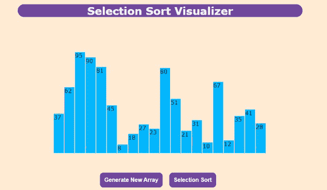
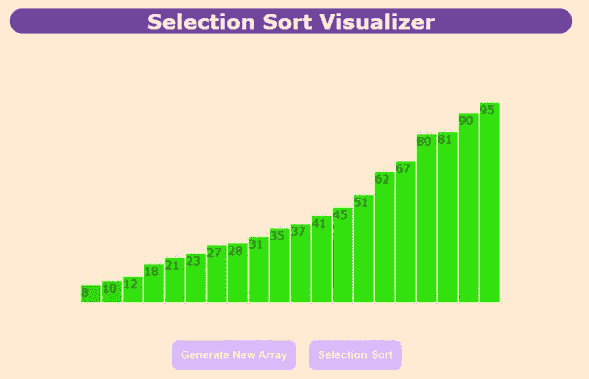

# JavaScript 中的选择排序可视化工具

> 原文:[https://www . geesforgeks . org/selection-sort-visualizer-in-JavaScript/](https://www.geeksforgeeks.org/selection-sort-visualizer-in-javascript/)

选择排序是最简单的排序算法，它通过从未排序的部分重复寻找最小元素(考虑升序)并将其放在开头来工作。

为了了解更多。请参考[选择排序](https://www.geeksforgeeks.org/selection-sort/)

像**选择排序**这样的算法可以通过可视化而不是长代码来轻松理解。在本文中，**选择排序可视化工具**是使用 **HTML** 、 **CSS** & **JavaScript 实现的。**

**先决条件:**

*   [选择排序](https://www.geeksforgeeks.org/selection-sort/)。
*   基础 [HTML](https://www.geeksforgeeks.org/html-tutorials/) 、[CSS](https://www.geeksforgeeks.org/css-tutorials/)&[JavaScript](https://www.geeksforgeeks.org/javascript-tutorial/)。
*   JavaScript [承诺](https://www.geeksforgeeks.org/javascript-promises/)。
*   JavaScript [异步/等待](https://www.geeksforgeeks.org/async-await-function-in-javascript/)功能。

**进场:**

*   按钮**生成新数组**使用****数学.随机()**函数和对应于高度值的条生成随机值数组。**
*   **不同的颜色用于指示哪些元素未排序(天蓝色)、已比较(深蓝色和红色)和已排序(浅绿色)。**
*   **按钮**选择排序**使用选择排序算法对元素进行排序。**
*   **最后，对元素进行排序。**

****示例:**点击生成新数组按钮，生成新的随机数组。单击选择排序按钮执行可视化。**

## **超文本标记语言**

```
<!DOCTYPE html>
<html lang="en">

  <!-- head -->
  <head>
    <meta charset="UTF-8" />
    <meta name="viewport" 
          content="width=device-width, initial-scale=1.0" />
    <meta http-equiv="X-UA-Compatible" content="ie=edge" />

    <!-- title -->
    <title>Sorting Visualizer</title>

    <!-- linking style.css -->
    <link href="style.css" rel="stylesheet" />
  </head>

  <!-- body -->
  <body >
   <section class="head">Selection Sort Visualizer</section>
   <section class="data-container"></section> 

   <!-- "Generate New Array" button -->
   <button  class="btn1" onclick="generate()" id="Button1" >
     Generate New Array</button>   

   <!-- "Selection Sort" button -->
   <button class="btn2" 
           onclick="SelectionSort(),disable()" id="Button2" >
     Selection Sort</button>
  </body>

  <!-- linking index.js -->
  <script src="index.js"></script>
</html>
```

## **半铸钢ˌ钢性铸铁(Cast Semi-Steel)**

```
.mySlides {
    display: none;
}

body {
    background-color: rgb(255, 235, 211);
    font-family: Verdana, sans-serif;
}

.head {
    margin-top: 20px;
    margin-right: 20vw;
    margin-left: 20vw;
    text-align: center;
    font-size: 30px;
    background-color: #6f459e;
    color: white;
    border-radius: 19px;
    font-weight: bolder;
}

.data-container {
    width: 600px;
    height: 384px;
    position: relative;
    margin: 0 auto;
}

.bar {
    width: 28px;
    position: absolute;
    left: 0;
    bottom: 0;
    background-color: rgb(0, 183, 255);
    transition: 0.2s all ease;
}

.bar__id {
    position: absolute;
    top: -24px;
    width: 100%;
    text-align: center;
}
.btn1 {
    padding: 12px;
    font-weight: bolder;
    background-color: #6f459e;
    border-radius: 10px;
    color: white;
    font-size: 16px;
    border: white;
    margin-left: 37vw;
    margin-top: 4vw;
    margin-right: 1vw;
}
.btn2 {
    padding: 12px;
    font-weight: bolder;
    background-color: #6f459e;
    border-radius: 10px;
    color: white;
    font-size: 16px;
    border: white;
}
```

## **java 描述语言**

```
const container = document.querySelector(".data-container");

// function to generate bars
function generatebars(num = 20) {

  //for loop to generate 20 bars
  for (let i = 0; i < num; i += 1) {

    // To generate random values from 1 to 100
    const value = Math.floor(Math.random() * 100) + 1; 

    // To create element "div"
    const bar = document.createElement("div");

    // To add class "bar" to "div"
    bar.classList.add("bar");

    // Provide height to the bar
    bar.style.height = `${value * 3}px`;

    // Translate the bar towards positive X axis 
    bar.style.transform = `translateX(${i * 30}px)`;

    // To create element "label"
    const barLabel = document.createElement("label");

    // To add class "bar_id" to "label"
    barLabel.classList.add("bar_id");

    // Assign value to "label"
    barLabel.innerHTML = value;

    // Append "Label" to "div"
    bar.appendChild(barLabel);

    // Append "div" to "data-container div"
    container.appendChild(bar);
  }
}

// asynchronous function to perform "Selection Sort"
async function SelectionSort(delay = 300) {
  let bars = document.querySelectorAll(".bar");
  // Assign 0 to min_idx
   var min_idx = 0;
   for (var i = 0; i < bars.length; i += 1) {

    // Assign i to min_idx
    min_idx = i;

    // Provide darkblue color to the ith bar
    bars[i].style.backgroundColor = "darkblue";
    for (var j = i + 1; j < bars.length; j += 1) {

      // Provide red color to the jth bar
      bars[j].style.backgroundColor = "red";

      // To pause the execution of code for 300 milliseconds
      await new Promise((resolve) =>
        setTimeout(() => {
          resolve();
        }, 300)
      );

      // To store the integer value of jth bar to var1 
      var val1 = parseInt(bars[j].childNodes[0].innerHTML);

      // To store the integer value of (min_idx)th bar to var2 
      var val2 = parseInt(bars[min_idx].childNodes[0].innerHTML);

      // Compare val1 & val2
      if (val1 < val2) {
        if (min_idx !== i) {

          // Provide skyblue color to the (min-idx)th bar
          bars[min_idx].style.backgroundColor = "  rgb(24, 190, 255)";
        }
        min_idx = j;
      } else {

        // Provide skyblue color to the jth bar
        bars[j].style.backgroundColor = "  rgb(24, 190, 255)";
      }
    }

    // To swap ith and (min_idx)th bar
    var temp1 = bars[min_idx].style.height;
    var temp2 = bars[min_idx].childNodes[0].innerText;
    bars[min_idx].style.height = bars[i].style.height;
    bars[i].style.height = temp1;
    bars[min_idx].childNodes[0].innerText = bars[i].childNodes[0].innerText;
    bars[i].childNodes[0].innerText = temp2;

    // To pause the execution of code for 300 milliseconds
    await new Promise((resolve) =>
      setTimeout(() => {
        resolve();
      }, 300)
    );

    // Provide skyblue color to the (min-idx)th bar
    bars[min_idx].style.backgroundColor = "  rgb(24, 190, 255)";

    // Provide lightgreen color to the ith bar
    bars[i].style.backgroundColor = " rgb(49, 226, 13)";
  }

  // To enable the button "Generate New Array" after final(sorted)
  document.getElementById("Button1").disabled = false;
  document.getElementById("Button1").style.backgroundColor = "#6f459e";

  // To enable the button "Selection Sort" after final(sorted)
  document.getElementById("Button2").disabled = false;
  document.getElementById("Button2").style.backgroundColor = "#6f459e";
}

// Call "generatebars" function
generatebars();

// function to generate new random array 
 function generate()
{
  window.location.reload();
 }

//  function to disable the button
function disable()
{
  // To disable the button "Generate New Array"
  document.getElementById("Button1").disabled = true;
  document.getElementById("Button1").style.backgroundColor = "#d8b6ff";

  // To disable the button "Selection Sort"
  document.getElementById("Button2").disabled = true;
  document.getElementById("Button2").style.backgroundColor = "#d8b6ff";  
}
```

****输出:****

*   **生成的新数组:**

****

*   **排序后:**

****