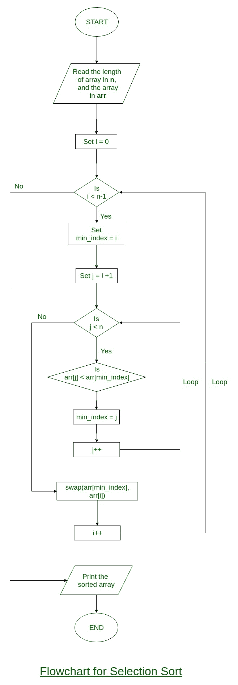

# 选择排序

> 原文:[https://www.geeksforgeeks.org/selection-sort/](https://www.geeksforgeeks.org/selection-sort/)

选择排序算法通过从未排序的部分重复寻找最小元素(考虑升序)并将其放在开头来对数组进行排序。该算法在给定的阵列中保持两个子阵列。
1)已经排序的子阵列。
2)未排序的剩余子阵列。
在选择排序的每次迭代中，来自未排序子阵列的最小元素(考虑升序)被挑选并移动到排序子阵列。
以下示例解释了上述步骤:

```
arr[] = 64 25 12 22 11

// Find the minimum element in arr[0...4]
// and place it at beginning
11 25 12 22 64

// Find the minimum element in arr[1...4]
// and place it at beginning of arr[1...4]
11 12 25 22 64

// Find the minimum element in arr[2...4]
// and place it at beginning of arr[2...4]
11 12 22 25 64

// Find the minimum element in arr[3...4]
// and place it at beginning of arr[3...4]
11 12 22 25 64 
```

**选择排序流程图:**



## C++

```
// C++ program for implementation of selection sort
#include <bits/stdc++.h>
using namespace std;

void swap(int *xp, int *yp)
{
    int temp = *xp;
    *xp = *yp;
    *yp = temp;
}

void selectionSort(int arr[], int n)
{
    int i, j, min_idx;

    // One by one move boundary of unsorted subarray
    for (i = 0; i < n-1; i++)
    {
        // Find the minimum element in unsorted array
        min_idx = i;
        for (j = i+1; j < n; j++)
        if (arr[j] < arr[min_idx])
            min_idx = j;

        // Swap the found minimum element with the first element
        swap(&arr[min_idx], &arr[i]);
    }
}

/* Function to print an array */
void printArray(int arr[], int size)
{
    int i;
    for (i=0; i < size; i++)
        cout << arr[i] << " ";
    cout << endl;
}

// Driver program to test above functions
int main()
{
    int arr[] = {64, 25, 12, 22, 11};
    int n = sizeof(arr)/sizeof(arr[0]);
    selectionSort(arr, n);
    cout << "Sorted array: \n";
    printArray(arr, n);
    return 0;
}

// This is code is contributed by rathbhupendra
```

## C

```
// C program for implementation of selection sort
#include <stdio.h>

void swap(int *xp, int *yp)
{
    int temp = *xp;
    *xp = *yp;
    *yp = temp;
}

void selectionSort(int arr[], int n)
{
    int i, j, min_idx;

    // One by one move boundary of unsorted subarray
    for (i = 0; i < n-1; i++)
    {
        // Find the minimum element in unsorted array
        min_idx = i;
        for (j = i+1; j < n; j++)
          if (arr[j] < arr[min_idx])
            min_idx = j;

        // Swap the found minimum element with the first element
        swap(&arr[min_idx], &arr[i]);
    }
}

/* Function to print an array */
void printArray(int arr[], int size)
{
    int i;
    for (i=0; i < size; i++)
        printf("%d ", arr[i]);
    printf("\n");
}

// Driver program to test above functions
int main()
{
    int arr[] = {64, 25, 12, 22, 11};
    int n = sizeof(arr)/sizeof(arr[0]);
    selectionSort(arr, n);
    printf("Sorted array: \n");
    printArray(arr, n);
    return 0;
}
```

## 计算机编程语言

```
# Python program for implementation of Selection
# Sort
import sys
A = [64, 25, 12, 22, 11]

# Traverse through all array elements
for i in range(len(A)):

    # Find the minimum element in remaining
    # unsorted array
    min_idx = i
    for j in range(i+1, len(A)):
        if A[min_idx] > A[j]:
            min_idx = j

    # Swap the found minimum element with
    # the first element       
    A[i], A[min_idx] = A[min_idx], A[i]

# Driver code to test above
print ("Sorted array")
for i in range(len(A)):
    print("%d" %A[i]),
```

## Java 语言(一种计算机语言，尤用于创建网站)

```
// Java program for implementation of Selection Sort
class SelectionSort
{
    void sort(int arr[])
    {
        int n = arr.length;

        // One by one move boundary of unsorted subarray
        for (int i = 0; i < n-1; i++)
        {
            // Find the minimum element in unsorted array
            int min_idx = i;
            for (int j = i+1; j < n; j++)
                if (arr[j] < arr[min_idx])
                    min_idx = j;

            // Swap the found minimum element with the first
            // element
            int temp = arr[min_idx];
            arr[min_idx] = arr[i];
            arr[i] = temp;
        }
    }

    // Prints the array
    void printArray(int arr[])
    {
        int n = arr.length;
        for (int i=0; i<n; ++i)
            System.out.print(arr[i]+" ");
        System.out.println();
    }

    // Driver code to test above
    public static void main(String args[])
    {
        SelectionSort ob = new SelectionSort();
        int arr[] = {64,25,12,22,11};
        ob.sort(arr);
        System.out.println("Sorted array");
        ob.printArray(arr);
    }
}
/* This code is contributed by Rajat Mishra*/
```

## C#

```
// C# program for implementation
// of Selection Sort
using System;

class GFG
{
    static void sort(int []arr)
    {
        int n = arr.Length;

        // One by one move boundary of unsorted subarray
        for (int i = 0; i < n - 1; i++)
        {
            // Find the minimum element in unsorted array
            int min_idx = i;
            for (int j = i + 1; j < n; j++)
                if (arr[j] < arr[min_idx])
                    min_idx = j;

            // Swap the found minimum element with the first
            // element
            int temp = arr[min_idx];
            arr[min_idx] = arr[i];
            arr[i] = temp;
        }
    }

    // Prints the array
    static void printArray(int []arr)
    {
        int n = arr.Length;
        for (int i=0; i<n; ++i)
            Console.Write(arr[i]+" ");
        Console.WriteLine();
    }

    // Driver code
    public static void Main()
    {
        int []arr = {64,25,12,22,11};
        sort(arr);
        Console.WriteLine("Sorted array");
        printArray(arr);
    }

}
// This code is contributed by Sam007
```

## 服务器端编程语言（Professional Hypertext Preprocessor 的缩写）

```
<?php
// PHP program for implementation
// of selection sort
function selection_sort(&$arr, $n)
{
    for($i = 0; $i < $n ; $i++)
    {
        $low = $i;
        for($j = $i + 1; $j < $n ; $j++)
        {
            if ($arr[$j] < $arr[$low])
            {
                $low = $j;
            }
        }

        // swap the minimum value to $ith node
        if ($arr[$i] > $arr[$low])
        {
            $tmp = $arr[$i];
            $arr[$i] = $arr[$low];
            $arr[$low] = $tmp;
        }
    }
}

// Driver Code
$arr = array(64, 25, 12, 22, 11);
$len = count($arr);
selection_sort($arr, $len);
echo "Sorted array : \n";

for ($i = 0; $i < $len; $i++)
    echo $arr[$i] . " ";

// This code is contributed
// by Deepika Gupta.
?>
```

## java 描述语言

```
<script>
// Javascript program for implementation of selection sort
function swap(arr,xp, yp)
{
    var temp = arr[xp];
    arr[xp] = arr[yp];
    arr[yp] = temp;
}

function selectionSort(arr,  n)
{
    var i, j, min_idx;

    // One by one move boundary of unsorted subarray
    for (i = 0; i < n-1; i++)
    {
        // Find the minimum element in unsorted array
        min_idx = i;
        for (j = i + 1; j < n; j++)
        if (arr[j] < arr[min_idx])
            min_idx = j;

        // Swap the found minimum element with the first element
        swap(arr,min_idx, i);
    }
}

function printArray( arr,  size)
{
    var i;
    for (i = 0; i < size; i++)
        document.write(arr[i] + " ");
    document.write(" <br>");
}

var arr = [64, 25, 12, 22, 11];
    var n = 5;
    selectionSort(arr, n);
    document.write("Sorted array: <br>");
    printArray(arr, n);

// This code is contributed by akshitsaxenaa09.
</script>
```

**Output:** 

```
Sorted array: 
11 12 22 25 64
```

**时间复杂度:** O(n <sup>2</sup> )因为有两个嵌套循环。
**辅助空间:** O(1)
选择排序的好处是它的交换次数永远不会超过 O(n)，并且在内存写入是一项昂贵的操作时非常有用。
**练习:**
[使用 Selection Sort 对字符串数组进行排序](https://www.geeksforgeeks.org/c-program-to-sort-an-array-of-strings-using-selection-sort-2/)
[稳定性:](https://www.geeksforgeeks.org/stability-in-sorting-algorithms/)默认实现不稳定。然而，它可以变得稳定。详见[稳定选择排序](https://www.geeksforgeeks.org/stable-selection-sort/)。
**就位:**是的，不需要额外的空间。

**Snapshots:** [Quiz on Selection Sort](https://www.geeksforgeeks.org/quiz-selectionsort-gq/)**Other Sorting Algorithms on GeeksforGeeks/GeeksQuiz:**   [Coding practice for sorting.](https://practice.geeksforgeeks.org/tag-page.php?tag=sorting&isCmp=0) Please write comments if you find anything incorrect, or you want to share more information about the topic discussed above