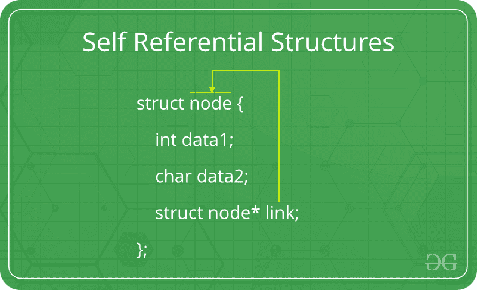

# 自我参照结构

> 原文:[https://www.geeksforgeeks.org/self-referential-structures/](https://www.geeksforgeeks.org/self-referential-structures/)

自我参照结构是那些[结构](https://www.geeksforgeeks.org/structures-c/)，它们有一个或多个指向相同类型结构的指针，作为它们的成员。



换句话说，指向同一类型结构的结构本质上是自指的。
示例:

## 卡片打印处理机（Card Print Processor 的缩写）

```
struct node {
    int data1;
    char data2;
    struct node* link;
};

int main()
{
    struct node ob;
    return 0;
}
```