# 序列比对问题

> 原文:[https://www.geeksforgeeks.org/sequence-alignment-problem/](https://www.geeksforgeeks.org/sequence-alignment-problem/)

给定两个字符串作为输入， = 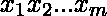，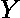 = 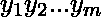，逐个字符地输出字符串的对齐方式，这样净惩罚为**最小化**。违约金计算为:
1。如果在绳子之间插入一个间隙，将受到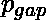的惩罚。
2。误匹配和字符将被罚款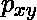。

**示例:**

```
Input : X = CG, Y = CA, p_gap = 3, p_xy = 7
Output : X = CG_, Y = C_A, Total penalty = 6

Input : X = AGGGCT, Y = AGGCA, p_gap = 3, p_xy = 2
Output : X = AGGGCT, Y = A_GGCA, Total penalty = 5

Input : X = CG, Y = CA, p_gap = 3, p_xy = 5
Output : X = CG, Y = CA, Total penalty = 5
```

**问题历史简述**
序列比对问题是生物科学的基本问题之一，旨在寻找两个氨基酸序列的相似性。比较氨基酸对人类来说至关重要，因为它提供了进化和发展的重要信息。索尔·尼德曼和克里斯蒂安·温施设计了一个解决这个问题的动态规划算法，并于 1970 年发表。从那以后，为了提高时间复杂度和空间复杂度，已经做了许多改进，但是这些都超出了本文的讨论范围。

**解**我们可以用动态规划来解决这个问题。可行的解决方案是在琴弦中引入间隙，从而使长度相等。因为可以容易地证明，在均衡长度之后增加额外的间隙只会导致罚分的增加。

**最优子结构**
从最优解可以观察到，例如从给定的样本输入，最优解缩小到只有**三个**候选。
1。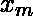和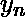。
2。还有差距。
3。间隙和。
最优子结构的证明。
我们很容易通过矛盾来证明。让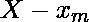成为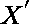，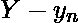成为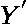。假设、的诱导对位有一些处罚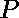，一个竞争对手对位有处罚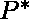，有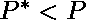。
现在，附加和，我们得到一个带有惩罚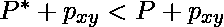的对齐。这与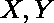的初始对齐的最优性相矛盾。
于是，证明了。
让![dp[i][j]    ](img/96f45eee19d0ac07cae358d47a8ff0e9.png "Rendered by QuickLaTeX.com")成为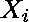和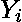最佳对中的惩罚。然后，从最优子结构出发，![dp[i][j] = min(dp[i-1][j-1] + p_{xy}, dp[i-1][j] + p_{gap}, dp[i][j-1] + p_{gap})    ](img/5dbc6360b8b80b119c204e7339be911c.png "Rendered by QuickLaTeX.com")。
总的最低处罚是![dp[m][n]    ](img/8f3b4e2a0540108da6c48b6fd411f73e.png "Rendered by QuickLaTeX.com")。

**重构解**
重构，
1。从![dp[m][n]    ](img/8f3b4e2a0540108da6c48b6fd411f73e.png "Rendered by QuickLaTeX.com")开始，追溯满满的表格。
2。当
…..2a .如果使用案例 1 填充，请转至。
…..2b。如果使用案例 2 填充，请转至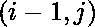。
…..2c。如果使用案例 3 填充，请转至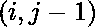。
3。如果 i = 0 或 j = 0，则用间隙匹配剩余的子字符串。

下面是上述解决方案的实现。

## C++

```
// CPP program to implement sequence alignment
// problem.
#include <bits/stdc++.h>

using namespace std;

// function to find out the minimum penalty
void getMinimumPenalty(string x, string y, int pxy, int pgap)
{
    int i, j; // initialising variables

    int m = x.length(); // length of gene1
    int n = y.length(); // length of gene2

    // table for storing optimal substructure answers
    int dp[m+1][n+1] = {0};

    // initialising the table
    for (i = 0; i <= (n+m); i++)
    {
        dp[i][0] = i * pgap;
        dp[0][i] = i * pgap;
    }   

    // calculating the minimum penalty
    for (i = 1; i <= m; i++)
    {
        for (j = 1; j <= n; j++)
        {
            if (x[i - 1] == y[j - 1])
            {
                dp[i][j] = dp[i - 1][j - 1];
            }
            else
            {
                dp[i][j] = min({dp[i - 1][j - 1] + pxy ,
                                dp[i - 1][j] + pgap    ,
                                dp[i][j - 1] + pgap    });
            }
        }
    }

    // Reconstructing the solution
    int l = n + m; // maximum possible length

    i = m; j = n;

    int xpos = l;
    int ypos = l;

    // Final answers for the respective strings
    int xans[l+1], yans[l+1];

    while ( !(i == 0 || j == 0))
    {
        if (x[i - 1] == y[j - 1])
        {
            xans[xpos--] = (int)x[i - 1];
            yans[ypos--] = (int)y[j - 1];
            i--; j--;
        }
        else if (dp[i - 1][j - 1] + pxy == dp[i][j])
        {
            xans[xpos--] = (int)x[i - 1];
            yans[ypos--] = (int)y[j - 1];
            i--; j--;
        }
        else if (dp[i - 1][j] + pgap == dp[i][j])
        {
            xans[xpos--] = (int)x[i - 1];
            yans[ypos--] = (int)'_';
            i--;
        }
        else if (dp[i][j - 1] + pgap == dp[i][j])
        {
            xans[xpos--] = (int)'_';
            yans[ypos--] = (int)y[j - 1];
            j--;
        }
    }
    while (xpos > 0)
    {
        if (i > 0) xans[xpos--] = (int)x[--i];
        else xans[xpos--] = (int)'_';
    }
    while (ypos > 0)
    {
        if (j > 0) yans[ypos--] = (int)y[--j];
        else yans[ypos--] = (int)'_';
    }

    // Since we have assumed the answer to be n+m long,
    // we need to remove the extra gaps in the starting
    // id represents the index from which the arrays
    // xans, yans are useful
    int id = 1;
    for (i = l; i >= 1; i--)
    {
        if ((char)yans[i] == '_' && (char)xans[i] == '_')
        {
            id = i + 1;
            break;
        }
    }

    // Printing the final answer
    cout << "Minimum Penalty in aligning the genes = ";
    cout << dp[m][n] << "\n";
    cout << "The aligned genes are :\n";
    for (i = id; i <= l; i++)
    {
        cout<<(char)xans[i];
    }
    cout << "\n";
    for (i = id; i <= l; i++)
    {
        cout << (char)yans[i];
    }
    return;
}

// Driver code
int main(){
    // input strings
    string gene1 = "AGGGCT";
    string gene2 = "AGGCA";

    // initialising penalties of different types
    int misMatchPenalty = 3;
    int gapPenalty = 2;

    // calling the function to calculate the result
    getMinimumPenalty(gene1, gene2,
        misMatchPenalty, gapPenalty);
    return 0;
}
```

## Java 语言(一种计算机语言，尤用于创建网站)

```
// Java program to implement
// sequence alignment problem.
import java.io.*;
import java.util.*;
import java.lang.*;

class GFG
{
// function to find out
// the minimum penalty
static void getMinimumPenalty(String x, String y,
                              int pxy, int pgap)
{
    int i, j; // initialising variables

    int m = x.length(); // length of gene1
    int n = y.length(); // length of gene2

    // table for storing optimal
    // substructure answers
    int dp[][] = new int[n + m + 1][n + m + 1];

    for (int[] x1 : dp)
    Arrays.fill(x1, 0);

    // initialising the table
    for (i = 0; i <= (n + m); i++)
    {
        dp[i][0] = i * pgap;
        dp[0][i] = i * pgap;
    }

    // calculating the
    // minimum penalty
    for (i = 1; i <= m; i++)
    {
        for (j = 1; j <= n; j++)
        {
            if (x.charAt(i - 1) == y.charAt(j - 1))
            {
                dp[i][j] = dp[i - 1][j - 1];
            }
            else
            {
                dp[i][j] = Math.min(Math.min(dp[i - 1][j - 1] + pxy ,
                                             dp[i - 1][j] + pgap) ,
                                             dp[i][j - 1] + pgap );
            }
        }
    }

    // Reconstructing the solution
    int l = n + m; // maximum possible length

    i = m; j = n;

    int xpos = l;
    int ypos = l;

    // Final answers for
    // the respective strings
    int xans[] = new int[l + 1];
    int yans[] = new int[l + 1];

    while ( !(i == 0 || j == 0))
    {
        if (x.charAt(i - 1) == y.charAt(j - 1))
        {
            xans[xpos--] = (int)x.charAt(i - 1);
            yans[ypos--] = (int)y.charAt(j - 1);
            i--; j--;
        }
        else if (dp[i - 1][j - 1] + pxy == dp[i][j])
        {
            xans[xpos--] = (int)x.charAt(i - 1);
            yans[ypos--] = (int)y.charAt(j - 1);
            i--; j--;
        }
        else if (dp[i - 1][j] + pgap == dp[i][j])
        {
            xans[xpos--] = (int)x.charAt(i - 1);
            yans[ypos--] = (int)'_';
            i--;
        }
        else if (dp[i][j - 1] + pgap == dp[i][j])
        {
            xans[xpos--] = (int)'_';
            yans[ypos--] = (int)y.charAt(j - 1);
            j--;
        }
    }
    while (xpos > 0)
    {
        if (i > 0) xans[xpos--] = (int)x.charAt(--i);
        else xans[xpos--] = (int)'_';
    }
    while (ypos > 0)
    {
        if (j > 0) yans[ypos--] = (int)y.charAt(--j);
        else yans[ypos--] = (int)'_';
    }

    // Since we have assumed the
    // answer to be n+m long,
    // we need to remove the extra
    // gaps in the starting id
    // represents the index from
    // which the arrays xans,
    // yans are useful
    int id = 1;
    for (i = l; i >= 1; i--)
    {
        if ((char)yans[i] == '_' &&
            (char)xans[i] == '_')
        {
            id = i + 1;
            break;
        }
    }

    // Printing the final answer
    System.out.print("Minimum Penalty in " +
                     "aligning the genes = ");
    System.out.print(dp[m][n] + "\n");
    System.out.println("The aligned genes are :");
    for (i = id; i <= l; i++)
    {
        System.out.print((char)xans[i]);
    }
    System.out.print("\n");
    for (i = id; i <= l; i++)
    {
        System.out.print((char)yans[i]);
    }
    return;
}

// Driver code
public static void main(String[] args)
{
    // input strings
    String gene1 = "AGGGCT";
    String gene2 = "AGGCA";

    // initialising penalties
    // of different types
    int misMatchPenalty = 3;
    int gapPenalty = 2;

    // calling the function to
    // calculate the result
    getMinimumPenalty(gene1, gene2,
        misMatchPenalty, gapPenalty);
}
}
```

## C#

```
// C# program to implement sequence alignment
// problem.
using System;

class GFG
{
    // function to find out the minimum penalty
    public static void getMinimumPenalty(string x, string y, int pxy, int pgap)
    {
        int i, j; // initialising variables

        int m = x.Length; // length of gene1
        int n = y.Length; // length of gene2

        // table for storing optimal substructure answers
        int[,] dp = new int[n+m+1,n+m+1];
        for(int q = 0; q < n+m+1; q++)
            for(int w = 0; w < n+m+1; w++)
                dp[q,w] = 0;

        // initialising the table 
        for (i = 0; i <= (n+m); i++)
        {
            dp[i,0] = i * pgap;
            dp[0,i] = i * pgap;
        }    

        // calculating the minimum penalty
        for (i = 1; i <= m; i++)
        {
            for (j = 1; j <= n; j++)
            {
                if (x[i - 1] == y[j - 1])
                {
                    dp[i,j] = dp[i - 1,j - 1];
                }
                else
                {
                    dp[i,j] = Math.Min(Math.Min(dp[i - 1,j - 1] + pxy , 
                                    dp[i - 1,j] + pgap)    , 
                                    dp[i,j - 1] + pgap    );
                }
            }
        }

        // Reconstructing the solution
        int l = n + m; // maximum possible length

        i = m; j = n;

        int xpos = l;
        int ypos = l;

        // Final answers for the respective strings
        int[] xans = new int[l+1];
        int [] yans = new int[l+1];

        while ( !(i == 0 || j == 0))
        {
            if (x[i - 1] == y[j - 1])
            {
                xans[xpos--] = (int)x[i - 1];
                yans[ypos--] = (int)y[j - 1];
                i--; j--;
            }
            else if (dp[i - 1,j - 1] + pxy == dp[i,j])
            {
                xans[xpos--] = (int)x[i - 1];
                yans[ypos--] = (int)y[j - 1];
                i--; j--;
            }
            else if (dp[i - 1,j] + pgap == dp[i,j])
            {
                xans[xpos--] = (int)x[i - 1];
                yans[ypos--] = (int)'_';
                i--;
            }
            else if (dp[i,j - 1] + pgap == dp[i,j])
            {
                xans[xpos--] = (int)'_';
                yans[ypos--] = (int)y[j - 1];
                j--;
            }
        }
        while (xpos > 0)
        {
            if (i > 0) xans[xpos--] = (int)x[--i];
            else xans[xpos--] = (int)'_';
        }
        while (ypos > 0)
        {
            if (j > 0) yans[ypos--] = (int)y[--j];
            else yans[ypos--] = (int)'_';
        }

        // Since we have assumed the answer to be n+m long, 
        // we need to remove the extra gaps in the starting 
        // id represents the index from which the arrays
        // xans, yans are useful
        int id = 1;
        for (i = l; i >= 1; i--)
        {
            if ((char)yans[i] == '_' && (char)xans[i] == '_')
            {
                id = i + 1;
                break;
            }
        }

        // Printing the final answer
        Console.Write("Minimum Penalty in aligning the genes = " + dp[m,n] + "\n");
        Console.Write("The aligned genes are :\n");
        for (i = id; i <= l; i++)
        {
            Console.Write((char)xans[i]);
        }
        Console.Write("\n");
        for (i = id; i <= l; i++)
        {
            Console.Write((char)yans[i]);
        }
        return;
    }

    // Driver code
    static void Main()
    {
        // input strings
        string gene1 = "AGGGCT";
        string gene2 = "AGGCA";

        // initialising penalties of different types
        int misMatchPenalty = 3;
        int gapPenalty = 2;

        // calling the function to calculate the result
        getMinimumPenalty(gene1, gene2, 
            misMatchPenalty, gapPenalty);
    }
    //This code is contributed by DrRoot_
}
```

## 服务器端编程语言（Professional Hypertext Preprocessor 的缩写）

```
<?php
// PHP program to implement
// sequence alignment problem.

// function to find out
// the minimum penalty
function getMinimumPenalty($x, $y,
                           $pxy, $pgap)
{
    $i; $j; // initializing variables

    $m = strlen($x); // length of gene1
    $n = strlen($y); // length of gene2

    // table for storing optimal
    // substructure answers
    $dp[$n + $m + 1][$n + $m + 1] = array(0);

    // initialising the table
    for ($i = 0; $i <= ($n+$m); $i++)
    {
        $dp[$i][0] = $i * $pgap;
        $dp[0][$i] = $i * $pgap;
    }

    // calculating the
    // minimum penalty
    for ($i = 1; $i <= $m; $i++)
    {
        for ($j = 1; $j <= $n; $j++)
        {
            if ($x[$i - 1] == $y[$j - 1])
            {
                $dp[$i][$j] = $dp[$i - 1][$j - 1];
            }
            else
            {
                $dp[$i][$j] = min($dp[$i - 1][$j - 1] + $pxy ,
                                  $dp[$i - 1][$j] + $pgap ,
                                  $dp[$i][$j - 1] + $pgap );
            }
        }
    }

    // Reconstructing the solution
    $l = $n + $m; // maximum possible length

    $i = $m; $j = $n;

    $xpos = $l;
    $ypos = $l;

    // Final answers for
    // the respective strings
    // $xans[$l + 1]; $yans[$l + 1];

    while ( !($i == 0 || $j == 0))
    {
        if ($x[$i - 1] == $y[$j - 1])
        {
            $xans[$xpos--] = $x[$i - 1];
            $yans[$ypos--] = $y[$j - 1];
            $i--; $j--;
        }
        else if ($dp[$i - 1][$j - 1] +
                 $pxy == $dp[$i][$j])
        {
            $xans[$xpos--] = $x[$i - 1];
            $yans[$ypos--] = $y[$j - 1];
            $i--; $j--;
        }
        else if ($dp[$i - 1][$j] +
                 $pgap == $dp[$i][$j])
        {
            $xans[$xpos--] = $x[$i - 1];
            $yans[$ypos--] = '_';
            $i--;
        }
        else if ($dp[$i][$j - 1] +
                 $pgap == $dp[$i][$j])
        {
            $xans[$xpos--] = '_';
            $yans[$ypos--] = $y[$j - 1];
            $j--;
        }
    }
    while ($xpos > 0)
    {
        if ($i > 0) $xans[$xpos--] = $x[--$i];
        else $xans[$xpos--] = '_';
    }
    while ($ypos > 0)
    {
        if ($j > 0)
            $yans[$ypos--] = $y[--$j];
        else
            $yans[$ypos--] = '_';
    }

    // Since we have assumed the
    // answer to be n+m long,
    // we need to remove the extra
    // gaps in the starting
    // id represents the index
    // from which the arrays
    // xans, yans are useful
    $id = 1;
    for ($i = $l; $i >= 1; $i--)
    {
        if ($yans[$i] == '_' &&
            $xans[$i] == '_')
        {
            $id = $i + 1;
            break;
        }
    }

    // Printing the final answer
    echo "Minimum Penalty in ".
         "aligning the genes = ";
    echo $dp[$m][$n] . "\n";
    echo "The aligned genes are :\n";
    for ($i = $id; $i <= $l; $i++)
    {
        echo $xans[$i];
    }
    echo "\n";
    for ($i = $id; $i <= $l; $i++)
    {
        echo $yans[$i];
    }
    return;
}

// Driver code

// input strings
$gene1 = "AGGGCT";
$gene2 = "AGGCA";

// initialising penalties
// of different types
$misMatchPenalty = 3;
$gapPenalty = 2;

// calling the function
// to calculate the result
getMinimumPenalty($gene1, $gene2,
    $misMatchPenalty, $gapPenalty);

// This code is contributed by Abhinav96
?>
```

**Output:** 

```
Minimum Penalty in aligning the genes = 5
The aligned genes are :
AGGGCT
A_GGCA
```

**时间复杂度:** 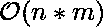
**空间复杂度:** 