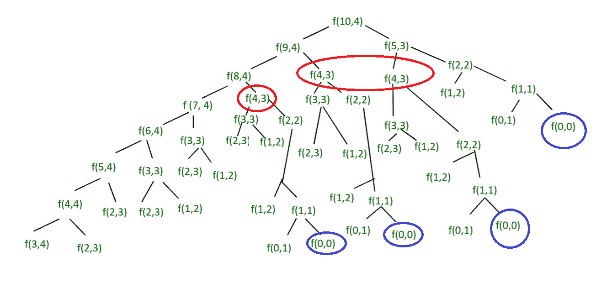

# 给定长度的序列，其中每个元素都大于或等于先前的两倍

> 原文:[https://www . geesforgeks . org/sequents-给定长度-每元素-相等-两倍-previous/](https://www.geeksforgeeks.org/sequences-given-length-every-element-equal-twice-previous/)

给定两个整数 m & n，求长度为 n 的可能序列的数目，使得每个下一个元素大于或等于前一个元素的两倍，但小于或等于 m。

**示例:**

```
Input : m = 10, n = 4
Output : 4
There should be n elements and value of last
element should be at-most m.
The sequences are {1, 2, 4, 8}, {1, 2, 4, 9},
                 {1, 2, 4, 10}, {1, 2, 5, 10}

Input : m = 5, n = 2
Output : 6
The sequences are {1, 2}, {1, 3}, {1, 4},
                  {1, 5}, {2, 4}, {2, 5}
```

根据给定的条件，序列的第 n 个值最多可以是 m。第 n 个元素有两种情况:

1.  如果是 m，那么第(n-1)个元素最多是 m/2。我们重复 m/2 和 n-1。
2.  如果不是 m，那么最多就是 m-1。我们重复(m-1)和 n。

序列总数是包括 m 的序列数和不包括 m 的序列数之和。因此，原来求最大值 m 的长度 n 的序列数的问题可以细分为求最大值 m-1 的长度 n 的序列数和最大值 m/2 的长度 n-1 的序列数的独立子问题。

## C++

```
// C++ program to count total number 
// of special sequences of length n where
#include <iostream>
using namespace std;

// Recursive function to find the number of special
// sequences
int getTotalNumberOfSequences(int m, int n)
{

    // A special sequence cannot exist if length
    // n is more than the maximum value m.
    if (m < n)
        return 0;

    // If n is 0, found an empty special sequence
    if (n == 0)
        return 1;

    // There can be two possibilities : (1) Reduce
    // last element value (2) Consider last element
    // as m and reduce number of terms
    return getTotalNumberOfSequences(m - 1, n) +
           getTotalNumberOfSequences(m / 2, n - 1);
}   

// Driver code
int main()
{
    int m = 10;
    int n = 4;
    cout << "Total number of possible sequences " 
         << getTotalNumberOfSequences(m, n);
    return 0;
}

// This code is contributed by shivanisinghss2110
```

## Java 语言(一种计算机语言，尤用于创建网站)

```
// Java program to count total number 
// of special sequences of length n where
class Sequences
{
    // Recursive function to find the number of special
    // sequences
    static int  getTotalNumberOfSequences(int m, int n)
    {
        // A special sequence cannot exist if length
        // n is more than the maximum value m.
        if(m < n)
            return 0;

        // If n is 0, found an empty special sequence
        if(n == 0)
            return 1;

        // There can be two possibilities : (1) Reduce
        // last element value (2) Consider last element
        // as m and reduce number of terms
        return getTotalNumberOfSequences (m-1, n) +
               getTotalNumberOfSequences (m/2, n-1);
    }   

    // main function
    public static void main (String[] args) 
    {
        int m = 10;
        int n = 4;
        System.out.println("Total number of possible sequences "+
                       getTotalNumberOfSequences(m, n));
    }
}
```

## 蟒蛇 3

```
#Python3 program to count total number of 
#special sequences of length n where 
#Recursive function to find the number of
# special sequences
def getTotalNumberOfSequences(m,n):

    #A special sequence cannot exist if length 
    #n is more than the maximum value m. 
    if m<n:
        return 0

    #If n is 0, found an empty special sequence 
    if n==0:
        return 1

    #There can be two possibilities : (1) Reduce
    #last element value (2) Consider last element 
    #as m and reduce number of terms 
    res=(getTotalNumberOfSequences(m-1,n)+
         getTotalNumberOfSequences(m//2,n-1))
    return res

#Driver Code
if __name__=='__main__':
    m=10
    n=4
    print('Total number of possible sequences:',getTotalNumberOfSequences(m,n))

#This code is contributed by sahilshelangia
```

## C#

```
// C# program to count total number 
// of special sequences of length n 
// where every element is more than 
// or equal to twice of previous
using System;

class GFG
{
    // Recursive function to find 
    // the number of special sequences
    static int getTotalNumberOfSequences(int m, int n)
    {
        // A special sequence cannot exist if length
        // n is more than the maximum value m.
        if(m < n)
            return 0;

        // If n is 0, found an empty special sequence
        if(n == 0)
            return 1;

        // There can be two possibilities : (1) Reduce
        // last element value (2) Consider last element
        // as m and reduce number of terms
        return getTotalNumberOfSequences (m-1, n) +
               getTotalNumberOfSequences (m/2, n-1);
    } 

    // Driver code
    public static void Main () 
    {
        int m = 10;
        int n = 4;
        Console.Write("Total number of possible sequences " +
                           getTotalNumberOfSequences(m, n));
    }
}

// This code is contributed by nitin mittal.
```

## 服务器端编程语言（Professional Hypertext Preprocessor 的缩写）

```
<?php
// PHP program to count total 
// number of special sequences
// of length n where

// Recursive function to find 
// the number of special sequences
function getTotalNumberOfSequences($m, $n)
{

    // A special sequence cannot 
    // exist if length n is more 
    // than the maximum value m.
    if ($m < $n)
        return 0;

    // If n is 0, found an empty 
    // special sequence
    if ($n == 0)
        return 1;

    // There can be two possibilities : 
    // (1) Reduce last element value
    // (2) Consider last element
    // as m and reduce number of terms
    return getTotalNumberOfSequences($m - 1, $n) +
           getTotalNumberOfSequences($m / 2, $n - 1);
}

    // Driver Code
    $m = 10;
    $n = 4;
    echo("Total number of possible sequences ");
    echo (getTotalNumberOfSequences($m, $n));

// This code is contributed by nitin mittal.
?>
```

## java 描述语言

```
<script>
// program to count total number of special sequences
// of length n where

// Recursive function to find the number of special
// sequences
   function  getTotalNumberOfSequences( m, n)
{
    // A special sequence cannot exist if length
    // n is more than the maximum value m.
    if (m < n)
        return 0;

    // If n is 0, found an empty special sequence
    if (n == 0)
        return 1;

    // There can be two possibilities : (1) Reduce
    // last element value (2) Consider last element
    // as m and reduce number of terms
    return getTotalNumberOfSequences (m-1, n) +
           getTotalNumberOfSequences (m/2, n-1);
}

// Driver Code

    let m = 10;
    let n = 4;
    document.write ("Total number of possible sequences ",
                   getTotalNumberOfSequences(m, n));

// This code is contributed by anikakapoor.
</script>
```

**输出:**

```
Total number of possible sequences 4
```

注意，上面的函数一次又一次地计算相同的子问题。考虑以下 f(10，4)的树。



m= 10 和 N =4 的递归树

我们可以用动态规划来解决这个问题。

## C++

```
// C program to count total number of special sequences
// of length N where
#include <stdio.h>

// DP based function to find the number of special
// sequences
int  getTotalNumberOfSequences(int m, int n)
{
        // define T and build in bottom manner to store
        // number of special sequences of length n and
        // maximum value m
        int T[m+1][n+1];
        for (int i=0; i<m+1; i++)
        {
            for (int j=0; j<n+1; j++)
            {
                // Base case : If length of sequence is 0
                // or maximum value is 0, there cannot
                // exist any special sequence
                if (i == 0 || j == 0)
                    T[i][j] = 0;

                // if length of sequence is more than
                // the maximum value, special sequence
                // cannot exist
                else if (i < j)
                    T[i][j] = 0;

                // If length of sequence is 1 then the
                // number of special sequences is equal
                // to the maximum value
                // For example with maximum value 2 and
                // length 1, there can be 2 special
                // sequences {1}, {2}
                else if (j == 1)
                    T[i][j] = i;

                // otherwise calculate
                else
                    T[i][j] = T[i-1][j] + T[i/2][j-1];
            }
        }
        return T[m][n];
}

// Driver Code
int main()
{
    int m = 10;
    int n = 4;
    printf("Total number of possible sequences %d",
                   getTotalNumberOfSequences(m, n));
    return 0;
}
```

## Java 语言(一种计算机语言，尤用于创建网站)

```
// Efficient java program to count total number 
// of special sequences of length n where
class Sequences
{
    // DP based function to find the number of special
    // sequences
    static int  getTotalNumberOfSequences(int m, int n)
    {
            // define T and build in bottom manner to store
            // number of special sequences of length n and
            // maximum value m
            int T[][]=new int[m+1][n+1];
            for (int i=0; i<m+1; i++)
            {
                for (int j=0; j<n+1; j++)
                {
                    // Base case : If length of sequence is 0
                    // or maximum value is 0, there cannot
                    // exist any special sequence
                    if (i == 0 || j == 0)
                        T[i][j] = 0;

                    // if length of sequence is more than
                    // the maximum value, special sequence
                    // cannot exist
                    else if (i < j)
                        T[i][j] = 0;

                    // If length of sequence is 1 then the
                    // number of special sequences is equal
                    // to the maximum value
                    // For example with maximum value 2 and
                    // length 1, there can be 2 special
                    // sequences {1}, {2}
                    else if (j == 1)
                        T[i][j] = i;

                    // otherwise calculate
                    else
                        T[i][j] = T[i-1][j] + T[i/2][j-1];
                }
            }
            return T[m][n];
    }

    // main function
    public static void main (String[] args) 
    {
        int m = 10;
        int n = 4;
        System.out.println("Total number of possible sequences "+
                       getTotalNumberOfSequences(m, n));
    }
}
```

## 蟒蛇 3

```
#Python3 program to count total number of 
#special sequences of length N where

#DP based function to find the number
# of special sequence
def getTotalNumberOfSequences(m,n):

    #define T and build in bottom manner to store 
    #number of special sequences of length n and 
    #maximum value m 
    T=[[0 for i in range(n+1)] for i in range(m+1)]
    for i in range(m+1):
        for j in range(n+1):

            #Base case : If length of sequence is 0 
            # or maximum value is 0, there cannot 
            #exist any special sequence
            if i==0 or j==0:
                T[i][j]=0

            #if length of sequence is more than 
            #the maximum value, special sequence
            # cannot exist
            elif i<j:
                T[i][j]=0

            # If length of sequence is 1 then the 
            # number of special sequences is equal 
            # to the maximum value 
            # For example with maximum value 2 and 
            # length 1, there can be 2 special 
            # sequences {1}, {2} 
            elif j==1:
                T[i][j]=i
            else:
                T[i][j]=T[i-1][j]+T[i//2][j-1]
    return T[m][n]

#Driver Code 
if __name__=='__main__':
    m=10
    n=4
    print('Total number of possible sequences ',getTotalNumberOfSequences(m, n))

#This code is contributed by sahilshelangia
```

## C#

```
// Efficient C# program to count total number 
// of special sequences of length n where
using System;
class Sequences {

    // DP based function to find
    // the number of special
    // sequences
    static int getTotalNumberOfSequences(int m, int n)
    {

            // define T and build in
            // bottom manner to store
            // number of special sequences
            // of length n and maximum value m
            int [,]T=new int[m + 1, n + 1];

            for (int i = 0; i < m + 1; i++)
            {
                for (int j = 0; j < n + 1; j++)
                {

                    // Base case : If length 
                    // of sequence is 0
                    // or maximum value is 
                    // 0, there cannot
                    // exist any special 
                    // sequence
                    if (i == 0 || j == 0)
                        T[i, j] = 0;

                    // if length of sequence
                    // is more than the maximum
                    // value, special sequence
                    // cannot exist
                    else if (i < j)
                        T[i,j] = 0;

                    // If length of sequence is 1 then the
                    // number of special sequences is equal
                    // to the maximum value
                    // For example with maximum value 2 and
                    // length 1, there can be 2 special
                    // sequences {1}, {2}
                    else if (j == 1)
                        T[i,j] = i;

                    // otherwise calculate
                    else
                        T[i,j] = T[i - 1, j] + T[i / 2, j - 1];
                }
            }
            return T[m,n];
    }

    // Driver Code
    public static void Main () 
    {
        int m = 10;
        int n = 4;
        Console.WriteLine("Total number of possible sequences "+
                                getTotalNumberOfSequences(m, n));
    }
}

// This code is contributed by anuj_67.
```

## 服务器端编程语言（Professional Hypertext Preprocessor 的缩写）

```
<?php
// PHP program to count total
// number of special sequences
// of length N where

// DP based function to find
// the number of special
// sequences
function getTotalNumberOfSequences($m, $n)
{

        // define T and build in bottom
        // manner to store number of 
        // special sequences of length 
        // n and maximum value m
        $T = array(array());

        for ($i = 0; $i < $m + 1; $i++)
        {
            for ($j = 0; $j < $n + 1; $j++)
            {

                // Base case : If length of 
                // sequence is 0 or maximum
                // value is 0, there cannot
                // exist any special sequence
                if ($i == 0 or $j == 0)
                    $T[$i][$j] = 0;

                // if length of sequence is 
                // more than the maximum value,
                // special sequence cannot exist
                else if ($i < $j)
                    $T[$i][$j] = 0;

                // If length of sequence is
                // 1 then the number of 
                // special sequences is equal
                // to the maximum value
                // For example with maximum 
                // value 2 and length 1, there
                // can be 2 special sequences 
                // {1}, {2}
                else if ($j == 1)
                    $T[$i][$j] = $i;

                // otherwise calculate
                else
                    $T[$i][$j] = $T[$i - 1][$j] + 
                                 $T[$i / 2][$j - 1];
            }
        }
        return $T[$m][$n];
}

    // Driver Code
    $m = 10;
    $n = 4;
    echo "Total number of possible sequences ",
            getTotalNumberOfSequences($m, $n);

// This code is contributed by anuj_67.
?>
```

## java 描述语言

```
<script>
    // Efficient javascript program to count total number
    // of special sequences of length n where

    // DP based function to find the number of special
    // sequences
    function getTotalNumberOfSequences(m, n)
    {
            // define T and build in bottom manner to store
            // number of special sequences of length n and
            // maximum value m
            let T = new Array(m+1);
            for (let i=0; i<m+1; i++)
            {
                T[i] = new Array(n+1);
                for (let j=0; j<n+1; j++)
                {
                    // Base case : If length of sequence is 0
                    // or maximum value is 0, there cannot
                    // exist any special sequence
                    if (i == 0 || j == 0)
                        T[i][j] = 0;

                    // if length of sequence is more than
                    // the maximum value, special sequence
                    // cannot exist
                    else if (i < j)
                        T[i][j] = 0;

                    // If length of sequence is 1 then the
                    // number of special sequences is equal
                    // to the maximum value
                    // For example with maximum value 2 and
                    // length 1, there can be 2 special
                    // sequences {1}, {2}
                    else if (j == 1)
                        T[i][j] = i;

                    // otherwise calculate
                    else
                        T[i][j] = T[i-1][j] + T[parseInt(i/2, 10)][j-1];
                }
            }
            return T[m][n];
    }

    let m = 10;
    let n = 4;
    document.write("Total number of possible sequences "+
                       getTotalNumberOfSequences(m, n));

  // This code is contributed rameshtravel07.
</script>
```

输出:

```
4
```

时间复杂度:O(m x n)
辅助空间:O(m x n)

本文由**巴虎巴利**供稿。如果你喜欢 GeeksforGeeks 并想投稿，你也可以使用[write.geeksforgeeks.org](https://write.geeksforgeeks.org)写一篇文章或者把你的文章邮寄到 review-team@geeksforgeeks.org。看到你的文章出现在极客博客主页上，帮助其他极客。
如果你发现任何不正确的地方，或者你想分享更多关于上面讨论的话题的信息，请写评论。