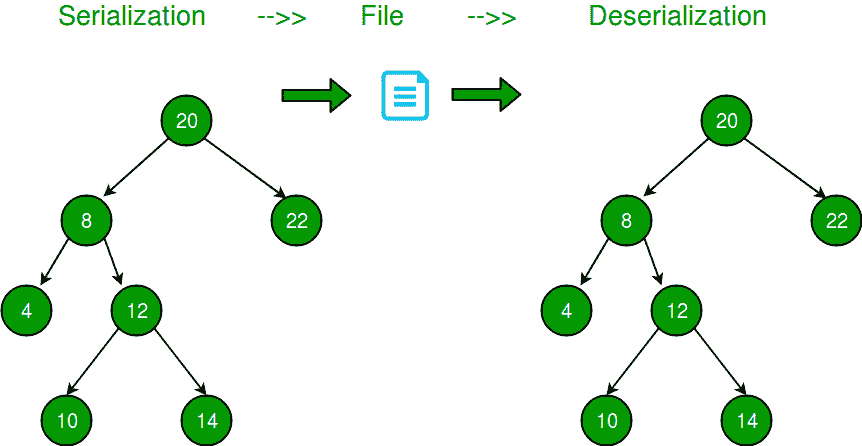
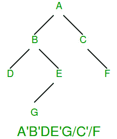
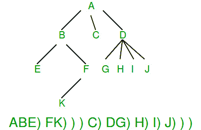

# 序列化和反序列化二叉树

> 原文:[https://www . geeksforgeeks . org/serialize-反序列化-二叉树/](https://www.geeksforgeeks.org/serialize-deserialize-binary-tree/)

序列化是将树存储在文件中，以便以后可以恢复。树的结构必须保持。反序列化正在从文件中读取树。



以下是这个问题的一些更简单的版本:
***如果给定的树是二叉查找树？***
如果给定的二叉树是二叉查找树，我们可以通过存储前序或后序遍历来存储它。在二分搜索法树的情况下，只有[前序或后序遍历足以存储结构信息](https://www.geeksforgeeks.org/construct-bst-from-given-preorder-traversal-set-2/)。

***如果给定的二叉树是完全树？***
如果除了可能的最后一级之外，所有的级都被完全填充，并且最后一级的所有节点都尽可能保留(二进制堆是完整的二叉树)，则二叉树是完整的。对于完整的二叉树，层次顺序遍历足以存储树。我们知道第一个节点是根节点，接下来的两个节点是下一级节点，接下来的四个节点是第二级节点，以此类推。

***如果给定的二叉树是全树？***
完整的二进制是一棵二叉树，其中每个节点都有 0 或 2 个子节点。序列化这样的树很容易，因为每个内部节点都有两个子节点。我们可以简单地存储前序遍历，并为每个节点存储一个位，以指示该节点是内部节点还是叶节点。

**如何存储通用二叉树？**
一个简单的解决方案是存储无序和预有序遍历。这个解决方案需要两倍于二叉树大小的空间。
我们可以通过存储 Preorder 遍历和空指针的标记来节省空间。

```
Let the marker for NULL pointers be '-1'
Input:
     12
    /
  13
Output: 12 13 -1 -1 -1

Input:
      20
    /   \
   8     22 
Output: 20 8 -1 -1 22 -1 -1 

Input:
         20
       /    
      8     
     / \
    4  12 
      /  \
     10  14
Output: 20 8 4 -1 -1 12 10 -1 -1 14 -1 -1 -1 

Input:
          20
         /    
        8     
      /
    10
    /
   5
Output: 20 8 10 5 -1 -1 -1 -1 -1 

Input:
          20
            \
             8
              \   
               10
                 \
                  5   
Output: 20 -1 8 -1 10 -1 5 -1 -1
```

反序列化可以通过简单地从文件中逐个读取数据来完成。

以下是上述想法的实现。

## C

```
// A C program to demonstrate serialization and deserialization of
// Binary Tree
#include <stdio.h>
#define MARKER -1

/* A binary tree Node has key, pointer to left and right children */
struct Node
{
    int key;
    struct Node* left, *right;
};

/* Helper function that allocates a new Node with the
   given key and NULL left and right pointers. */
Node* newNode(int key)
{
    Node* temp = new Node;
    temp->key = key;
    temp->left = temp->right = NULL;
    return (temp);
}

// This function stores a tree in a file pointed by fp
void serialize(Node *root, FILE *fp)
{
    // If current node is NULL, store marker
    if (root == NULL)
    {
        fprintf(fp, "%d ", MARKER);
        return;
    }

    // Else, store current node and recur for its children
    fprintf(fp, "%d ", root->key);
    serialize(root->left, fp);
    serialize(root->right, fp);
}

// This function constructs a tree from a file pointed by 'fp'
void deSerialize(Node *&root, FILE *fp)
{
    // Read next item from file. If there are no more items or next
    // item is marker, then return
    int val;
    if ( !fscanf(fp, "%d ", &val) || val == MARKER)
       return;

    // Else create node with this item and recur for children
    root = newNode(val);
    deSerialize(root->left, fp);
    deSerialize(root->right, fp);
}

// A simple inorder traversal used for testing the constructed tree
void inorder(Node *root)
{
    if (root)
    {
        inorder(root->left);
        printf("%d ", root->key);
        inorder(root->right);
    }
}

/* Driver program to test above functions*/
int main()
{
    // Let us construct a tree shown in the above figure
    struct Node *root        = newNode(20);
    root->left               = newNode(8);
    root->right              = newNode(22);
    root->left->left         = newNode(4);
    root->left->right        = newNode(12);
    root->left->right->left  = newNode(10);
    root->left->right->right = newNode(14);

    // Let us open a file and serialize the tree into the file
    FILE *fp = fopen("tree.txt", "w");
    if (fp == NULL)
    {
        puts("Could not open file");
        return 0;
    }
    serialize(root, fp);
    fclose(fp);

    // Let us deserialize the stored tree into root1
    Node *root1 = NULL;
    fp = fopen("tree.txt", "r");
    deSerialize(root1, fp);

    printf("Inorder Traversal of the tree constructed from file:\n");
    inorder(root1);

    return 0;
}
```

## Java 语言(一种计算机语言，尤用于创建网站)

```
// A JAVA program to demonstrate serialization and
// deserialization of Binary Tree
import java.util.*;

/* A binary tree Node has key, pointer to left and right
 * children */
class TreeNode {
    int val;
    TreeNode left;
    TreeNode right;
    TreeNode(int x) { val = x; }
}

class BinaryTree {
    TreeNode root;

    // Encodes a tree to a single string.
    public static String serialize(TreeNode root)
    {
        if (root == null) {
            return null;
        }
        Stack<TreeNode> s = new Stack<>();
        s.push(root);

        List<String> l = new ArrayList<>();
        while (!s.isEmpty()) {
            TreeNode t = s.pop();
            // If current node is NULL, store marker
            if (t == null) {
                l.add("#");
            }
            else {
                // Else, store current node and recur for
                // its children
                l.add("" + t.val);
                s.push(t.right);
                s.push(t.left);
            }
        }
        return String.join(",", l);
    }

    static int t;

    // Decodes your encoded data to tree.
    public static TreeNode deserialize(String data)
    {
        if (data == null)
            return null;
        t = 0;
        String[] arr = data.split(",");
        return helper(arr);
    }

    public static TreeNode helper(String[] arr)
    {
        if (arr[t].equals("#"))
            return null;
        // create node with this item and recur for children
        TreeNode root
            = new TreeNode(Integer.parseInt(arr[t]));
        t++;
        root.left = helper(arr);
        t++;
        root.right = helper(arr);
        return root;
    }

    // A simple inorder traversal used for testing the
    // constructed tree
    static void inorder(TreeNode root)
    {
        if (root != null) {
            inorder(root.left);
            System.out.print(root.val + " ");
            inorder(root.right);
        }
    }

    /* Driver program to test above functions*/
    public static void main(String args[])
    {
        // Let us construct a tree shown in the above figure
        BinaryTree tree = new BinaryTree();
        tree.root = new TreeNode(20);
        tree.root.left = new TreeNode(8);
        tree.root.right = new TreeNode(22);
        tree.root.left.left = new TreeNode(4);
        tree.root.left.right = new TreeNode(12);
        tree.root.left.right.left = new TreeNode(10);
        tree.root.left.right.right = new TreeNode(14);

        String serialized = serialize(tree.root);
        System.out.println("Serialized view of the tree:");
        System.out.println(serialized);
        System.out.println();

        // Let us deserialize the stored tree into root1
        TreeNode t = deserialize(serialized);

        System.out.println(
            "Inorder Traversal of the tree constructed from serialized String:");
        inorder(t);
    }
}
```

**输出:**

```
Inorder Traversal of the tree constructed from file:
4 8 10 12 14 20 22
```

**上述解决方案需要多少额外空间？**
如果有 n 个键，那么上述解决方案需要 n+1 个标记，这可能比简单解决方案(存储键两次)在键大或者键有大数据项与之关联的情况下更好。

**能否进一步优化？**
以上解决方案可以通过多种方式进行优化。如果我们仔细看看上面的序列化树，我们可以观察到所有的叶节点都需要两个标记。一个简单的优化是为每个节点存储一个单独的位，以指示该节点是内部的还是外部的。这样，我们就不必在每个叶节点上存储两个标记，因为叶可以通过额外的位来识别。我们仍然需要有一个子节点的内部节点的标记。例如，在下图中,'用于指示内部节点集位，而'/'用作空标记。图取自[此处](http://www.cs.usfca.edu/~brooks/S04classes/cs245/lectures/lecture11.pdf)。



请注意，二叉树中的叶节点总是比内部节点多(叶节点数是内部节点数(2 度)加 1，所以这种优化是有意义的。

**如何序列化 n 元树？**
在 n 元树中，没有指定的左或右子树。我们可以在每个节点上存储一个“儿童结束”标记。下图显示了序列化，其中“)”用作子标记的结尾。我们将很快介绍 n 元树的实现。图取自[此处](http://www.cs.usfca.edu/~brooks/S04classes/cs245/lectures/lecture11.pdf)。



**参考文献:**
[http://www . cs . usfca . edu/~ brooks/s04 classes/cs 245/讲座/讲师 11.pdf](http://www.cs.usfca.edu/~brooks/S04classes/cs245/lectures/lecture11.pdf)
本文由 **Shivam Gupta** 供稿，如发现有不正确之处，或想分享以上讨论话题的更多信息，请写评论