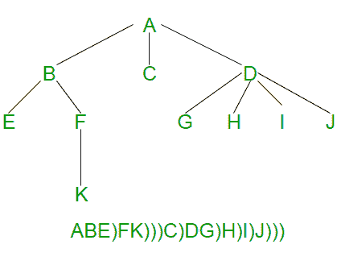

# 序列化和反序列化 N 元树

> 原文:[https://www . geesforgeks . org/serialize-deserize-n-ary-tree/](https://www.geeksforgeeks.org/serialize-deserialize-n-ary-tree/)

给定一个 N 元树，其中每个节点最多有 N 个子节点。如何序列化和反序列化？序列化是将树存储在文件中，以便以后可以恢复。树的结构必须保持。反序列化正在从文件中读取树。
本帖主要是下方帖的延伸。
[序列化和反序列化二叉树](https://www.geeksforgeeks.org/serialize-deserialize-binary-tree/)

在 N 元树中，没有指定的左右子树。N 元树是通过存储每个节点的子指针数组或列表来表示的。

这个想法是在每个节点上存储一个“子节点结束”标记。下图显示了序列化，其中“)”用作子标记的结尾。



以下是上述思想的 C++实现。

## C++

```
// A C++ Program serialize and deserialize an N-ary tree
#include<cstdio>
#define MARKER ')'
#define N 5
using namespace std;

// A node of N-ary tree
struct Node {
   char key;
   Node *child[N];  // An array of pointers for N children
};

// A utility function to create a new N-ary tree node
Node *newNode(char key)
{
    Node *temp = new Node;
    temp->key = key;
    for (int i = 0; i < N; i++)
        temp->child[i] = NULL;
    return temp;
}

// This function stores the given N-ary tree in a file pointed by fp
void serialize(Node *root, FILE *fp)
{
    // Base case
    if (root == NULL) return;

    // Else, store current node and recur for its children
    fprintf(fp, "%c ", root->key);
    for (int i = 0; i < N && root->child[i]; i++)
         serialize(root->child[i],  fp);

    // Store marker at the end of children
    fprintf(fp, "%c ", MARKER);
}

// This function constructs N-ary tree from a file pointed by 'fp'.
// This function returns 0 to indicate that the next item is a valid
// tree key. Else returns 0
int deSerialize(Node *&root, FILE *fp)
{
    // Read next item from file. If there are no more items or next
    // item is marker, then return 1 to indicate same
    char val;
    if ( !fscanf(fp, "%c ", &val) || val == MARKER )
       return 1;

    // Else create node with this item and recur for children
    root = newNode(val);
    for (int i = 0; i < N; i++)
      if (deSerialize(root->child[i], fp))
         break;

    // Finally return 0 for successful finish
    return 0;
}

// A utility function to create a dummy tree shown in above diagram
Node *createDummyTree()
{
    Node *root = newNode('A');
    root->child[0] = newNode('B');
    root->child[1] = newNode('C');
    root->child[2] = newNode('D');
    root->child[0]->child[0] = newNode('E');
    root->child[0]->child[1] = newNode('F');
    root->child[2]->child[0] = newNode('G');
    root->child[2]->child[1] = newNode('H');
    root->child[2]->child[2] = newNode('I');
    root->child[2]->child[3] = newNode('J');
    root->child[0]->child[1]->child[0] = newNode('K');
    return root;
}

// A utility function to traverse the constructed N-ary tree
void traverse(Node *root)
{
    if (root)
    {
        printf("%c ", root->key);
        for (int i = 0; i < N; i++)
            traverse(root->child[i]);
    }
}

// Driver program to test above functions
int main()
{
    // Let us create an N-ary tree shown in above diagram
    Node *root = createDummyTree();

    // Let us open a file and serialize the tree into the file
    FILE *fp = fopen("tree.txt", "w");
    if (fp == NULL)
    {
        puts("Could not open file");
        return 0;
    }
    serialize(root, fp);
    fclose(fp);

    // Let us deserialize the stored tree into root1
    Node *root1 = NULL;
    fp = fopen("tree.txt", "r");
    deSerialize(root1, fp);

    printf("Constructed N-Ary Tree from file is \n");
    traverse(root1);

    return 0;
}
```

输出:

```
Constructed N-Ary Tree from file is
A B E F K C D G H I J
```

上面的实现可以通过许多方式进行优化，例如使用向量代替指针数组。我们一直保持这种方式，以使其易于阅读和理解。
本文由**瓦润**供稿。如果你发现任何不正确的地方，或者你想分享更多关于上面讨论的话题的信息，请写评论。