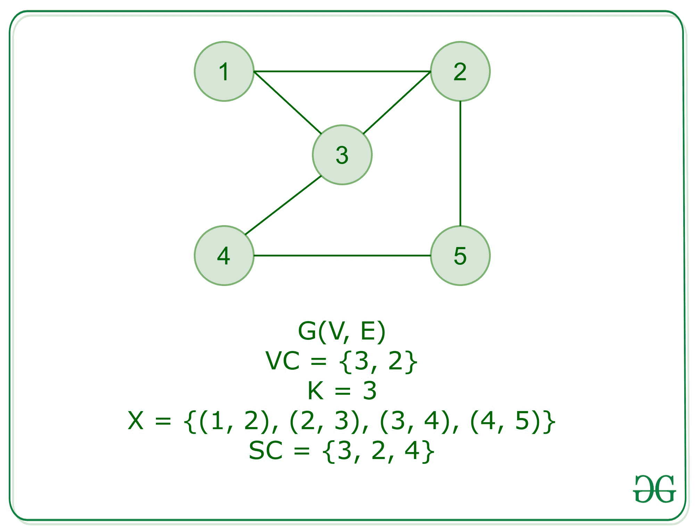

# 套盖完成

> 原文:[https://www.geeksforgeeks.org/set-cover-is-np-complete/](https://www.geeksforgeeks.org/set-cover-is-np-complete/)

**<u>问题</u>** <u>:</u> 给定一个地集合 **X** ，一个整数 **k** ，以及 X 的子集集合**SI**，问题是识别是否存在一个并集为 X 的子集集合，大小**至多为 k** 。

**<u>证明:</u>** 问题的一个实例是指定给问题的输入。集合覆盖问题的一个例子是一个地面集合 X，一个整数 k 和一个子集 Si 的集合，这些子集 Si 是由【X】形成的。由于 [NP-complete 问题](https://www.geeksforgeeks.org/np-completeness-set-1/)顾名思义是一个既是 [NP 又是 NP-Hard](https://www.geeksforgeeks.org/difference-between-np-hard-and-np-complete-problem/) 的问题，所以证明或陈述一个问题是 NP-complete 由两部分组成:

1.  问题本身是 NP 完全的。
2.  NP 类中的所有其他问题都可以在多项式时间内简化为这个问题。(乙是多时间可还原为丙)。

如果满足唯一的第二个条件，这个问题就叫做 NP-Hard。但是不可能把每一个 NP 问题都化为另一个 NP 问题来一直展示它的 NP 完全性。这就是为什么如果我们想证明一个问题是 NP 完全的，证明这个问题是 NP 完全的，并且任何 NP 完全问题都可以简化为 NP 完全问题。因此，可以使用以下命题来验证集合覆盖问题是 NP-完全的:

1.  **<u>Set Cover 在 NP:</u>** 如果有任何问题在 **NP** 中，那么给定一个‘证书’，它是问题的一个解决方案和问题的一个实例(子集的集合，大小为 k 的 C)，我们将能够在多项式时间内识别(无论解决方案是否正确)证书。这可以通过:
    提供一个**大小 k** 的子集的集合 **C** ，我们可以迭代集合的子集中的每个元素，标记 X 中被覆盖的元素。最后，不应该在 x 中发现任何元素。
    这相对于 x 中的子集数量需要多项式时间。因此，集合覆盖在 NP 中。
2.  **<u>集合覆盖是 NP-Hard:</u>** 为了证明集合覆盖是 NP-Hard，我们将从一个已知的 NP-Hard 问题进行约简，即顶点覆盖到集合覆盖问题。对于顶点覆盖问题，我们有一个图形作为输入 **G = (V，E)** 和一个整数 k。现在，让地面集合
    *   X = E，即 g 中的边集。
    *   子集 S u 对于 **V** 中的每个**顶点 u** ，包含与 **u** 关联的边。

现在，以下两个命题成立:

*   我们考虑 **k** 套**Su1SU2……SukT9】套地套 **X** ，那么 **E** 中的每一条**边 e** 都与 u1…uk 的最小一个顶点相邻，因此形成**尺寸 k** 的顶点套。**
*   让我们考虑顶点 **u1…uk** 形成顶点覆盖，然后 Su1 覆盖 u1 入射的所有边。因此，集合套**Su1SU2…SukT9】形成套盖 **X** 。**

**<u>结论:</u>**

套盖为 **NP 和 NP-Hard** 。因此**套盖**T5 是**NP-Complete**T8。