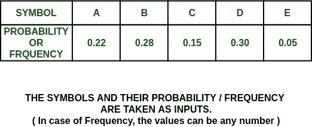
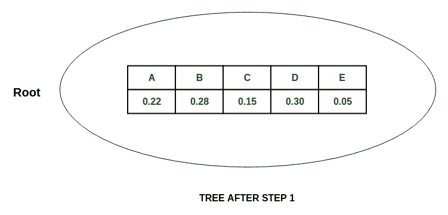
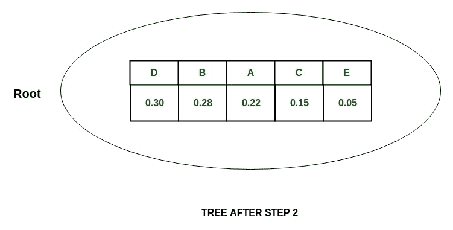
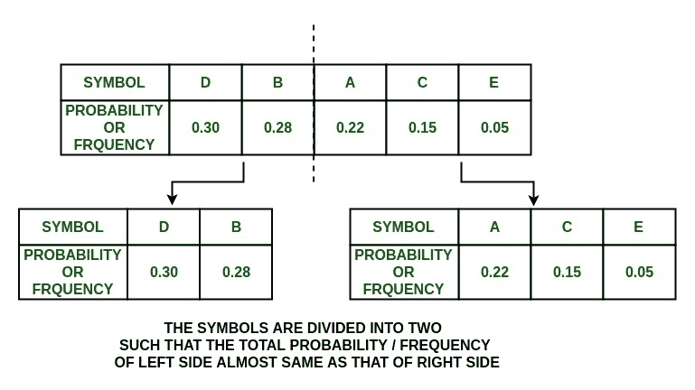
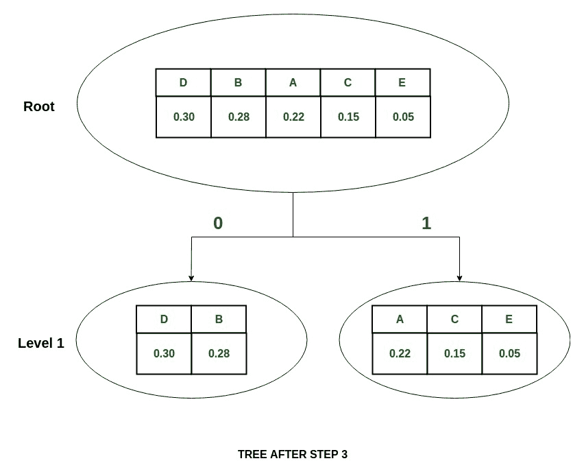
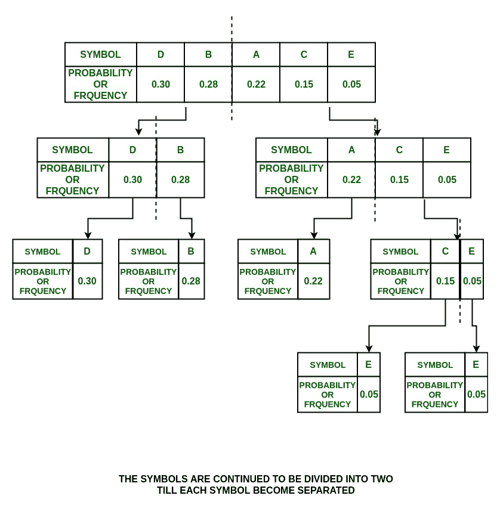
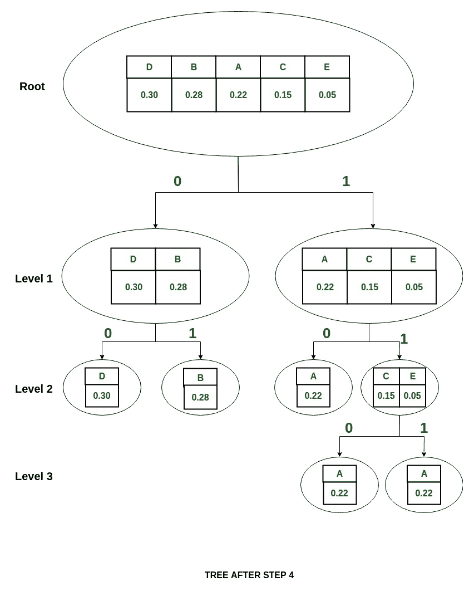
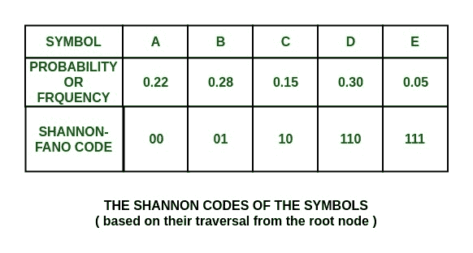

# 用于数据压缩的香农-法诺算法

> 原文:[https://www . geesforgeks . org/Shannon-fano-算法用于数据压缩/](https://www.geeksforgeeks.org/shannon-fano-algorithm-for-data-compression/)

**数据压缩及其类型**
数据压缩，也称为源编码，是以消耗较少内存空间的方式编码或转换数据的过程。数据压缩减少了存储和传输数据所需的资源数量。
可以通过两种方式完成——无损压缩和有损压缩。有损压缩通过删除不必要的信息来减小数据的大小，而无损压缩则不会丢失数据。

什么是香农·FANO 编码？
香农法诺算法是一种用于多媒体无损数据压缩的熵编码技术。它以克劳德·香农和罗伯特·法诺的名字命名，根据出现的概率为每个符号分配一个代码。这是一种可变长度编码方案，也就是说，分配给符号的代码将具有不同的长度。

**它是如何工作的？**
算法的步骤如下:

1.  为给定的符号集创建一个概率或频率计数列表，以便知道每个符号的相对出现频率。
2.  按照概率递减顺序对符号列表进行排序，最有可能的符号向左排列，最不可能的符号向右排列。
3.  将列表分成两部分，两部分的总概率尽可能接近。
4.  将值 0 指定给左边部分，将值 1 指定给右边部分。
5.  对每个零件重复步骤 3 和 4，直到所有符号都被拆分成单独的子组。

**如果每个符号的代码是唯一的，则香农代码被认为是准确的。**

**示例:**
给定的任务是使用香农-法诺无损压缩技术为给定的符号集构建香农码。

**步骤:**



**树:**



**解决方案:**

1.按照概率递减顺序排列符号时:

> **P(D) + P(B) = 0.30 + 0.2 = 0.58**

还有，

> **P(A)+P(C)+P(E)= 0.22+0.15+0.05 = 0.42**

由于几乎平均分割了表，所以分割最多的是 blockquote 表

> **{D，B}** 和 **{A，C，E}**

并分别为它们赋值 0 和 1。

**步骤:**


**树:**



2.现在，在{D，B}组中，

> **P(D)= 0.30****P(B)= 0.28**

也就是说 **P(D)~P(B)** ，所以把{D，B}分成{D}和{B}，给 D 赋值 0，给 B 赋值 1。

**步骤:**



**树:**



3.在{A，C，E}组中，

> **P(A)= 0.22****P(C)+P(E)= 0.20**

所以小组被分成

> **{ A }****{ C，E}**

并且它们分别被赋予值 0 和 1。

4.在{C，E}组中，

> **P(C)= 0.15****P(E)= 0.05**

因此，请将它们分为{C}和{E}，并将 0 分配给{C}，将 1 分配给{E}

**步骤:**



**树:**



**注意:**分裂现在停止，因为每个符号现在被分离。

**这组符号的香农码是:**



可以看出，这些都是独一无二的，长度各不相同。

下面是上述方法的实现:

## C++

```
// C++ program for Shannon Fano Algorithm

// include header files
#include <bits/stdc++.h>
using namespace std;

// declare structure node
struct node {

    // for storing symbol
    string sym;

    // for storing probability or frequency
    float pro;
    int arr[20];
    int top;
} p[20];

typedef struct node node;

// function to find shannon code
void shannon(int l, int h, node p[])
{
    float pack1 = 0, pack2 = 0, diff1 = 0, diff2 = 0;
    int i, d, k, j;
    if ((l + 1) == h || l == h || l > h) {
        if (l == h || l > h)
            return;
        p[h].arr[++(p[h].top)] = 0;
        p[l].arr[++(p[l].top)] = 1;
        return;
    }
    else {
        for (i = l; i <= h - 1; i++)
            pack1 = pack1 + p[i].pro;
        pack2 = pack2 + p[h].pro;
        diff1 = pack1 - pack2;
        if (diff1 < 0)
            diff1 = diff1 * -1;
        j = 2;
        while (j != h - l + 1) {
            k = h - j;
            pack1 = pack2 = 0;
            for (i = l; i <= k; i++)
                pack1 = pack1 + p[i].pro;
            for (i = h; i > k; i--)
                pack2 = pack2 + p[i].pro;
            diff2 = pack1 - pack2;
            if (diff2 < 0)
                diff2 = diff2 * -1;
            if (diff2 >= diff1)
                break;
            diff1 = diff2;
            j++;
        }
        k++;
        for (i = l; i <= k; i++)
            p[i].arr[++(p[i].top)] = 1;
        for (i = k + 1; i <= h; i++)
            p[i].arr[++(p[i].top)] = 0;

        // Invoke shannon function
        shannon(l, k, p);
        shannon(k + 1, h, p);
    }
}

// Function to sort the symbols
// based on their probability or frequency
void sortByProbability(int n, node p[])
{
    int i, j;
    node temp;
    for (j = 1; j <= n - 1; j++) {
        for (i = 0; i < n - 1; i++) {
            if ((p[i].pro) > (p[i + 1].pro)) {
                temp.pro = p[i].pro;
                temp.sym = p[i].sym;

                p[i].pro = p[i + 1].pro;
                p[i].sym = p[i + 1].sym;

                p[i + 1].pro = temp.pro;
                p[i + 1].sym = temp.sym;
            }
        }
    }
}

// function to display shannon codes
void display(int n, node p[])
{
    int i, j;
    cout << "\n\n\n\tSymbol\tProbability\tCode";
    for (i = n - 1; i >= 0; i--) {
        cout << "\n\t" << p[i].sym << "\t\t" << p[i].pro << "\t";
        for (j = 0; j <= p[i].top; j++)
            cout << p[i].arr[j];
    }
}

// Driver code
int main()
{
    int n, i, j;
    float total = 0;
    string ch;
    node temp;

    // Input number of symbols
    cout << "Enter number of symbols\t: ";
    n = 5;
    cout << n << endl;

    // Input symbols
    for (i = 0; i < n; i++) {
        cout << "Enter symbol " << i + 1 << " : ";
        ch = (char)(65 + i);
        cout << ch << endl;

        // Insert the symbol to node
        p[i].sym += ch;
    }

    // Input probability of symbols
    float x[] = { 0.22, 0.28, 0.15, 0.30, 0.05 };
    for (i = 0; i < n; i++) {
        cout << "\nEnter probability of " << p[i].sym << " : ";
        cout << x[i] << endl;

        // Insert the value to node
        p[i].pro = x[i];
        total = total + p[i].pro;

        // checking max probability
        if (total > 1) {
            cout << "Invalid. Enter new values";
            total = total - p[i].pro;
            i--;
        }
    }

    p[i].pro = 1 - total;

    // Sorting the symbols based on
    // their probability or frequency
    sortByProbability(n, p);

    for (i = 0; i < n; i++)
        p[i].top = -1;

    // Find the shannon code
    shannon(0, n - 1, p);

    // Display the codes
    display(n, p);
    return 0;
}
```

## 蟒蛇 3

```
# Python3 program for Shannon Fano Algorithm

# declare structure node
class  node :
    def __init__(self) -> None:
        # for storing symbol
        self.sym=''
        # for storing probability or frequency
        self.pro=0.0
        self.arr=[0]*20
        self.top=0
p=[node() for _ in range(20)]

# function to find shannon code
def shannon(l, h, p):
    pack1 = 0; pack2 = 0; diff1 = 0; diff2 = 0
    if ((l + 1) == h or l == h or l > h) :
        if (l == h or l > h):
            return
        p[h].top+=1
        p[h].arr[(p[h].top)] = 0
        p[l].top+=1
        p[l].arr[(p[l].top)] = 1

        return

    else :
        for i in range(l,h):
            pack1 = pack1 + p[i].pro
        pack2 = pack2 + p[h].pro
        diff1 = pack1 - pack2
        if (diff1 < 0):
            diff1 = diff1 * -1
        j = 2
        while (j != h - l + 1) :
            k = h - j
            pack1 = pack2 = 0
            for i in range(l, k+1):
                pack1 = pack1 + p[i].pro
            for i in range(h,k,-1):
                pack2 = pack2 + p[i].pro
            diff2 = pack1 - pack2
            if (diff2 < 0):
                diff2 = diff2 * -1
            if (diff2 >= diff1):
                break
            diff1 = diff2
            j+=1

        k+=1
        for i in range(l,k+1):
            p[i].top+=1
            p[i].arr[(p[i].top)] = 1

        for i in range(k + 1,h+1):
            p[i].top+=1
            p[i].arr[(p[i].top)] = 0

        # Invoke shannon function
        shannon(l, k, p)
        shannon(k + 1, h, p)

# Function to sort the symbols
# based on their probability or frequency
def sortByProbability(n, p):
    temp=node()
    for j in range(1,n) :
        for i in range(n - 1) :
            if ((p[i].pro) > (p[i + 1].pro)) :
                temp.pro = p[i].pro
                temp.sym = p[i].sym

                p[i].pro = p[i + 1].pro
                p[i].sym = p[i + 1].sym

                p[i + 1].pro = temp.pro
                p[i + 1].sym = temp.sym

# function to display shannon codes
def display(n, p):
    print("\n\n\n\tSymbol\tProbability\tCode",end='')
    for i in range(n - 1,-1,-1):
        print("\n\t", p[i].sym, "\t\t", p[i].pro,"\t",end='')
        for j in range(p[i].top+1):
            print(p[i].arr[j],end='')

# Driver code
if __name__ == '__main__':
    total = 0

    # Input number of symbols
    print("Enter number of symbols\t: ",end='')
    n = 5
    print(n)
    i=0
    # Input symbols
    for i in range(n):
        print("Enter symbol", i + 1," : ",end="")
        ch = chr(65 + i)
        print(ch)

        # Insert the symbol to node
        p[i].sym += ch

    # Input probability of symbols
    x = [0.22, 0.28, 0.15, 0.30, 0.05]
    for i in range(n):
        print("\nEnter probability of", p[i].sym, ": ",end="")
        print(x[i])

        # Insert the value to node
        p[i].pro = x[i]
        total = total + p[i].pro

        # checking max probability
        if (total > 1) :
            print("Invalid. Enter new values")
            total = total - p[i].pro
            i-=1

    i+=1
    p[i].pro = 1 - total
    # Sorting the symbols based on
    # their probability or frequency
    sortByProbability(n, p)

    for i in range(n):
        p[i].top = -1

    # Find the shannon code
    shannon(0, n - 1, p)

    # Display the codes
    display(n, p)
```

**Output:** 

```
Enter number of symbols    : 5
Enter symbol 1 : A
Enter symbol 2 : B
Enter symbol 3 : C
Enter symbol 4 : D
Enter symbol 5 : E

Enter probability of A : 0.22

Enter probability of B : 0.28

Enter probability of C : 0.15

Enter probability of D : 0.3

Enter probability of E : 0.05

    Symbol    Probability    Code
    D        0.3    00
    B        0.28    01
    A        0.22    10
    C        0.15    110
    E        0.05    111
```