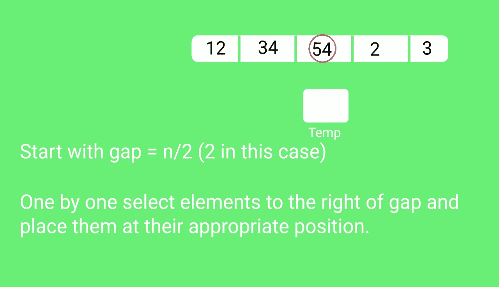
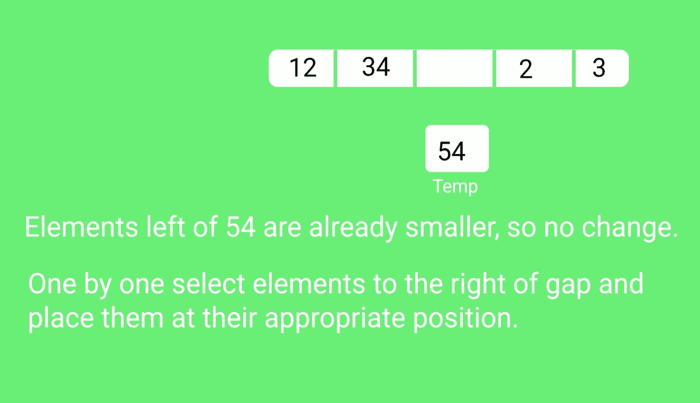
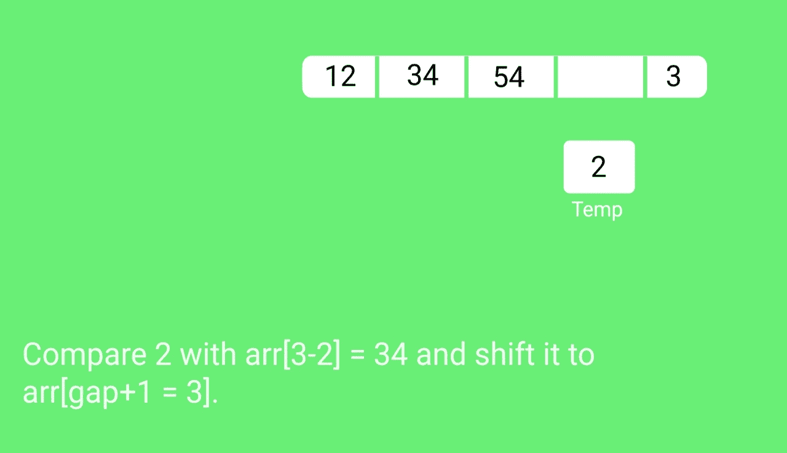
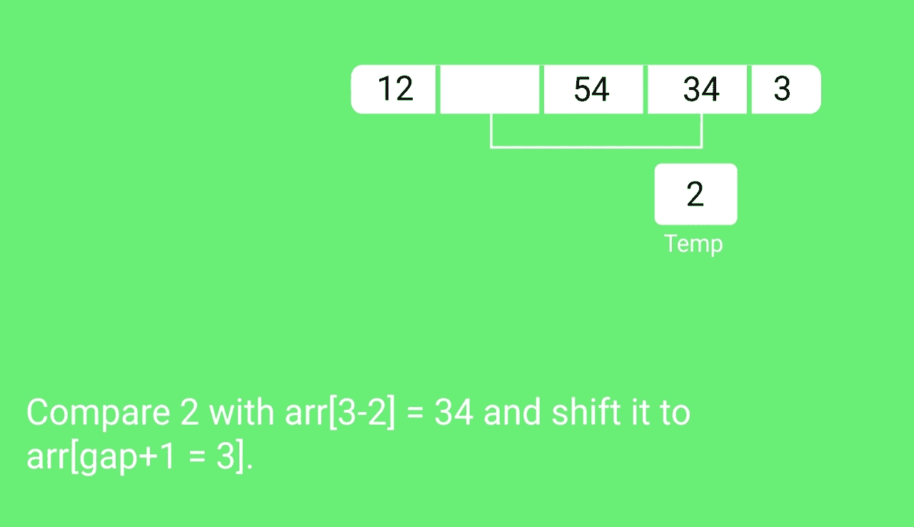
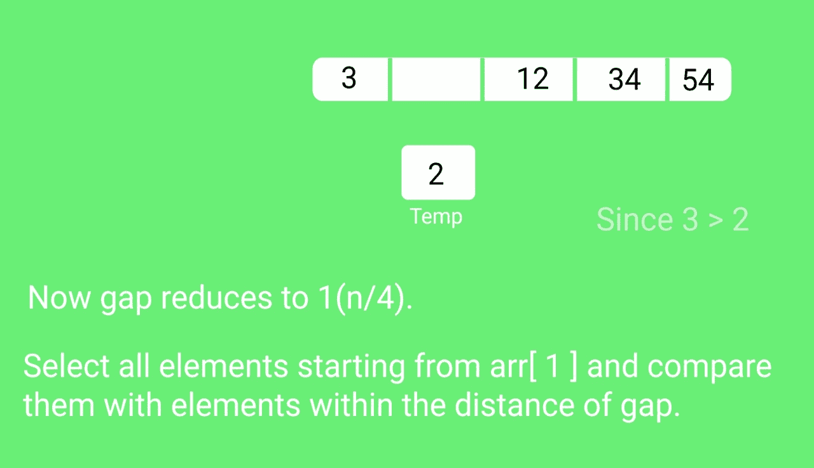
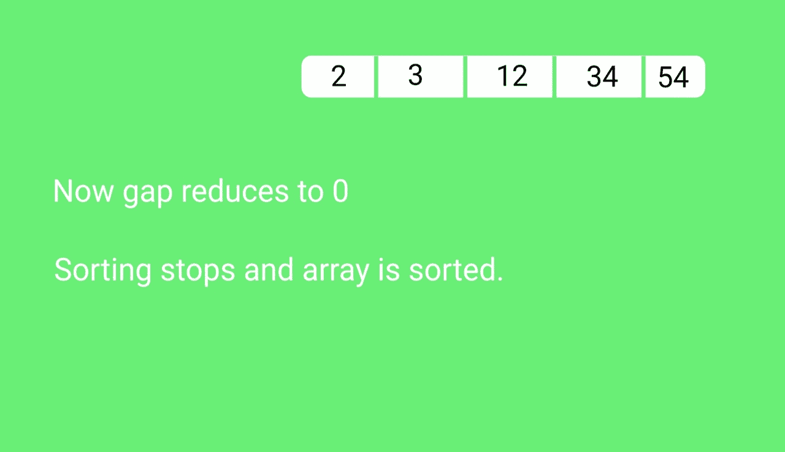

# shell place

> 原文:[https://www.geeksforgeeks.org/shellsort/](https://www.geeksforgeeks.org/shellsort/)

[壳排序](http://en.wikipedia.org/wiki/Shellsort)主要是[插入排序](https://www.geeksforgeeks.org/insertion-sort/)的变体。在插入排序中，我们只将元素向前移动一个位置。当一个元素必须向前移动很远时，会涉及到许多移动。shellSort 的思想是允许交换远程项目。在 shellSort 中，我们对数组 h 进行排序，得到一个大的 h 值。我们不断减少 h 的值，直到它变成 1。如果第 h 个元素的所有子列表都被排序，那么这个数组被称为 h 排序的。

下面是 ShellSort 的实现。

## C++

```
// C++ implementation of Shell Sort
#include  <iostream>
using namespace std;

/* function to sort arr using shellSort */
int shellSort(int arr[], int n)
{
    // Start with a big gap, then reduce the gap
    for (int gap = n/2; gap > 0; gap /= 2)
    {
        // Do a gapped insertion sort for this gap size.
        // The first gap elements a[0..gap-1] are already in gapped order
        // keep adding one more element until the entire array is
        // gap sorted
        for (int i = gap; i < n; i += 1)
        {
            // add a[i] to the elements that have been gap sorted
            // save a[i] in temp and make a hole at position i
            int temp = arr[i];

            // shift earlier gap-sorted elements up until the correct
            // location for a[i] is found
            int j;           
            for (j = i; j >= gap && arr[j - gap] > temp; j -= gap)
                arr[j] = arr[j - gap];

            //  put temp (the original a[i]) in its correct location
            arr[j] = temp;
        }
    }
    return 0;
}

void printArray(int arr[], int n)
{
    for (int i=0; i<n; i++)
        cout << arr[i] << " ";
}

int main()
{
    int arr[] = {12, 34, 54, 2, 3}, i;
    int n = sizeof(arr)/sizeof(arr[0]);

    cout << "Array before sorting: \n";
    printArray(arr, n);

    shellSort(arr, n);

    cout << "\nArray after sorting: \n";
    printArray(arr, n);

    return 0;
}
```

## Java 语言(一种计算机语言，尤用于创建网站)

```
// Java implementation of ShellSort
class ShellSort
{
    /* An utility function to print array of size n*/
    static void printArray(int arr[])
    {
        int n = arr.length;
        for (int i=0; i<n; ++i)
            System.out.print(arr[i] + " ");
        System.out.println();
    }

    /* function to sort arr using shellSort */
    int sort(int arr[])
    {
        int n = arr.length;

        // Start with a big gap, then reduce the gap
        for (int gap = n/2; gap > 0; gap /= 2)
        {
            // Do a gapped insertion sort for this gap size.
            // The first gap elements a[0..gap-1] are already
            // in gapped order keep adding one more element
            // until the entire array is gap sorted
            for (int i = gap; i < n; i += 1)
            {
                // add a[i] to the elements that have been gap
                // sorted save a[i] in temp and make a hole at
                // position i
                int temp = arr[i];

                // shift earlier gap-sorted elements up until
                // the correct location for a[i] is found
                int j;
                for (j = i; j >= gap && arr[j - gap] > temp; j -= gap)
                    arr[j] = arr[j - gap];

                // put temp (the original a[i]) in its correct
                // location
                arr[j] = temp;
            }
        }
        return 0;
    }

    // Driver method
    public static void main(String args[])
    {
        int arr[] = {12, 34, 54, 2, 3};
        System.out.println("Array before sorting");
        printArray(arr);

        ShellSort ob = new ShellSort();
        ob.sort(arr);

        System.out.println("Array after sorting");
        printArray(arr);
    }
}
/*This code is contributed by Rajat Mishra */
```

## 蟒蛇 3

```
# Python3 program for implementation of Shell Sort

def shellSort(arr):
    gap = len(arr) // 2 # initialize the gap

    while gap > 0:
        i = 0
        j = gap

        # check the array in from left to right
        # till the last possible index of j
        while j < len(arr):

            if arr[i] >arr[j]:
                arr[i],arr[j] = arr[j],arr[i]

            i += 1
            j += 1

            # now, we look back from ith index to the left
            # we swap the values which are not in the right order.
            k = i
            while k - gap > -1:

                if arr[k - gap] > arr[k]:
                    arr[k-gap],arr[k] = arr[k],arr[k-gap]
                k -= 1

        gap //= 2

# driver to check the code
arr2 = [12, 34, 54, 2, 3]
print("input array:",arr2)

shellSort(arr2)
print("sorted array",arr2)

# This code is contributed by Shubham Prashar (SirPrashar)
```

## C#

```
// C# implementation of ShellSort
using System;

class ShellSort
{
    /* An utility function to
       print array of size n*/
    static void printArray(int []arr)
    {
        int n = arr.Length;
        for (int i=0; i<n; ++i)
        Console.Write(arr[i] + " ");
        Console.WriteLine();
    }

    /* function to sort arr using shellSort */
    int sort(int []arr)
    {
        int n = arr.Length;

        // Start with a big gap,
        // then reduce the gap
        for (int gap = n/2; gap > 0; gap /= 2)
        {
            // Do a gapped insertion sort for this gap size.
            // The first gap elements a[0..gap-1] are already
            // in gapped order keep adding one more element
            // until the entire array is gap sorted
            for (int i = gap; i < n; i += 1)
            {
                // add a[i] to the elements that have
                // been gap sorted save a[i] in temp and
                // make a hole at position i
                int temp = arr[i];

                // shift earlier gap-sorted elements up until
                // the correct location for a[i] is found
                int j;
                for (j = i; j >= gap && arr[j - gap] > temp; j -= gap)
                    arr[j] = arr[j - gap];

                // put temp (the original a[i])
                // in its correct location
                arr[j] = temp;
            }
        }
        return 0;
    }

    // Driver method
    public static void Main()
    {
        int []arr = {12, 34, 54, 2, 3};
        Console.Write("Array before sorting :\n");
        printArray(arr);

        ShellSort ob = new ShellSort();
        ob.sort(arr);

        Console.Write("Array after sorting :\n");
        printArray(arr);
    }
}

// This code is contributed by nitin mittal.
```

## java 描述语言

```
<script>
// Javascript implementation of ShellSort

/* An utility function to print array of size n*/
function printArray(arr)
{
    let n = arr.length;
        for (let i = 0; i < n; ++i)
            document.write(arr[i] + " ");
        document.write("<br>");
}

/* function to sort arr using shellSort */
function sort(arr)
{
    let n = arr.length;

        // Start with a big gap, then reduce the gap
        for (let gap = Math.floor(n/2); gap > 0; gap = Math.floor(gap/2))
        {

            // Do a gapped insertion sort for this gap size.
            // The first gap elements a[0..gap-1] are already
            // in gapped order keep adding one more element
            // until the entire array is gap sorted
            for (let i = gap; i < n; i += 1)
            {

                // add a[i] to the elements that have been gap
                // sorted save a[i] in temp and make a hole at
                // position i
                let temp = arr[i];

                // shift earlier gap-sorted elements up until
                // the correct location for a[i] is found
                let j;
                for (j = i; j >= gap && arr[j - gap] > temp; j -= gap)
                    arr[j] = arr[j - gap];

                // put temp (the original a[i]) in its correct
                // location
                arr[j] = temp;
            }
        }
        return arr;
}

// Driver method
let arr = [12, 34, 54, 2, 3];
document.write("Array before sorting<br>");
printArray(arr);

arr = sort(arr);
document.write("Array after sorting<br>");
printArray(arr);

// This code is contributed by unknown2108
</script>
```

**输出:**

```
Array before sorting:
12 34 54 2 3
Array after sorting:
2 3 12 34 54

```

**时间复杂度:**上述 shellsort 实现的时间复杂度为 O(n <sup>2</sup> )。在上面的实现中，间隙在每次迭代中减少一半。还有许多其他方法可以减少间隙，从而提高时间复杂度。详见[本](http://en.wikipedia.org/wiki/Shellsort#Gap_sequences)。

**参考资料:**
[https://www . YouTube . com/watch？v = pghazjsfw 28](https://www.youtube.com/watch?v=pGhazjsFW28)
[【http://en . Wikipedia . org/wiki/shell port】](http://en.wikipedia.org/wiki/Shellsort)

**快照:**













## [外壳分类测验](https://www.geeksforgeeks.org/quiz-shellsort-gq/)

**极客上的其他排序算法/极客 sQuiz:**

*   [选择排序](https://www.geeksforgeeks.org/selection-sort/)
*   [气泡排序](https://www.geeksforgeeks.org/bubble-sort/)
*   [插入输出](https://www.geeksforgeeks.org/insertion-sort/)
*   [合并排序](https://www.geeksforgeeks.org/merge-sort/)
*   [堆排序](https://www.geeksforgeeks.org/heap-sort/)
*   [快速排序](https://www.geeksforgeeks.org/quick-sort/)
*   [基数排序](https://www.geeksforgeeks.org/radix-sort/)
*   [计数排序](https://www.geeksforgeeks.org/counting-sort/)
*   [桶排序](https://www.geeksforgeeks.org/bucket-sort-2/)