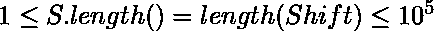

# 将所有前缀移动给定长度

> 原文:[https://www . geeksforgeeks . org/shift-所有前缀按给定长度/](https://www.geeksforgeeks.org/shift-all-prefixes-by-given-lengths/)

给定一个包含字母和数字的字符串 **S** ，一个整数数组 **Shift** 其中，和 Shift 数组的每个元素![0 \leq Shift[i] \leq 10^{9}](img/67d95cdc7917d6a1ab6056c40eb7c35c.png "Rendered by QuickLaTeX.com")。任务是，每次**移位【I】= X**，你都要将 **S** 、 **X 次**的第一个 **i+1** 字母移位。将所有这些移位应用到 **S** 后，返回最后一个字符串。
**注:** Shift 表示循环递增 ASCII 值。
**例:**

> 输入:S =“abc 789”，Shift = [2，5，9]
> 输出:“qpl 706”
> 说明:从“ABC”开始。
> 把 S 的前 1 个字母移位 2 后，我们有了“cbc”。
> 将 S 的前 2 个字母移位 5 后，我们有了“hgc”。
> 把 S 的前 3 个字母移位 9 后，就有了“qpl”。
> 
> 输入:S = "geeksforgeeks "，Shift[] = [ 11，10000，9999999 ]
> 输出:qdnyulaufkuug

**逼近:**S 的第 I 个字符被移位**Shift[I]+Shift[I+1]+…+Shift[Shift . length–1]次**。
所以我们向后更新**移位**数组，以知道要应用于字符串 **S** 每个元素的确切移位数。
现在，

> *   Traverse the given text **(s)** one character at a time.
> *   For each role, transform the given role according to the rules, that is, apply shift **shift [I]** times.
> *   The generated new string.

## C++

```
// CPP implementation of above approach
#include <bits/stdc++.h>
using namespace std;

// Function to find S after shifting each letter
string shift_S(string S, int Shift[], int n)
{
    // update shift array for each element
    for (int i = n - 2; i >= 0; --i)
        Shift[i] += Shift[i + 1];

    // finding the new shifted string
    string result = "";

    // traverse S and shift letters according to shift array
    for (int i = 0; i < S.length(); i++) {

        // For upper letters
        if (isupper(S[i])) {
            result += char((int(S[i]) + Shift[i] - 'A') % 26 + 'A');
        }

        // For lower letters
        else if (islower(S[i])) {            
            result += char((int(S[i]) + Shift[i] - 'a') % 26 + 'a');
        }

        // For digits
        else {            
            result += char((int(S[i]) + Shift[i] - '0') % 10 + '0');
        }
    }

    // Return the shifted string
    return result;
}

// Driver program
int main()
{
    string S = "abc";
    int Shift[] = { 2, 5, 9 };

    int n = sizeof(Shift) / sizeof(Shift[0]);

    // function call to print required answer
    cout << shift_S(S, Shift, n);

    return 0;
}

// This code is written by Sanjit_Prasad
```

## Java 语言(一种计算机语言，尤用于创建网站)

```
// Java implementation of the above approach 

public class GfG{

    // Function to find S after shifting each letter 
    public static String shift_S(String S, int Shift[], int n) 
    { 
        // update shift array for each element 
        for (int i = n - 2; i >= 0; --i) 
            Shift[i] += Shift[i + 1]; 

        // finding the new shifted string 
        String result = ""; 

        // traverse S and shift letters according to shift array 
        for (int i = 0; i < S.length(); i++) { 

            // For upper letters 
            if (Character.isUpperCase(S.charAt(i))) { 
                result += (char)(((int)(S.charAt(i)) + Shift[i] - 'A') % 26 + 'A'); 
            } 

            // For lower letters 
            else if (Character.isLowerCase(S.charAt(i))) {             
                result += (char)(((int)(S.charAt(i)) + Shift[i] - 'a') % 26 + 'a'); 
            } 

            // For digits 
            else {             
                result += (char)(((int)(S.charAt(i)) + Shift[i] - '0') % 10 + '0'); 
            } 
        } 

        // Return the shifted string 
        return result; 
    } 

     public static void main(String []args){

        String S = "abc"; 
        int Shift[] = { 2, 5, 9 }; 
        int n = Shift.length;

        // Function call to print the required answer 
        System.out.println(shift_S(S, Shift, n));
     }
}

// This code is contributed by Rituraj Jain
```

## 蟒蛇 3

```
# Python3 implementation of above approach

# Function to find S after shifting
# each letter
def shift_S(S, Shift, n):

    # update shift array for 
    # each element
    for i in range(n - 2, -1, -1):
        Shift[i] = Shift[i] + Shift[i + 1]

    # finding the new shifted string
    result = ""

    # traverse S and shift letters
    # according to shift array
    for i in range(len(S)):

        # For upper letters
        if(S[i].isupper()):
            result = result + chr((ord(S[i]) + Shift[i] - 
                                   ord('A')) % 26 + ord('A'))

        # For lower letters
        elif (S[i].islower()):
            result = result + chr((ord(S[i]) + Shift[i] - 
                                   ord('a')) % 26 + ord('a'))

        # For digits
        else:
            result = result + chr((ord(S[i]) + Shift[i] - 
                                   ord('0')) % 10 + ord('0'))

    # Return the shifted string
    return result 

# Driver Code
S = "abc"
Shift = [2, 5, 9]
n = len(Shift)

# Function call to print the required answer
print(shift_S(S, Shift, n))

# This code is contributed 
# by Shashank_Sharma
```

## C#

```
// C# implementation of the above approach 
using System;

class GfG{ 

// Function to find S after 
// shifting each letter 
public static String shift_S(string S, 
                             int[] Shift,
                             int n) 
{ 

    // Update shift array for each element 
    for(int i = n - 2; i >= 0; --i) 
        Shift[i] += Shift[i + 1]; 

    // Finding the new shifted string 
    string result = ""; 

    // Traverse S and shift letters 
    // according to shift array 
    for(int i = 0; i < S.Length; i++) 
    { 

        // For upper letters 
        if (Char.IsUpper(S[i])) 
        { 
            result += (char)(((int)(S[i]) + 
                     Shift[i] - 'A') % 26 + 'A'); 
        } 

        // For lower letters 
        else if (Char.IsLower(S[i]))
        {             
            result += (char)(((int)(S[i]) + 
                     Shift[i] - 'a') % 26 + 'a'); 
        } 

        // For digits 
        else 
        {             
            result += (char)(((int)(S[i]) + 
                     Shift[i] - '0') % 10 + '0'); 
        } 
    } 

    // Return the shifted string 
    return result; 
} 

// Driver code
public static void Main()
{ 
    string S = "abc"; 
    int[] Shift = { 2, 5, 9 }; 
    int n = Shift.Length; 

    // Function call to print 
    // the required answer 
    Console.WriteLine(shift_S(S, Shift, n)); 
} 
}

// This code is contributed by sanjoy_62
```

**Output:** 

```
qpl

```

**时间复杂度:** O(N)，其中 N 是字符串 s 的长度