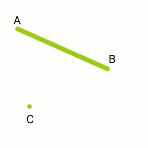
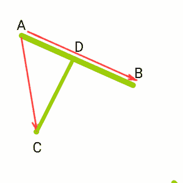
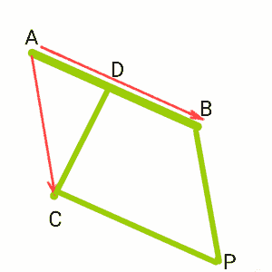

# 三维平面中直线和点之间的最短距离

> 原文:[https://www . geesforgeks . org/直线与三维平面中的点之间的最短距离/](https://www.geeksforgeeks.org/shortest-distance-between-a-line-and-a-point-in-a-3-d-plane/)

给定一条穿过两个点 A 和 B 的直线以及三维平面中的任意点 C，任务是找到点 C 与穿过点 A 和 B 的直线之间的最短距离。
示例:

```
Input: A = (5, 2, 1), B = (3, 1, -1), C = (0, 2, 3)
Output: Shortest Distance is 5

Input: A = (4, 2, 1), B = (3, 2, 1), C = (0, 2, 0)
Output: Shortest Distance is 1
```

考虑一个点 C 和一条穿过 A 和 B 的线，如下图所示。



现在考虑向量， **AB** 和 **AC** ，最短距离为 CD。最短距离总是垂直距离。D 点取在 AB 上，使得 CD 垂直于 AB。



如图构造 BP 和 CP，形成平行四边形。现在 C 是平行四边形 ABPC 的顶点，CD 垂直于 AB 面。因此，光盘是平行四边形的高度。



**注意:**当 D 没有落在线段 AB 上时，会有一个点 D '使得 PD '垂直于 AB，D '位于线段 AB 上，CD = PD '。
叉积 **AB** 和 **AC** 的大小给出了平行四边形的面积。同样，平行四边形的面积是**底*高= AB * CD** 。所以，

```
CD = |ABxAC| / |AB|
```

下面是寻找最短距离的 CPP 程序:

## 卡片打印处理机（Card Print Processor 的缩写）

```
// C++ program to find the Shortest
// Distance Between A line and a
// Given point.
#include<bits/stdc++.h>
using namespace std;

class Vector {
private:
    int x, y, z;
    // 3D Coordinates of the Vector

public:
    Vector(int x, int y, int z)
    {
        // Constructor
        this->x = x;
        this->y = y;
        this->z = z;
    }
    Vector operator+(Vector v); // ADD 2 Vectors
    Vector operator-(Vector v); // Subtraction
    int operator^(Vector v); // Dot Product
    Vector operator*(Vector v); // Cross Product
    float magnitude()
    {
        return sqrt(pow(x, 2) + pow(y, 2) + pow(z, 2));
    }
    friend ostream& operator<<(ostream& out, const Vector& v);
    // To output the Vector
};

// ADD 2 Vectors
Vector Vector::operator+(Vector v)
{
    int x1, y1, z1;
    x1 = x + v.x;
    y1 = y + v.y;
    z1 = z + v.z;
    return Vector(x1, y1, z1);
}

// Subtract 2 vectors
Vector Vector::operator-(Vector v)
{
    int x1, y1, z1;
    x1 = x - v.x;
    y1 = y - v.y;
    z1 = z - v.z;
    return Vector(x1, y1, z1);
}

// Dot product of 2 vectors
int Vector::operator^(Vector v)
{
    int x1, y1, z1;
    x1 = x * v.x;
    y1 = y * v.y;
    z1 = z * v.z;
    return (x1 + y1 + z1);
}

// Cross product of 2 vectors
Vector Vector::operator*(Vector v)
{
    int x1, y1, z1;
    x1 = y * v.z - z * v.y;
    y1 = z * v.x - x * v.z;
    z1 = x * v.y - y * v.x;
    return Vector(x1, y1, z1);
}

// Display Vector
ostream& operator<<(ostream& out,
                    const Vector& v)
{
    out << v.x << "i ";
    if (v.y >= 0)
        out << "+ ";
    out << v.y << "j ";
    if (v.z >= 0)
        out << "+ ";
    out << v.z << "k" << endl;
    return out;
}

// calculate shortest dist. from point to line
float shortDistance(Vector line_point1, Vector line_point2,
                    Vector point)
{
    Vector AB = line_point2 - line_point1;
    Vector AC = point - line_point1;
    float area = Vector(AB * AC).magnitude();
    float CD = area / AB.magnitude();
    return CD;
}

// Driver program
int main()
{
    // Taking point C as (2, 2, 2)
    // Line Passes through A(4, 2, 1)
    // and B(8, 4, 2).
    Vector line_point1(4, 2, 1), line_point2(8, 4, 2);
    Vector point(2, 2, 2);

    cout << "Shortest Distance is : "
         << shortDistance(line_point1, line_point2, point);

  return 0;
}
```

**Output:** 

```
Shortest Distance is : 1.63299
```

**时间复杂度:** O(1)

**辅助空间:** O(1)