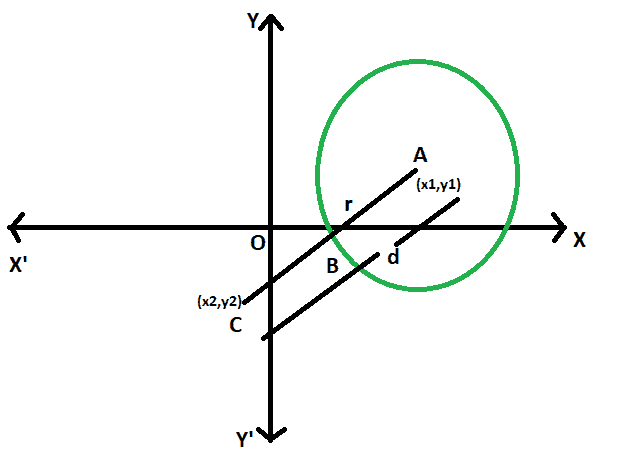

# 点到圆的最短距离

> 原文:[https://www . geesforgeks . org/最短点圆距离/](https://www.geeksforgeeks.org/shortest-distance-between-a-point-and-a-circle/)

给定一个具有给定半径的圆，其中心在坐标平面的特定位置。在坐标平面上，给出了另一个点。任务是找到点和圆之间的最短距离。
**例:**

```
Input: x1 = 4, y1 = 6, x2 = 35, y2 = 42, r = 5 
Output: 42.5079

Input: x1 = 0, y1 = 0, x2 = 5, y2 = 12, r = 3
Output: 10
```



**接近** :

*   让圆的半径= **r**

*   圆心坐标= **(x1，y1)**

*   点的坐标= **(x2，y2)**

*   让中心和点之间的距离= **d**

*   由于直线 AC 在 B 处与圆相交，因此最短距离为 BC，
    等于 **(d-r)**

*   这里使用距离公式，
    **d = √((x2-x1)^2–(y2-y1)^2)**

*   所以【T2-x1)^ 2-(y2-y1)^ 2-–r

*   所以，
    

以下是上述方法的实现:

## C++

```
// C++ program to find
// the Shortest distance
// between a point and
// a circle
#include <bits/stdc++.h>
using namespace std;

// Function to find the shortest distance
void dist(double x1, double y1, double x2, double y2, double r)
{
    cout << "The shortest distance "
         << "between a point and a circle is "
         << sqrt((pow((x2 - x1), 2))
                 + (pow((y2 - y1), 2)))
                - r
         << endl;
}

// Driver code
int main()
{
    double x1 = 4, y1 = 6,
           x2 = 35, y2 = 42, r = 5;
    dist(x1, y1, x2, y2, r);
    return 0;
}
```

## Java 语言(一种计算机语言，尤用于创建网站)

```
// Java program to find
// the Shortest distance
// between a point and
// a circle
class GFG
{

// Function to find the shortest distance
static void dist(double x1, double y1, double x2,
                                double y2, double r)
{
    System.out.println("The shortest distance "
            + "between a point and a circle is "
            + (Math.sqrt((Math.pow((x2 - x1), 2))
                    + (Math.pow((y2 - y1), 2)))
            - r));
}

// Driver code
public static void main(String[] args)
{
    double x1 = 4, y1 = 6,
            x2 = 35, y2 = 42, r = 5;
    dist(x1, y1, x2, y2, r);
}
}

/* This code contributed by PrinciRaj1992 */
```

## 蟒蛇 3

```
# Python program to find 
# the Shortest distance 
# between a point and 
# a circle 

# Function to find the shortest distance 
def dist(x1, y1, x2, y2, r): 
    print("The shortest distance between a point and a circle is "
    ,((((x2 - x1)** 2) + ((y2 - y1)** 2))**(1/2)) - r);

# Driver code 
x1 = 4;
y1 = 6; 
x2 = 35;
y2 = 42;
r = 5; 
dist(x1, y1, x2, y2, r); 

# This code has been contributed by 29AjayKumar
```

## C#

```
// C# program to find the Shortest distance
// between a point and a circle
using System;

class GFG
{

// Function to find the shortest distance
static void dist(double x1, double y1, double x2,
                                double y2, double r)
{
    Console.WriteLine("The shortest distance "
            + "between a point and a circle is "
            + (Math.Sqrt((Math.Pow((x2 - x1), 2))
                    + (Math.Pow((y2 - y1), 2)))
            - r));
}

// Driver code
public static void Main(String[] args)
{
    double x1 = 4, y1 = 6,
            x2 = 35, y2 = 42, r = 5;
    dist(x1, y1, x2, y2, r);
}
}

/* This code contributed by PrinciRaj1992 */
```

## 服务器端编程语言（Professional Hypertext Preprocessor 的缩写）

```
<?php
// PHP program to find 
// the Shortest distance 
// between a point and 
// a circle 

// Function to find the shortest distance 
function dist($x1, $y1, $x2, $y2, $r) 
{ 
    echo "The shortest distance between a point and a circle is "
                ,sqrt((pow(($x2 - $x1), 2)) 
                + (pow(($y2 - $y1), 2))) 
                - $r ;
} 

// Driver code 
$x1 = 4;
$y1 = 6; 
$x2 = 35;
$y2 = 42;
$r = 5; 
dist($x1, $y1, $x2, $y2, $r); 

// This code is contributed by AnkitRai01

?>
```

## java 描述语言

```
<script>

// javascript program to find
// the Shortest distance
// between a point and
// a circle

// Function to find the shortest distance
function dist(x1 , y1 , x2, y2 , r)
{
    document.write("The shortest distance "
            + "between a point and a circle is "
            + (Math.sqrt((Math.pow((x2 - x1), 2))
                    + (Math.pow((y2 - y1), 2)))
            - r).toFixed(5));
}

// Driver code

var x1 = 4, y1 = 6,
        x2 = 35, y2 = 42, r = 5;
dist(x1, y1, x2, y2, r);

// This code contributed by Princi Singh 

</script>
```

**Output:** 

```
The shortest distance between a point and a circle is 42.5079
```