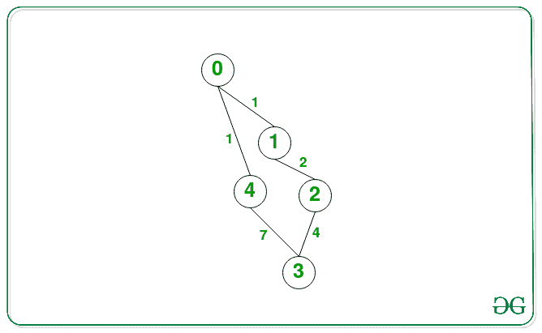

# 通过移除任意 K 条边，双向加权图中给定节点之间的最短距离

> 原文:[https://www . geesforgeks . org/双向加权图中给定节点之间的最短距离-通过移除任意 k 条边/](https://www.geeksforgeeks.org/shortest-distance-between-given-nodes-in-a-bidirectional-weighted-graph-by-removing-any-k-edges/)

给定一个正整数 **K** 和一个由 **N** 节点和 **E** 边组成的**加权**无向[连通图](https://www.geeksforgeeks.org/biconnectivity-in-a-graph/),作为{u，v，W}类型的数组**边【】**,表示权重为 **W** 的**节点 u** 和**节点 v** 之间的边，任务是找到两个给定节点之间的最短距离

**示例:**

> **输入:** N = 5，K = 1，Edges[][] = {{0，1，1}，{0，4，1}，{1，2，2}，{2，3，4}，{4，3，7}}，s = 0，d = 3
> **输出:** 1
> **解释:**
> 下面是给定测试用例的图形:
> 
> 
> 
> 在 0 和 3 之间有 2 条可能的路线。{0->1->2->3}和{0->4->3}
> 在将边缘 4- > 3 的距离减小到零之后，第二条路线变为 0- > (4，3)，因此最小距离为 1。
> 
> **输入:** N = 5，K = 2，边[][] = {{0，1，2}，{0，2，3}，{2，1，2}，{2，3，1}，{3，1，2}，{3，4，3}，{4，2，4}}，s = 0，d = 3
> **输出:** 2

**方法:**可以使用 [DFS 遍历](https://www.geeksforgeeks.org/depth-first-traversal-for-a-graph/)并存储两个给定节点之间的所有[可能路径](https://www.geeksforgeeks.org/count-possible-paths-two-vertices/)来解决给定问题。按照以下步骤解决给定的问题:

*   初始化一个变量，将 **minimumCost** 表示为 [**INT_MAX**](https://www.geeksforgeeks.org/int_max-int_min-cc-applications/) ，存储合成的最短距离。
*   [使用 DFS 遍历遍历图中从节点 **S** 到节点 **D** 的所有路径，并将从节点 **S** 到 **D** 获得的所有边权重存储在向量](https://www.geeksforgeeks.org/find-paths-given-source-destination/)的[向量中，比如 **edgesPath[]** 。](https://www.geeksforgeeks.org/vector-of-vectors-in-c-stl-with-examples/)
*   完成上述步骤后，[按照递减顺序](https://www.geeksforgeeks.org/how-to-sort-a-vector-in-descending-order-using-stl-in-c/)对存储在**edge spath【】**中的每个向量进行排序。
*   [遍历向量**的向量**](https://www.geeksforgeeks.org/how-to-iterate-through-a-vector-without-using-iterators-in-c/)edge spath【】对于每个[向量](https://www.geeksforgeeks.org/vector-in-cpp-stl/)，说**A【】**，执行以下步骤:
    *   求 **A[]** 中第一条 **K** 最大边的和。
    *   将**最小成本**的值更新为当前**(合计–总和)**和**最小成本**的最小值。
*   完成上述步骤后，打印**最小成本**的值作为结果。

下面是上述方法的实现:

## C++

```
// C++ program of the above approach
#include <bits/stdc++.h>
using namespace std;

// Function to get all the possible
// paths from the source to destination
void dfs_all(int n, int s, int d,
             vector<vector<pair<int, int> > >& graph,
             vector<bool>& vis,
             vector<vector<int> >& edge_path,
             vector<int>& temp_edge)
{
    // One possible path, reached node D
    if (s == d) {
        edge_path.push_back(temp_edge);
        return;
    }

    // Mark node s as visited
    vis[s] = true;

    // Calculate number of edges with
    // node s as connection
    int edges_in_a = graph[s].size();

    // Traverse all the connections
    // of node s
    for (int i = 0; i < edges_in_a; i++) {

        // If the connected node
        // isn't visited
        if (!vis[graph[s][i].first]) {

            // Push back edge value
            // in temp_edge
            temp_edge.push_back(
                graph[s][i].second);

            // Call DFS function recursively
            dfs_all(n, graph[s][i].first,
                    d, graph, vis,
                    edge_path, temp_edge);

            // Pop back last added edge
            temp_edge.pop_back();
        }
    }

    // Mark s as unvisited for more
    // possible paths
    vis[s] = false;
}

// Function to find the minimum sum of
// edges from source to destination
// after reducing at most K cost to 0
int getDistance(
    vector<vector<int> >& edge_path, int k)
{
    // Store the shortestDistance
    int shortestDistance = INT_MAX;

    // If edge_path vector is empty,
    // means no path exist
    if (edge_path.empty())
        return -1;

    // Traverse all the vector in
    // the edge_path
    for (auto x : edge_path) {

        // Base Case
        if (k == x.size())
            return 0;

        // lets sort the vector in
        // decreasing order
        sort(x.begin(), x.end(), greater<int>());

        // Find the sum of all the nodes
        int sum = 0;

        // Find the sum of k largest nodes
        int ksum = 0;

        for (int i = 0; i < x.size(); i++) {
            sum += x[i];
            if (i < k)
                ksum += x[i];
        }

        // If the given shortestDistance
        // is shortest, then update the
        // shortestDistance
        shortestDistance
            = min(sum - ksum, shortestDistance);
    }

    // Return the shortestDistance
    return shortestDistance;
}

// Function to find the minimum sum of
// weight of edges among all paths from
// source to destination after reducing
// at most K cost to 0
int solve(
    vector<vector<pair<int, int> > > graph,
    int n, int k, int src, int dest)
{
    // Stores all the vectors of edges for
    // every path traversed in DFS call
    vector<vector<int> > edge_path;

    // Store the edges of particular path
    vector<int> temp_edge;

    // Boolean visited vector
    vector<bool> vis(n, false);

    // DFS Call
    dfs_all(n, src, dest, graph,
            vis, edge_path, temp_edge);

    return getDistance(edge_path, k);
}

// Driver Code
int main()
{
    int n = 5, e = 5, k = 1;
    vector<vector<pair<int, int> > > graph(n);

    // Given Adjacency List
    graph[0].push_back(make_pair(1, 1));
    graph[1].push_back(make_pair(0, 1));

    graph[0].push_back(make_pair(4, 1));
    graph[4].push_back(make_pair(0, 1));

    graph[1].push_back(make_pair(2, 2));
    graph[2].push_back(make_pair(1, 2));

    graph[2].push_back(make_pair(3, 4));
    graph[3].push_back(make_pair(2, 4));

    graph[4].push_back(make_pair(3, 7));
    graph[3].push_back(make_pair(4, 7));

    int a = 0, b = 3;

    cout << solve(graph, n, k, a, b);

    return 0;
}
```

**Output:**

```
1

```

***时间复杂度:**O((N * log N)N<sup>N</sup>)*
***辅助空间:** O(N <sup>2</sup> )*

**高效方法:**上述方法也可以在找到所有可能路径后进行[排序](https://www.geeksforgeeks.org/sorting-algorithms/)的步骤进行优化。与其排序，不如用 [MinHeap](https://www.geeksforgeeks.org/binary-heap/) 计算图中 **K** 最大权重之和，将该步骤的时间复杂度降低到 ***O(N*log K)*** 。

下面是上述方法的实现:

## C++

```
// C++ program of the above approach
#include <bits/stdc++.h>
using namespace std;

// Function to get all the possible
// paths from the source to destination
void dfs_all(int n, int s, int d,
             vector<vector<pair<int, int> > >& graph,
             vector<bool>& vis,
             vector<vector<int> >& edge_path,
             vector<int>& temp_edge)
{
    // One possible path, reached node D
    if (s == d) {
        edge_path.push_back(temp_edge);
        return;
    }

    // Mark node s as visited
    vis[s] = true;

    // Calculate number of edges with
    // node s as connection
    int edges_in_a = graph[s].size();

    // Traverse all the connections
    // of node s
    for (int i = 0; i < edges_in_a; i++) {

        // If the connected node
        // isn't visited
        if (!vis[graph[s][i].first]) {

            // Push back edge value
            // in temp_edge
            temp_edge.push_back(
                graph[s][i].second);

            // Call DFS function recursively
            dfs_all(n, graph[s][i].first,
                    d, graph, vis,
                    edge_path, temp_edge);

            // Pop back last added edge
            temp_edge.pop_back();
        }
    }

    // Mark s as unvisited for more
    // possible paths
    vis[s] = false;
}

// Function to find the minimum sum of
// edges from source to destination
// after reducing at most K cost to 0
int getDistance(
    vector<vector<int> >& edge_path, int k)
{
    int shortestDistance = INT_MAX;

    // If edge_path vector is empty,
    // means no path exist
    if (edge_path.empty())
        return -1;

    // Traverse all the vector in
    // the edge_path
    for (auto x : edge_path) {

        if (k == x.size())
            return 0;

        // Use heap to store the array
        priority_queue<int, vector<int>,
                       greater<int> >
            minHeap;

        // Find the sum of all the nodes
        int sum = 0;

        // Find the sum of k largest nodes
        int ksum = 0;

        // Find the largest K edges using
        // minHeap
        for (int i = 0; i < x.size(); i++) {
            sum += x[i];
            ksum += x[i];

            // Pushing edge in MinHeap
            minHeap.push(x[i]);

            // If heap size is K
            if (minHeap.size() > k) {
                ksum -= minHeap.top();
                minHeap.pop();
            }
        }

        // If the shortestDistance is
        // smallest, then update the
        // shortestDistance
        shortestDistance
            = min(sum - ksum, shortestDistance);
    }

    // Return the shortestDistance
    return shortestDistance;
}

// Function to find the minimum sum of
// weight of edges among all paths from
// source to destination after reducing
// at most K cost to 0
int solve(
    vector<vector<pair<int, int> > > graph,
    int n, int k, int src, int dest)
{
    // Stores all the vectors of edges for
    // every path traversed in DFS call
    vector<vector<int> > edge_path;

    // Store the edges of particular path
    vector<int> temp_edge;

    // Boolean visited vector
    vector<bool> vis(n, false);

    // DFS Call
    dfs_all(n, src, dest, graph,
            vis, edge_path, temp_edge);

    return getDistance(edge_path, k);
}

// Driver Code
int main()
{
    int n = 5, e = 5, k = 1;
    vector<vector<pair<int, int> > > graph(n);

    // Given Adjacency List
    graph[0].push_back(make_pair(1, 1));
    graph[1].push_back(make_pair(0, 1));

    graph[0].push_back(make_pair(4, 1));
    graph[4].push_back(make_pair(0, 1));

    graph[1].push_back(make_pair(2, 2));
    graph[2].push_back(make_pair(1, 2));

    graph[2].push_back(make_pair(3, 4));
    graph[3].push_back(make_pair(2, 4));

    graph[4].push_back(make_pair(3, 7));
    graph[3].push_back(make_pair(4, 7));

    int a = 0, b = 3;

    cout << solve(graph, n, k, a, b);

    return 0;
}
```

**Output:**

```
1

```

***时间复杂度:**O((N * log K)N<sup>N</sup>)*
***辅助空间:** O(N <sup>2</sup> )*