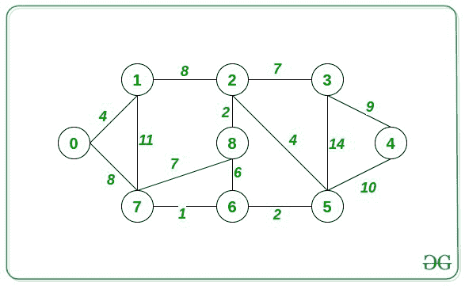

# 通过将一条边的权重减半来缩短图中两个节点之间的距离

> 原文:[https://www . geeksforgeeks . org/图中两个节点之间的最短距离-通过将边的权重减半/](https://www.geeksforgeeks.org/shortest-distance-between-two-nodes-in-graph-by-reducing-weight-of-an-edge-by-half/)

给定一个由 **N** 节点和 **M** 边组成的[加权无向图](https://www.geeksforgeeks.org/graph-implementation-using-stl-for-competitive-programming-set-2-weighted-graph/)，任务是通过将一条边的权重减半来寻找两个节点 **A** 和 **B** 之间的最短距离。

**示例:**

> **输入:** A = 0，B = 2，下图
> 
> 
> 
> **输出:** 8
> **说明:**
> 将连接 1 和 2 的边的权重减半后，将其新权重修改为 4。现在，从 0 通过路径 0 - > 1 - > 2 到达 2 的最短距离是(4 + 4) = 8。
> 因此，打印 8。

**方法:**给定的问题可以通过维护两个数组来解决，以源节点为 A 的[最短距离数组](https://www.geeksforgeeks.org/dijkstras-shortest-path-algorithm-greedy-algo-7/)将存储所有节点到 **A 的最短距离**，同样以源节点为 **B 的最短距离数组**。这些数组可以使用[迪克斯特拉算法](https://www.geeksforgeeks.org/dijkstras-shortest-path-algorithm-greedy-algo-7/)来计算。按照以下步骤解决上述问题:

*   使用 Dijkstra 算法将每个节点从 **A** 到[数组](https://www.geeksforgeeks.org/introduction-to-arrays/)T4【disA】的最短距离存储起来。
*   使用迪克斯特拉算法将每个节点从 **B** 到一个数组 **disB[]** 的最短距离存储起来。
*   假设边 <sub>i</sub> = **{u <sub>i</sub> ，v <sub>i</sub> ，wt <sub>i</sub> }** 即边 <sub>i</sub> 将节点**u<sub>I</sub>T15】连接到**v<sub>I</sub>T19】，权重为**wt<sub>I</sub>T23】。******
*   现在，迭代所有边，对于每个边，跟踪函数如下:

> **f(边<sub>I</sub>)= min(DiSA[u<sub>I</sub>)+DISb[v<sub>I</sub>、DiSA[v<sub>I</sub>+DISb[u<sub>I</sub>)+(wt<sub>I</sub>/2)**。

*   上面的关系给出了 **f(边)**的最小值，这是合成的最短距离。

下面是上述方法的实现:

## C++14

```
// C++ program for the above approach

#include <bits/stdc++.h>
using namespace std;

// Stores the input Graph
vector<pair<int, int> > graph[100001];

// Stores edges of input Graph
vector<vector<int> > edges;

// Function to input Edges
void add_edge(int u, int v, int w)
{
    graph[u].push_back({ v, w });
    graph[v].push_back({ u, w });
    edges.push_back({ u, v, w });
}

// Function to find the shortest distance
// to each node from the src node using
// Dijkstra’s Algorithm
vector<int> dijsktras(int src, int N)
{
    // Stores the shortest distance of
    // each node form src node
    vector<int> dis(N, INT_MAX);

    vector<bool> vis(N, false);

    // Stores the node and current
    // minimum distance in a heap
    priority_queue<pair<int, int>,
                   vector<pair<int, int> >,
                   greater<pair<int, int> > >
        pq;
    pq.push({ 0, src });
    dis[src] = 0;

    // BFS for single source shortest
    // path algorithm
    while (!pq.empty()) {

        // Top of the PQ
        auto cur = pq.top();
        pq.pop();

        // Store the node and weight
        int node = cur.second;
        int weight = cur.first;

        // If node is already visited
        if (vis[node])
            continue;
        vis[node] = true;

        // Traverse the adjacency list
        // of the node
        for (auto child : graph[node]) {

            // If the distance obtained
            // from parent is less than
            // the current minimum
            // distance stored for child
            if (dis[child.first]
                > child.second + weight) {
                dis[child.first] = weight
                                   + child.second;

                // Push the next pair
                // in the PQ
                pq.push({ dis[child.first],
                          child.first });
            }
        }
    }

    // Return the maximum distance
    return dis;
}

// Function to find shortest distance
// between two nodes by reducing any
// one weight of an edge by half
int shortestDistance(int N, int M,
                     int A, int B)
{
    // Stores the the shortest distance
    // of each node from A
    vector<int> disA = dijsktras(A, N);

    // Stores the the shortest distance
    // of each node from B
    vector<int> disB = dijsktras(B, N);

    int ans = disA[B];
    for (auto edge : edges) {
        int u = edge[0], v = edge[1];
        int weight = edge[2];

        // Calculate the value of f(edge)
        // for the current edge
        int cur = min(disA[u] + disB[v],
                      disA[v] + disB[u])
                  + (weight / 2);

        // Keep track of the minimum of
        // f(edge) for all edges
        ans = min(ans, cur);
    }

    // Return Answer
    return ans;
}

// Driver Code
int main()
{
    int N = 9, M = 14, A = 0, B = 2;

    // Create a Graph
    add_edge(0, 1, 4);
    add_edge(1, 2, 8);
    add_edge(2, 3, 7);
    add_edge(3, 4, 9);
    add_edge(4, 5, 10);
    add_edge(5, 6, 2);
    add_edge(6, 7, 1);
    add_edge(7, 0, 8);
    add_edge(1, 7, 11);
    add_edge(7, 8, 7);
    add_edge(2, 8, 2);
    add_edge(6, 8, 6);
    add_edge(2, 5, 4);
    add_edge(3, 5, 14);

    // Function Call
    cout << shortestDistance(N, M, A, B);

    return 0;
}
```

**Output:** 

```
8
```

***时间复杂度:** O(M*log N)*
***辅助空间:** O(N + M)*