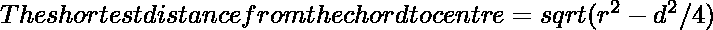

# 圆心到弦的最短距离

> 原文:[https://www . geeksforgeeks . org/从圆心到弦的最短距离/](https://www.geeksforgeeks.org/shortest-distance-from-the-centre-of-a-circle-to-a-chord/)

给定一个内部有弦的圆。给出了弦的长度和圆的半径。任务是找到从和弦到中心的最短距离。
**例:**

```
Input: r = 4, d = 3 
Output: 3.7081

Input: r = 9.8, d = 7.3
Output: 9.09492
```


**接近**:

*   我们知道从弦的中心垂下的线段将弦一分为二。这条线就是弦的垂直平分线，我们知道垂直距离是最短的距离，所以我们的任务就是求这个垂直平分线的长度。
*   让圆的半径= **r**
*   弦长= **d**
*   所以，在三角形中 **OBC** 、
    来自**勾股定理**、
    T6】ob^2+(d/2)^2 = r^2
    所以，**ob = √(r^2–d^2/4)**
*   所以，

下面是上述方法的实现:

## C++

```
// C++ program to find
// the shortest distance from
// chord to the centre of circle
#include <bits/stdc++.h>
using namespace std;

// Function to find the shortest distance
void shortdis(double r, double d)
{
    cout << "The shortest distance "
         << "from the chord to centre "
         << sqrt((r * r) - ((d * d) / 4))
         << endl;
}

// Driver code
int main()
{
    double r = 4, d = 3;
    shortdis(r, d);
    return 0;
}
```

## Java 语言(一种计算机语言，尤用于创建网站)

```
// Java program to find
// the shortest distance from
// chord to the centre of circle
class GFG
{

// Function to find the shortest distance
static void shortdis(double r, double d)
{
    System.out.println("The shortest distance "
        + "from the chord to centre "
        + (Math.sqrt((r * r) - ((d * d) / 4))));
}

// Driver code
public static void main(String[] args)
{
    double r = 4, d = 3;
    shortdis(r, d);
}
}

/* This code contributed by PrinciRaj1992 */
```

## 蟒蛇 3

```
# Python program to find
# the shortest distance from
# chord to the centre of circle

# Function to find the shortest distance
def shortdis(r, d):
    print("The shortest distance ",end="");
    print("from the chord to centre ",end="");
    print(((r * r) - ((d * d) / 4))**(1/2));

# Driver code
r = 4;
d = 3;
shortdis(r, d);

# This code has been contributed by 29AjayKumar
```

## C#

```
// C# program to find
// the shortest distance from
// chord to the centre of circle
using System;

class GFG
{

    // Function to find the shortest distance
    static void shortdis(double r, double d)
    {
        Console.WriteLine("The shortest distance "
            + "from the chord to centre "
            + (Math.Sqrt((r * r) - ((d * d) / 4))));
    }

    // Driver code
    public static void Main()
    {
        double r = 4, d = 3;
        shortdis(r, d);
    }
}

// This code is contributed by AnkitRai01
```

## 服务器端编程语言（Professional Hypertext Preprocessor 的缩写）

```
<?php

// PHP program to find
// the shortest distance from
// chord to the centre of circle

// Function to find the shortest distance
function shortdis($r,  $d)
{
    echo "The shortest distance ";
    echo "from the chord to centre ";
    echo sqrt(($r * $r) - (($d * $d) / 4));
}

// Driver code
    $r = 4;
    $d = 3;
    shortdis($r, $d);

// This code is contributed by Naman_Garg.

?>
```

## java 描述语言

```
<script>

// JavaScript program to find
// the shortest distance from
// chord to the centre of circle

// Function to find the shortest distance
function shortdis(r, d)
{
    document.write("The shortest distance "
        + "from the chord to centre "
        + Math.sqrt((r * r) - ((d * d) / 4))
        + "<br>");
}

// Driver code

    let r = 4, d = 3;
    shortdis(r, d);

// This code is contributed by Surbhi Tyagi.

</script>
```

**Output:** 

```
The leshortest distance from the chord to centre 3.7081
```