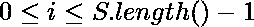

# 从给定角色到其他角色的最短距离

> 原文:[https://www . geesforgeks . org/给定字符到每隔一个字符的最短距离/](https://www.geeksforgeeks.org/shortest-distance-to-every-other-character-from-given-character/)

给定一个字符串 *S* 和一个字符 *X* 其中![X\varepsilon S[i]      ](img/88e182f4021567497247b434657965c3.png "Rendered by QuickLaTeX.com")，对于一些。任务是返回一个距离数组，表示从字符 *X* 到字符串中每隔一个字符的最短距离。
**示例:**

> **输入:** S = "geeksforgeeks "，X = ' e '
> T3】输出:【1，0，0，1，2，3，3，2，1，0，0，1，2】
> 对于 S[0] = 'g '最近的' e '是在距离= 1 处，即 S[1] = 'e '。
> 同样，对于 S[1] = 'e '，距离= 0。
> 对于 S[6] = 'o '，距离= 3 因为我们有 S[9] = 'e '，以此类推。
> **输入:** S = "helloworld "，X = 'o'
> **输出:**【4，3，2，1，0，1，0，1，2，3】

**方法 1:** 对于*S【】*中索引 *i* 处的每个字符，让我们试着从左到右，从右到左找到到下一个字符 *X* 的距离。答案将是这两个值中的最小值。

*   从左到右，我们记住了看到的最后一个字符 *X* 的索引。那么答案是*I–prev*。
*   从右向左，答案是*prev–I*。
*   我们取这两个答案中的最小值来创建最终的距离数组。
*   最后，打印数组。

下面是上述方法的实现:

## C++

```
// C++ implementation of above approach
#include <bits/stdc++.h>

using namespace std;

// Function to return required
// array of distances
void shortestDistance(string S, char X)
{
    // Find distance from occurrences of X
    // appearing before current character.
    int prev = INT_MAX;
    vector<int> ans;

    for (int i = 0; i < S.length(); i++)
    {
        if (S[i] == X)
            prev = i;
        if (prev == INT_MAX)
            ans.push_back(INT_MAX);
        else
            ans.push_back(i - prev);
    }

    // Find distance from occurrences of X
    // appearing after current character and
    // compare this distance with earlier.
    prev = INT_MAX;
    for (int i = S.length() - 1; i >= 0; i--)
    {
        if (S[i] == X)
            prev = i;
         if (prev != INT_MAX)
            ans[i] = min(ans[i], prev - i);
    }

    for (auto val: ans)
        cout << val << ' ';
}

// Driver code
int main()
{
    string S = "helloworld";
    char X = 'o';
    shortestDistance(S, X);
    return 0;
}

// This code is contributed by Rituraj Jain
```

## Java 语言(一种计算机语言，尤用于创建网站)

```
// Java implementation of above approach
import java.util.*;

class GFG
{

// Function to return required
// array of distances
static void shortestDistance(String S, char X)
{

    // Find distance from occurrences of X
    // appearing before current character.
    int prev = Integer.MAX_VALUE;
    Vector<Integer> ans = new Vector<>();

    for (int i = 0; i < S.length(); i++)
    {
        if (S.charAt(i) == X)
            prev = i;
        if (prev == Integer.MAX_VALUE)
            ans.add(Integer.MAX_VALUE);
        else   
            ans.add(i - prev);
    }

    // Find distance from occurrences of X
    // appearing after current character and
    // compare this distance with earlier.
    prev = Integer.MAX_VALUE;
    for (int i = S.length() - 1; i >= 0; i--)
    {
        if (S.charAt(i) == X)
            prev = i;
        if (prev != Integer.MAX_VALUE)   
            ans.set(i, Math.min(ans.get(i), prev - i));
    }

    for (Integer val: ans)
            System.out.print(val+" ");
}

// Driver code
public static void main(String[] args)
{
    String S = "geeksforgeeks";
    char X = 'g';
    shortestDistance(S, X);
}
}

// This code is contributed by Rajput-Ji
```

## 蟒蛇 3

```
# Python3 implementation of above approach

# Function to return required
# array of distances
def shortestDistance(S, X):

    # Find distance from occurrences of X
    # appearing before current character.
    inf = float('inf')
    prev = inf
    ans = []
    for i,j in enumerate(S):
        if S[i] == X:
            prev = i
        if (prev == inf) :
            ans.append(inf)
        else :    
            ans.append(i - prev)

    # Find distance from occurrences of X
    # appearing after current character and
    # compare this distance with earlier.
    prev = inf
    for i in range(len(S) - 1, -1, -1):
        if S[i] == X:
            prev = i
        if (X != inf):   
            ans[i] = min(ans[i], prev - i)

    # return array of distance
    return ans

# Driver code
S = "geeksforgeeks"
X = "g"

# Function call to print answer
print(shortestDistance(S, X))
```

## C#

```
// C# implementation of above approach
using System;
using System.Collections.Generic;

class GFG
{

    // Function to return required
    // array of distances
    public static void shortestDistance(String S, char X){

        // Find distance from occurrences of X
        // appearing before current character.
        int prev = int.MaxValue;
        List<int> ans = new List<int>();
        for (int i=0; i<S.Length; i++)
        {
            if (S[i] == X)
                prev = i;
            if (prev == int.MaxValue)
                ans.Add(int.MaxValue);
            else
                ans.Add(i-prev);
        }

        // Find distance from occurrences of X
        // appearing after current character and
        // compare this distance with earlier.
        prev = int.MaxValue;
        for (int i=S.Length-1; i>=0; i--)
        {
            if (S[i] == X)
                prev = i;
            if (prev != int.MaxValue)
                ans[i] = Math.Min(ans[i], prev-i);
        }

        foreach (var i in ans)
            Console.Write(i + " ");
    }

    // Driver code
    public static void Main(String[] args)
    {
        String S = "geeksforgeeks";
        char X = 'g';
        shortestDistance(S, X);
    }
}

// This code is contributed by
// sanjeev2552
```

**Output**

```
4 3 2 1 0 1 0 1 2 3 
```

**方法 2:** 创建一个保存字符出现的列表，然后创建两个指针指向该列表中的两个直接位置，现在迭代字符串以找到这两个指针的差异，并在结果列表中插入最小值。如果指针 2 更接近当前字符，则将指针向前移动一步。

*   创建一个保存字符串中所需字符位置的列表和一个保存结果数组的空列表。
*   创建两个指向列表的指针 *p1=0* 和 *p2=0* 如果列表长度为 1*p2 = 1*
*   迭代字符串，并将这些指针 *(v1=p1- >值& v2=p2- >值)*处的值与当前索引 *(i)* 进行比较。
    *   如果 *i < = v1，*则在结果列表中推 *v1-i* 。
    *   否则如果*我< = v2*
        *   如果 *i* 更靠近 *v1，*则在结果列表中推 *i-v1*
        *   否则，在结果列表中按下 *v2-i* ，如果可能，将指针向前移动一步
    *   否则将 *i-v1* 推入结果列表
*   返回结果列表

下面是上述方法的实现:

## C++

```
// C++ implementation of above approach
#include <bits/stdc++.h>

using namespace std;

// Function to return required
// vector of distances
vector<int> shortestToChar(string s, char c)
{
    // list to hold position of c in s
    vector<int> list;

    // list to hold the result
    vector<int> res;

    // length of string
    int len = s.length();

    // Iterate over string to create list
    for (int i = 0; i < len; i++) {
        if (s[i] == c) {
            list.push_back(i);
        }
    }

    int p1, p2, v1, v2;

    // max value of p2
    int l = list.size() - 1;

    // Initialize the pointers
    p1 = 0;
    p2 = l > 0 ? 1 : 0;

    // Create result array
    for (int i = 0; i < len; i++) {
        // Values at current pointers
        v1 = list[p1];
        v2 = list[p2];

        // Current Index is before than p1
        if (i <= v1) {
            res.push_back(v1 - i);
        }
        // Current Index is between p1 and p2
        else if (i <= v2) {
            // Current Index is nearer to p1
            if (i - v1 < v2 - i) {
                res.push_back(i - v1);
            }
            // Current Index is nearer to p2
            else {
                res.push_back(v2 - i);
                // Move pointer 1 step ahead
                p1 = p2;
                p2 = p2 < l ? (p2 + 1) : p2;
            }
        }
        // Current index is after p2
        else {
            res.push_back(i - v2);
        }
    }
    return res;
}

// Driver code
int main()
{
    string s = "geeksforgeeks";
    char c = 'e';
    vector<int> res = shortestToChar(s, c);
    for (auto i : res)
        cout << i << "  ";
    return 0;
}

// This code is contributed by Shivam Sharma
```

## C

```
// C implementation of above approach
#include <stdio.h>
#define MAX_SIZE 100

// Function to return required
// vector of distances
void shortestToChar(char s[], char c, int* res)
{
    // list to hold position of c in s
    int list[MAX_SIZE];

    // length of string
    int len = 0;

    // To hold size of list
    int l = 0;

    // Iterate over string to create list
    while (s[len] != '\0') {
        if (s[len] == c) {
            list[l] = len;
            l++;
        }
        len++;
    }

    int p1, p2, v1, v2;

    // max value of p2
    l = l - 1;

    // Initialize the pointers
    p1 = 0;
    p2 = l > 0 ? 1 : 0;

    // Create result array
    for (int i = 0; i < len; i++) {
        // Values at current pointers
        v1 = list[p1];
        v2 = list[p2];

        // Current Index is before than p1
        if (i <= v1) {
            res[i] = (v1 - i);
        }
        // Current Index is between p1 and p2
        else if (i <= v2) {
            // Current Index is nearer to p1
            if (i - v1 < v2 - i) {
                res[i] = (i - v1);
            }
            // Current Index is nearer to p2
            else {
                res[i] = (v2 - i);
                // Move pointer 1 step ahead
                p1 = p2;
                p2 = p2 < l ? (p2 + 1) : p2;
            }
        }
        // Current index is after p2
        else {
            res[i] = (i - v2);
        }
    }
}

// Driver code
int main()
{
    char s[] = "geeksforgeeks";
    char c = 'e';
    int res[MAX_SIZE];
    shortestToChar(s, c, res);
    int i = 0;
    while (s[i] != '\0')
        printf("%d  ", res[i++]);
    return 0;
}

// This code is contributed by Shivam Sharma
```

**Output**

```
1  0  0  1  2  3  3  2  1  0  0  1  2  
```

**时间复杂度:** O(n)

**空间复杂度:** O(n)