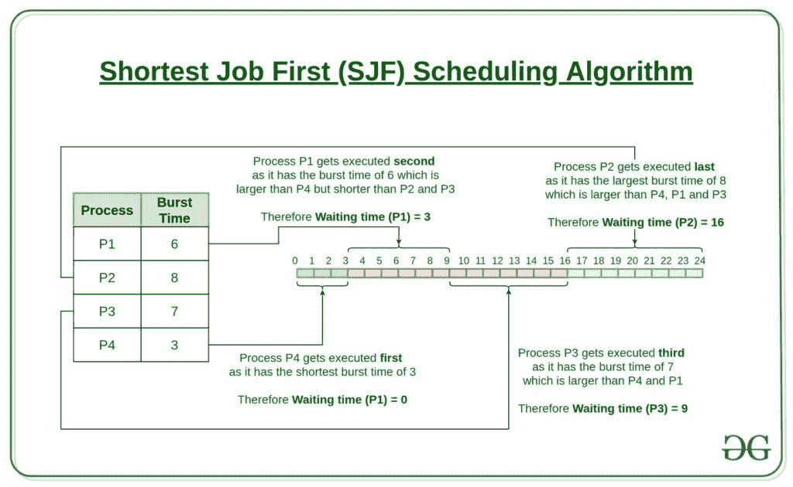

# 使用段树的最短作业优先(或 SJF) CPU 调度非抢占算法

> 原文:[https://www . geesforgeks . org/最短作业优先-or-sjf-CPU-调度-非抢占式-算法-使用段-树/](https://www.geeksforgeeks.org/shortest-job-first-or-sjf-cpu-scheduling-non-preemptive-algorithm-using-segment-tree/)

[最短作业优先(SJF)或最短作业其次](https://www.geeksforgeeks.org/program-for-shortest-job-first-or-sjf-cpu-scheduling-set-1-non-preemptive/)，是一种调度策略，选择执行时间最小的等待进程进行下一步执行。SJN 是一个非抢先算法。

*   最短作业优先具有在所有[调度算法](https://www.geeksforgeeks.org/cpu-scheduling-in-operating-systems/)中具有最小平均等待时间的优点。
*   这是一个[贪婪算法](https://www.geeksforgeeks.org/greedy-algorithms/)。
*   如果持续出现更短的进程，可能会导致饥饿。这个问题可以用老化的概念来解决。
*   这实际上是不可行的，因为操作系统可能不知道突发时间，因此可能不会对它们进行排序。虽然不可能预测执行时间，但是可以使用几种方法来估计作业的执行时间，例如以前执行时间的加权平均值。SJF 可以用在专门的环境中，那里有准确的运行时间估计。

例如:



在上面的例子中，由于所有进程的到达时间是 0，所以进程的执行顺序是进程的突发时间的升序。突发时间由列持续时间给出。因此，流程的执行顺序由
给出

```
P4 -> P1 -> P3 -> P2
```

这个算法的一个实现已经在[文章中借助于朴素方法](https://www.geeksforgeeks.org/program-for-shortest-job-first-or-sjf-cpu-scheduling-set-1-non-preemptive/)进行了讨论。在本文中，该算法通过使用[段树](https://www.geeksforgeeks.org/segment-tree-set-1-sum-of-given-range/)的概念来实现。

**方法:**以下是用于执行最短作业优先的方法:

1.  顾名思义，最短作业优先算法是执行突发时间最少且在当前时间之前到达的进程的算法。因此，为了找到需要执行的进程，请根据到达时间对给定进程集中的所有进程进行排序。这确保了首先到达的具有最短突发时间的进程被首先执行。
2.  不是通过迭代整个结构数组来寻找所有到达进程中的最小突发时间进程，而是使用[段树](https://www.geeksforgeeks.org/segment-tree-set-1-sum-of-given-range/)来计算所有到达进程的突发时间到当前时间的[范围最小值](https://www.geeksforgeeks.org/segment-tree-set-1-range-minimum-query/)。
3.  选择需要执行的流程后，利用流程的到达时间和突发时间计算**完成时间**、**周转时间**和**等待时间**。计算相应时间的公式如下:
    *   **完成时间:**进程完成执行的时间。

```
Completion Time = Start Time + Burst Time
```

*   **周转时间:**完工时间与到达时间的时间差。

```
Turn Around Time = Completion Time – Arrival Time
```

*   **等待时间(W.T):** 掉头时间和突发时间之间的时间差。

```
Waiting Time = Turn Around Time – Burst Time
```

1.  在计算之后，在数组中更新相应的时间，并且在段树基数组中将所执行的过程的突发时间设置为无穷大，从而在进一步的查询中不将其视为最小突发时间。

下面是使用[段树](https://www.geeksforgeeks.org/segment-tree-set-1-sum-of-given-range/)的概念实现最短作业优先:

## C++

```
// C++ implementation of shortest job first
// using the concept of segment tree

#include <bits/stdc++.h>
using namespace std;
#define ll long long
#define z 1000000007
#define sh 100000
#define pb push_back
#define pr(x) printf("%d ", x)

struct util {

    // Process ID
    int id;
    // Arrival time
    int at;
    // Burst time
    int bt;
    // Completion time
    int ct;
    // Turnaround time
    int tat;
    // Waiting time
    int wt;
}

// Array to store all the process information
// by implementing the above struct util
ar[sh + 1];

struct util1 {

    // Process id
    int p_id;
    // burst time
    int bt1;
};

util1 range;

// Segment tree array to
// process the queries in nlogn
util1 tr[4 * sh + 5];

// To keep an account of where
// a particular process_id is
// in the segment tree base array
int mp[sh + 1];

// Comparator function to sort the
// struct array according to arrival time
bool cmp(util a, util b)
{
    if (a.at == b.at)
        return a.id < b.id;
    return a.at < b.at;
}

// Function to update the burst time and process id
// in the segment tree
void update(int node, int st, int end,
            int ind, int id1, int b_t)
{
    if (st == end) {
        tr[node].p_id = id1;
        tr[node].bt1 = b_t;
        return;
    }
    int mid = (st + end) / 2;
    if (ind <= mid)
        update(2 * node, st, mid, ind, id1, b_t);
    else
        update(2 * node + 1, mid + 1, end, ind, id1, b_t);
    if (tr[2 * node].bt1 < tr[2 * node + 1].bt1) {
        tr[node].bt1 = tr[2 * node].bt1;
        tr[node].p_id = tr[2 * node].p_id;
    }
    else {
        tr[node].bt1 = tr[2 * node + 1].bt1;
        tr[node].p_id = tr[2 * node + 1].p_id;
    }
}

// Function to return the range minimum of the burst time
// of all the arrived processes using segment tree
util1 query(int node, int st, int end, int lt, int rt)
{
    if (end < lt || st > rt)
        return range;
    if (st >= lt && end <= rt)
        return tr[node];
    int mid = (st + end) / 2;
    util1 lm = query(2 * node, st, mid, lt, rt);
    util1 rm = query(2 * node + 1, mid + 1, end, lt, rt);
    if (lm.bt1 < rm.bt1)
        return lm;
    return rm;
}

// Function to perform non_preemptive
// shortest job first and return the
// completion time, turn around time and
// waiting time for the given processes
void non_preemptive_sjf(int n)
{

    // To store the number of processes
    // that have been completed
    int counter = n;

    // To keep an account of the number
    // of processes that have been arrived
    int upper_range = 0;

    // Current running time
    int tm = min(INT_MAX, ar[upper_range + 1].at);

    // To find the list of processes whose arrival time
    // is less than or equal to the current time
    while (counter) {
        for (; upper_range <= n;) {
            upper_range++;
            if (ar[upper_range].at > tm || upper_range > n) {
                upper_range--;
                break;
            }

            update(1, 1, n, upper_range,
                   ar[upper_range].id, ar[upper_range].bt);
        }

        // To find the minimum of all the running times
        // from the set of processes whose arrival time is
        // less than or equal to the current time
        util1 res = query(1, 1, n, 1, upper_range);

        // Checking if the process has already been executed
        if (res.bt1 != INT_MAX) {
            counter--;
            int index = mp[res.p_id];
            tm += (res.bt1);

            // Calculating and updating the array with
            // the current time, turn around time and waiting time
            ar[index].ct = tm;
            ar[index].tat = ar[index].ct - ar[index].at;
            ar[index].wt = ar[index].tat - ar[index].bt;

            // Update the process burst time with
            // infinity when the process is executed
            update(1, 1, n, index, INT_MAX, INT_MAX);
        }
        else {
            tm = ar[upper_range + 1].at;
        }
    }
}

// Function to call the functions and perform
// shortest job first operation
void execute(int n)
{

    // Sort the array based on the arrival times
    sort(ar + 1, ar + n + 1, cmp);
    for (int i = 1; i <= n; i++)
        mp[ar[i].id] = i;

    // Calling the function to perform
    // non-premptive-sjf
    non_premptive_sjf(n);
}

// Function to print the required values after
// performing shortest job first
void print(int n)
{

    cout << "ProcessId  "
         << "Arrival Time  "
         << "Burst Time  "
         << "Completion Time  "
         << "Turn Around Time  "
         << "Waiting Time\n";
    for (int i = 1; i <= n; i++) {
        cout << ar[i].id << " \t\t "
             << ar[i].at << " \t\t "
             << ar[i].bt << " \t\t "
             << ar[i].ct << " \t\t "
             << ar[i].tat << " \t\t "
             << ar[i].wt << " \n";
    }
}

// Driver code
int main()
{
    // Number of processes
    int n = 5;

    // Initializing the process id
    // and burst time
    range.p_id = INT_MAX;
    range.bt1 = INT_MAX;

    for (int i = 1; i <= 4 * sh + 1; i++) {
        tr[i].p_id = INT_MAX;
        tr[i].bt1 = INT_MAX;
    }

    // Arrival time, Burst time and ID
    // of the processes on which SJF needs
    // to be performed
    ar[1].at = 1;
    ar[1].bt = 7;
    ar[1].id = 1;

    ar[2].at = 2;
    ar[2].bt = 5;
    ar[2].id = 2;

    ar[3].at = 3;
    ar[3].bt = 1;
    ar[3].id = 3;

    ar[4].at = 4;
    ar[4].bt = 2;
    ar[4].id = 4;

    ar[5].at = 5;
    ar[5].bt = 8;
    ar[5].id = 5;

    execute(n);

    // Print the calculated time
    print(n);
}
```

## Java 语言(一种计算机语言，尤用于创建网站)

```
// Java implementation of shortest job first
// using the concept of segment tree
import java.util.*;

class GFG {

    static int z = 1000000007;
    static int sh = 100000;

    static class util {

        // Process ID
        int id;
        // Arrival time
        int at;
        // Burst time
        int bt;
        // Completion time
        int ct;
        // Turnaround time
        int tat;
        // Waiting time
        int wt;
    }

    // Array to store all the process information
    // by implementing the above struct util
    static util[] ar = new util[sh + 1];
    static {
        for (int i = 0; i < sh + 1; i++) {
            ar[i] = new util();
        }
    }

    static class util1 {

        // Process id
        int p_id;
        // burst time
        int bt1;
    };

    static util1 range = new util1();

    // Segment tree array to
    // process the queries in nlogn
    static util1[] tr = new util1[4 * sh + 5];
    static {
        for (int i = 0; i < 4 * sh + 5; i++) {
            tr[i] = new util1();
        }
    }

    // To keep an account of where
    // a particular process_id is
    // in the segment tree base array
    static int[] mp = new int[sh + 1];

    // Comparator function to sort the
    // struct array according to arrival time

    // Function to update the burst time and process id
    // in the segment tree
    static void update(int node, int st, int end,
                        int ind, int id1, int b_t)
    {
        if (st == end) {
            tr[node].p_id = id1;
            tr[node].bt1 = b_t;
            return;
        }
        int mid = (st + end) / 2;
        if (ind <= mid)
            update(2 * node, st, mid, ind, id1, b_t);
        else
            update(2 * node + 1, mid + 1, end, ind, id1, b_t);
        if (tr[2 * node].bt1 < tr[2 * node + 1].bt1) {
            tr[node].bt1 = tr[2 * node].bt1;
            tr[node].p_id = tr[2 * node].p_id;
        } else {
            tr[node].bt1 = tr[2 * node + 1].bt1;
            tr[node].p_id = tr[2 * node + 1].p_id;
        }
    }

    // Function to return the range minimum of the burst time
    // of all the arrived processes using segment tree
    static util1 query(int node, int st, int end,
                        int lt, int rt)
    {
        if (end < lt || st > rt)
            return range;
        if (st >= lt && end <= rt)
            return tr[node];
        int mid = (st + end) / 2;
        util1 lm = query(2 * node, st, mid, lt, rt);
        util1 rm = query(2 * node + 1, mid + 1, end, lt, rt);
        if (lm.bt1 < rm.bt1)
            return lm;
        return rm;
    }

    // Function to perform non_preemptive
    // shortest job first and return the
    // completion time, turn around time and
    // waiting time for the given processes
    static void non_premptive_sjf(int n) {

        // To store the number of processes
        // that have been completed
        int counter = n;

        // To keep an account of the number
        // of processes that have been arrived
        int upper_range = 0;

        // Current running time
        int tm = Math.min(Integer.MAX_VALUE, ar[upper_range + 1].at);

        // To find the list of processes whose arrival time
        // is less than or equal to the current time
        while (counter != 0) {
            for (; upper_range <= n;) {
                upper_range++;
                if (ar[upper_range].at > tm || upper_range > n) {
                    upper_range--;
                    break;
                }

                update(1, 1, n, upper_range, ar[upper_range].id,
                        ar[upper_range].bt);
            }

            // To find the minimum of all the running times
            // from the set of processes whose arrival time is
            // less than or equal to the current time
            util1 res = query(1, 1, n, 1, upper_range);

            // Checking if the process has already been executed
            if (res.bt1 != Integer.MAX_VALUE) {
                counter--;
                int index = mp[res.p_id];
                tm += (res.bt1);

                // Calculating and updating the array with
                // the current time, turn around time and waiting time
                ar[index].ct = tm;
                ar[index].tat = ar[index].ct - ar[index].at;
                ar[index].wt = ar[index].tat - ar[index].bt;

                // Update the process burst time with
                // infinity when the process is executed
                update(1, 1, n, index, Integer.MAX_VALUE, Integer.MAX_VALUE);
            } else {
                tm = ar[upper_range + 1].at;
            }
        }
    }

    // Function to call the functions and perform
    // shortest job first operation
    static void execute(int n) {

        // Sort the array based on the arrival times
        Arrays.sort(ar, 1, n, new Comparator<util>() {
            public int compare(util a, util b) {
                if (a.at == b.at)
                    return a.id - b.id;
                return a.at - b.at;
            }
        });
        for (int i = 1; i <= n; i++)
            mp[ar[i].id] = i;

        // Calling the function to perform
        // non-premptive-sjf
        non_premptive_sjf(n);
    }

    // Function to print the required values after
    // performing shortest job first
    static void print(int n) {

        System.out.println("ProcessId Arrival Time Burst Time" +
                " Completion Time Turn Around Time Waiting Time");
        for (int i = 1; i <= n; i++) {
            System.out.printf("%d\t\t%d\t\t%d\t\t%d\t\t%d\t\t%d\n",
                 ar[i].id, ar[i].at, ar[i].bt, ar[i].ct, ar[i].tat,
                    ar[i].wt);
        }
    }

    // Driver Code
    public static void main(String[] args)
    {
        // Number of processes
        int n = 5;

        // Initializing the process id
        // and burst time
        range.p_id = Integer.MAX_VALUE;
        range.bt1 = Integer.MAX_VALUE;

        for (int i = 1; i <= 4 * sh + 1; i++)
        {
            tr[i].p_id = Integer.MAX_VALUE;
            tr[i].bt1 = Integer.MAX_VALUE;
        }

        // Arrival time, Burst time and ID
        // of the processes on which SJF needs
        // to be performed
        ar[1].at = 1;
        ar[1].bt = 7;
        ar[1].id = 1;

        ar[2].at = 2;
        ar[2].bt = 5;
        ar[2].id = 2;

        ar[3].at = 3;
        ar[3].bt = 1;
        ar[3].id = 3;

        ar[4].at = 4;
        ar[4].bt = 2;
        ar[4].id = 4;

        ar[5].at = 5;
        ar[5].bt = 8;
        ar[5].id = 5;

        execute(n);

        // Print the calculated time
        print(n);
    }
}

// This code is contributed by
// sanjeev2552
```

**Output:** 

```
ProcessId  Arrival Time  Burst Time  Completion Time  Turn Around Time  Waiting Time
1          1          7          8          7          0 
2          2          5          16          14          9 
3          3          1          9          6          5 
4          4          2          11          7          5 
5          5          8          24          19          11
```

**时间复杂度:**为了分析上述算法的运行时间，首先需要了解以下运行时间:

*   为 N 个进程构建分段树的时间复杂度为 **O(N)** 。
*   更新段树中节点的时间复杂度由 **O(log(N))** 给出。
*   在段树中执行范围最小查询的时间复杂度由 **O(log(N))** 给出。
*   由于更新操作和查询是针对给定的 N 个进程执行的，因此算法的总时间复杂度为 **O(N*log(N))** ，其中 N 是进程数。
*   该算法的性能优于本文中提到的[方法，因为它需要 **O(N <sup>2</sup> )** 来执行。](https://www.geeksforgeeks.org/program-for-shortest-job-first-or-sjf-cpu-scheduling-set-1-non-preemptive/)