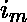

# 二叉树的数组状表示中两个节点之间的最短路径

> 原文:[https://www . geesforgeks . org/二进制树的类数组表示中两个节点之间的最短路径/](https://www.geeksforgeeks.org/shortest-path-between-two-nodes-in-array-like-representation-of-binary-tree/)

考虑一棵二叉树，其中除了叶节点之外，每个节点都有两个子节点。如果一个节点被标记为“v”，那么它的右子节点将被标记为 2v+1，左子节点将被标记为 2v。根标为
给定两个标为 I 和 j 的节点，任务是找到最短的距离和从 I 到 j 的路径，并从根节点打印节点 I 和节点 j 的路径。

**示例:**

> **输入:** i = 1，j = 2
> **输出:** 1
> **说明:**
> 路径为 1 2
> 
> **输入:** i = 4，j = 3
> **输出:** 3
> **说明:**
> 路径为 4 2 1 3

这个问题主要是[求二叉树的两个给定键之间的距离](https://www.geeksforgeeks.org/find-distance-two-given-nodes/)的扩展。在这里，我们不仅找到了最短的距离，还找到了路径。
两个节点 I 和 j 之间的距离将等于 dist(i，LCA(i，j)) + dist(j，LCA(i， 其中 LCA 表示标记为 I 和 j 的节点的最低公共祖先。如果数字 x 以二进制形式表示，那么 2*x 可以通过将 0 附加到 x 的二进制表示来表示，2x+1 可以通过将 1 附加到 x 的二进制表示来表示。这是因为当我们附加 0 时，以 x 的二进制形式存在的所有项都向左移动，所以它会加倍。同样，当我们附加 1 时，我们会得到 2x+1。 假设一个节点的二进制表示是 1010，这告诉我们这个节点从根的路径。第一项“1”代表根第二项 0 代表左转，然后第三项 1 代表从上一个节点右转，最后，0 代表左转。

二进制形式的节点 10 是 1010，二进制形式的节点 13 是 1101 其次，任何节点的二进制表示的长度也说明了它在二叉树中的级别。假设 I 的二进制表示为 m 长度，为[Tex]I _ 2[/Tex]……，节点 j 的二进制表示为 n 长度 [Tex]j_2 [/Tex]…… 。
由此我们从根源上知道了 I 和 j 的路径。找出 k，使得对于所有 p < =k  = 。这是二进制形式的 I 和 j 的 LCA。因此 dist(i，LCA(i，j))将为 m–k，dist(j，LCA(i，j))= n–k，因此答案将为 m+n–2k。打印路径也不是什么大问题，只需存储 I 到 LCA 的路径和 j 到 LCA 的路径，并将其连接起来。

## C++

```
// C++ representation of finding shortest
// distance between node i and j
#include <bits/stdc++.h>
using namespace std;

// prints the path between node i and node j
void ShortestPath(int i, int j, int k, int m, int n)
{
    // path1 stores path of node i to lca and
    // path2 stores path of node j to lca
    vector<int> path1, path2;
    int x = m - 1;

    // push node i in path1
    path1.push_back(i);

    // keep pushing parent of node labelled
    // as i to path1 until lca is reached
    while (x != k) {
        path1.push_back(i / 2);
        i = i / 2;
        x--;
    }
    int y = n - 1;

    // push node j to path2
    path2.push_back(j);

    // keep pushing parent of node j till
    // lca is reached
    while (y != k)
    {
        path2.push_back(j / 2);
        j = j / 2;
        y--;
    }

    // printing path from node i to lca
    for (int l = 0; l < path1.size(); l++)
        cout << path1[l] << " ";

    // printing path from lca to node j
    for (int l = path2.size() - 2; l >= 0; l--)
        cout << path2[l] << " ";
    cout << endl;
}

// returns the shortest distance between
// nodes labelled as i and j
int ShortestDistance(int i, int j)
{
    // vector to store binary form of i and j
    vector<int> v1, v2;

    // finding binary form of i and j
    int p1 = i;
    int p2 = j;
    while (i != 0)
    {
        v1.push_back(i % 2);
        i = i / 2;
    }
    while (j != 0) {
        v2.push_back(j % 2);
        j = j / 2;
    }

    // as binary form will be in reverse order
    // reverse the vectors
    reverse(v1.begin(), v1.end());
    reverse(v2.begin(), v2.end());

    // finding the k that is lca (i, j)
    int m = v1.size(), n = v2.size(), k = 0;
    if (m < n)
    {
        while (k < m && v1[k] == v2[k])
            k++;
    }
    else {
        while (k < n && v1[k] == v2[k])
            k++;
    }

    ShortestPath(p1, p2, k - 1, m, n);
    return m + n - 2 * k;
}

// Driver Code
int main()
{
    cout << ShortestDistance(1, 2) << endl;
    cout << ShortestDistance(4, 3) << endl;
    return 0;
}
```

## Java 语言(一种计算机语言，尤用于创建网站)

```
// Java representation of finding shortest
// distance between node i and j
import java.util.*;

class GFG
{

// prints the path between node i and node j
static void ShortestPath(int i, int j, int k, int m,
                                    int n)
{
    // path1 stores path of node i to lca and
    // path2 stores path of node j to lca
    Vector<Integer> path1=new Vector<Integer>(),
                    path2=new Vector<Integer>();
    int x = m - 1;

    // push node i in path1
    path1.add(i);

    // keep pushing parent of node labelled
    // as i to path1 until lca is reached
    while (x != k)
    {
        path1.add(i / 2);
        i = i / 2;
        x--;
    }
    int y = n - 1;

    // push node j to path2
    path2.add(j);

    // keep pushing parent of node j till
    // lca is reached
    while (y != k)
    {
        path2.add(j / 2);
        j = j / 2;
        y--;
    }

    // printing path from node i to lca
    for (int l = 0; l < path1.size(); l++)
        System.out.print( path1.get(l) + " ");

    // printing path from lca to node j
    for (int l = path2.size() - 2; l >= 0; l--)
        System.out.print( path2.get(l) + " ");
    System.out.println();
}

// returns the shortest distance between
// nodes labelled as i and j
static int ShortestDistance(int i, int j)
{
    // vector to store binary form of i and j
    Vector<Integer> v1=new Vector<Integer>(),
                    v2=new Vector<Integer>();

    // finding binary form of i and j
    int p1 = i;
    int p2 = j;
    while (i != 0)
    {
        v1.add(i % 2);
        i = i / 2;
    }
    while (j != 0)
    {
        v2.add(j % 2);
        j = j / 2;
    }

    // as binary form will be in reverse order
    // reverse the vectors
    Collections.reverse(v1);
    Collections.reverse(v2);

    // finding the k that is lca (i, j)
    int m = v1.size(), n = v2.size(), k = 0;
    if (m < n)
    {
        while (k < m && v1.get(k) == v2.get(k))
            k++;
    }
    else
    {
        while (k < n && v1.get(k) == v2.get(k))
            k++;
    }

    ShortestPath(p1, p2, k - 1, m, n);
    return m + n - 2 * k;
}

// Driver code
public static void main(String args[])
{
    System.out.println( ShortestDistance(1, 2) );
    System.out.println(ShortestDistance(4, 3) );
}
}

// This code is contributed by Arnab Kundu
```

## 蟒蛇 3

```
# Python3 representation of finding
# shortest distance between node i and j

# Prints the path between node i and node j
def ShortestPath(i, j, k, m, n):

    # path1 stores path of node i to lca and
    # path2 stores path of node j to lca
    path1, path2 = [], []
    x = m - 1

    # push node i in path1
    path1.append(i)

    # keep pushing parent of node labelled
    # as i to path1 until lca is reached
    while x != k:
        path1.append(i // 2)
        i = i // 2
        x -= 1

    y = n - 1

    # push node j to path2
    path2.append(j)

    # keep pushing parent of node
    # j till lca is reached
    while y != k:
        path2.append(j / 2)
        j = j // 2
        y -= 1

    # printing path from node i to lca
    for l in range(0, len(path1)):
        print(path1[l], end=" ")

    # printing path from lca to node j
    for l in range(len(path2) - 2, -1, -1):
        print(path2[l], end=" ")
    print()

# Returns the shortest distance
# between nodes labelled as i and j
def ShortestDistance(i, j):

    # vector to store binary form of i and j
    v1, v2 = [], []

    # finding binary form of i and j
    p1, p2 = i, j
    while i != 0:
        v1.append(i % 2)
        i = i // 2

    while j != 0:
        v2.append(j % 2)
        j = j // 2

    # as binary form will be in reverse
    # order reverse the vectors
    v1 = v1[::-1]
    v2 = v2[::-1]

    # finding the k that is lca (i, j)
    m, n, k = len(v1), len(v2), 0
    if m < n:
        while k < m and v1[k] == v2[k]:
            k += 1

    else:
        while k < n and v1[k] == v2[k]:
            k += 1

    ShortestPath(p1, p2, k - 1, m, n)
    return m + n - 2 * k

# Driver Code
if __name__ == "__main__":

    print(ShortestDistance(1, 2))
    print(ShortestDistance(4, 3))

# This code is contributed by Rituraj Jain
```

## C#

```
// C#  representation of finding shortest
// distance between node i and j
using System;
using System.Collections.Generic;   

class GFG
{

// prints the path between node i and node j
static void ShortestPath(int i, int j, int k, int m,
                                    int n)
{
    // path1 stores path of node i to lca and
    // path2 stores path of node j to lca
    List<int> path1=new List<int>(),
                    path2=new List<int>();
    int x = m - 1;

    // push node i in path1
    path1.Add(i);

    // keep pushing parent of node labelled
    // as i to path1 until lca is reached
    while (x != k)
    {
        path1.Add(i / 2);
        i = i / 2;
        x--;
    }
    int y = n - 1;

    // push node j to path2
    path2.Add(j);

    // keep pushing parent of node j till
    // lca is reached
    while (y != k)
    {
        path2.Add(j / 2);
        j = j / 2;
        y--;
    }

    // printing path from node i to lca
    for (int l = 0; l < path1.Count; l++)
        Console.Write( path1[l] + " ");

    // printing path from lca to node j
    for (int l = path2.Count - 2; l >= 0; l--)
        Console.Write( path2[l] + " ");
    Console.WriteLine();
}

// returns the shortest distance between
// nodes labelled as i and j
static int ShortestDistance(int i, int j)
{
    // vector to store binary form of i and j
    List<int> v1=new List<int>(),
                    v2=new List<int>();

    // finding binary form of i and j
    int p1 = i;
    int p2 = j;
    while (i != 0)
    {
        v1.Add(i % 2);
        i = i / 2;
    }
    while (j != 0)
    {
        v2.Add(j % 2);
        j = j / 2;
    }

    // as binary form will be in reverse order
    // reverse the vectors
    v1.Reverse();
    v2.Reverse();

    // finding the k that is lca (i, j)
    int m =v1.Count, n =v2.Count, k = 0;
    if (m < n)
    {
        while (k < m && v1[k] == v2[k])
            k++;
    }
    else
    {
        while (k < n && v1[k] == v2[k])
            k++;
    }

    ShortestPath(p1, p2, k - 1, m, n);
    return m + n - 2 * k;
}

// Driver code
public static void Main(String []args)
{
    Console.WriteLine( ShortestDistance(1, 2) );
    Console.WriteLine(ShortestDistance(4, 3) );
}
}

// This code is contributed by Princi Singh
```

## java 描述语言

```
<script>

// Javascript  representation of finding shortest
// distance between node i and j

// prints the path between node i and node j
function ShortestPath(i,j,k,m,n)
{
    // path1 stores path of node i to lca and
    // path2 stores path of node j to lca
    let path1=[];
    let path2=[];
    let x = m - 1;

    // push node i in path1
    path1.push(i);

    // keep pushing parent of node labelled
    // as i to path1 until lca is reached
    while (x != k)
    {
        path1.push(Math.floor(i / 2));
        i = Math.floor(i / 2);
        x--;
    }
    let y = n - 1;

    // push node j to path2
    path2.push(j);

    // keep pushing parent of node j till
    // lca is reached
    while (y != k)
    {
        path2.push(Math.floor(j / 2));
        j = Math.floor(j / 2);
        y--;
    }

    // printing path from node i to lca
    for (let l = 0; l < path1.length; l++)
        document.write( path1[l] + " ");

    // printing path from lca to node j
    for (let l = path2.length - 2; l >= 0; l--)
        document.write( path2[l] + " ");
    document.write("<br>");
}

// returns the shortest distance between
// nodes labelled as i and j
function ShortestDistance(i,j)
{
    // vector to store binary form of i and j
    let v1=[];
    let v2=[];

    // finding binary form of i and j
    let p1 = i;
    let p2 = j;
    while (i != 0)
    {
        v1.push(i % 2);
        i = Math.floor(i / 2);
    }
    while (j != 0)
    {
        v2.push(j % 2);
        j = Math.floor(j / 2);
    }

    // as binary form will be in reverse order
    // reverse the vectors
    v1.reverse();
    v2.reverse();

    // finding the k that is lca (i, j)
    let m =v1.length, n =v2.length, k = 0;
    if (m < n)
    {
        while (k < m && v1[k] == v2[k])
            k++;
    }
    else
    {
        while (k < n && v1[k] == v2[k])
            k++;
    }

    ShortestPath(p1, p2, k - 1, m, n);
    return m + n - 2 * k;
}

// Driver code
document.write( ShortestDistance(1, 2) +"<br>");
document.write(ShortestDistance(4, 3) +"<br>");

// This code is contributed by avanitrachhadiya2155
</script>
```

**输出:**

```
1 2
1
4 2 1 3
3
```

**时间复杂度** O(  i +  j)
本文由 **Ayush Jha** 供稿。如果你喜欢 GeeksforGeeks 并想投稿，你也可以使用[write.geeksforgeeks.org](https://write.geeksforgeeks.org)写一篇文章或者把你的文章邮寄到 review-team@geeksforgeeks.org。看到你的文章出现在极客博客主页上，帮助其他极客。
如果发现有不正确的地方，或者想分享更多关于上述话题的信息，请写评论。