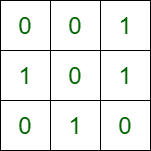

# 最多有 K 个障碍物的矩阵中两点之间的最短路径

> 原文:[https://www . geesforgeks . org/最多有 k 个障碍物的矩阵中两点之间的最短路径/](https://www.geeksforgeeks.org/shortest-path-between-two-points-in-a-matrix-with-at-most-k-obstacles/)

给定一个大小为 **ROW * COL** 的[二维数组](https://www.geeksforgeeks.org/multidimensional-arrays-c-cpp/) **矩阵[][]** 和一个整数 **K、**，其中每个单元格**矩阵【I】【j】**或者是 **0(空)**或者是 **1(障碍)**。指针可以在一个步骤中从一个空单元格向上、向下、向左或向右移动。任务是找到从源 **(0，0)** 到目的地 **(ROW-1，COL-1)** 所需要的最小步数，并且小于或等于 **K** 障碍消除。障碍消除定义为将单元格的值**矩阵【I】【j】**从 **1** 更改为 **0。**如果没有路径，则返回 **-1** 。

**示例:**

> **输入:**矩阵[][] = { {0，0，1}，
> {1，0，1}，
> {0，1，0} }，
> ROW = 3，COL = 3，K = 2
> **输出:** 4
> **说明:**
> 
> 
> 
> 将矩阵[0][2]和矩阵[1][2]的值更改为 0，路径为 0，0 -> 0，1 -> 0，2 -> 1，2 -> 2，2。
> 
> **输入:**矩阵[][] = { {0，1，0}，
> {1，1，0}，
> {0，0，0}，
> {0，0，0} }，
> ROW = 4，COL = 3，K = 1
> **输出:** 5

**方法:**可以使用矩阵上的 [BFS 来搜索最短路径。](https://www.geeksforgeeks.org/breadth-first-traversal-bfs-on-a-2d-array/)初始化一个**计数器【】【】**向量，这个数组将记录每个被访问小区可以消除的剩余障碍物的数量。在每个单元格上运行[广度优先搜索](https://www.geeksforgeeks.org/breadth-first-search-or-bfs-for-a-graph/)，同时记录我们仍然可以消除的障碍数量。在每个单元格，首先，检查它是否是目标单元格。然后，检查当前单元是否是障碍，然后可用的清除计数递减 **1** 。如果计数器数组中的单元格值比当前变量的值低，则更新该值。长度数组在每一步都会更新。按照以下步骤解决问题:

*   定义 2 个数组 **dir_Row[4]** 和 **dir_Col[4]** 来存储每个点可能的方向坐标。
*   [将结构](https://www.geeksforgeeks.org/structures-c/) **点锁定**定义为 **x，y，**和 **k.**
*   [初始化队列**点锁定**数据类型的](https://www.geeksforgeeks.org/queue-cpp-stl/) **q[]** 。
*   [用值 **0** 初始化二维向量](https://www.geeksforgeeks.org/2d-vector-in-cpp-with-user-defined-size/) **距离【ROW】【COL】**，以存储每个像元到源像元的距离。
*   [初始化二维向量](https://www.geeksforgeeks.org/vector-of-vectors-in-c-stl-with-examples/) **障碍包【ROW】【COL】**值 **-1** 以存储可用障碍清除的计数。
*   [将值 **{0，0，K}** 排入队列](https://www.geeksforgeeks.org/circular-queue-set-1-introduction-array-implementation/) **q[]。**
*   [循环遍历](https://www.geeksforgeeks.org/c-c-while-loop-with-examples/)直到队列 **q[]** 大于 **0** 并执行以下任务:
    *   将变量 **te** 初始化为队列前面的[**q[]。**](https://www.geeksforgeeks.org/queuefront-queueback-c-stl/)
    *   将变量 **x，y** 和 **tk** 初始化为 **te.x，te.y** 和**te . k**
    *   如果当前单元格等于目标单元格，则返回**距离【x】【y】**的值作为答案。
    *   [将前面的元素从队列中出列](https://www.geeksforgeeks.org/array-implementation-of-queue-simple/)T2【q】。
    *   如果当前单元格是一个障碍，那么如果 **tk** 大于 **0** ，那么将其值减少 **1** 否则继续。
    *   如果**障碍【x】【y】**大于等于 **tk** ，则继续否则将其值设置为 **tk。**
    *   [使用变量 **i** 迭代范围](https://www.geeksforgeeks.org/range-based-loop-c/)**【0，4)** ，并执行以下任务:
        *   查看所有相邻小区 **(ax，ay)** ，检查是否为有效小区。如果没有，那就继续。否则将 **{ax，ay，tk}** 排入队列 **q[]** 并将**距离【ax】【ay】**的值设置为**距离【x】【y】+1。**
*   执行上述步骤后，如果没有找到答案，打印数值 **-1** 。

下面是上述方法的实现。

## C++

```
// C++ program for the above approach
#include <bits/stdc++.h>
using namespace std;

#define ROW 3
#define COL 3

// Direction Vectors
int dir_Row[4] = { -1, 0, 1, 0 };
int dir_Col[4] = { 0, 1, 0, -1 };

// Structure for storing coordinates
// count of remaining obstacle eliminations
struct pointLoc {
    int x, y, k;
};

// Function to perform BFS
int BFS(int matrix[][COL], int k, pair<int, int> source,
        pair<int, int> destination)
{

    // Stores pointLoc of each cell
    queue<struct pointLoc> q;

    // Vector array to store distance of
    // each cell from source cell
    vector<vector<int> > distance(
      ROW, vector<int>(COL, 0));

    // Vector array to store count of
    // available obstacle eliminations
    vector<vector<int> > obstacles(
      ROW, vector<int>(COL, -1));

    // Push the source cell into queue
    // and use as starting point
    q.push({ source.first, source.second, k });

    // Iterate while queue is not empty
    while (!q.empty()) {

        struct pointLoc te = q.front();
        int x = te.x;
        int y = te.y;
        int tk = te.k;

        // If current cell is same as
        // destination then return distance
        if (x == destination.first
            && y == destination.second)
            return distance[x][y];

        q.pop();

        // If current cell is an obstacle
        // then decrement current value
        // if possible else skip the cell
        if (matrix[x][y] == 1) {

            if (tk > 0)
                tk--;

            else
                continue;
        }

        // Cell is skipped only if current
        // value is less than previous
        // value of cell
        if (obstacles[x][y] >= tk)
            continue;

        // Else update value
        obstacles[x][y] = tk;

        // Push all valid adjacent
        // cells into queue
        for (int i = 0; i < 4; i++) {

            int ax = x + dir_Row[i];
            int ay = y + dir_Col[i];

            if (ax < 0 || ay < 0
                || ax >= ROW || ay >= COL)
                continue;

            q.push({ ax, ay, tk });

            // Update distance of current
            // cell from source cell
            distance[ax][ay] = distance[x][y] + 1;
        }
    }

    // If not possible to reach
    // destination from source
    return -1;
}

// Driver Code
int main()
{

    // Given input
    int matrix[ROW][COL]
        = { { 0, 0, 1 },
           { 1, 0, 1 },
           { 0, 1, 0 } };

    int k = 2;

    pair<int, int> source = { 0, 0 };

    pair<int, int> destination = { 2, 2 };

    cout << BFS(matrix, k, source, destination);

    return 0;
}
```

## Java 语言(一种计算机语言，尤用于创建网站)

```
// Java program for the above approach
import java.util.*;

class GFG {

    static final int ROW = 3;
    static final int COL = 3;

    // Direction Vectors
    static int dir_Row[] = { -1, 0, 1, 0 };
    static int dir_Col[] = { 0, 1, 0, -1 };

    // Structure for storing coordinates
    // count of remaining obstacle eliminations
    static class pointLoc {
        int x, y, k;

        public pointLoc(int x, int y, int k) {
            super();
            this.x = x;
            this.y = y;
            this.k = k;
        }
    };

    static class pair {
        int first, second;

        public pair(int first, int second) {
            this.first = first;
            this.second = second;
        }
    }

    // Function to perform BFS
    static int BFS(int matrix[][], int k, pair source, pair destination) {

        // Stores pointLoc of each cell
        Queue<pointLoc> q = new LinkedList<GFG.pointLoc>();

        // Vector array to store distance of
        // each cell from source cell

        int[][] distance = new int[ROW][COL];

        // Vector array to store count of
        // available obstacle eliminations

        int[][] obstacles = new int[ROW][COL];

        // Push the source cell into queue
        // and use as starting point
        q.add(new pointLoc(source.first, source.second, k));

        // Iterate while queue is not empty
        while (!q.isEmpty()) {

            pointLoc te = q.peek();
            int x = te.x;
            int y = te.y;
            int tk = te.k;

            // If current cell is same as
            // destination then return distance
            if (x == destination.first && y == destination.second)
                return distance[x][y];

            q.remove();

            // If current cell is an obstacle
            // then decrement current value
            // if possible else skip the cell
            if (matrix[x][y] == 1) {

                if (tk > 0)
                    tk--;

                else
                    continue;
            }

            // Cell is skipped only if current
            // value is less than previous
            // value of cell
            if (obstacles[x][y] >= tk)
                continue;

            // Else update value
            obstacles[x][y] = tk;

            // Push all valid adjacent
            // cells into queue
            for (int i = 0; i < 4; i++) {

                int ax = x + dir_Row[i];
                int ay = y + dir_Col[i];

                if (ax < 0 || ay < 0 || ax >= ROW || ay >= COL)
                    continue;

                q.add(new pointLoc(ax, ay, tk));

                // Update distance of current
                // cell from source cell
                distance[ax][ay] = distance[x][y] + 1;
            }
        }

        // If not possible to reach
        // destination from source
        return -1;
    }

    // Driver Code
    public static void main(String[] args) {

        // Given input
        int matrix[][] = { { 0, 0, 1 }, { 1, 0, 1 }, { 0, 1, 0 } };
        int k = 2;
        pair source = new pair(0, 0);
        pair destination = new pair(2, 2);
        System.out.print(BFS(matrix, k, source, destination));
    }
}

// This code is contributed by shikhasingrajput
```

## C#

```
// C# program for the above approach
using System;
using System.Collections.Generic;

class GFG{

static readonly int ROW = 3;
static readonly int COL = 3;

// Direction Lists
static int []dir_Row = { -1, 0, 1, 0 };
static int []dir_Col = { 0, 1, 0, -1 };

// Structure for storing coordinates
// count of remaining obstacle eliminations
class pointLoc
{
    public int x, y, k;

    public pointLoc(int x, int y, int k)
    {
        this.x = x;
        this.y = y;
        this.k = k;
    }
};

class pair
{
    public int first, second;

    public pair(int first, int second)
    {
        this.first = first;
        this.second = second;
    }
}

// Function to perform BFS
static int BFS(int [,]matrix, int k, pair source,
               pair destination)
{

    // Stores pointLoc of each cell
    Queue<pointLoc> q = new Queue<GFG.pointLoc>();

    // List array to store distance of
    // each cell from source cell
    int[,] distance = new int[ROW, COL];

    // List array to store count of
    // available obstacle eliminations
    int[,] obstacles = new int[ROW, COL];

    // Push the source cell into queue
    // and use as starting point
    q.Enqueue(new pointLoc(source.first,
                           source.second, k));

    // Iterate while queue is not empty
    while (q.Count != 0)
    {
        pointLoc te = q.Peek();
        int x = te.x;
        int y = te.y;
        int tk = te.k;

        // If current cell is same as
        // destination then return distance
        if (x == destination.first &&
            y == destination.second)
            return distance[x, y];

        q.Dequeue();

        // If current cell is an obstacle
        // then decrement current value
        // if possible else skip the cell
        if (matrix[x, y] == 1)
        {
            if (tk > 0)
                tk--;
            else
                continue;
        }

        // Cell is skipped only if current
        // value is less than previous
        // value of cell
        if (obstacles[x, y] >= tk)
            continue;

        // Else update value
        obstacles[x, y] = tk;

        // Push all valid adjacent
        // cells into queue
        for(int i = 0; i < 4; i++)
        {
            int ax = x + dir_Row[i];
            int ay = y + dir_Col[i];

            if (ax < 0 || ay < 0 ||
             ax >= ROW || ay >= COL)
                continue;

            q.Enqueue(new pointLoc(ax, ay, tk));

            // Update distance of current
            // cell from source cell
            distance[ax, ay] = distance[x, y] + 1;
        }
    }

    // If not possible to reach
    // destination from source
    return -1;
}

// Driver Code
public static void Main(String[] args)
{

    // Given input
    int [,]matrix = { { 0, 0, 1 },
                      { 1, 0, 1 },
                      { 0, 1, 0 } };
    int k = 2;
    pair source = new pair(0, 0);
    pair destination = new pair(2, 2);

    Console.Write(BFS(matrix, k, source, destination));
}
}

// This code is contributed by shikhasingrajput
```

## java 描述语言

```
<script>

       // JavaScript Program to implement
       // the above approach
       let ROW = 3
       let COL = 3

       // Direction Vectors
       let dir_Row = [-1, 0, 1, 0];
       let dir_Col = [0, 1, 0, -1];

       // Structure for storing coordinates
       // count of remaining obstacle eliminations
       class pointLoc {
           constructor(x, y, k) {
               this.x = x;
               this.y = y;
               this.k = k;
           }

       };

       // Function to perform BFS
       function BFS(matrix, k, source,
           destination) {

           // Stores pointLoc of each cell
           let q = [];

           // Vector array to store distance of
           // each cell from source cell
           let distance = new Array(ROW);
           for (let i = 0; i < distance.length; i++) {
               distance[i] = new Array(COL).fill(0);
           }

           // Vector array to store count of
           // available obstacle eliminations
           let obstacles = new Array(ROW);
           for (let i = 0; i < obstacles.length; i++) {
               obstacles[i] = new Array(COL).fill(-1);
           }

           // Push the source cell into queue
           // and use as starting point
           q.push(new pointLoc(source[0], source[1], k));

           // Iterate while queue is not empty
           while (q.length > 0) {

               let te = q[0];
               let x = te.x;
               let y = te.y;
               let tk = te.k;

               // If current cell is same as
               // destination then return distance
               if (x == destination[0]
                   && y == destination[1])
                   return distance[x][y];

               q.shift();

               // If current cell is an obstacle
               // then decrement current value
               // if possible else skip the cell
               if (matrix[x][y] == 1) {

                   if (tk > 0)
                       tk--;

                   else
                       continue;
               }

               // Cell is skipped only if current
               // value is less than previous
               // value of cell
               if (obstacles[x][y] >= tk)
                   continue;

               // Else update value
               obstacles[x][y] = tk;

               // Push all valid adjacent
               // cells into queue
               for (let i = 0; i < 4; i++) {

                   let ax = x + dir_Row[i];
                   let ay = y + dir_Col[i];

                   if (ax < 0 || ay < 0
                       || ax >= ROW || ay >= COL)
                       continue;

                   q.push(new pointLoc(ax, ay, tk));

                   // Update distance of current
                   // cell from source cell
                   distance[ax][ay] = distance[x][y] + 1;
               }
           }

           // If not possible to reach
           // destination from source
           return -1;
       }

       // Driver Code

       // Given input
       let matrix
           = [[0, 0, 1],
           [1, 0, 1],
           [0, 1, 0]];

       let k = 2;
       let source = [0, 0];
       let destination = [2, 2];
       document.write(BFS(matrix, k, source, destination));

   // This code is contributed by Potta Lokesh
   </script>
```

**Output**

```
4
```

***时间复杂度:**O(*ROW * COL** K)*
***辅助空间:** O(* ROW*COL **K)*