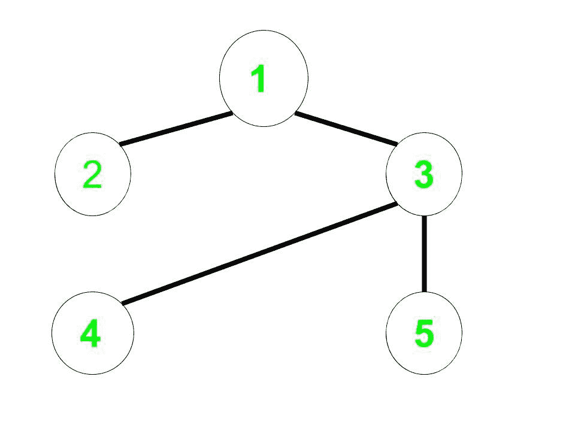
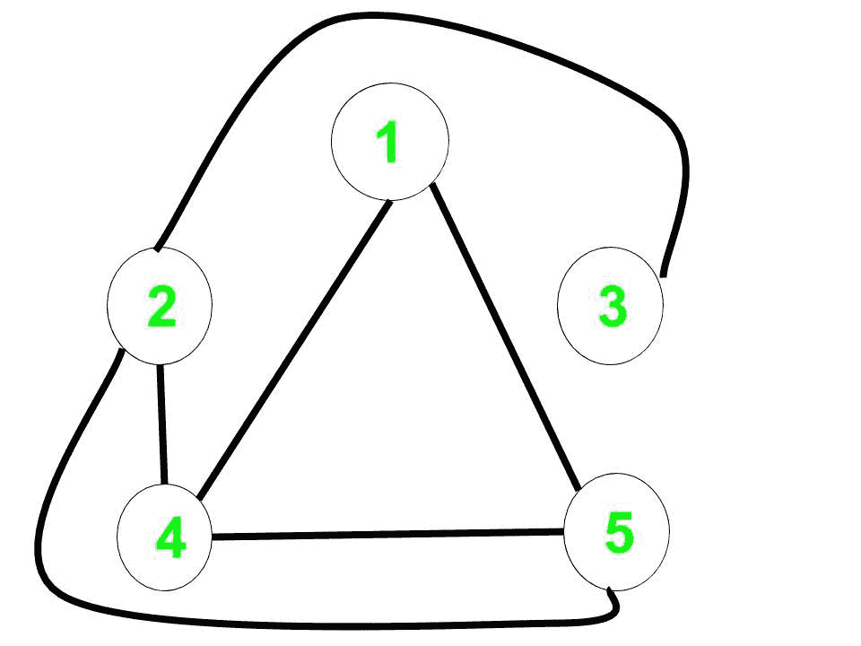

# 补图中的最短路径

> 原文:[https://www . geeksforgeeks . org/最短补码路径图/](https://www.geeksforgeeks.org/shortest-path-in-a-complement-graph/)

给定一个**无向非加权图 G** 。对于给定的节点**开始**返回最短路径，即从开始到 g 的补图中所有节点的边数

> **补集图**是这样一个图，它只包含原始图中不存在的那些边。

**示例:**

> **输入:**无向边= (1，2)、(1，3)、(3，4)、(3，5)，开始= 1
> **输出:**0 2 3 1
> T6】解释:
> **原图:**
> 
> [](https://media.geeksforgeeks.org/wp-content/uploads/20200701031811/GFG136.jpg)
> 
> **补语图:**
> 
> [](https://media.geeksforgeeks.org/wp-content/uploads/20200701032219/Untitled-drawing48-3.jpg)
> 
> 补码图中从 1 到每个节点的距离是:
> 1 到 1 = 0，
> 1 到 2 = 2，
> 1 到 3 = 3，
> 1 到 4 = 1，
> 1 到 5 = 1

**天真方法:**一个简单的解决方案是创建补码图，并在该图上使用[广度优先搜索](https://www.geeksforgeeks.org/breadth-first-search-or-bfs-for-a-graph/)来找到到所有节点的距离。
***时间复杂度:** O(n <sup>2</sup> )用于创建补图，O(n + m)用于广度优先搜索。*
**高效途径:**思路是用**修正广度优先搜索**计算答案，然后就不需要构造补图了。

*   对于每个顶点或节点，减少一个顶点的距离，该顶点是当前顶点的补充，尚未被发现。
*   对于这个问题，我们必须观察到，如果图是稀疏的，那么未被发现的节点将被快速访问。

下面是上述方法的实现:

## C++

```
// C++ implementation to find the
// shortest path in a complement graph

#include <bits/stdc++.h>
using namespace std;

const int inf = 100000;

void bfs(int start, int n, int m,
         map<pair<int, int>, int> edges)
{
    int i;

    // List of undiscovered vertices
    // initially it will contain all
    // the vertices of the graph
    set<int> undiscovered;

    // Distance will store the distance
    // of all vertices from start in the
    // complement graph
    vector<int> distance_node(10000);

    for (i = 1; i <= n; i++) {

        // All vertices are undiscovered
        undiscovered.insert(i);

        // Let initial distance be infinity
        distance_node[i] = inf;
    }

    undiscovered.erase(start);
    distance_node[start] = 0;
    queue<int> q;

    q.push(start);

    // Check if queue is not empty and the
    // size of undiscovered vertices
    // is greater than 0
    while (undiscovered.size() && !q.empty()) {
        int cur = q.front();
        q.pop();

        // Vector to store all the complement
        // vertex to the current vertex
        // which has not been
        // discovered or visited yet.
        vector<int> complement_vertex;

        for (int x : undiscovered) {

            if (edges.count({ cur, x }) == 0 &&
                edges.count({ x, cur })==0)
                complement_vertex.push_back(x);
        }
        for (int x : complement_vertex) {

            // Check if optimal change
            // the distance of this
            // complement vertex
            if (distance_node[x]
                > distance_node[cur] + 1) {
                distance_node[x]
                    = distance_node[cur] + 1;
                q.push(x);
            }

            // Finally this vertex has been
            // discovered so erase it from
            // undiscovered vertices list
            undiscovered.erase(x);
        }
    }
    // Print the result
    for (int i = 1; i <= n; i++)
        cout << distance_node[i] << " ";
}

// Driver code
int main()
{
    // n is the number of vertex
    // m is the number of edges
    // start - starting vertex is 1
    int n = 5, m = 4;

    // Using edge hashing makes the
    // algorithm faster and we can
    // avoid the use of adjacency
    // list representation
    map<pair<int, int>, int> edges;

    // Initial edges for
    // the original graph
    edges[{ 1, 3 }] = 1,
                 edges[{ 3, 1 }] = 1;
    edges[{ 1, 2 }] = 1,
                 edges[{ 2, 1 }] = 1;
    edges[{ 3, 4 }] = 1,
                 edges[{ 4, 3 }] = 1;
    edges[{ 3, 5 }] = 1,
                 edges[{ 5, 3 }] = 1;

    bfs(1, n, m, edges);

    return 0;
}
```

## Java 语言(一种计算机语言，尤用于创建网站)

```
// Java implementation to find the
// shortest path in a complement graph
import java.io.*;
import java.util.*;

class GFG{

// Pair class is made so as to
// store the edges between nodes
static class Pair
{
    int left;
    int right;

    public Pair(int left, int right)
    {
        this.left = left;
        this.right = right;
    }

    // We need to override hashCode so that
    // we can use Set's properties like contains()
    @Override
    public int hashCode()
    {
        final int prime = 31;
        int result = 1;
        result = prime * result + left;
        result = prime * result + right;
        return result;
    }

    @Override
    public boolean equals( Object other )
    {
        if (this == other){return true;}
        if (other instanceof Pair)
        {
            Pair m = (Pair)other;
            return this.left == m.left &&
                  this.right == m.right;
        }
        return false;
    }
}

public static void bfs(int start, int n, int m,
                       Set<Pair> edges)
{
    int i;

    // List of undiscovered vertices
    // initially it will contain all
    // the vertices of the graph
    Set<Integer> undiscovered = new HashSet<>();

    // Distance will store the distance
    // of all vertices from start in the
    // complement graph
    int[] distance_node = new int[1000];

    for(i = 1; i <= n; i++)
    {

        // All vertices are undiscovered initially
        undiscovered.add(i);

        // Let initial distance be maximum value
        distance_node[i] = Integer.MAX_VALUE;
    }

    // Start is discovered
    undiscovered.remove(start);

    // Distance of the node to itself is 0
    distance_node[start] = 0;

    // Queue used for BFS
    Queue<Integer> q = new LinkedList<>();

    q.add(start);

    // Check if queue is not empty and the
    // size of undiscovered vertices
    // is greater than 0
    while (undiscovered.size() > 0 && !q.isEmpty())
    {

        // Current node
        int cur = q.peek();
        q.remove();

        // Vector to store all the complement
        // vertex to the current vertex
        // which has not been
        // discovered or visited yet.
        List<Integer>complement_vertex = new ArrayList<>();

        for(int x : undiscovered)
        {
            Pair temp1 = new Pair(cur, x);
            Pair temp2 = new Pair(x, cur);

            // Add the edge if not already present
            if (!edges.contains(temp1) &&
                !edges.contains(temp2))
            {
                complement_vertex.add(x);
            }
        }

        for(int x : complement_vertex)
        {

            // Check if optimal change
            // the distance of this
            // complement vertex
            if (distance_node[x] >
                distance_node[cur] + 1)
            {
                distance_node[x] =
                distance_node[cur] + 1;
                q.add(x);
            }

            // Finally this vertex has been
            // discovered so erase it from
            // undiscovered vertices list
            undiscovered.remove(x);
        }
    }

    // Print the result
    for(i = 1; i <= n; i++)
        System.out.print(distance_node[i] + " ");
}

// Driver code
public static void main(String[] args)
{

    // n is the number of vertex
    // m is the number of edges
    // start - starting vertex is 1
    int n = 5, m = 4;

    // Using edge hashing makes the
    // algorithm faster and we can
    // avoid the use of adjacency
    // list representation
    Set<Pair> edges = new HashSet<>();

    // Initial edges for
    // the original graph
    edges.add(new Pair(1, 3));
    edges.add(new Pair(3, 1));
    edges.add(new Pair(1, 2));
    edges.add(new Pair(2, 1));
    edges.add(new Pair(3, 4));
    edges.add(new Pair(4, 3));
    edges.add(new Pair(3, 5)) ;
    edges.add(new Pair(5, 3));
    Pair t = new Pair(1, 3);

    bfs(1, n, m, edges);
}
}

// This code is contributed by kunalsg18elec
```

**Output:** 

```
0 2 3 1 1
```

***时间复杂度:** O(V+E)*
***辅助空间:** O(V)*