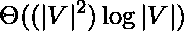

# 有向图中最短路径的迪杰斯特拉算法

> 原文:[https://www . geesforgeks . org/最短路径有向图逐 dijkstras 算法/](https://www.geeksforgeeks.org/shortest-path-in-a-directed-graph-by-dijkstras-algorithm/)

给定图中的一个[有向图](https://www.geeksforgeeks.org/euler-circuit-directed-graph/)和一个**源顶点**，任务是在给定图中找到从源到目标顶点的最短距离和路径，其中边是加权的(非负的)并且从父顶点到源顶点是有向的。

**进场:**

*   将所有顶点标记为未访问。创建一组所有未访问的顶点。
*   将零距离值指定给源顶点，将无限距离值指定给所有其他顶点。
*   将源顶点设置为当前顶点
*   对于当前顶点，考虑其所有未访问的子顶点，并计算它们通过当前顶点的暂定距离。(当前距离+相应边的权重)将新计算的距离与当前指定的值(对于某些顶点可以是无穷大)进行比较，并指定较小的值。
*   考虑当前顶点的所有未访问的子顶点后，将*当前*标记为已访问，并将其从未访问集中移除。
*   同样，继续所有顶点，直到所有节点都被访问。

下面是上述方法的实现:

## C++

```
// C++ implementation to find the
// shortest path in a directed
// graph from source vertex to
// the destination vertex

#include <bits/stdc++.h>
#define infi 1000000000
using namespace std;

// Class of the node
class Node {
public:
    int vertexNumber;

    // Adjacency list that shows the
    // vertexNumber of child vertex
    // and the weight of the edge
    vector<pair<int, int> > children;
    Node(int vertexNumber)
    {
        this->vertexNumber = vertexNumber;
    }

    // Function to add the child for
    // the given node
    void add_child(int vNumber, int length)
    {
        pair<int, int> p;
        p.first = vNumber;
        p.second = length;
        children.push_back(p);
    }
};

// Function to find the distance of
// the node from the given source
// vertex to the destination vertex
vector<int> dijkstraDist(
    vector<Node*> g,
    int s, vector<int>& path)
{
    // Stores distance of each
    // vertex from source vertex
    vector<int> dist(g.size());

    // Boolean array that shows
    // whether the vertex 'i'
    // is visited or not
    bool visited[g.size()];
    for (int i = 0; i < g.size(); i++) {
        visited[i] = false;
        path[i] = -1;
        dist[i] = infi;
    }
    dist[s] = 0;
    path[s] = -1;
    int current = s;

    // Set of vertices that has
    // a parent (one or more)
    // marked as visited
    unordered_set<int> sett;
    while (true) {

        // Mark current as visited
        visited[current] = true;
        for (int i = 0;
             i < g[current]->children.size();
             i++) {
            int v = g[current]->children[i].first;
            if (visited[v])
                continue;

            // Inserting into the
            // visited vertex
            sett.insert(v);
            int alt
                = dist[current]
                  + g[current]->children[i].second;

            // Condition to check the distance
            // is correct and update it
            // if it is minimum from the previous
            // computed distance
            if (alt < dist[v]) {
                dist[v] = alt;
                path[v] = current;
            }
        }
        sett.erase(current);
        if (sett.empty())
            break;

        // The new current
        int minDist = infi;
        int index = 0;

        // Loop to update the distance
        // of the vertices of the graph
        for (int a: sett) {
            if (dist[a] < minDist) {
                minDist = dist[a];
                index = a;
            }
        }
        current = index;
    }
    return dist;
}

// Function to print the path
// from the source vertex to
// the destination vertex
void printPath(vector<int> path,
               int i, int s)
{
    if (i != s) {

        // Condition to check if
        // there is no path between
        // the vertices
        if (path[i] == -1) {
            cout << "Path not found!!";
            return;
        }
        printPath(path, path[i], s);
        cout << path[i] << " ";
    }
}

// Driver Code
int main()
{
    vector<Node*> v;
    int n = 4, s = 0, e = 5;

    // Loop to create the nodes
    for (int i = 0; i < n; i++) {
        Node* a = new Node(i);
        v.push_back(a);
    }

    // Creating directed
    // weighted edges
    v[0]->add_child(1, 1);
    v[0]->add_child(2, 4);
    v[1]->add_child(2, 2);
    v[1]->add_child(3, 6);
    v[2]->add_child(3, 3);

    vector<int> path(v.size());
    vector<int> dist
        = dijkstraDist(v, s, path);

    // Loop to print the distance of
    // every node from source vertex
    for (int i = 0; i < dist.size(); i++) {
        if (dist[i] == infi) {
            cout << i << " and " << s
                 << " are not connected"
                 << endl;
            continue;
        }
        cout << "Distance of " << i
             << "th vertex from source vertex "
             << s << " is: "
             << dist[i] << endl;
    }
    return 0;
}
```

## Java 语言(一种计算机语言，尤用于创建网站)

```
// Java implementation to find the
// shortest path in a directed
// graph from source vertex to
// the destination vertex
import java.util.ArrayList;
import java.util.HashSet;
import java.util.List;
import java.util.Set;

class Pair
{
    int first, second;

    public Pair(int first, int second)
    {
        this.first = first;
        this.second = second;
    }
}

class GFG{

static final int infi = 1000000000;

// Class of the node
static class Node
{
    int vertexNumber;

    // Adjacency list that shows the
    // vertexNumber of child vertex
    // and the weight of the edge
    List<Pair> children;

    Node(int vertexNumber)
    {
        this.vertexNumber = vertexNumber;
        children = new ArrayList<>();
    }

    // Function to add the child for
    // the given node
    void add_child(int vNumber, int length)
    {
        Pair p = new Pair(vNumber, length);
        children.add(p);
    }
}

// Function to find the distance of
// the node from the given source
// vertex to the destination vertex
static int[] dijkstraDist(List<Node> g,
                          int s, int[] path)
{

    // Stores distance of each
    // vertex from source vertex
    int[] dist = new int[g.size()];

    // Boolean array that shows
    // whether the vertex 'i'
    // is visited or not
    boolean[] visited = new boolean[g.size()];
    for(int i = 0; i < g.size(); i++)
    {
        visited[i] = false;
        path[i] = -1;
        dist[i] = infi;
    }
    dist[s] = 0;
    path[s] = -1;
    int current = s;

    // Set of vertices that has
    // a parent (one or more)
    // marked as visited
    Set<Integer> sett = new HashSet<>();
    while (true)
    {

        // Mark current as visited
        visited[current] = true;
        for(int i = 0;
                i < g.get(current).children.size();
                i++)
        {
            int v = g.get(current).children.get(i).first;

            if (visited[v])
                continue;

            // Inserting into the
            // visited vertex
            sett.add(v);
            int alt = dist[current] +
                     g.get(current).children.get(i).second;

            // Condition to check the distance
            // is correct and update it
            // if it is minimum from the previous
            // computed distance
            if (alt < dist[v])
            {
                dist[v] = alt;
                path[v] = current;
            }
        }
        sett.remove(current);

        if (sett.isEmpty())
            break;

        // The new current
        int minDist = infi;
        int index = 0;

        // Loop to update the distance
        // of the vertices of the graph
        for(int a : sett)
        {
            if (dist[a] < minDist)
            {
                minDist = dist[a];
                index = a;
            }
        }
        current = index;
    }
    return dist;
}

// Function to print the path
// from the source vertex to
// the destination vertex
void printPath(int[] path, int i, int s)
{
    if (i != s)
    {

        // Condition to check if
        // there is no path between
        // the vertices
        if (path[i] == -1)
        {
            System.out.println("Path not found!!");
            return;
        }
        printPath(path, path[i], s);
        System.out.print(path[i] + " ");
    }
}

// Driver Code
public static void main(String[] args)
{
    List<Node> v = new ArrayList<>();
    int n = 4, s = 0, e = 5;

    // Loop to create the nodes
    for(int i = 0; i < n; i++)
    {
        Node a = new Node(i);
        v.add(a);
    }

    // Creating directed
    // weighted edges
    v.get(0).add_child(1, 1);
    v.get(0).add_child(2, 4);
    v.get(1).add_child(2, 2);
    v.get(1).add_child(3, 6);
    v.get(2).add_child(3, 3);

    int[] path = new int[v.size()];
    int[] dist = dijkstraDist(v, s, path);

    // Loop to print the distance of
    // every node from source vertex
    for(int i = 0; i < dist.length; i++)
    {
        if (dist[i] == infi)
        {
            System.out.printf("%d and %d are not " +
                              "connected\n", i, s);
            continue;
        }
        System.out.printf("Distance of %dth vertex " +
                          "from source vertex %d is: %d\n",
                          i, s, dist[i]);
    }
}
}

// This code is contributed by sanjeev2552
```

## 蟒蛇 3

```
# Python3 implementation to find the
# shortest path in a directed
# graph from source vertex to
# the destination vertex
class Pair:
    def __init__(self, first, second):
        self.first = first
        self.second = second
infi = 1000000000;

# Class of the node
class Node:

    # Adjacency list that shows the
    # vertexNumber of child vertex
    # and the weight of the edge   
    def __init__(self, vertexNumber):       
        self.vertexNumber = vertexNumber
        self.children = []

    # Function to add the child for
    # the given node
    def Add_child(self, vNumber, length):   
        p = Pair(vNumber, length);
        self.children.append(p);

# Function to find the distance of
# the node from the given source
# vertex to the destination vertex
def dijkstraDist(g, s, path):

    # Stores distance of each
    # vertex from source vertex
    dist = [infi for i in range(len(g))]

    # bool array that shows
    # whether the vertex 'i'
    # is visited or not
    visited = [False for i in range(len(g))]

    for i in range(len(g)):       
        path[i] = -1
    dist[s] = 0;
    path[s] = -1;
    current = s;

    # Set of vertices that has
    # a parent (one or more)
    # marked as visited
    sett = set()    
    while (True):

        # Mark current as visited
        visited[current] = True;
        for i in range(len(g[current].children)): 
            v = g[current].children[i].first;           
            if (visited[v]):
                continue;

            # Inserting into the
            # visited vertex
            sett.add(v);
            alt = dist[current] + g[current].children[i].second;

            # Condition to check the distance
            # is correct and update it
            # if it is minimum from the previous
            # computed distance
            if (alt < dist[v]):      
                dist[v] = alt;
                path[v] = current;       
        if current in sett:           
            sett.remove(current);       
        if (len(sett) == 0):
            break;

        # The new current
        minDist = infi;
        index = 0;

        # Loop to update the distance
        # of the vertices of the graph
        for a in sett:       
            if (dist[a] < minDist):          
                minDist = dist[a];
                index = a;          
        current = index;  
    return dist;

# Function to print the path
# from the source vertex to
# the destination vertex
def printPath(path, i, s):
    if (i != s):

        # Condition to check if
        # there is no path between
        # the vertices
        if (path[i] == -1):       
            print("Path not found!!");
            return;       
        printPath(path, path[i], s);
        print(path[i] + " ");

# Driver Code
if __name__=='__main__':

    v = []
    n = 4
    s = 0;

    # Loop to create the nodes
    for i in range(n):
        a = Node(i);
        v.append(a);

    # Creating directed
    # weighted edges
    v[0].Add_child(1, 1);
    v[0].Add_child(2, 4);
    v[1].Add_child(2, 2);
    v[1].Add_child(3, 6);
    v[2].Add_child(3, 3);
    path = [0 for i in range(len(v))];
    dist = dijkstraDist(v, s, path);

    # Loop to print the distance of
    # every node from source vertex
    for i in range(len(dist)):
        if (dist[i] == infi):

            print("{0} and {1} are not " +
                              "connected".format(i, s));
            continue;       
        print("Distance of {}th vertex from source vertex {} is: {}".format(
                          i, s, dist[i]));

    # This code is contributed by pratham76
```

## C#

```
// C# implementation to find the
// shortest path in a directed
// graph from source vertex to
// the destination vertex
using System;
using System.Collections;
using System.Collections.Generic;

class Pair
{
    public int first, second;

    public Pair(int first, int second)
    {
        this.first = first;
        this.second = second;
    }
}

class GFG
{

static int infi = 1000000000;

// Class of the node
class Node
{
    public int vertexNumber;

    // Adjacency list that shows the
    // vertexNumber of child vertex
    // and the weight of the edge
    public List<Pair> children;

    public Node(int vertexNumber)
    {
        this.vertexNumber = vertexNumber;
        children = new List<Pair>();
    }

    // Function to Add the child for
    // the given node
    public void Add_child(int vNumber, int length)
    {
        Pair p = new Pair(vNumber, length);
        children.Add(p);
    }
}

// Function to find the distance of
// the node from the given source
// vertex to the destination vertex
static int[] dijkstraDist(List<Node> g,
                          int s, int[] path)
{

    // Stores distance of each
    // vertex from source vertex
    int[] dist = new int[g.Count];

    // bool array that shows
    // whether the vertex 'i'
    // is visited or not
    bool[] visited = new bool[g.Count];
    for(int i = 0; i < g.Count; i++)
    {
        visited[i] = false;
        path[i] = -1;
        dist[i] = infi;
    }
    dist[s] = 0;
    path[s] = -1;
    int current = s;

    // Set of vertices that has
    // a parent (one or more)
    // marked as visited
    HashSet<int> sett = new HashSet<int>();

    while (true)
    {

        // Mark current as visited
        visited[current] = true;
        for(int i = 0;
                i < g[current].children.Count;
                i++)
        {
            int v = g[current].children[i].first;           
            if (visited[v])
                continue;

            // Inserting into the
            // visited vertex
            sett.Add(v);
            int alt = dist[current] +
                     g[current].children[i].second;

            // Condition to check the distance
            // is correct and update it
            // if it is minimum from the previous
            // computed distance
            if (alt < dist[v])
            {
                dist[v] = alt;
                path[v] = current;
            }
        }
        sett.Remove(current);

        if (sett.Count == 0)
            break;

        // The new current
        int minDist = infi;
        int index = 0;

        // Loop to update the distance
        // of the vertices of the graph
        foreach(int a in sett)
        {
            if (dist[a] < minDist)
            {
                minDist = dist[a];
                index = a;
            }
        }
        current = index;
    }
    return dist;
}

// Function to print the path
// from the source vertex to
// the destination vertex
void printPath(int[] path, int i, int s)
{
    if (i != s)
    {

        // Condition to check if
        // there is no path between
        // the vertices
        if (path[i] == -1)
        {
            Console.WriteLine("Path not found!!");
            return;
        }
        printPath(path, path[i], s);
        Console.WriteLine(path[i] + " ");
    }
}

// Driver Code
public static void Main(string[] args)
{
    List<Node> v = new List<Node>();
    int n = 4, s = 0;

    // Loop to create the nodes
    for(int i = 0; i < n; i++)
    {
        Node a = new Node(i);
        v.Add(a);
    }

    // Creating directed
    // weighted edges
    v[0].Add_child(1, 1);
    v[0].Add_child(2, 4);
    v[1].Add_child(2, 2);
    v[1].Add_child(3, 6);
    v[2].Add_child(3, 3);

    int[] path = new int[v.Count];
    int[] dist = dijkstraDist(v, s, path);

    // Loop to print the distance of
    // every node from source vertex
    for(int i = 0; i < dist.Length; i++)
    {
        if (dist[i] == infi)
        {
            Console.Write("{0} and {1} are not " +
                              "connected\n", i, s);
            continue;
        }
        Console.Write("Distance of {0}th vertex " +
                          "from source vertex {1} is: {2}\n",
                          i, s, dist[i]);
    }
}
}

// This code is contributed by rutvik_56
```

**Output:** Distance of 0th vertex from source vertex 0 is: 0 Distance of 1th vertex from source vertex 0 is: 1 Distance of 2th vertex from source vertex 0 is: 3 Distance of 3th vertex from source vertex 0 is: 6  

**时间复杂度:** 
**辅助空间:** O(V + E)
**相关文章:**我们已经讨论了利用拓扑排序的有向图中的最短路径，在本文中:[有向无环图中的最短路径](https://www.geeksforgeeks.org/shortest-path-for-directed-acyclic-graphs/)