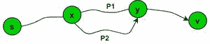
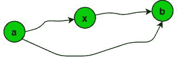

# 最短路径属性

> 原文:[https://www.geeksforgeeks.org/shortest-path-properties/](https://www.geeksforgeeks.org/shortest-path-properties/)

[最短路径](https://www.geeksforgeeks.org/shortest-path-unweighted-graph/)问题是寻找图中两个顶点(或节点)之间的路径，使其组成边的权重之和最小化的问题。图的任意两个节点之间的最短路径可以使用许多算法来建立，例如[迪克斯特拉的](https://www.geeksforgeeks.org/dijkstras-shortest-path-algorithm-greedy-algo-7/)算法、[贝尔曼-福特](https://www.geeksforgeeks.org/bellman-ford-algorithm-dp-23/)算法、[弗洛伊德·沃霍尔](https://www.geeksforgeeks.org/dynamic-programming-set-16-floyd-warshall-algorithm/)算法。寻找最短路径有一些属性，寻找最短路径的算法就是基于这些属性工作的:

1.  [**Optimal Substructure Property**](https://www.geeksforgeeks.org/optimal-substructure-property-in-dynamic-programming-dp-2/)
    *   最短路径的所有子路径也必须是最短路径。
    *   如果两个节点 **U** 和 **V** 之间存在最短路径长度，那么贪婪地选择 **V** 到 **S** 之间长度最小的边，将给出 **U** 和 **S** 之间的最短路径长度。
    *   上面列出的所有算法都基于这个属性。
    *   例如，让 **P 1** 成为从图 **G** 的【最短路径】 **(S →X →Y → V)** 的 **(X** ***→ Y)*** 的子路径。并让 **P 2** 成为图形 **G** 中的任意其他路径**(X*****→*****Y)**。那么，**中的** ***的成本 P 1 必须小于或等于*** **等于** *到*T42 的*T45】的成本 P2T48】。否则*的路径 **(S →X →Y → V)** 将不是节点 **S** 和 **V** 之间的最短路径。

    图表 G

2.  **Triangle Inequality**
    *   设***d(a，b)*** 为图中 ***a*** 到***b**G1*最短路径的长度。然后，
        *   ***d(a，b) ≤ d(a，x)+【d(x，b)***

    图 G 1