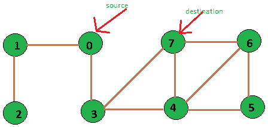

# 未加权图中的最短路径

> 原文:[https://www . geeksforgeeks . org/最短路径-未加权图/](https://www.geeksforgeeks.org/shortest-path-unweighted-graph/)

给定一个未加权的图、一个源和一个目的地，我们需要以最佳方式在图中找到从源到目的地的最短路径。

[](https://cdncontribute.geeksforgeeks.org/wp-content/uploads/exampleFigure-1.png)

8 个顶点的未加权图

```
Input: source vertex = 0 and destination vertex is = 7.
Output: Shortest path length is:2
        Path is::
        0 3 7

Input: source vertex is = 2 and destination vertex is = 6.
Output: Shortest path length is:5
        Path is::
        2 1 0 3 4 6
```

一种解决方案是使用[行李员–福特](https://www.geeksforgeeks.org/dynamic-programming-set-23-bellman-ford-algorithm/)在 O(VE)时间内解决。如果没有负权重循环，那么我们可以使用[迪克斯特拉算法](https://www.geeksforgeeks.org/greedy-algorithms-set-6-dijkstras-shortest-path-algorithm/)在 0(E+VLogV)时间内求解。
由于图是不加权的，我们可以在 O(V + E)时间内解决这个问题。这个想法是使用[广度优先搜索](https://www.geeksforgeeks.org/breadth-first-search-or-bfs-for-a-graph/)的修改版本，在这个版本中，我们在进行广度优先搜索的同时，继续存储给定顶点的前身。
我们首先初始化一个数组 dist[0，1，…。，v-1]使得 dist[i]存储顶点 I 到源顶点和数组 pred[0，1，…的距离..，v-1]使得 pred[i]表示从源开始的广度优先搜索中顶点 I 的直接前身。
现在我们从数组 d 中得到从源到任何其他顶点的路径长度，在 O(1)时间内，为了打印从源到任何顶点的路径，我们可以使用数组 p，在最坏的情况下，这将花费 O(V)时间，因为 V 是数组 p 的大小。因此，算法的大部分时间都花在从给定的源进行广度优先搜索上，我们知道这需要 O(V+E)时间。因此，我们算法的时间复杂度是 O(V+E)。
以下面的未加权图为例:
下面是寻找最短路径的完整算法:

## C++

```
// CPP code for printing shortest path between
// two vertices of unweighted graph
#include <bits/stdc++.h>
using namespace std;

// utility function to form edge between two vertices
// source and dest
void add_edge(vector<int> adj[], int src, int dest)
{
    adj[src].push_back(dest);
    adj[dest].push_back(src);
}

// a modified version of BFS that stores predecessor
// of each vertex in array p
// and its distance from source in array d
bool BFS(vector<int> adj[], int src, int dest, int v,
         int pred[], int dist[])
{
    // a queue to maintain queue of vertices whose
    // adjacency list is to be scanned as per normal
    // DFS algorithm
    list<int> queue;

    // boolean array visited[] which stores the
    // information whether ith vertex is reached
    // at least once in the Breadth first search
    bool visited[v];

    // initially all vertices are unvisited
    // so v[i] for all i is false
    // and as no path is yet constructed
    // dist[i] for all i set to infinity
    for (int i = 0; i < v; i++) {
        visited[i] = false;
        dist[i] = INT_MAX;
        pred[i] = -1;
    }

    // now source is first to be visited and
    // distance from source to itself should be 0
    visited[src] = true;
    dist[src] = 0;
    queue.push_back(src);

    // standard BFS algorithm
    while (!queue.empty()) {
        int u = queue.front();
        queue.pop_front();
        for (int i = 0; i < adj[u].size(); i++) {
            if (visited[adj[u][i]] == false) {
                visited[adj[u][i]] = true;
                dist[adj[u][i]] = dist[u] + 1;
                pred[adj[u][i]] = u;
                queue.push_back(adj[u][i]);

                // We stop BFS when we find
                // destination.
                if (adj[u][i] == dest)
                    return true;
            }
        }
    }

    return false;
}

// utility function to print the shortest distance
// between source vertex and destination vertex
void printShortestDistance(vector<int> adj[], int s,
                           int dest, int v)
{
    // predecessor[i] array stores predecessor of
    // i and distance array stores distance of i
    // from s
    int pred[v], dist[v];

    if (BFS(adj, s, dest, v, pred, dist) == false) {
        cout << "Given source and destination"
             << " are not connected";
        return;
    }

    // vector path stores the shortest path
    vector<int> path;
    int crawl = dest;
    path.push_back(crawl);
    while (pred[crawl] != -1) {
        path.push_back(pred[crawl]);
        crawl = pred[crawl];
    }

    // distance from source is in distance array
    cout << "Shortest path length is : "
         << dist[dest];

    // printing path from source to destination
    cout << "\nPath is::\n";
    for (int i = path.size() - 1; i >= 0; i--)
        cout << path[i] << " ";
}

// Driver program to test above functions
int main()
{
    // no. of vertices
    int v = 8;

    // array of vectors is used to store the graph
    // in the form of an adjacency list
    vector<int> adj[v];

    // Creating graph given in the above diagram.
    // add_edge function takes adjacency list, source
    // and destination vertex as argument and forms
    // an edge between them.
    add_edge(adj, 0, 1);
    add_edge(adj, 0, 3);
    add_edge(adj, 1, 2);
    add_edge(adj, 3, 4);
    add_edge(adj, 3, 7);
    add_edge(adj, 4, 5);
    add_edge(adj, 4, 6);
    add_edge(adj, 4, 7);
    add_edge(adj, 5, 6);
    add_edge(adj, 6, 7);
    int source = 0, dest = 7;
    printShortestDistance(adj, source, dest, v);
    return 0;
}
```

## Java 语言(一种计算机语言，尤用于创建网站)

```
// Java program to find shortest path in an undirected
// graph
import java.util.ArrayList;
import java.util.Iterator;
import java.util.LinkedList;

public class pathUnweighted {

    // Driver Program
    public static void main(String args[])
    {
        // No of vertices
        int v = 8;

        // Adjacency list for storing which vertices are connected
        ArrayList<ArrayList<Integer>> adj =
                            new ArrayList<ArrayList<Integer>>(v);
        for (int i = 0; i < v; i++) {
            adj.add(new ArrayList<Integer>());
        }

        // Creating graph given in the above diagram.
        // add_edge function takes adjacency list, source
        // and destination vertex as argument and forms
        // an edge between them.
        addEdge(adj, 0, 1);
        addEdge(adj, 0, 3);
        addEdge(adj, 1, 2);
        addEdge(adj, 3, 4);
        addEdge(adj, 3, 7);
        addEdge(adj, 4, 5);
        addEdge(adj, 4, 6);
        addEdge(adj, 4, 7);
        addEdge(adj, 5, 6);
        addEdge(adj, 6, 7);
        int source = 0, dest = 7;
        printShortestDistance(adj, source, dest, v);
    }

    // function to form edge between two vertices
    // source and dest
    private static void addEdge(ArrayList<ArrayList<Integer>> adj, int i, int j)
    {
        adj.get(i).add(j);
        adj.get(j).add(i);
    }

    // function to print the shortest distance and path
    // between source vertex and destination vertex
    private static void printShortestDistance(
                     ArrayList<ArrayList<Integer>> adj,
                             int s, int dest, int v)
    {
        // predecessor[i] array stores predecessor of
        // i and distance array stores distance of i
        // from s
        int pred[] = new int[v];
        int dist[] = new int[v];

        if (BFS(adj, s, dest, v, pred, dist) == false) {
            System.out.println("Given source and destination" +
                                         "are not connected");
            return;
        }

        // LinkedList to store path
        LinkedList<Integer> path = new LinkedList<Integer>();
        int crawl = dest;
        path.add(crawl);
        while (pred[crawl] != -1) {
            path.add(pred[crawl]);
            crawl = pred[crawl];
        }

        // Print distance
        System.out.println("Shortest path length is: " + dist[dest]);

        // Print path
        System.out.println("Path is ::");
        for (int i = path.size() - 1; i >= 0; i--) {
            System.out.print(path.get(i) + " ");
        }
    }

    // a modified version of BFS that stores predecessor
    // of each vertex in array pred
    // and its distance from source in array dist
    private static boolean BFS(ArrayList<ArrayList<Integer>> adj, int src,
                                  int dest, int v, int pred[], int dist[])
    {
        // a queue to maintain queue of vertices whose
        // adjacency list is to be scanned as per normal
        // BFS algorithm using LinkedList of Integer type
        LinkedList<Integer> queue = new LinkedList<Integer>();

        // boolean array visited[] which stores the
        // information whether ith vertex is reached
        // at least once in the Breadth first search
        boolean visited[] = new boolean[v];

        // initially all vertices are unvisited
        // so v[i] for all i is false
        // and as no path is yet constructed
        // dist[i] for all i set to infinity
        for (int i = 0; i < v; i++) {
            visited[i] = false;
            dist[i] = Integer.MAX_VALUE;
            pred[i] = -1;
        }

        // now source is first to be visited and
        // distance from source to itself should be 0
        visited[src] = true;
        dist[src] = 0;
        queue.add(src);

        // bfs Algorithm
        while (!queue.isEmpty()) {
            int u = queue.remove();
            for (int i = 0; i < adj.get(u).size(); i++) {
                if (visited[adj.get(u).get(i)] == false) {
                    visited[adj.get(u).get(i)] = true;
                    dist[adj.get(u).get(i)] = dist[u] + 1;
                    pred[adj.get(u).get(i)] = u;
                    queue.add(adj.get(u).get(i));

                    // stopping condition (when we find
                    // our destination)
                    if (adj.get(u).get(i) == dest)
                        return true;
                }
            }
        }
        return false;
    }
}
// This code is contributed by Sahil Vaid
```

## 蟒蛇 3

```
# Python3 code for printing shortest path between
# two vertices of unweighted graph

# utility function to form edge between two vertices
# source and dest
def add_edge(adj, src, dest):

    adj[src].append(dest);
    adj[dest].append(src);

# a modified version of BFS that stores predecessor
# of each vertex in array p
# and its distance from source in array d
def BFS(adj, src, dest, v, pred, dist):

    # a queue to maintain queue of vertices whose
    # adjacency list is to be scanned as per normal
    # DFS algorithm
    queue = []

    # boolean array visited[] which stores the
    # information whether ith vertex is reached
    # at least once in the Breadth first search
    visited = [False for i in range(v)];

    # initially all vertices are unvisited
    # so v[i] for all i is false
    # and as no path is yet constructed
    # dist[i] for all i set to infinity
    for i in range(v):

        dist[i] = 1000000
        pred[i] = -1;

    # now source is first to be visited and
    # distance from source to itself should be 0
    visited[src] = True;
    dist[src] = 0;
    queue.append(src);

    # standard BFS algorithm
    while (len(queue) != 0):
        u = queue[0];
        queue.pop(0);
        for i in range(len(adj[u])):

            if (visited[adj[u][i]] == False):
                visited[adj[u][i]] = True;
                dist[adj[u][i]] = dist[u] + 1;
                pred[adj[u][i]] = u;
                queue.append(adj[u][i]);

                # We stop BFS when we find
                # destination.
                if (adj[u][i] == dest):
                    return True;

    return False;

# utility function to print the shortest distance
# between source vertex and destination vertex
def printShortestDistance(adj, s, dest, v):

    # predecessor[i] array stores predecessor of
    # i and distance array stores distance of i
    # from s
    pred=[0 for i in range(v)]
    dist=[0 for i in range(v)];

    if (BFS(adj, s, dest, v, pred, dist) == False):
        print("Given source and destination are not connected")

    # vector path stores the shortest path
    path = []
    crawl = dest;
    crawl = dest;
    path.append(crawl);

    while (pred[crawl] != -1):
        path.append(pred[crawl]);
        crawl = pred[crawl];

    # distance from source is in distance array
    print("Shortest path length is : " + str(dist[dest]), end = '')

    # printing path from source to destination
    print("\nPath is : : ")

    for i in range(len(path)-1, -1, -1):
        print(path[i], end=' ')

# Driver program to test above functions
if __name__=='__main__':

    # no. of vertices
    v = 8;

    # array of vectors is used to store the graph
    # in the form of an adjacency list
    adj = [[] for i in range(v)];

    # Creating graph given in the above diagram.
    # add_edge function takes adjacency list, source
    # and destination vertex as argument and forms
    # an edge between them.
    add_edge(adj, 0, 1);
    add_edge(adj, 0, 3);
    add_edge(adj, 1, 2);
    add_edge(adj, 3, 4);
    add_edge(adj, 3, 7);
    add_edge(adj, 4, 5);
    add_edge(adj, 4, 6);
    add_edge(adj, 4, 7);
    add_edge(adj, 5, 6);
    add_edge(adj, 6, 7);
    source = 0
    dest = 7;
    printShortestDistance(adj, source, dest, v);

    # This code is contributed by rutvik_56
```

## C#

```
// C# program to find shortest
// path in an undirected graph
using System;
using System.Collections.Generic;
class pathUnweighted{

// Driver code
public static void Main(String []args)
{
  // No of vertices
  int v = 8;

  // Adjacency list for storing
  // which vertices are connected
  List<List<int>> adj =
            new List<List<int>>(v);

  for (int i = 0; i < v; i++)
  {
    adj.Add(new List<int>());
  }

  // Creating graph given in the
  // above diagram. add_edge
  // function takes adjacency list,
  // source and destination vertex
  // as argument and forms an edge
  // between them.
  addEdge(adj, 0, 1);
  addEdge(adj, 0, 3);
  addEdge(adj, 1, 2);
  addEdge(adj, 3, 4);
  addEdge(adj, 3, 7);
  addEdge(adj, 4, 5);
  addEdge(adj, 4, 6);
  addEdge(adj, 4, 7);
  addEdge(adj, 5, 6);
  addEdge(adj, 6, 7);
  int source = 0, dest = 7;
  printShortestDistance(adj, source,
                        dest, v);
}

// function to form edge between
// two vertices source and dest
private static void addEdge(List<List<int>> adj,
                            int i, int j)
{
  adj[i].Add(j);
  adj[j].Add(i);
}

// function to print the shortest
// distance and path between source
// vertex and destination vertex
private static void printShortestDistance(List<List<int>> adj,
                                          int s, int dest, int v)
{
  // predecessor[i] array stores
  // predecessor of i and distance
  // array stores distance of i
  // from s
  int []pred = new int[v];
  int []dist = new int[v];

  if (BFS(adj, s, dest,
          v, pred, dist) == false)
  {
    Console.WriteLine("Given source and destination" +
                      "are not connected");
    return;
  }

  // List to store path
  List<int> path = new List<int>();
  int crawl = dest;
  path.Add(crawl);

  while (pred[crawl] != -1)
  {
    path.Add(pred[crawl]);
    crawl = pred[crawl];
  }

  // Print distance
  Console.WriteLine("Shortest path length is: " +
                     dist[dest]);

  // Print path
  Console.WriteLine("Path is ::");

  for (int i = path.Count - 1;
           i >= 0; i--)
  {
    Console.Write(path[i] + " ");
  }
}

// a modified version of BFS that
// stores predecessor of each vertex
// in array pred and its distance
// from source in array dist
private static bool BFS(List<List<int>> adj,
                        int src, int dest,
                        int v, int []pred,
                        int []dist)
{
  // a queue to maintain queue of
  // vertices whose adjacency list
  // is to be scanned as per normal
  // BFS algorithm using List of int type
  List<int> queue = new List<int>();

  // bool array visited[] which
  // stores the information whether
  // ith vertex is reached at least
  // once in the Breadth first search
  bool []visited = new bool[v];

  // initially all vertices are
  // unvisited so v[i] for all i
  // is false and as no path is
  // yet constructed dist[i] for
  // all i set to infinity
  for (int i = 0; i < v; i++)
  {
    visited[i] = false;
    dist[i] = int.MaxValue;
    pred[i] = -1;
  }

  // now source is first to be
  // visited and distance from
  // source to itself should be 0
  visited[src] = true;
  dist[src] = 0;
  queue.Add(src);

  // bfs Algorithm
  while (queue.Count != 0)
  {
    int u = queue[0];
    queue.RemoveAt(0);

    for (int i = 0;
             i < adj[u].Count; i++)
    {
      if (visited[adj[u][i]] == false)
      {
        visited[adj[u][i]] = true;
        dist[adj[u][i]] = dist[u] + 1;
        pred[adj[u][i]] = u;
        queue.Add(adj[u][i]);

        // stopping condition (when we
        // find our destination)
        if (adj[u][i] == dest)
          return true;
      }
    }
  }
  return false;
}
}

// This code is contributed by Rajput-Ji
```

**Output:** 

```
Shortest path length is : 2
Path is::
0 3 7
```

时间复杂度:O(V + E)
辅助空间:O(V)