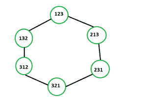

# 使用中间相遇的最短路径

> 原文:[https://www . geesforgeks . org/最短路径使用-中间相遇/](https://www.geeksforgeeks.org/shortest-path-using-meet-in-the-middle/)

给定一个排列 **P = p <sub>1</sub> ，p <sub>2</sub> ，…。，第一个 **n 个**自然数**的 p<sub>n</sub>**(1≤n≤10)**。可以交换任意两个连续的元素 **p <sub>i</sub>** 和**p<sub>I+1</sub>****(1≤I<n)**。任务是找到最小数量的互换，将 **P** 改为另一种排列 **P' = p' <sub>1</sub> ，p' <sub>2</sub> ，…。，p' <sub>n</sub>** 。

**示例:**

> **输入:** P = "213 "，P' = "321"
> **输出:**2
> 213<->231<->321
> 
> 
> 
> **输入:**P =“1234”，P ' =“4123”
> T3】输出: 3

**方法:**这个问题可以用[迪克斯特拉最短路径算法来解决。](https://www.geeksforgeeks.org/dijkstras-shortest-path-algorithm-using-priority_queue-stl/)语句中似乎没有与图形相关的内容。但是假设一个置换是一个顶点，那么置换元素的每一次交换都是连接这个顶点和另一个顶点的边。因此，寻找互换的最小数量现在变成了一个简单的 BFS/最短路径问题。
现在我们来分析一下时间复杂度。我们有 **n！**顶点，每个顶点有**n–1 个**相邻顶点。我们还必须通过映射来存储顶点访问状态，因为它们的表示很难通过普通数组来存储。所以总时间复杂度是 **O(N log(N！)* N！)**。[在中间相遇](https://www.geeksforgeeks.org/meet-in-the-middle/)技术可以让解决的更快。
在中间相遇解决方案类似于 Dijkstra 的解决方案，只是做了一些修改。

*   让 **P** 作为开始顶点， **P'** 作为结束顶点。
*   让开始和结束都成为根。我们从两个根开始 BFS，同时开始和结束，但只使用一个队列。
*   将开始和完成推入队列的后面，**访问了<sub>开始</sub> =访问了<sub>完成</sub> =真**。
*   让 **src <sub>u</sub>** 成为 BFS 级数中顶点 u 的根。所以， **src <sub>开始</sub> =开始，src <sub>结束</sub> =结束**。
*   让 **D <sub>u</sub>** 成为顶点 **u** 到它的树根的最短距离。所以 **D <sub>开始</sub> = D <sub>结束</sub> = 0** 。
*   当队列不为空时，弹出队列前面的顶点 **u** ，然后将所有与 **u** 相邻且尚未被访问的顶点**v****(已访问的 <sub>v</sub> =假)**推入队列后面，然后让**D<sub>v</sub>= D<sub>u</sub>+1**， **src <sub>v</sub> =特别是如果 **v** 拜访了 **src <sub>v</sub> ！= src <sub>u</sub>** 那我们就可以马上退回**D<sub>u</sub>+D<sub>v</sub>+1**。**

下面是上述方法的实现:

## C++

```
// C++ implementation of the approach
#include <bits/stdc++.h>
using namespace std;

// Function to find minimum number of
// swaps to make another permutation
int ShortestPath(int n, string start, string finish)
{
    unordered_map<string, bool> visited;
    unordered_map<string, int> D;
    unordered_map<string, string> src;

    visited[start] = visited[finish] = true;
    D[start] = D[finish] = 0;
    src[start] = start;
    src[finish] = finish;

    queue<string> q;
    q.push(start);
    q.push(finish);

    while (!q.empty()) {

        // Take top vertex of the queue
        string u = q.front();
        q.pop();

        // Generate n - 1 of it's permutations
        for (int i = 1; i < n; i++) {

            // Generate next permutation
            string v = u;
            swap(v[i], v[i - 1]);

            // If v is not visited
            if (!visited[v]) {

                // Set it visited
                visited[v] = true;

                // Make root of u and root of v equal
                src[v] = src[u];

                // Increment it's distance by 1
                D[v] = D[u] + 1;

                // Push this vertex into queue
                q.push(v);
            }

            // If it is already visited
            // and roots are different
            // then answer is found
            else if (src[u] != src[v])
                return D[u] + D[v] + 1;
        }
    }
}

// Driver code
int main()
{
    string p1 = "1234", p2 = "4123";
    int n = p1.length();
    cout << ShortestPath(n, p1, p2);

    return 0;
}
```

## Java 语言(一种计算机语言，尤用于创建网站)

```
// Java implementation of the approach
import java.util.*;

class GFG{

// Function to find minimum number of
// swaps to make another permutation
static int ShortestPath(int n, String start,
                               String finish)
{
    HashMap<String,
            Boolean> visited = new HashMap<String,
                                           Boolean>();
    HashMap<String,
            Integer> D = new HashMap<String,
                                     Integer>();
    HashMap<String,
            String> src = new HashMap<String,
                                      String>();

    visited.put(start, true);
    visited.put(finish, true);

    D.put(start, 0);
    D.put(finish, 0);

    src.put(start, start);
    src.put(finish, finish);
    Queue<String> q = new LinkedList<>();
    q.add(start);
    q.add(finish);

    while (q.size() != 0)
    {

        // Take top vertex of the queue
        String u = (String)q.peek();
        q.remove();

        // Generate n - 1 of it's permutations
        for(int i = 1; i < n; i++)
        {

            // Generate next permutation
            StringBuilder tmp = new StringBuilder(u);
            char t = tmp.charAt(i);
            tmp.setCharAt(i, tmp.charAt(i - 1));
            tmp.setCharAt(i - 1, t);

            String v = tmp.toString();

            // If v is not visited
            if (!visited.getOrDefault(v, false))
            {

                // Set it visited
                visited.put(v, true);

                // Make root of u and root of v equal
                src.put(v, src.get(u));

                // Increment it's distance by 1
                D.put(v, D.get(u) + 1);

                // Push this vertex into queue
                q.add(v);
            }

            // If it is already visited
            // and roots are different
            // then answer is found
            else if (src.get(u) != src.get(v))
                return D.get(u) + D.get(v) + 1;
        }
    }
    return 0;
}

// Driver Code
public static void main(String[] args)
{
    String p1 = "1234", p2 = "4123";
    int n = p1.length();

    System.out.println(ShortestPath(n, p1, p2));
}
}

// This code is contributed by pratham76
```

## 蟒蛇 3

```
# Python3 implementation of the approach
from collections import deque, defaultdict

# Function to find minimum number of
# swaps to make another permutation
def shortestPath(n: int, start: str, finish: str) -> int:
    visited, D, src = defaultdict(lambda: False), defaultdict(
        lambda: 0), defaultdict(lambda: '')
    visited[start] = visited[finish] = True
    D[start] = D[finish] = 0
    src[start], src[finish] = start, finish

    q = deque()
    q.append(start)
    q.append(finish)

    while q:

        # Take top vertex of the queue
        u = q[0]
        q.popleft()

        # Generate n - 1 of it's permutations
        for i in range(n):
            v = list(u)
            v[i], v[i - 1] = v[i - 1], v[i]

            v = ''.join(v)

            if not visited[v]:

                # Set it visited
                visited[v] = True

                # Make root of u and root of v equal
                src[v] = src[u]

                # Increment it's distance by 1
                D[v] = D[u] + 1

                # Push this vertex into queue
                q.append(v)

            # If it is already visited
            # and roots are different
            # then answer is found
            elif u in src and src[u] != src[v]:
                return D[u] + D[v] + 1

# Driver Code
if __name__ == "__main__":

    p1 = "1234"
    p2 = "4123"
    n = len(p1)
    print(shortestPath(n, p1, p2))

# This code is contributed by
# sanjeev2552
```

## C#

```
// C# implementation of the approach
using System;
using System.Collections;
using System.Text;
using System.Collections.Generic;

class GFG{

// Function to find minimum number of
// swaps to make another permutation
static int ShortestPath(int n, string start,
                               string finish)
{
    Dictionary<string,
               bool> visited = new Dictionary<string,
                                              bool>();
    Dictionary<string,
               int> D = new Dictionary<string,
                                       int>();
    Dictionary<string,
               string> src = new Dictionary<string,
                                            string>();

    visited[start] = true;
    visited[finish] = true;

    D[start] = 0;
    D[finish] = 0;

    src[start] = start;
    src[finish] = finish;

    Queue q = new Queue();
    q.Enqueue(start);
    q.Enqueue(finish);

    while (q.Count != 0)
    {

        // Take top vertex of the queue
        string u = (string)q.Peek();
        q.Dequeue();

        // Generate n - 1 of it's permutations
        for(int i = 1; i < n; i++)
        {

            // Generate next permutation
            StringBuilder tmp = new StringBuilder(u);
            char t = tmp[i];
            tmp[i] = tmp[i - 1];
            tmp[i - 1] = t;

            string v = tmp.ToString();

            // If v is not visited
            if (!visited.GetValueOrDefault(v, false))
            {

                // Set it visited
                visited[v] = true;

                // Make root of u and root of v equal
                src[v] = src[u];

                // Increment it's distance by 1
                D[v] = D[u] + 1;

                // Push this vertex into queue
                q.Enqueue(v);
            }

            // If it is already visited
            // and roots are different
            // then answer is found
            else if (src[u] != src[v])
                return D[u] + D[v] + 1;
        }
    }
    return 0;
}

// Driver Code
public static void Main(string[] args)
{
    string p1 = "1234", p2 = "4123";
    int n = p1.Length;

    Console.Write(ShortestPath(n, p1, p2));
}
}

// This code is contributed by rutvik_56
```

**Output:**

```
3
```