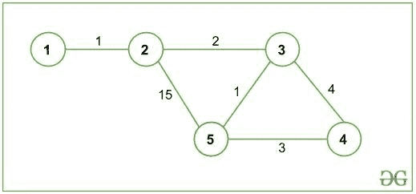
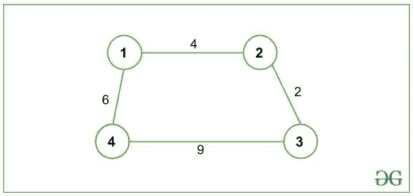
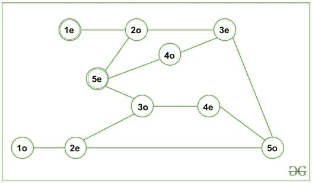

# 从源到目的地的偶数边最短路径

> 原文:[https://www . geesforgeks . org/从源到目的地的偶数边最短路径/](https://www.geeksforgeeks.org/shortest-path-with-even-number-of-edges-from-source-to-destination/)

给定一个无向图 **G** ，任务是找到偶数长度的最短路径，给定 **1** 作为源节点， **N** 作为目的节点。路径长度是指路径中存在的边的数量(不是路径的成本)。

**示例:**

> **输入:** N = 5，G 给出如下:
> 
> 
> 
> **输出:** 10
> **说明:**
> 从 1(源节点)到 5(目的节点)的所有路径为:
> 1- > 2- > 5
> 代价:16 长度:2(偶数)
> 1- > 2- > 3- > 5
> 代价:4 长度:3(奇数)
> 1- > 2- > 3- > 4 但是它有一条奇数长度的路径，由于我们只对偶数长度的路径感兴趣，所以偶数长度的最短路径是 1- > 2- > 3- > 4- > 5，总成本为 10。
> 
> **输入 2:** N = 4，G 如下:
> 
> 
> 
> **输出:** -1
> **说明:**
> 从 1(源节点)到 4(目的节点)没有偶数长度的路径。

**方法:**
创建新图形( **G'** )。对于初始图形 **G** 中的每个节点 **V** ，创建两个新节点**V _ 偶数**和**V _ 奇数**。

> 这里，**V _ 奇数**表示为((V * 10)+1)**V _ 偶数**表示为((V * 10) + 2)。
> 例如，如果节点 **V** = 4，则**V _ 奇数** = 41，**V _ 偶数** = 42。

现在，对于 **G** 中的每条边( **U，V** )，在**G’**、**(U _ 偶数，V _ 奇数)**和**(U _ 奇数，V _ 偶数)**中添加两条新边。最后使用 [Dijkstra 最短路径算法](https://www.geeksforgeeks.org/dijkstras-shortest-path-algorithm-greedy-algo-7/)找到**(源 _ 偶)**节点到**(目的 _ 偶)**节点的最短路径。
对于上述输入 1 中给出的图形，**G’**可以表示为:



从图**G’**可以观察到，从**(1 _ 偶)**到**(5 _ 偶)**只有偶长路径。因此，奇数长度的路径在**G’**中被分开，并且可以获得所需的最短路径。

下面是上述方法的实现:

## C++

```
// C++ program for the above approach
#include <bits/stdc++.h>
using namespace std;

const int MAXX = 10000, INF = 1e9;

// Adjacency List: to represent graph
vector<vector<pair<int, int> > >
    adj(MAXX * 10 + 3);

// Distance Array: to store shortest
// distance to every node
vector<int> dist(MAXX * 10 + 3, INF);

// returns value which will
// represent even_x
int even(int x)
{
    return x * 10 + 2;
}
// returns value which will
// represent odd_x
int odd(int x)
{
    return x * 10 + 1;
}

// converting edge (a->b) to 2
// different edges i.e. (a->b)
// converts to (1). even_a -> odd_b
// (2). odd_a -> even_b
// since, graph is undirected, so we
// push them in reverse order too
// hence, 4 push_back operations are
// there.
void addEdge(int a, int b, int cost)
{
    adj[even(a)].push_back(
        { odd(b), cost });
    adj[odd(a)].push_back(
        { even(b), cost });
    adj[odd(b)].push_back(
        { even(a), cost });
    adj[even(b)].push_back(
        { odd(a), cost });
}

// Function calculates shortest
// distance to all nodes from
// "source" using Dijkstra
// Shortest Path Algorithm
// and returns shortest distance
// to "destination"
int dijkstra(int source,
             int destination)
{

    /* Priority Queue/min-heap
    to store and process
    (distance, node) */
    priority_queue<pair<int, int>,
                   vector<pair<int, int> >,
                   greater<pair<int, int> > >
        pq;

    // pushing source node to
    // priority queue and dist from
    // source to source is set to 0
    pq.push({ 0, even(source) });
    dist[even(source)] = 0;

    while (!pq.empty()) {

        // U is the node at top
        // of the priority queue
        // note that pq.top().first
        // refers to the Distance
        // and pq.top().second
        // will refer to the Node
        int u = pq.top().second;
        pq.pop();

        // exploring all neighbours
        // of node u
        for (pair<int, int> p :
             adj[u]) {

            /* v is neighbour node of u
          and c is the cost/weight
          of edge (u, v) */
            int v = p.first;
            int c = p.second;

            // relaxation: checking if there
            // is a shorter path to v via u
            if (dist[u] + c
                < dist[v]) {

                // updating distance of v
                dist[v] = dist[u] + c;
                pq.push({ dist[v], v });
            }
        }
    }

    // returning shortest
    // distance to "destination"
    return dist[even(destination)];
}

// Driver function
int main()
{
    // n = number of Nodes,
    // m = number of Edges
    int n = 5, m = 6;
    addEdge(1, 2, 1);
    addEdge(2, 3, 2);
    addEdge(2, 5, 15);
    addEdge(3, 5, 1);
    addEdge(3, 4, 4);
    addEdge(5, 4, 3);

    int source = 1;
    int destination = n;
    int ans = dijkstra(source, destination);

    // if ans is INF: There is no
    // even length path from source
    // to destination else path
    // exists and we print the
    // shortest distance
    if (ans == INF)
        cout << "-1"
             << "\n";
    else
        cout << ans << "\n";

    return 0;
}
```

## Java 语言(一种计算机语言，尤用于创建网站)

```
// Java program for the above approach
import java.util.ArrayList;
import java.util.Arrays;
import java.util.PriorityQueue;

class GFG{

static class Pair implements Comparable<Pair>
{
    int first, second;

    public Pair(int first, int second)
    {
        this.first = first;
        this.second = second;
    }

    @Override
    public int compareTo(GFG.Pair o)
    {
        if (this.first == o.first)
        {
            return this.second - o.second;
        }
        return this.first - o.first;
    }
}

static final int MAXX = 10000, INF = (int)1e9;

// Adjacency List: to represent graph
@SuppressWarnings("unchecked")
static ArrayList<Pair>[] adj = new ArrayList[MAXX * 10 + 3];

// Distance Array: to store shortest
// distance to every node
static int[] dist = new int[MAXX * 10 + 3];

// Returns value which will
// represent even_x
static int even(int x)
{
    return x * 10 + 2;
}

// Returns value which will
// represent odd_x
static int odd(int x)
{
    return x * 10 + 1;
}

// Converting edge (a->b) to 2
// different edges i.e. (a->b)
// converts to (1). even_a -> odd_b
// (2). odd_a -> even_b
// since, graph is undirected, so we
// push them in reverse order too
// hence, 4 push_back operations are
// there.
static void addEdge(int a, int b, int cost)
{
    adj[even(a)].add(new Pair(odd(b), cost));
    adj[odd(a)].add(new Pair(even(b), cost));
    adj[odd(b)].add(new Pair(even(a), cost));
    adj[even(b)].add(new Pair(odd(a), cost));
}

// Function calculates shortest
// distance to all nodes from
// "source" using Dijkstra
// Shortest Path Algorithm
// and returns shortest distance
// to "destination"
static int dijkstra(int source, int destination)
{

    // Priority Queue/min-heap to store
    // and process (distance, node)
    PriorityQueue<Pair> pq = new PriorityQueue<>();

    // Pushing source node to
    // priority queue and dist from
    // source to source is set to 0
    pq.add(new Pair(0, even(source)));
    dist[even(source)] = 0;

    while (!pq.isEmpty())
    {

        // U is the node at top
        // of the priority queue
        // note that pq.top().first
        // refers to the Distance
        // and pq.top().second
        // will refer to the Node
        int u = pq.poll().second;

        // Exploring all neighbours
        // of node u
        for(Pair p : adj[u])
        {

            // v is neighbour node of u and
            // c is the cost/weight of edge (u, v)
            int v = p.first;
            int c = p.second;

            // Relaxation: checking if there
            // is a shorter path to v via u
            if (dist[u] + c < dist[v])
            {

                // Updating distance of v
                dist[v] = dist[u] + c;
                pq.add(new Pair(dist[v], v));
            }
        }
    }

    // Returning shortest
    // distance to "destination"
    return dist[even(destination)];
}

// Driver code
public static void main(String[] args)
{
    for(int i = 0; i < MAXX * 10 + 3; i++)
    {
        adj[i] = new ArrayList<Pair>();
    }

    Arrays.fill(dist, INF);

    // n = number of Nodes,
    // m = number of Edges
    int n = 5, m = 6;
    addEdge(1, 2, 1);
    addEdge(2, 3, 2);
    addEdge(2, 5, 15);
    addEdge(3, 5, 1);
    addEdge(3, 4, 4);
    addEdge(5, 4, 3);

    int source = 1;
    int destination = n;
    int ans = dijkstra(source, destination);

    // If ans is INF: There is no
    // even length path from source
    // to destination else path
    // exists and we print the
    // shortest distance
    if (ans == INF)
        System.out.println("-1");
    else
        System.out.println(ans);
}
}

// This code is contributed by sanjeev2552
```

## 蟒蛇 3

```
# Python3 program for the above approach
import heapq as hq

MAXX = 10000
INF = 1e9

# Adjacency List: to represent graph
adj = [[] for _ in range(MAXX * 10 + 3)]

# Distance Array: to store shortest
# distance to every node
dist = [INF] * (MAXX * 10 + 3)

# returns value which will
# represent even_x
def even(x):
    return x * 10 + 2

# returns value which will
# represent odd_x
def odd(x):
    return x * 10 + 1

# converting edge (a->b) to 2
# different edges i.e. (a->b)
# converts to (1). even_a -> odd_b
# (2). odd_a -> even_b
# since, graph is undirected, so we
# push them in reverse order too
# hence, 4 append operations are
# there.
def addEdge(a, b, cost):
    adj[even(a)].append((odd(b), cost))
    adj[odd(a)].append((even(b), cost))
    adj[odd(b)].append((even(a), cost))
    adj[even(b)].append((odd(a), cost))

# Function calculates shortest
# distance to all nodes from
# "source" using Dijkstra
# Shortest Path Algorithm
# and returns shortest distance
# to "destination"
def dijkstra(source, destination):

    # Priority Queue/min-heap
    # to store and process
    # (distance, node)
    pq = []

    # pushing source node to
    # priority queue and dist from
    # source to source is set to 0
    hq.heappush(pq, (0, even(source)))
    dist[even(source)] = 0

    while pq:

        # U is the node at top
        # of the priority queue
        # note that pq.top()[1]
        # refers to the Distance
        # and pq.top()[1]
        # will refer to the Node
        u = hq.heappop(pq)[1]

        # exploring all neighbours
        # of node u
        # v is neighbour node of u
        # and c is the cost/weight
        # of edge (u, v)
        for v, c in adj[u]:

            # relaxation: checking if there
            # is a shorter path to v via u
            if dist[u] + c < dist[v]:

                # updating distance of v
                dist[v] = dist[u] + c
                hq.heappush(pq, (dist[v], v))

    # returning shortest
    # distance to "destination"
    return dist[even(destination)]

# Driver function
if __name__ == "__main__":
    # n = number of Nodes,
    # m = number of Edges
    n = 5
    m = 6
    addEdge(1, 2, 1)
    addEdge(2, 3, 2)
    addEdge(2, 5, 15)
    addEdge(3, 5, 1)
    addEdge(3, 4, 4)
    addEdge(5, 4, 3)

    source = 1
    destination = n
    ans = dijkstra(source, destination)

    # if ans is INF: There is no
    # even length path from source
    # to destination else path
    # exists and we prthe
    # shortest distance
    if ans == INF:
        print(-1)
    else:
        print(ans)
```

**Output:** 

```
10
```

**时间复杂度:** (E * log(V))
**辅助空间:** O(V + E)