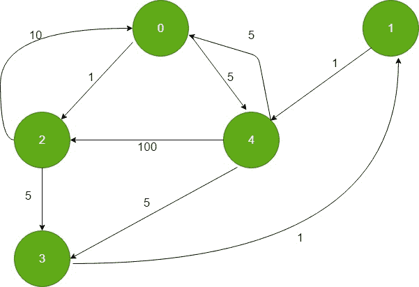
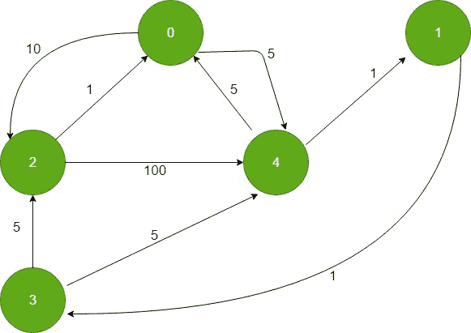

# 从所有顶点到目的地的最短路径

> 原文:[https://www . geesforgeks . org/从所有顶点到目的地的最短路径/](https://www.geeksforgeeks.org/shortest-paths-from-all-vertices-to-a-destination/)

给定一个加权有向图和图中的一个目标顶点，求所有顶点到目标顶点的最短距离。
**输入:**



one

**输出:**0 6 10 7 5
0 距离 0: 0 的距离
0 距离 1:1+5 = 6(1->4->0)
0 距离 2:10(2->0)
0 距离 3:1+1+5 = 7(3->1->4->0)
0 距离 4: 5 (4- 【T14

**方法:**问题类似于[迪克斯特拉的问题。](https://www.geeksforgeeks.org/dijkstras-shortest-path-algorithm-using-priority_queue-stl/)。这个想法是使用 Dijkstra 的算法。为了找到从所有顶点到给定目标顶点的最短距离，我们反转有向图的所有边，并将目标顶点用作 dijkstra 算法中的源顶点。因为现在所有的边都是反向的，所以计算从目的顶点到所有其他顶点的最短距离类似于计算从所有顶点到给定目的顶点的最短距离。
反转边缘后，图形看起来像:



现在在 Dijkstra 的算法中计算从目的顶点到源顶点的最短距离。
以下是上述方法的实现:

## 卡片打印处理机（Card Print Processor 的缩写）

```
// C++ implementation for the above approach
#include <bits/stdc++.h>
using namespace std;
#define INF 0x3f3f3f3f

// iPair ==>  Integer Pair
typedef pair<int, int> iPair;

// This class represents a directed graph using
// adjacency list representation
class Graph {
    int V; // No. of vertices

    // In a weighted graph, we need to store vertex
    // and weight pair for every edge
    list<pair<int, int> >* adj;

public:
    Graph(int V); // Constructor

    // function to add an reverse edge to graph
    void addEdgeRev(int u, int v, int w);

    // prints shortest distance from all
    // vertex to the given destination vertex
    void shortestPath(int s);
};

// Allocates memory for adjacency list
Graph::Graph(int V)
{
    this->V = V;
    adj = new list<iPair>[V];
}

void Graph::addEdgeRev(int u, int v, int w)
{

    adj[v].push_back(make_pair(u, w));
}

// Prints shortest distance from all vertex to
// the given destination vertex
void Graph::shortestPath(int dest)
{
    // Create a priority queue to store vertices that
    // are being preprocessed. This is weird syntax in C++.
    // Refer below link for details of this syntax
    // https:// www.geeksforgeeks.org/implement-min-heap-using-stl/
    priority_queue<iPair, vector<iPair>, greater<iPair> > pq;

    // Create a vector for distances and initialize all
    // distances as infinite (INF)
    vector<int> dist(V, INF);

    // Insert destination itself in priority queue and initialize
    // its distance as 0.
    pq.push(make_pair(0, dest));
    dist[dest] = 0;

    /* Looping till priority queue becomes empty (or all
      distances are not finalized) */
    while (!pq.empty()) {

        // The first vertex in pair is the minimum distance
        // vertex, extract it from priority queue.
        // vertex label is stored in second of pair (it
        // has to be done this way to keep the vertices
        // sorted distance (distance must be first item
        // in pair)
        int u = pq.top().second;
        pq.pop();

        // 'i' is used to get all adjacent vertices of a vertex
        list<pair<int, int> >::iterator i;
        for (i = adj[u].begin(); i != adj[u].end(); ++i) {

            // Get vertex label and weight of current adjacent
            // of u.
            int v = (*i).first;
            int weight = (*i).second;

            // If there is shorted path to v through u.
            if (dist[v] > dist[u] + weight) {
                // Updating distance of v
                dist[v] = dist[u] + weight;
                pq.push(make_pair(dist[v], v));
            }
        }
    }

    // Print shortest distances stored in dist[]
    printf("Destination Vertex Distance "
           "from all vertex\n");
    for (int i = 0; i < V; ++i)
        printf("%d \t\t %d\n", i, dist[i]);
}

// Driver program to test methods of graph class
int main()
{
    // create the graph given in above figure
    int V = 5;
    Graph g(V);

    // adding edges in reverse direction
    g.addEdgeRev(0, 2, 1);
    g.addEdgeRev(0, 4, 5);
    g.addEdgeRev(1, 4, 1);
    g.addEdgeRev(2, 0, 10);
    g.addEdgeRev(2, 3, 5);
    g.addEdgeRev(3, 1, 1);
    g.addEdgeRev(4, 0, 5);
    g.addEdgeRev(4, 2, 100);
    g.addEdgeRev(4, 3, 5);

    g.shortestPath(0);

    return 0;
}
```

## 蟒蛇 3

```
from queue import PriorityQueue
INF = int(0x3f3f3f3f)

# This class represents a directed graph using
# adjacency list representation
class Graph:
    def __init__(self, V: int) -> None:

        self.V = V
        # No. of vertices

        # In a weighted graph, we need to store vertex
        # and weight pair for every edge
        self.adj = [[] for _ in range(V)]
    def addEdgeRev(self, u: int, v: int, w: int) -> None:
        self.adj[v].append((u, w))

    # Prints shortest distance from all vertex to
    # the given destination vertex
    def shortestPath(self, dest: int) -> None:

        # Create a priority queue to store vertices that
        # are being preprocessed. This is weird syntax in C++.
        # Refer below link for details of this syntax
        # https:# www.geeksforgeeks.org/implement-min-heap-using-stl/
        pq = PriorityQueue()

        # Create a vector for distances and initialize all
        # distances as infinite (INF)
        dist = [INF for _ in range(V)]

        # Insert destination itself in priority queue and initialize
        # its distance as 0.
        pq.put((0, dest))
        dist[dest] = 0

        # Looping till priority queue becomes empty (or all
        # distances are not finalized) */
        while not pq.empty():

            # The first vertex in pair is the minimum distance
            # vertex, extract it from priority queue.
            # vertex label is stored in second of pair (it
            # has to be done this way to keep the vertices
            # sorted distance (distance must be first item
            # in pair)
            u = pq.get()[1]

            # 'i' is used to get all adjacent vertices of a vertex
            for i in self.adj[u]:

                # Get vertex label and weight of current adjacent
                # of u.
                v = i[0]
                weight = i[1]

                # If there is shorted path to v through u.
                if (dist[v] > dist[u] + weight):

                    # Updating distance of v
                    dist[v] = dist[u] + weight
                    pq.put((dist[v], v))

        # Print shortest distances stored in dist[]
        print("Destination Vertex Distance from all vertex")
        for i in range(V):
            print("{} \t\t {}".format(i, dist[i]))

# Driver code
if __name__ == "__main__":

    # create the graph given in above figure
    V = 5
    g = Graph(V)

    # adding edges in reverse direction
    g.addEdgeRev(0, 2, 1)
    g.addEdgeRev(0, 4, 5)
    g.addEdgeRev(1, 4, 1)
    g.addEdgeRev(2, 0, 10)
    g.addEdgeRev(2, 3, 5)
    g.addEdgeRev(3, 1, 1)
    g.addEdgeRev(4, 0, 5)
    g.addEdgeRev(4, 2, 100)
    g.addEdgeRev(4, 3, 5)

    g.shortestPath(0)

# This code is contributed by sanjeev2552
```

**Output:** 

```
Destination Vertex Distance from all vertex
0                0
1                6
2                10
3                7
4                5         
```