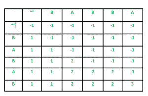

# 最短不常见子序列

> 原文:[https://www . geesforgeks . org/最短-不常见-子序列/](https://www.geeksforgeeks.org/shortest-uncommon-subsequence/)

给定两个字符串 S 和 T，求 S 中最短的子序列的长度，它不是 T 中的子序列。如果不可能有这样的子序列，返回-1。子序列是以相同的相对顺序出现的序列，但不一定是连续的。长度为 n 的字符串具有 2^n 不同的可能子序列。
长度为 m 的弦 S(1<= m<= 1000)
长度为 n 的弦 T(1<= n<= 1000)
**例:**

```
Input : S = “babab” T = “babba”
Output : 3
The subsequence “aab” of length 3 is 
present in S but not in T.

Input :  S = “abb” T = “abab”
Output : -1
There is no subsequence that is present 
in S but not in T.

```

**强力方法**
一种简单的方法是生成字符串 S 的所有子序列，并针对每个子序列检查它是否存在于字符串 T 中。考虑示例 2，其中 S =“abb”，
它的子序列是“”、“a”、“b”、“ab”、“bb”、“abb”，每个子序列都出现在“abab”中。这个解决方案的时间复杂度将是指数级的。
**【高效(动态规划)**
**1。最优子结构:**分别考虑长度为 m 和 n 的两个字符串 S 和 T&让寻找最短非常见子序列的函数为 shortestSeq (char *S，char *T)。对于 S 中的每个字符，如果它不在 T 中，那么这个字符就是答案本身。
否则，如果在索引 k 处找到它，那么我们可以选择是否将其包含在最短的不常见子序列中。

```
If it is included answer = 1 + ShortestSeq( S + 1, T + k + 1) 
If not included answer =  ShortestSeq( S + 1, T) 
The minimum of the two is the answer.

```

因此，我们可以看到这个问题具有最优子结构性质，因为它可以通过使用子问题的解来解决。
**2。**重叠子问题
下面是上述问题的简单递归实现。

## C++

```
// A simple recursive C++ program to find shortest
// uncommon subsequence.
#include<bits/stdc++.h>
using namespace std;

#define MAX 1005

/* A recursive function to find the length of
   shortest uncommon subsequence*/
int shortestSeq(char *S, char *T, int m, int n)
{
    // S string is empty
    if (m == 0)
        return MAX;

    // T string is empty
    if (n <= 0)
        return 1;

    // Loop to search for current character
    int k;
    for (k=0; k < n; k++)
        if (T[k] == S[0])
            break;

    // char not found in T
    if (k == n)
        return 1;

    // Return minimum of following two
    // Not including current char in answer
    // Including current char
    return min(shortestSeq(S+1, T, m-1, n),
            1 + shortestSeq(S+1, T+k+1, m-1, n-k-1));
}

// Driver program to test the above function
int main()
{
    char S[] = "babab";
    char T[] = "babba";
    int m = strlen(S), n = strlen(T);
    int ans = shortestSeq(S, T, m, n);
    if (ans >= MAX)
       ans = -1;
    cout << "Length of shortest subsequence is: "
         << ans << endl;
    return 0;
}
```

## Java 语言(一种计算机语言，尤用于创建网站)

```
// A simple recursive Java program to find shortest
// uncommon subsequence.
import java.util.*;

class GFG
{

static final int MAX = 1005;

/* A recursive function to find the length of
shortest uncommon subsequence*/
static int shortestSeq(char []S, char []T, int m, int n)
{
    // S String is empty
    if (m == 0)
        return MAX;

    // T String is empty
    if (n <= 0)
        return 1;

    // Loop to search for current character
    int k;
    for (k = 0; k < n; k++)
        if (T[k] == S[0])
            break;

    // char not found in T
    if (k == n)
        return 1;

    // Return minimum of following two
    // Not including current char in answer
    // Including current char
    return Math.min(shortestSeq(Arrays.copyOfRange(S, 1, S.length), T, m - 1, n),
                    1 + shortestSeq(Arrays.copyOfRange(S, 1, S.length),
                    Arrays.copyOfRange(T, k + 1, T.length), m - 1, n - k - 1));
}

// Driver code
public static void main(String[] args)
{
    char S[] = "babab".toCharArray();
    char T[] = "babba".toCharArray();
    int m = S.length, n = T.length;
    int ans = shortestSeq(S, T, m, n);
    if (ans >= MAX)
    ans = -1;
    System.out.print("Length of shortest subsequence is: "
        + ans +"\n");
}
}

// This code is contributed by Rajput-Ji
```

## 蟒蛇 3

```
# A simple recursive Python
# program to find shortest
# uncommon subsequence.
MAX = 1005

# A recursive function to
# find the length of shortest
# uncommon subsequence
def shortestSeq(S, T, m, n):

    # S String is empty
    if m == 0:
        return MAX

    # T String is empty
    if(n <= 0):
        return 1

    # Loop to search for
    # current character
    for k in range(n):
        if(T[k] == S[0]):
            break

    # char not found in T
    if(k == n):
        return 1

    # Return minimum of following
    # two Not including current
    # char in answer Including
    # current char
    return min(shortestSeq(S[1 : ], T, m - 1, n),
               1 + shortestSeq((S[1 : ]), T[k + 1 : ],
                                m - 1, n - k - 1))

# Driver code
S = "babab"
T = "babba"

m = len(S)
n = len(T)
ans = shortestSeq(S, T, m, n)
if(ans >= MAX):
    ans =- 1
print("Length of shortest subsequence is:", ans)

# This code is contributed by avanitrachhadiya2155
```

## C#

```
// A simple recursive C# program to find shortest
// uncommon subsequence.
using System;

class GFG
{

static readonly int MAX = 1005;

/* A recursive function to find the length of
shortest uncommon subsequence*/
static int shortestSeq(char []S, char []T, int m, int n)
{
    // S String is empty
    if (m == 0)
        return MAX;

    // T String is empty
    if (n <= 0)
        return 1;

    // Loop to search for current character
    int k;
    for (k = 0; k < n; k++)
        if (T[k] == S[0])
            break;

    // char not found in T
    if (k == n)
        return 1;

    // Return minimum of following two
    // Not including current char in answer
    // Including current char
    char []St1 = new Char[S.Length - 1];
    Array.Copy(S, 1, St1, 0, S.Length - 1);
    char []St2 = new Char[S.Length - 1];
    Array.Copy(S, 1, St2, 0, S.Length - 1);
    char []Tt1 = new Char[T.Length - (k + 1)];
    Array.Copy(T, k + 1, Tt1, 0, T.Length - (k + 1));
    return Math.Min(shortestSeq(St1, T, m - 1, n),
                    1 + shortestSeq(St2, Tt1, m - 1, n - k - 1));
}

// Driver code
public static void Main(String[] args)
{
    char []S = "babab".ToCharArray();
    char []T = "babba".ToCharArray();
    int m = S.Length, n = T.Length;
    int ans = shortestSeq(S, T, m, n);
    if (ans >= MAX)
    ans = -1;
    Console.Write("Length of shortest subsequence is: "
        + ans +"\n");
}
}

// This code is contributed by Rajput-Ji
```

**输出:**

```
Length of shortest subsequence is : 3

```

如果我们画出完整的递归树，那么我们可以看到有很多子问题被一次又一次地解决。因此，该问题具有重叠子结构性质，用记忆法或制表法都可以避免同一子问题的重新计算。以下是问题的列表实现。



## C++

```
// A dynamic programming based C++ program
// to find shortest uncommon subsequence.
#include<bits/stdc++.h>
using namespace std;

#define MAX 1005

// Returns length of shortest common subsequence
int shortestSeq(char *S, char *T)
{
    int m = strlen(S), n = strlen(T);

    // declaring 2D array of m + 1 rows and
    // n + 1 columns dynamically
    int dp[m+1][n+1];

    // T string is empty
    for (int i = 0; i <= m; i++)
        dp[i][0] = 1;

    // S string is empty
    for (int i = 0; i <= n; i++)
        dp[0][i] = MAX;

    for (int i = 1; i <= m; i++)
    {
        for (int j = 1; j <= n; j++)
        {
            char ch = S[i-1];
            int k;
            for (k = j-1; k >= 0; k--)
                if (T[k] == ch)
                    break;

            // char not present in T
            if (k == -1)
                dp[i][j] = 1;
            else
               dp[i][j] = min(dp[i-1][j], dp[i-1][k] + 1);
        }
    }

    int ans = dp[m][n];
    if (ans >= MAX)
        ans = -1;

    return ans;
}

// Driver program to test the above function
int main()
{
    char S[] = "babab";
    char T[] = "babba";
    int m = strlen(S), n = strlen(T);
    cout << "Length of shortest subsequence is : "
         << shortestSeq(S, T) << endl;
}
```

## Java 语言(一种计算机语言，尤用于创建网站)

```
// A dynamic programming based Java program
// to find shortest uncommon subsequence.
class GFG
{

    static final int MAX = 1005;

    // Returns length of shortest common subsequence
    static int shortestSeq(char[] S, char[] T)
    {
        int m = S.length, n = T.length;

        // declaring 2D array of m + 1 rows and
        // n + 1 columns dynamically
        int dp[][] = new int[m + 1][n + 1];

        // T string is empty
        for (int i = 0; i <= m; i++)
        {
            dp[i][0] = 1;
        }

        // S string is empty
        for (int i = 0; i <= n; i++)
        {
            dp[0][i] = MAX;
        }

        for (int i = 1; i <= m; i++)
        {
            for (int j = 1; j <= n; j++)
            {
                char ch = S[i - 1];
                int k;
                for (k = j - 1; k >= 0; k--)
                {
                    if (T[k] == ch)
                    {
                        break;
                    }
                }

                // char not present in T
                if (k == -1)
                {
                    dp[i][j] = 1;
                }
                else
                {
                    dp[i][j] = Math.min(dp[i - 1][j],
                                    dp[i - 1][k] + 1);
                }
            }
        }

        int ans = dp[m][n];
        if (ans >= MAX)
        {
            ans = -1;
        }
        return ans;
    }

    // Driver code
    public static void main(String[] args)
    {
        char S[] = "babab".toCharArray();
        char T[] = "babba".toCharArray();
        int m = S.length, n = T.length;
        System.out.println("Length of shortest" +
                            "subsequence is : " +
                            shortestSeq(S, T));
    }
}

// This code is contributed by 29AjayKumar
```

## 蟒蛇 3

```
# A dynamic programming based Python program
# to find shortest uncommon subsequence.
MAX = 1005

# Returns length of shortest common subsequence
def shortestSeq(S: list, T: list):
    m = len(S)
    n = len(T)

    # declaring 2D array of m + 1 rows and
    # n + 1 columns dynamically
    dp = [[0 for i in range(n + 1)]
             for j in range(m + 1)]

    # T string is empty
    for i in range(m + 1):
        dp[i][0] = 1

    # S string is empty
    for i in range(n + 1):
        dp[0][i] = MAX

    for i in range(1, m + 1):
        for j in range(1, n + 1):
            ch = S[i - 1]
            k = j - 1
            while k >= 0:
                if T[k] == ch:
                    break
                k -= 1

            # char not present in T
            if k == -1:
                dp[i][j] = 1
            else:
                dp[i][j] = min(dp[i - 1][j],
                               dp[i - 1][k] + 1)

    ans = dp[m][n]
    if ans >= MAX:
        ans = -1

    return ans

# Driver Code
if __name__ == "__main__":
    S = "babab"
    T = "babba"

    print("Length of shortest subsequence is:",
                             shortestSeq(S, T))

# This code is contributed by
# sanjeev2552
```

## C#

```
// A dynamic programming based C# program
// to find shortest uncommon subsequence.
using System;

class GFG
{

    static readonly int MAX = 1005;

    // Returns length of shortest common subsequence
    static int shortestSeq(char[] S, char[] T)
    {
        int m = S.Length, n = T.Length;

        // declaring 2D array of m + 1 rows and
        // n + 1 columns dynamically
        int [,]dp = new int[m + 1, n + 1];

        // T string is empty
        for (int i = 0; i <= m; i++)
        {
            dp[i, 0] = 1;
        }

        // S string is empty
        for (int i = 0; i <= n; i++)
        {
            dp[0, i] = MAX;
        }

        for (int i = 1; i <= m; i++)
        {
            for (int j = 1; j <= n; j++)
            {
                char ch = S[i - 1];
                int k;
                for (k = j - 1; k >= 0; k--)
                {
                    if (T[k] == ch)
                    {
                        break;
                    }
                }

                // char not present in T
                if (k == -1)
                {
                    dp[i, j] = 1;
                }
                else
                {
                    dp[i, j] = Math.Min(dp[i - 1, j],
                                    dp[i - 1, k] + 1);
                }
            }
        }

        int ans = dp[m, n];
        if (ans >= MAX)
        {
            ans = -1;
        }
        return ans;
    }

    // Driver code
    public static void Main(String[] args)
    {
        char []S = "babab".ToCharArray();
        char []T = "babba".ToCharArray();
        int m = S.Length, n = T.Length;
        Console.WriteLine("Length of shortest" +
                            "subsequence is : " +
                            shortestSeq(S, T));
    }
}

// This code contributed by Rajput-Ji
```

## 服务器端编程语言（Professional Hypertext Preprocessor 的缩写）

```
<?php
// A dynamic programming based PHP program
// to find shortest uncommon subsequence.

$GLOBALS['MAX'] = 1005;

// Returns length of shortest
// common subsequence
function shortestSeq($S, $T)
{
    $m = strlen($S);
    $n = strlen($T);

    // declaring 2D array of m + 1 rows 
    // and n + 1 columns dynamically
    $dp = array(array());

    // T string is empty
    for ($i = 0; $i <= $m; $i++)
        $dp[$i][0] = 1;

    // S string is empty
    for ($i = 0; $i <= $n; $i++)
        $dp[0][$i] = $GLOBALS['MAX'];

    for ($i = 1; $i <= $m; $i++)
    {
        for ($j = 1; $j <= $n; $j++)
        {
            $ch = $S[$i - 1];
            for ($k = $j - 1; $k >= 0; $k--)
                if ($T[$k] == $ch)
                    break;

            // char not present in T
            if ($k == -1)
                $dp[$i][$j] = 1;
            else
            $dp[$i][$j] = min($dp[$i - 1][$j], 
                              $dp[$i - 1][$k] + 1);
        }
    }

    $ans = $dp[$m][$n];
    if ($ans >= $GLOBALS['MAX'])
        $ans = -1;

    return $ans;
}

// Driver Code
$S = "babab";
$T = "babba";
$m = strlen($S);
$n = strlen($T);
echo "Length of shortest subsequence is : ",
                        shortestSeq($S, $T);

// This code is contributed by Ryuga
?>
```

**输出:**

```
Length of shortest subsequence is : 3

```

**时间复杂度:**o(mn^2)
T3】空间复杂度: O(mn)
本文由 **Aditi Sharma** 供稿。如果你喜欢 GeeksforGeeks 并想投稿，你也可以用[contribute.geeksforgeeks.org](http://contribute.geeksforgeeks.org)写一篇文章或者把你的文章邮寄到 contribute@geeksforgeeks.org。看到你的文章出现在极客博客主页上，帮助其他极客。
如果发现有不正确的地方，或者想分享更多关于上述话题的信息，请写评论。