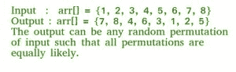

# 使用 Fisher-Yates 打乱算法打乱给定数组

> 原文： [https://www.geeksforgeeks.org/shuffle-a-given-array/](https://www.geeksforgeeks.org/shuffle-a-given-array/)

给定一个数组，编写一个程序以生成数组元素的随机排列。 还问这个问题为“打乱”或“给定数组随机化”。 这里的随机化意味着数组元素的每个排列都应该具有相同的可能性。



令给定数组为`arr[]`。 一个简单的解决方案是创建一个辅助数组`temp[]`，该数组最初是`arr[]`的副本。 从`temp[]`中随机选择一个元素，将随机选择的元素复制到`arr[0]`中，然后从`temp[]`中删除所选元素。 重复相同的过程`n`次，并将元素复制到`arr[1], arr[2], …`。此解决方案的时间复杂度为`O(n ^ 2)`。

[Fisher-Yates 打乱算法](http://en.wikipedia.org/wiki/Fisher%E2%80%93Yates_shuffle#The_modern_algorithm)在`O(n)`时间复杂度下工作。 这里的假设是，给我们一个函数`rand()`，它在`O(1)`时间内生成随机数。

的想法是从最后一个元素开始，将其与整个数组（包括最后一个）中随机选择的元素交换。 现在考虑从 0 到`n-2`的数组（大小减小 1），并重复该过程直到我们找到第一个元素。

以下是详细的算法：

```
To shuffle an array a of n elements (indices 0..n-1):
  for i from n - 1 downto 1 do
       j = random integer with 0 <= j <= i
       exchange a[j] and a[i]

```

以下是该算法的实现。

## C++ 

```cpp

// C++ Program to shuffle a given array  
#include<bits/stdc++.h>  
#include <stdlib.h>  
#include <time.h>  
using namespace std;  

// A utility function to swap to integers  
void swap (int *a, int *b)  
{  
    int temp = *a;  
    *a = *b;  
    *b = temp;  
}  

// A utility function to print an array  
void printArray (int arr[], int n)  
{  
    for (int i = 0; i < n; i++)  
        cout << arr[i] << " ";  
    cout << "\n";  
}  

// A function to generate a random  
// permutation of arr[]  
void randomize (int arr[], int n)  
{  
    // Use a different seed value so that  
    // we don't get same result each time 
    // we run this program  
    srand (time(NULL));  

    // Start from the last element and swap  
    // one by one. We don't need to run for  
    // the first element that's why i > 0  
    for (int i = n - 1; i > 0; i--)  
    {  
        // Pick a random index from 0 to i  
        int j = rand() % (i + 1);  

        // Swap arr[i] with the element  
        // at random index  
        swap(&arr[i], &arr[j]);  
    }  
}  

// Driver Code 
int main()  
{  
    int arr[] = {1, 2, 3, 4, 5, 6, 7, 8};  
    int n = sizeof(arr) / sizeof(arr[0]);  
    randomize (arr, n);  
    printArray(arr, n);  

    return 0;  
}  

// This code is contributed by  
// rathbhupendra 

```

## C

```c

// C Program to shuffle a given array 

#include <stdio.h> 
#include <stdlib.h> 
#include <time.h> 

// A utility function to swap to integers 
void swap (int *a, int *b) 
{ 
    int temp = *a; 
    *a = *b; 
    *b = temp; 
} 

// A utility function to print an array 
void printArray (int arr[], int n) 
{ 
    for (int i = 0; i < n; i++) 
        printf("%d ", arr[i]); 
    printf("\n"); 
} 

// A function to generate a random permutation of arr[] 
void randomize ( int arr[], int n ) 
{ 
    // Use a different seed value so that we don't get same 
    // result each time we run this program 
    srand ( time(NULL) ); 

    // Start from the last element and swap one by one. We don't 
    // need to run for the first element that's why i > 0 
    for (int i = n-1; i > 0; i--) 
    { 
        // Pick a random index from 0 to i 
        int j = rand() % (i+1); 

        // Swap arr[i] with the element at random index 
        swap(&arr[i], &arr[j]); 
    } 
} 

// Driver program to test above function. 
int main() 
{ 
    int arr[] = {1, 2, 3, 4, 5, 6, 7, 8}; 
    int n = sizeof(arr)/ sizeof(arr[0]); 
    randomize (arr, n); 
    printArray(arr, n); 

    return 0; 
} 

```

## Java

```java

// Java Program to shuffle a given array 
import java.util.Random; 
import java.util.Arrays; 
public class ShuffleRand  
{ 
    // A Function to generate a random permutation of arr[] 
    static void randomize( int arr[], int n) 
    { 
        // Creating a object for Random class 
        Random r = new Random(); 

        // Start from the last element and swap one by one. We don't 
        // need to run for the first element that's why i > 0 
        for (int i = n-1; i > 0; i--) { 

            // Pick a random index from 0 to i 
            int j = r.nextInt(i+1); 

            // Swap arr[i] with the element at random index 
            int temp = arr[i]; 
            arr[i] = arr[j]; 
            arr[j] = temp; 
        } 
        // Prints the random array 
        System.out.println(Arrays.toString(arr)); 
    } 

    // Driver Program to test above function 
    public static void main(String[] args)  
    { 

         int[] arr = {1, 2, 3, 4, 5, 6, 7, 8}; 
         int n = arr.length; 
         randomize (arr, n); 
    } 
} 
// This code is contributed by Sumit Ghosh 

```

## Python

```py

# Python Program to shuffle a given array 
import random 

# A function to generate a random permutation of arr[] 
def randomize (arr, n): 
    # Start from the last element and swap one by one. We don't 
    # need to run for the first element that's why i > 0 
    for i in range(n-1,0,-1): 
        # Pick a random index from 0 to i 
        j = random.randint(0,i+1) 

        # Swap arr[i] with the element at random index 
        arr[i],arr[j] = arr[j],arr[i] 
    return arr 

# Driver program to test above function. 
arr = [1, 2, 3, 4, 5, 6, 7, 8] 
n = len(arr) 
print(randomize(arr, n)) 

# This code is contributed by Pratik Chhajer 

```

## C# 

```cs

// C# Code for Number of digits  
// in the product of two numbers 
using System; 

class GFG 
{  
// A Function to generate a 
// random permutation of arr[] 
    static void randomize(int []arr, int n) 
    { 
        // Creating a object 
        // for Random class 
        Random r = new Random(); 

        // Start from the last element and 
        // swap one by one. We don't need to 
        // run for the first element  
        // that's why i > 0 
        for (int i = n - 1; i > 0; i--)  
        { 

            // Pick a random index 
            // from 0 to i 
            int j = r.Next(0, i+1); 

            // Swap arr[i] with the 
            // element at random index 
            int temp = arr[i]; 
            arr[i] = arr[j]; 
            arr[j] = temp; 
        } 
        // Prints the random array 
        for (int i = 0; i < n; i++) 
        Console.Write(arr[i] + " "); 
    } 

// Driver Code 
static void Main() 
{ 
    int[] arr = {1, 2, 3, 4,  
                 5, 6, 7, 8}; 
    int n = arr.Length; 
    randomize (arr, n); 
} 
} 

// This code is contributed by Sam007 

```

## PHP

```php

<?php 
// PHP Program to shuffle  
// a given array 

// A function to generate 
// a random permutation of arr[] 
function randomize ($arr, $n) 
{ 
    // Start from the last element  
    // and swap one by one. We  
    // don't need to run for the 
    // first element that's why i > 0 
    for($i = $n - 1; $i >= 0; $i--) 
    { 
        // Pick a random index 
        // from 0 to i 
        $j = rand(0, $i+1); 

        // Swap arr[i] with the  
        // element at random index 
        $tmp = $arr[$i]; 
        $arr[$i] = $arr[$j]; 
        $arr[$j] = $tmp; 
    } 
    for($i = 0; $i < $n; $i++) 
    echo $arr[$i]." "; 
} 

// Driver Code 
$arr = array(1, 2, 3, 4,  
             5, 6, 7, 8); 
$n = count($arr); 
randomize($arr, $n); 

// This code is contributed by mits 
?> 

```

**输出**：

```
7 8 4 6 3 1 2 5
```

上面的函数假定`rand()`生成一个随机数。

**时间复杂度**：`O(n)`，假设函数`rand()`需要`O(1)`时间。

**这是如何工作的？**

第`i`个元素（包括最后一个元素）到达最后位置的概率为`1 / n`，因为我们在第一次迭代中随机选择了一个元素。

通过将`i`元素分为两种情况，可以证明第`i`元素到达倒数第二个位置的概率为`1 / n`。

**情况 1，`i = n-1`（最后一个元素的索引）**：

最后一个元素到达倒数第二个位置的概率为（最后一个元素没有停留在其原始位置的概率）乘（再次选择在上一步中选择的索引以便交换最后一个元素的概率）

因此，概率`= ((n-1) / n) x (1 / (n-1)) = 1 / n`。

**情况 2，`0 < i < n-1`（非最后索引）**：

第`i`个元素移至第二位置的概率为（第一个元素在上一次迭代中未被选择概率）乘（在此迭代中选择第`i`个元素的概率），

因此，概率`= ((n-1) / n) x (1 / (n-1))= 1 / n`。

我们可以轻松地将上述证明推广到其他位置。

