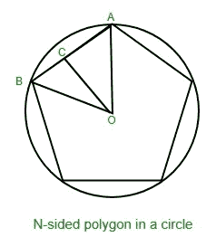

# 正多边形的外切圆边

> 原文:[https://www . geeksforgeeks . org/正边 n 边多边形外接圆/](https://www.geeksforgeeks.org/side-of-a-regular-n-sided-polygon-circumscribed-in-a-circle/)

给定两个整数 **r** 和 **n** ，其中 **n** 是正多边形的边数， **r** 是该多边形的外切圆的半径。任务是找到多边形边的长度。



**例:**

> **输入:** n = 5，r = 11
> **输出:** 12.9256
> **输入:** n = 3，r = 5
> **输出:** 8.6576

**逼近:**考虑上图，让**角度 AOB** 为**θ**然后**θ= 360/n**。
在直角三角形中，**角度 ACO = 90 度**和**角度 AOC =θ/2**。
所以，**AC = OA * sin(θ/2)= r * sin(θ/2)**
因此，多边形的边， **AB = 2 * AC** 即**2 * r * sin(θ/2)**。
以下是上述方法的实施:

## C++

```
// C++ implementation of the approach
#include <bits/stdc++.h>
using namespace std;

// Function to calculate the side of the polygon
// circumscribed in a circle
float calculateSide(float n, float r)
{
    float theta, theta_in_radians;

    theta = 360 / n;
    theta_in_radians = theta * 3.14 / 180;

    return 2 * r * sin(theta_in_radians / 2);
}

// Driver Code
int main()
{

    // Total sides of the polygon
    float n = 3;

    // Radius of the circumscribing circle
    float r = 5;

    cout << calculateSide(n, r);
}
```

## Java 语言(一种计算机语言，尤用于创建网站)

```
// Java  implementation of the approach
import java.lang.Math;
import java.io.*;

class GFG {

// Function to calculate the side of the polygon
// circumscribed in a circle
static double calculateSide(double  n, double r)
{
    double theta, theta_in_radians;

    theta = 360 / n;
    theta_in_radians = theta * 3.14 / 180;

    return 2 * r * Math.sin(theta_in_radians / 2);
}

// Driver Code
    public static void main (String[] args) {

    // Total sides of the polygon
    double n = 3;

    // Radius of the circumscribing circle
    double r = 5;
    System.out.println (calculateSide(n, r));
    }
//This code is contributed by akt_mit   
}
```

## 蟒蛇 3

```
# Python 3 implementation of the approach
from math import sin

# Function to calculate the side of
# the polygon circumscribed in a circle
def calculateSide(n, r):
    theta = 360 / n
    theta_in_radians = theta * 3.14 / 180

    return 2 * r * sin(theta_in_radians / 2)

# Driver Code
if __name__ == '__main__':

    # Total sides of the polygon
    n = 3

    # Radius of the circumscribing circle
    r = 5

    print('{0:.5}'.format(calculateSide(n, r)))

# This code is contributed by
# Sanjit_Prasad
```

## C#

```
// C# implementation of the approach

using System;

class GFG {

    // Function to calculate the side of the polygon
    // circumscribed in a circle
    static double calculateSide(double n, double r)
    {
        double theta, theta_in_radians;

        theta = 360 / n;
        theta_in_radians = theta * 3.14 / 180;

        return Math.Round(2 * r * Math.Sin(theta_in_radians / 2),4);
    }

        // Driver Code
    public static void Main () {

    // Total sides of the polygon
    double n = 3;

    // Radius of the circumscribing circle
    double r = 5;

    Console.WriteLine(calculateSide(n, r));
    }
    // This code is contributed by Ryuga
}
```

## 服务器端编程语言（Professional Hypertext Preprocessor 的缩写）

```
<?php
// PHP implementation of the approach

// Function to calculate the side of the
// polygon circumscribed in a circle
function calculateSide($n, $r)
{
    $theta; $theta_in_radians;

    $theta = 360 / $n;
    $theta_in_radians = $theta * 3.14 / 180;

    return 2 * $r * sin($theta_in_radians / 2);
}

// Driver Code

// Total sides of the polygon
$n = 3;

// Radius of the circumscribing circle
$r = 5;

echo calculateSide($n, $r);

// This code is contributed by inder_verma..
?>
```

## java 描述语言

```
<script>

// javascript  implementation of the approach

// Function to calculate the side of the polygon
// circumscribed in a circle
function calculateSide( n , r)
{
    var theta, theta_in_radians;

    theta = 360 / n;
    theta_in_radians = theta * 3.14 / 180;

    return 2 * r * Math.sin(theta_in_radians / 2);
}

// Driver Code

// Total sides of the polygon
var n = 3;

// Radius of the circumscribing circle
var r = 5;
document.write(calculateSide(n, r).toFixed(5));

// This code contributed by Princi Singh

</script>
```

**Output:** 

```
8.6576
```