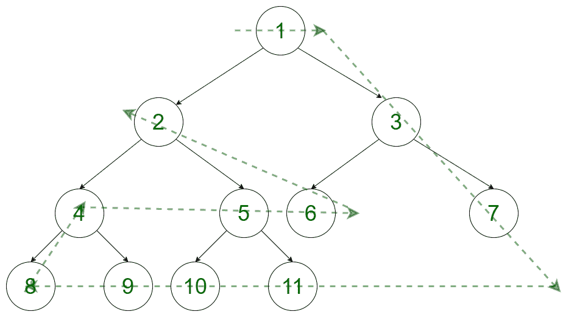

# 完全二叉树的横向遍历

> 原文:[https://www . geesforgeks . org/完全二叉树的横向遍历/](https://www.geeksforgeeks.org/sideways-traversal-of-a-complete-binary-tree/)

给定一个[完整二叉树](https://www.geeksforgeeks.org/binary-tree-set-3-types-of-binary-tree/)，任务是按照以下模式打印元素。让我们把这棵树想象成:


树的遍历方式如下:



上述树的输出为:

```
1 3 7 11 10 9 8 4 5 6 2
```

**方法:**想法是使用修改后的[广度优先搜索](https://www.geeksforgeeks.org/breadth-first-search-or-bfs-for-a-graph/)函数将每一级的所有节点存储在向量数组中。与此同时，树需要遍历的最大级别也存储在一个变量中。完成预计算任务后，按照以下步骤得到所需答案:

1.  创建一个向量**树[]** ，其中**树[i]** 将存储该树在 **i** 级别的所有节点。
2.  取一个整数变量 **k** 来记录正在遍历的级别号，取另一个整数变量**路径**来记录已经完成的循环数。还创建了一个**标志**变量来跟踪树被遍历的方向。
3.  现在，开始打印每个级别最右边的节点，直到达到**最大级别**。
4.  由于达到了最大水平，必须改变方向。在最后一层，从最右边到左边打印元素。**最大级别**变量的值必须递减。
5.  当树从下层遍历到上层时，将打印最右边的元素。因为在下一次迭代中， **maxlevel** 的值已经被改变，所以它确保在最后一级中已经访问过的节点不再被遍历。

以下是上述方法的实现:

## C++

```
// C++ program to print sideways
// traversal of complete binary tree

#include <bits/stdc++.h>
using namespace std;

const int sz = 1e5;
int maxLevel = 0;

// Adjacency list representation
// of the tree
vector<int> tree[sz + 1];

// Boolean array to mark all the
// vertices which are visited
bool vis[sz + 1];

// Integer array to store the level
// of each node
int level[sz + 1];

// Array of vector where ith index
// stores all the nodes at level i
vector<int> nodes[sz + 1];

// Utility function to create an
// edge between two vertices
void addEdge(int a, int b)
{

    // Add a to b's list
    tree[a].push_back(b);

    // Add b to a's list
    tree[b].push_back(a);
}

// Modified Breadth-First Function
void bfs(int node)
{

    // Create a queue of {child, parent}
    queue<pair<int, int> > qu;

    // Push root node in the front of
    // the queue and mark as visited
    qu.push({ node, 0 });
    nodes[0].push_back(node);
    vis[node] = true;
    level[1] = 0;

    while (!qu.empty()) {

        pair<int, int> p = qu.front();

        // Dequeue a vertex from queue
        qu.pop();
        vis[p.first] = true;

        // Get all adjacent vertices of the dequeued
        // vertex s. If any adjacent has not
        // been visited then enqueue it
        for (int child : tree[p.first]) {

            if (!vis[child]) {
                qu.push({ child, p.first });
                level[child] = level[p.first] + 1;
                maxLevel = max(maxLevel, level[child]);
                nodes[level[child]].push_back(child);
            }
        }
    }
}

// Utility Function to display the pattern
void display()
{
    // k represents the level no.
    // cycle represents how many
    // cycles has been completed
    int k = 0, path = 0;
    int condn = (maxLevel) / 2 + 1;
    bool flag = true;

    // While there are nodes left to traverse
    while (condn--) {

        if (flag) {

            // Traversing whole level from
            // left to right
            int j = nodes[k].size() - 1;
            for (j = 0; j < nodes[k].size() - path; j++)
                cout << nodes[k][j] << " ";

            // Moving to new level
            k++;

            // Traversing rightmost unvisited
            // element  in path path as we
            // move up to down
            while (k < maxLevel) {

                j = nodes[k].size() - 1;
                cout << nodes[k][j - path] << " ";
                k++;
            }

            j = nodes[k].size() - 1;
            if (k > path)
                for (j -= path; j >= 0; j--)
                    cout << nodes[k][j] << " ";

            // Setting value of new maximum
            // level upto which we have to traverse
            // next time
            maxLevel--;

            // Updating from which level to
            // start new path
            k--;
            path++;

            flag = !flag;
        }
        else {

            // Traversing each element of remaining
            // last level from left to right
            int j = nodes[k].size() - 1;
            for (j = 0; j < nodes[k].size() - path; j++)
                cout << nodes[k][j] << " ";

            // Decrementing value of Max level
            maxLevel--;

            k--;

            // Traversing rightmost unvisited
            // element  in path as we
            // move down to up
            while (k > path) {

                int j = nodes[k].size() - 1;
                cout << nodes[k][j - path] << " ";
                k--;
            }

            j = nodes[k].size() - 1;

            if (k == path)
                for (j -= path; j >= 0; j--)
                    cout << nodes[k][j] << " ";

            path++;

            // Updating the level number from which
            // a new cycle has to be started
            k++;
            flag = !flag;
        }
    }
}

// Driver code
int main()
{

    // Initialising  the above mentioned
    // complete binary tree
    for (int i = 1; i <= 5; i++) {

        // Adding edge to a binary tree
        addEdge(i, 2 * i);
        addEdge(i, 2 * i + 1);
    }

    // Calling modified bfs function
    bfs(1);

    display();

    return 0;
}
```

## Java 语言(一种计算机语言，尤用于创建网站)

```
// Java program to print sideways
// traversal of complete binary tree
import java.util.*;

class GFG
{

static class pair
{
    int first, second;
    public pair(int first, int second)
    {
        this.first = first;
        this.second = second;
    }
}
static int sz = (int) 1e5;
static int maxLevel = 0;

// Adjacency list representation
// of the tree
static Vector<Integer> []tree = new Vector[sz + 1];

// Boolean array to mark all the
// vertices which are visited
static boolean []vis = new boolean[sz + 1];

// Integer array to store the level
// of each node
static int []level = new int[sz + 1];

// Array of vector where ith index
// stores all the nodes at level i
static Vector<Integer> []nodes = new Vector[sz + 1];

// Utility function to create an
// edge between two vertices
static void addEdge(int a, int b)
{

    // Add a to b's list
    tree[a].add(b);

    // Add b to a's list
    tree[b].add(a);
}

// Modified Breadth-First Function
static void bfs(int node)
{

    // Create a queue of {child, parent}
    Queue<pair > qu = new LinkedList<>();

    // Push root node in the front of
    // the queue and mark as visited
    qu.add(new pair( node, 0 ));
    nodes[0].add(node);
    vis[node] = true;
    level[1] = 0;

    while (!qu.isEmpty()) {

        pair p = qu.peek();

        // Dequeue a vertex from queue
        qu.remove();
        vis[p.first] = true;

        // Get all adjacent vertices of the dequeued
        // vertex s. If any adjacent has not
        // been visited then enqueue it
        for (int child : tree[p.first]) {

            if (!vis[child]) {
                qu.add(new pair( child, p.first ));
                level[child] = level[p.first] + 1;
                maxLevel = Math.max(maxLevel, level[child]);
                nodes[level[child]].add(child);
            }
        }
    }
}

// Utility Function to display the pattern
static void display()
{
    // k represents the level no.
    // cycle represents how many
    // cycles has been completed
    int k = 0, path = 0;
    int condn = (maxLevel) / 2 + 1;
    boolean flag = true;

    // While there are nodes left to traverse
    while (condn-- > 0) {

        if (flag) {

            // Traversing whole level from
            // left to right
            int j = nodes[k].size() - 1;
            for (j = 0; j < nodes[k].size() - path; j++)
                System.out.print(nodes[k].get(j)+ " ");

            // Moving to new level
            k++;

            // Traversing rightmost unvisited
            // element in path path as we
            // move up to down
            while (k < maxLevel) {

                j = nodes[k].size() - 1;
                System.out.print(nodes[k].get(j - path)+ " ");
                k++;
            }

            j = nodes[k].size() - 1;
            if (k > path)
                for (j -= path; j >= 0; j--)
                    System.out.print(nodes[k].get(j)+ " ");

            // Setting value of new maximum
            // level upto which we have to traverse
            // next time
            maxLevel--;

            // Updating from which level to
            // start new path
            k--;
            path++;

            flag = !flag;
        }
        else {

            // Traversing each element of remaining
            // last level from left to right
            int j = nodes[k].size() - 1;
            for (j = 0; j < nodes[k].size() - path; j++)
                System.out.print(nodes[k].get(j)+ " ");

            // Decrementing value of Max level
            maxLevel--;

            k--;

            // Traversing rightmost unvisited
            // element in path as we
            // move down to up
            while (k > path) {

                int c = nodes[k].size() - 1;
                System.out.print(nodes[k].get(c - path)+ " ");
                k--;
            }

            j = nodes[k].size() - 1;

            if (k == path)
                for (j -= path; j >= 0; j--)
                    System.out.print(nodes[k].get(j)+ " ");

            path++;

            // Updating the level number from which
            // a new cycle has to be started
            k++;
            flag = !flag;
        }
    }
}

// Driver code
public static void main(String[] args)
{

    for (int i = 0; i < tree.length; i++) {
        tree[i] = new Vector<>();
        nodes[i] = new Vector<>();
    }

    // Initialising the above mentioned
    // complete binary tree
    for (int i = 1; i <= 5; i++) {

        // Adding edge to a binary tree
        addEdge(i, 2 * i);
        addEdge(i, 2 * i + 1);
    }

    // Calling modified bfs function
    bfs(1);

    display();
}
}

// This code is contributed by 29AjayKumar
```

## 蟒蛇 3

```
# Python3 program to prsideways
# traversal of complete binary tree
from collections import deque

sz = 10**5
maxLevel = 0

# Adjacency list representation
# of the tree
tree = [[] for i in range(sz + 1)]

# Boolean array to mark all the
# vertices which are visited
vis = [False]*(sz + 1)

# Integer array to store the level
# of each node
level = [0]*(sz + 1)

# Array of vector where ith index
# stores all the nodes at level i
nodes = [[] for i in range(sz + 1)]

# Utility function to create an
# edge between two vertices
def addEdge(a, b):

    # Add a to b's list
    tree[a].append(b)

    # Add b to a's list
    tree[b].append(a)

# Modified Breadth-First Function
def bfs(node):
    global maxLevel

    # Create a queue of {child, parent}
    qu = deque()

    # Push root node in the front of
    # the queue and mark as visited
    qu.append([node, 0])
    nodes[0].append(node)
    vis[node] = True
    level[1] = 0

    while (len(qu) > 0):

        p = qu.popleft()

        # Dequeue a vertex from queue
        vis[p[0]] = True

        # Get all adjacent vertices of the dequeued
        # vertex s. If any adjacent has not
        # been visited then enqueue it
        for child in tree[p[0]]:

            if (vis[child] == False):
                qu.append([child, p[0]])
                level[child] = level[p[0]] + 1
                maxLevel = max(maxLevel, level[child])
                nodes[level[child]].append(child)

# Utility Function to display the pattern
def display():
    global maxLevel

    # k represents the level no.
    # cycle represents how many
    # cycles has been completed
    k = 0
    path = 0
    condn = (maxLevel) // 2 + 1
    flag = True

    # While there are nodes left to traverse
    while (condn):

        if (flag):

            # Traversing whole level from
            # left to right
            j = len(nodes[k]) - 1
            for j in range(len(nodes[k])- path):
                print(nodes[k][j],end=" ")

            # Moving to new level
            k += 1

            # Traversing rightmost unvisited
            # element in path path as we
            # move up to down
            while (k < maxLevel):

                j = len(nodes[k]) - 1
                print(nodes[k][j - path], end=" ")
                k += 1

            j = len(nodes[k]) - 1
            if (k > path):
                while j >= 0:
                    j -= path
                    print(nodes[k][j], end=" ")
                    j -= 1

            # Setting value of new maximum
            # level upto which we have to traverse
            # next time
            maxLevel -= 1

            # Updating from which level to
            # start new path
            k -= 1
            path += 1

            flag = not flag
        else:

            # Traversing each element of remaining
            # last level from left to right
            j = len(nodes[k]) - 1
            for j in range(len(nodes[k]) - path):
                print(nodes[k][j], end=" ")

            # Decrementing value of Max level
            maxLevel -= 1

            k -= 1

            # Traversing rightmost unvisited
            # element in path as we
            # move down to up
            while (k > path):

                j = len(nodes[k]) - 1
                print(nodes[k][j - path], end=" ")
                k -= 1

            j = len(nodes[k]) - 1

            if (k == path):
                while j >= 0:
                    j -= path
                    print(nodes[k][j],end=" ")
                    j -= 1

            path += 1

            # Updating the level number from which
            # a new cycle has to be started
            k += 1
            flag = not flag
        condn -= 1

# Driver code
if __name__ == '__main__':

    # Initialising the above mentioned
    # complete binary tree
    for i in range(1,6):

        # Adding edge to a binary tree
        addEdge(i, 2 * i)
        addEdge(i, 2 * i + 1)

    # Calling modified bfs function
    bfs(1)

    display()

# This code is contributed by mohit kumar 29
```

## C#

```
// C# program to print sideways
// traversal of complete binary tree
using System;
using System.Collections.Generic;

class GFG
{

class pair
{
    public int first, second;
    public pair(int first, int second)
    {
        this.first = first;
        this.second = second;
    }
}
static int sz = (int) 1e5;
static int maxLevel = 0;

// Adjacency list representation
// of the tree
static List<int> []tree = new List<int>[sz + 1];

// Boolean array to mark all the
// vertices which are visited
static bool []vis = new bool[sz + 1];

// int array to store the level
// of each node
static int []level = new int[sz + 1];

// Array of vector where ith index
// stores all the nodes at level i
static List<int> []nodes = new List<int>[sz + 1];

// Utility function to create an
// edge between two vertices
static void addEdge(int a, int b)
{

    // Add a to b's list
    tree[a].Add(b);

    // Add b to a's list
    tree[b].Add(a);
}

// Modified Breadth-First Function
static void bfs(int node)
{

    // Create a queue of {child, parent}
    Queue<pair> qu = new Queue<pair>();

    // Push root node in the front of
    // the queue and mark as visited
    qu.Enqueue(new pair( node, 0 ));
    nodes[0].Add(node);
    vis[node] = true;
    level[1] = 0;

    while (qu.Count != 0) {

        pair p = qu.Peek();

        // Dequeue a vertex from queue
        qu.Dequeue();
        vis[p.first] = true;

        // Get all adjacent vertices of the dequeued
        // vertex s. If any adjacent has not
        // been visited then enqueue it
        foreach (int child in tree[p.first]) {

            if (!vis[child]) {
                qu.Enqueue(new pair( child, p.first ));
                level[child] = level[p.first] + 1;
                maxLevel = Math.Max(maxLevel, level[child]);
                nodes[level[child]].Add(child);
            }
        }
    }
}

// Utility Function to display the pattern
static void display()
{
    // k represents the level no.
    // cycle represents how many
    // cycles has been completed
    int k = 0, path = 0;
    int condn = (maxLevel) / 2 + 1;
    bool flag = true;

    // While there are nodes left to traverse
    while (condn-- > 0) {

        if (flag) {

            // Traversing whole level from
            // left to right
            int j = nodes[k].Count - 1;
            for (j = 0; j < nodes[k].Count - path; j++)
                Console.Write(nodes[k][j]+ " ");

            // Moving to new level
            k++;

            // Traversing rightmost unvisited
            // element in path path as we
            // move up to down
            while (k < maxLevel) {

                j = nodes[k].Count - 1;
                Console.Write(nodes[k][j - path]+ " ");
                k++;
            }

            j = nodes[k].Count - 1;
            if (k > path)
                for (j -= path; j >= 0; j--)
                    Console.Write(nodes[k][j]+ " ");

            // Setting value of new maximum
            // level upto which we have to traverse
            // next time
            maxLevel--;

            // Updating from which level to
            // start new path
            k--;
            path++;

            flag = !flag;
        }
        else {

            // Traversing each element of remaining
            // last level from left to right
            int j = nodes[k].Count - 1;
            for (j = 0; j < nodes[k].Count - path; j++)
                Console.Write(nodes[k][j]+ " ");

            // Decrementing value of Max level
            maxLevel--;

            k--;

            // Traversing rightmost unvisited
            // element in path as we
            // move down to up
            while (k > path) {

                int c = nodes[k].Count - 1;
                Console.Write(nodes[k]+ " ");
                k--;
            }

            j = nodes[k].Count - 1;

            if (k == path)
                for (j -= path; j >= 0; j--)
                    Console.Write(nodes[k][j]+ " ");

            path++;

            // Updating the level number from which
            // a new cycle has to be started
            k++;
            flag = !flag;
        }
    }
}

// Driver code
public static void Main(String[] args)
{

    for (int i = 0; i < tree.Length; i++) {
        tree[i] = new List<int>();
        nodes[i] = new List<int>();
    }

    // Initialising the above mentioned
    // complete binary tree
    for (int i = 1; i <= 5; i++) {

        // Adding edge to a binary tree
        addEdge(i, 2 * i);
        addEdge(i, 2 * i + 1);
    }

    // Calling modified bfs function
    bfs(1);

    display();
}
}

// This code contributed by PrinciRaj1992
```

## java 描述语言

```
<script>
// Javascript program to print sideways
// traversal of complete binary tree

let sz =  1e5;
let maxLevel = 0;

// Adjacency list representation
// of the tree
let tree = new Array(sz + 1);

// Boolean array to mark all the
// vertices which are visited
let vis = new Array(sz + 1);

// Integer array to store the level
// of each node
let level = new Array(sz + 1);

// Array of vector where ith index
// stores all the nodes at level i
let nodes = new Array(sz + 1);

// Utility function to create an
// edge between two vertices
function addEdge(a,b)
{
    // Add a to b's list
    tree[a].push(b);

    // Add b to a's list
    tree[b].push(a);
}

// Modified Breadth-First Function
function bfs(node)
{
    // Create a queue of {child, parent}
    let qu = [];

    // Push root node in the front of
    // the queue and mark as visited
    qu.push([ node, 0 ]);
    nodes[0].push(node);
    vis[node] = true;
    level[1] = 0;

    while (qu.length!=0) {

        let p = qu[0];

        // Dequeue a vertex from queue
        qu.shift();
        vis[p[0]] = true;

        // Get all adjacent vertices of the dequeued
        // vertex s. If any adjacent has not
        // been visited then enqueue it
        for (let child=0;child<tree[p[0]].length;child++) {

            if (!vis[tree[p[0]][child]]) {
                qu.push([ tree[p[0]][child], p[0] ]);
                level[tree[p[0]][child]] = level[p[0]] + 1;
                maxLevel = Math.max(maxLevel, level[tree[p[0]][child]]);
                nodes[level[tree[p[0]][child]]].push(tree[p[0]][child]);
            }
        }
    }
}

// Utility Function to display the pattern
function display()
{
    // k represents the level no.
    // cycle represents how many
    // cycles has been completed
    let k = 0, path = 0;
    let condn = Math.floor((maxLevel) / 2) + 1;
    let flag = true;

    // While there are nodes left to traverse
    while (condn-- > 0) {

        if (flag) {

            // Traversing whole level from
            // left to right
            let j = nodes[k].length - 1;
            for (j = 0; j < nodes[k].length - path; j++)
                document.write(nodes[k][j]+ " ");

            // Moving to new level
            k++;

            // Traversing rightmost unvisited
            // element in path path as we
            // move up to down
            while (k < maxLevel) {

                j = nodes[k].length - 1;
                document.write(nodes[k][j - path]+ " ");
                k++;
            }

            j = nodes[k].length - 1;
            if (k > path)
                for (j -= path; j >= 0; j--)
                    document.write(nodes[k][j]+ " ");

            // Setting value of new maximum
            // level upto which we have to traverse
            // next time
            maxLevel--;

            // Updating from which level to
            // start new path
            k--;
            path++;

            flag = !flag;
        }
        else {

            // Traversing each element of remaining
            // last level from left to right
            let j = nodes[k].length - 1;
            for (j = 0; j < nodes[k].length - path; j++)
                document.write(nodes[k][j]+ " ");

            // Decrementing value of Max level
            maxLevel--;

            k--;

            // Traversing rightmost unvisited
            // element in path as we
            // move down to up
            while (k > path) {

                let c = nodes[k].length - 1;
                document.write(nodes[k]+ " ");
                k--;
            }

            j = nodes[k].length - 1;

            if (k == path)
                for (j -= path; j >= 0; j--)
                    document.write(nodes[k][j]+ " ");

            path++;

            // Updating the level number from which
            // a new cycle has to be started
            k++;
            flag = !flag;
        }
    }
}

// Driver code
for (let i = 0; i < tree.length; i++) {
        tree[i] = [];
        nodes[i] = [];
        vis[i]=false;
        level[i]=0;
    }

    // Initialising the above mentioned
    // complete binary tree
    for (let i = 1; i <= 5; i++) {

        // Adding edge to a binary tree
        addEdge(i, 2 * i);
        addEdge(i, 2 * i + 1);
    }

    // Calling modified bfs function
    bfs(1);

    display();

// This code is contributed by unknown2108
</script>
```

**Output:** 

```
1 3 7 11 10 9 8 4 5 6 2
```