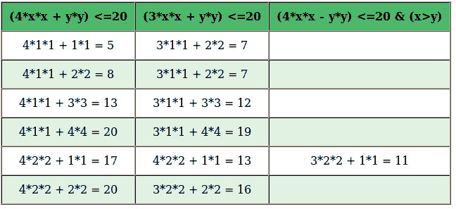

# 阿特金筛

> 原文:[https://www.geeksforgeeks.org/sieve-of-atkin/](https://www.geeksforgeeks.org/sieve-of-atkin/)

给定一个限制，打印所有小于或等于给定限制的素数。

**示例:**

```
Input:  limit = 10
Output: 2, 3, 5, 7

Input:  limit = 20
Output: 2, 3, 5, 7, 11, 13, 17, 19 
```

我们已经讨论了上述任务的算法。
[厄拉多塞之筛](https://www.geeksforgeeks.org/sieve-of-eratosthenes/)
[巽他拉姆之筛](https://www.geeksforgeeks.org/sieve-sundaram-print-primes-smaller-n/)
阿特金之筛是一种现代算法，用于寻找所有素数直到指定整数。与古代厄拉多塞的[筛标出素数倍数相比，它做了一些前期工作，然后标出素数的平方倍数，这就是为什么它与的**复杂度相比具有更好的理论渐近复杂度**](https://www.geeksforgeeks.org/sieve-of-eratosthenes/)

**算法:**

1.  创建一个结果列表，用 2、3 和 5 填充。
2.  为每个正整数创建一个包含条目的筛选列表；该列表中的所有条目最初都应标记为非质数。
3.  对于筛选列表中的每个条目编号 n，取模 60 余数 r:
    1.  如果 r 是 1、13、17、29、37、41、49 或 53，则将每个可能解的条目翻转为 4x <sup>2</sup> + y <sup>2</sup> = n。
    2.  如果 r 是 7、19、31 或 43，则将每个可能解的条目翻转到 3x <sup>2</sup> + y <sup>2</sup> = n。
    3.  如果 r 是 11、23、47 或 59，则将每个可能解的条目翻转到 3x<sup>2</sup>–y<sup>2</sup>= n 当 x > y。
    4.  如果 r 是别的东西，完全忽略它…
4.  从筛选列表中最低的数字开始。
5.  取筛列表中的下一个数字，仍然标记为质数。
6.  将数字包括在结果列表中。
7.  将数字平方，并将该平方的所有倍数标记为非质数。请注意，可以乘以 2、3 或 5 的倍数不需要标记，因为在素数的最终枚举中将忽略这些倍数。
8.  重复步骤 4 到 7。

下面是上述算法的实现。

## C++

```
// C++ program for implementation of Sieve of Atkin
#include <bits/stdc++.h>
using namespace std;

int SieveOfAtkin(int limit)
{
    // 2 and 3 are known to be prime
    if (limit > 2)
        cout << 2 << " ";
    if (limit > 3)
        cout << 3 << " ";

    // Initialise the sieve array with false values
    bool sieve[limit];
    for (int i = 0; i < limit; i++)
        sieve[i] = false;

    /* Mark sieve[n] is true if one
       of the following is true:
    a) n = (4*x*x)+(y*y) has odd number of
       solutions, i.e., there exist
       odd number of distinct pairs (x, y)
       that satisfy the equation and
        n % 12 = 1 or n % 12 = 5.
    b) n = (3*x*x)+(y*y) has odd number of
       solutions and n % 12 = 7
    c) n = (3*x*x)-(y*y) has odd number of
       solutions, x > y and n % 12 = 11 */
    for (int x = 1; x * x < limit; x++) {
        for (int y = 1; y * y < limit; y++) {

            // Main part of Sieve of Atkin
            int n = (4 * x * x) + (y * y);
            if (n <= limit && (n % 12 == 1 || n % 12 == 5))
                sieve[n] ^= true;

            n = (3 * x * x) + (y * y);
            if (n <= limit && n % 12 == 7)
                sieve[n] ^= true;

            n = (3 * x * x) - (y * y);
            if (x > y && n <= limit && n % 12 == 11)
                sieve[n] ^= true;
        }
    }

    // Mark all multiples of squares as non-prime
    for (int r = 5; r * r < limit; r++) {
        if (sieve[r]) {
            for (int i = r * r; i < limit; i += r * r)
                sieve[i] = false;
        }
    }

    // Print primes using sieve[]
    for (int a = 5; a < limit; a++)
        if (sieve[a])
            cout << a << " ";
}

// Driver program
int main(void)
{
    int limit = 20;
    SieveOfAtkin(limit);
    return 0;
}
```

## Java 语言(一种计算机语言，尤用于创建网站)

```
// Java program for implementation of Sieve
// of Atkin
class GFG {

    static int SieveOfAtkin(int limit)
    {
        // 2 and 3 are known to be prime
        if (limit > 2)
            System.out.print(2 + " ");

        if (limit > 3)
            System.out.print(3 + " ");

        // Initialise the sieve array with
        // false values
        boolean sieve[] = new boolean[limit];

        for (int i = 0; i < limit; i++)
            sieve[i] = false;

        /* Mark sieve[n] is true if one of the
        following is true:
        a) n = (4*x*x)+(y*y) has odd number
           of solutions, i.e., there exist
           odd number of distinct pairs
           (x, y) that satisfy the equation
           and    n % 12 = 1 or n % 12 = 5.
        b) n = (3*x*x)+(y*y) has odd number
           of solutions and n % 12 = 7
        c) n = (3*x*x)-(y*y) has odd number
           of solutions, x > y and n % 12 = 11 */
        for (int x = 1; x * x < limit; x++) {
            for (int y = 1; y * y < limit; y++) {

                // Main part of Sieve of Atkin
                int n = (4 * x * x) + (y * y);
                if (n <= limit && (n % 12 == 1 || n % 12 == 5))

                    sieve[n] ^= true;

                n = (3 * x * x) + (y * y);
                if (n <= limit && n % 12 == 7)
                    sieve[n] ^= true;

                n = (3 * x * x) - (y * y);
                if (x > y && n <= limit && n % 12 == 11)
                    sieve[n] ^= true;
            }
        }

        // Mark all multiples of squares as
        // non-prime
        for (int r = 5; r * r < limit; r++) {
            if (sieve[r]) {
                for (int i = r * r; i < limit;
                     i += r * r)
                    sieve[i] = false;
            }
        }

        // Print primes using sieve[]
        for (int a = 5; a < limit; a++)
            if (sieve[a])
                System.out.print(a + " ");
        return 0;
    }

    // Driver code
    public static void main(String[] args)
    {
        int limit = 20;
        SieveOfAtkin(limit);
    }
}

// This code is contributed by Anant Agarwal.
```

## 蟒蛇 3

```
# Python 3 program for
# implementation of
# Sieve of Atkin

def SieveOfAtkin(limit):
    # 2 and 3 are known
    # to be prime
    if limit > 2:
        print(2, end=" ")
    if limit > 3:
        print(3, end=" ")

    # Initialise the sieve
    # array with False values
    sieve = [False] * limit
    for i in range(0, limit):
        sieve[i] = False

    '''Mark sieve[n] is True if
    one of the following is True:
    a) n = (4*x*x)+(y*y) has odd
    number of solutions, i.e.,
    there exist odd number of
    distinct pairs (x, y) that
    satisfy the equation and
    n % 12 = 1 or n % 12 = 5.
    b) n = (3*x*x)+(y*y) has
    odd number of solutions
    and n % 12 = 7
    c) n = (3*x*x)-(y*y) has
    odd number of solutions,
    x > y and n % 12 = 11 '''
    x = 1
    while x * x < limit:
        y = 1
        while y * y < limit:

            # Main part of
            # Sieve of Atkin
            n = (4 * x * x) + (y * y)
            if (n <= limit and (n % 12 == 1 or
                                n % 12 == 5)):
                sieve[n] ^= True

            n = (3 * x * x) + (y * y)
            if n <= limit and n % 12 == 7:
                sieve[n] ^= True

            n = (3 * x * x) - (y * y)
            if (x > y and n <= limit and
                    n % 12 == 11):
                sieve[n] ^= True
            y += 1
        x += 1

    # Mark all multiples of
    # squares as non-prime
    r = 5
    while r * r < limit:
        if sieve[r]:
            for i in range(r * r, limit, r * r):
                sieve[i] = False

        r += 1

        # Print primes
    # using sieve[]
    for a in range(5, limit):
        if sieve[a]:
            print(a, end=" ")

# Driver Code
limit = 20
SieveOfAtkin(limit)

# This code is contributed
# by Smitha
```

## C#

```
// C# program for implementation of Sieve
// of Atkin
using System;

class GFG {

    static int SieveOfAtkin(int limit)
    {
        // 2 and 3 are known to be prime
        if (limit > 2)
            Console.Write(2 + " ");

        if (limit > 3)
            Console.Write(3 + " ");

        // Initialise the sieve array with
        // false values
        bool[] sieve = new bool[limit];

        for (int i = 0; i < limit; i++)
            sieve[i] = false;

        /* Mark sieve[n] is true if one of the
        following is true:
        a) n = (4*x*x)+(y*y) has odd number
           of solutions, i.e., there exist
           odd number of distinct pairs
           (x, y) that satisfy the equation
           and    n % 12 = 1 or n % 12 = 5.
        b) n = (3*x*x)+(y*y) has odd number
           of solutions and n % 12 = 7
        c) n = (3*x*x)-(y*y) has odd number
           of solutions, x > y and n % 12 = 11 */
        for (int x = 1; x * x < limit; x++) {
            for (int y = 1; y * y < limit; y++) {

                // Main part of Sieve of Atkin
                int n = (4 * x * x) + (y * y);
                if (n <= limit && (n % 12 == 1 || n % 12 == 5))

                    sieve[n] ^= true;

                n = (3 * x * x) + (y * y);
                if (n <= limit && n % 12 == 7)
                    sieve[n] ^= true;

                n = (3 * x * x) - (y * y);
                if (x > y && n <= limit && n % 12 == 11)
                    sieve[n] ^= true;
            }
        }

        // Mark all multiples of squares as
        // non-prime
        for (int r = 5; r * r < limit; r++) {
            if (sieve[r]) {
                for (int i = r * r; i < limit;
                     i += r * r)
                    sieve[i] = false;
            }
        }

        // Print primes using sieve[]
        for (int a = 5; a < limit; a++)
            if (sieve[a])
                Console.Write(a + " ");
        return 0;
    }

    // Driver code
    public static void Main()
    {
        int limit = 20;
        SieveOfAtkin(limit);
    }
}

// This code is contributed by nitin mittal
```

## 服务器端编程语言（Professional Hypertext Preprocessor 的缩写）

```
<?php
// PHP program for implementation
// of Sieve of Atkin

function SieveOfAtkin($limit)
{

    // 2 and 3 are known
    // to be prime
    if ($limit > 2)
        echo 2 , " ";
    if ($limit > 3)
        echo 3 , " ";

    // Initialise the sieve array
    // with false values
    $sieve[$limit] = 0;
    for ($i = 0; $i < $limit; $i++)
        $sieve[$i] = false;

    /* Mark sieve[n] is true if one
       of the following is true:
    a) n = (4*x*x)+(y*y) has odd number of
       solutions, i.e., there exist
       odd number of distinct pairs (x, y)
       that satisfy the equation and
       n % 12 = 1 or n % 12 = 5.
    b) n = (3*x*x)+(y*y) has odd number of
       solutions and n % 12 = 7
    c) n = (3*x*x)-(y*y) has odd number of
       solutions, x > y and n % 12 = 11 */
    for ($x = 1; $x * $x < $limit; $x++)
    {
        for ($y = 1; $y * $y < $limit; $y++)
        {

            // Main part of Sieve of Atkin
            $n = (4 * $x * $x) + ($y * $y);
            if ($n <= $limit && ($n % 12 == 1 ||
                                   $n % 12 == 5))
                $sieve[$n] ^= true;

            $n = (3 * $x * $x) + ($y * $y);
            if ($n <= $limit && $n % 12 == 7)
                $sieve[$n] = true;

            $n = (3 * $x * $x) - ($y * $y);
            if ($x > $y && $n <= $limit &&
                            $n % 12 == 11)
                $sieve[$n] ^= true;
        }
    }

    // Mark all multiples of
    // squares as non-prime
    for ($r = 5; $r * $r < $limit; $r++) {
        if ($sieve[$r]) {
            for ($i = $r * $r; $i < $limit;
                             $i += $r * $r)
                $sieve[$i] = false;
        }
    }

    // Print primes
    // using sieve[]
    for ($a = 5; $a < $limit; $a++)
        if ($sieve[$a])
            echo $a , " ";
}

    // Driver Code
    $limit = 20;
    SieveOfAtkin($limit);

// This code is contributed by nitin mittal.
?>
```

## java 描述语言

```
<script>
// Javascript program for implementation
// of Sieve of Atkin

function SieveOfAtkin(limit)
{

    // 2 and 3 are known
    // to be prime
    if (limit > 2)
        document.write(2 + " ");
    if (limit > 3)
        document.write(3 + " ");

    // Initialise the sieve array
    // with false values
    let sieve = new Array()
    sieve[limit] = 0;
    for (let i = 0; i < limit; i++)
        sieve[i] = false;

    /* Mark sieve[n] is true if one
    of the following is true:
    a) n = (4*x*x)+(y*y) has odd number of
    solutions, i.e., there exist
    odd number of distinct pairs (x, y)
    that satisfy the equation and
    n % 12 = 1 or n % 12 = 5.
    b) n = (3*x*x)+(y*y) has odd number of
    solutions and n % 12 = 7
    c) n = (3*x*x)-(y*y) has odd number of
    solutions, x > y and n % 12 = 11 */
    for (let x = 1; x * x < limit; x++)
    {
        for (let y = 1; y * y < limit; y++)
        {

            // Main part of Sieve of Atkin
            let n = (4 * x * x) + (y * y);
            if (n <= limit && (n % 12 == 1 ||
                                n % 12 == 5))
                sieve[n] ^= true;

            n = (3 * x * x) + (y * y);
            if (n <= limit && n % 12 == 7)
                sieve[n] = true;

            n = (3 * x * x) - (y * y);
            if (x > y && n <= limit &&
                            n % 12 == 11)
                sieve[n] ^= true;
        }
    }

    // Mark all multiples of
    // squares as non-prime
    for (let r = 5; r * r < limit; r++) {
        if (sieve[r]) {
            for (i = r * r; i < limit;
                            i += r * r)
                sieve[i] = false;
        }
    }

    // Print primes
    // using sieve[]
    for (let a = 5; a < limit; a++)
        if (sieve[a])
            document.write(a , " ");
}

    // Driver Code
    let limit = 20;
    SieveOfAtkin(limit);

// This code is contributed by nitin gfgking

</script>
```

**输出:**

```
2 3 5 7 11 13 17 19 
```

**工作原理:**

1.  该算法将 2、3 和 5 视为特例，只需将它们添加到素数集合中即可。
2.  像《厄拉多塞的筛子》一样，我们从一系列我们想调查的数字开始。假设我们想找到素数< =100，那么我们为[5，100]列一个列表。如(1)所述，2、3 和 5 是特例，4 不是素数。
3.  该算法是根据模 60 余数…
4.  所有具有模 60 余数 1、13、17、29、37、41、49 或 53 的数都具有模 12 余数 1 或 5。当且仅当 4×2+y2=n 的解的个数为奇数且该个数为无平方时，这些数为素数。无平方整数是不能被 1 以外的任何完美平方整除的整数。
5.  所有具有模 60 余数 7、19、31 或 43 的数都具有模 6 余数 1。当且仅当 3x <sup>2</sup> + y <sup>2</sup> = n 的解的数量为奇数且该数量为无平方时，这些数为素数。
6.  所有具有模 60 余数 11、23、47 或 59 的数都具有模 12 余数 11。当且仅当 3x<sup>2</sup>–y<sup>2</sup>= n 的解的数量为奇数且该数量为无平方时，这些数为素数。

**让我们看看它是如何生成 20 个素数的:**

```
1    2    3    4    5    6    7    8    9    10
11  12   13    14   15   16   17  18   19    20
```

**第 0 步:**
开始时所有数字的状态都为假。特殊的数字是 2、3 和 5，它们被认为是质数。

**步骤 1:**
生成条件值。



**第二步:**
根据情况翻转状态。
将测试在 x，y 循环中生成的表中 n 的上述值是否满足取模条件。
**第 1 列:**如果(Column 1 值)% 12 == 1 或 5
则翻转该数字的筛选状态。
我们用 12 代替 60 进行 mod。这是因为如果我们取 mod 60，那么我们必须考虑多达 1、13、17、29、37、41、49 或 53 个 r，对于所有这些 r，mod 12 是 1 或 5。(这样做只是为了减小表达式大小)
**第 2 列:**如果(Column 2 值)% 12 == 7
则翻转该数字的筛选状态。
**第 3 列:**如果(第 3 列值)% 12 == 11
则翻转该数字的筛选状态。

**第三步:**
检查是否有平方空闲条件:如果我们列表中的任何一个数是任何数的平方，那么去掉它。

**第四步:**
创建一个状态为真的素数数组。
即 2 3 5 7 11 13 17 19

**第五步:**
在屏幕上打印输出。

本文由 **Anuj Rathore** 供稿。如果你发现任何不正确的地方，或者你想分享更多关于上面讨论的话题的信息，请写评论。