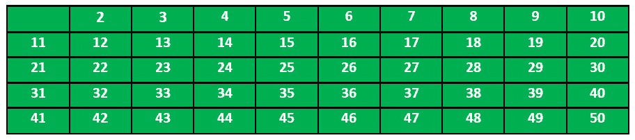
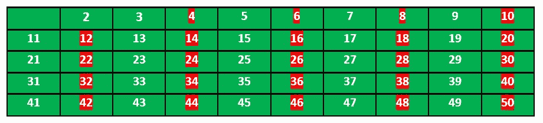
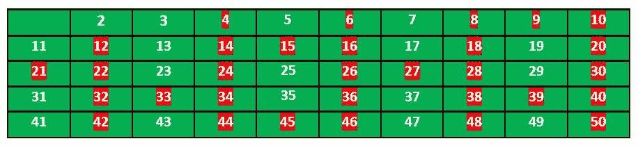
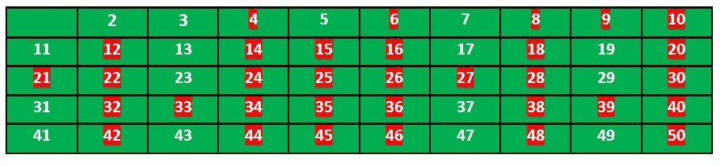

# 厄拉多塞筛

> 原文:[https://www.geeksforgeeks.org/sieve-of-eratosthenes/](https://www.geeksforgeeks.org/sieve-of-eratosthenes/)

给定一个数 n，打印所有小于或等于 n 的素数，也给定 n 是一个小数。

**示例:**

> **输入:**n = 10
> T3】输出: 2 3 5 7
> 
> **输入:**n = 20
> T3】输出: 2 3 5 7 11 13 17 19

当 n 小于 1000 万左右时，厄拉多塞筛是寻找所有小于 n 的素数的最有效方法之一。

下面是用埃拉托斯特尼方法求所有小于等于给定整数 n 的素数的算法:
当算法终止时，列表中所有没有标记的数都是素数。

**举例说明:**

让我们举一个 n = 50 的例子。所以我们需要打印所有小于或等于 50 的质数。

我们创建一个从 2 到 50 的所有数字的列表。



根据算法，我们将标记所有可被 2 整除且大于或等于其平方的数。



现在我们转到下一个未标记的数字 3，标记所有 3 的倍数大于或等于 3 的平方的数字。



我们移动到下一个未标记的数字 5，标记所有 5 的倍数，并且大于或等于它的平方。



我们继续这个过程，最终的表格如下所示:


所以质数是没有标记的:2，3，5，7，11，13，17，19，23，29，31，37，41，43，47。

感谢 [**克里山·库马尔**](https://www.linkedin.com/in/krishankumarsingh05) 提供以上解释。

**实施:**

下面是上述算法的实现。在下面的实现中，大小为 n 的布尔数组 arr[]用于标记素数的倍数。

## C#

```
// C++ program to print all primes
// smaller than or equal to
// n using Sieve of Eratosthenes
#include <bits/stdc++.h>
using namespace std;

void SieveOfEratosthenes(int n)
{
    // Create a boolean array
    // "prime[0..n]" and initialize
    // all entries it as true.
    // A value in prime[i] will
    // finally be false if i is
    // Not a prime, else true.
    bool prime[n + 1];
    memset(prime, true, sizeof(prime));

    for (int p = 2; p * p <= n; p++)
    {
        // If prime[p] is not changed,
        // then it is a prime
        if (prime[p] == true)
        {
            // Update all multiples
            // of p greater than or
            // equal to the square of it
            // numbers which are multiple
            // of p and are less than p^2
            // are already been marked.
            for (int i = p * p; i <= n; i += p)
                prime[i] = false;
        }
    }

    // Print all prime numbers
    for (int p = 2; p <= n; p++)
        if (prime[p])
            cout << p << " ";
}

// Driver Code
int main()
{
    int n = 30;
    cout << "Following are the prime numbers smaller "
         << " than or equal to " << n << endl;
    SieveOfEratosthenes(n);
    return 0;
}
```

## Java 语言(一种计算机语言，尤用于创建网站)

```
// Java program to print all
// primes smaller than or equal to
// n using Sieve of Eratosthenes

class SieveOfEratosthenes {
    void sieveOfEratosthenes(int n)
    {
        // Create a boolean array
        // "prime[0..n]" and
        // initialize all entries
        // it as true. A value in
        // prime[i] will finally be
        // false if i is Not a
        // prime, else true.
        boolean prime[] = new boolean[n + 1];
        for (int i = 0; i <= n; i++)
            prime[i] = true;

        for (int p = 2; p * p <= n; p++)
        {
            // If prime[p] is not changed, then it is a
            // prime
            if (prime[p] == true)
            {
                // Update all multiples of p
                for (int i = p * p; i <= n; i += p)
                    prime[i] = false;
            }
        }

        // Print all prime numbers
        for (int i = 2; i <= n; i++)
        {
            if (prime[i] == true)
                System.out.print(i + " ");
        }
    }

    // Driver Code
    public static void main(String args[])
    {
        int n = 30;
        System.out.print(
            "Following are the prime numbers ");
        System.out.println("smaller than or equal to " + n);
        SieveOfEratosthenes g = new SieveOfEratosthenes();
        g.sieveOfEratosthenes(n);
    }
}

// This code has been contributed by Amit Khandelwal.
```

## 蟒蛇 3

```
# Python program to print all
# primes smaller than or equal to
# n using Sieve of Eratosthenes

def SieveOfEratosthenes(n):

    # Create a boolean array
    # "prime[0..n]" and initialize
    #  all entries it as true.
    # A value in prime[i] will
    # finally be false if i is
    # Not a prime, else true.
    prime = [True for i in range(n+1)]
    p = 2
    while (p * p <= n):

        # If prime[p] is not
        # changed, then it is a prime
        if (prime[p] == True):

            # Update all multiples of p
            for i in range(p * p, n+1, p):
                prime[i] = False
        p += 1

    # Print all prime numbers
    for p in range(2, n+1):
        if prime[p]:
            print(p)

# Driver code
if __name__ == '__main__':
    n = 20
    print("Following are the prime numbers smaller"),
    print("than or equal to", n)
    SieveOfEratosthenes(n)
```

## C#

```
// C# program to print all primes
// smaller than or equal to n
// using Sieve of Eratosthenes
using System;

namespace prime {
public class GFG {

    public static void SieveOfEratosthenes(int n)
    {

        // Create a boolean array
        // "prime[0..n]" and
        // initialize all entries
        // it as true. A value in
        // prime[i] will finally be
        // false if i is Not a
        // prime, else true.

        bool[] prime = new bool[n + 1];

        for (int i = 0; i <= n; i++)
            prime[i] = true;

        for (int p = 2; p * p <= n; p++)
        {
            // If prime[p] is not changed,
            // then it is a prime
            if (prime[p] == true)
            {
                // Update all multiples of p
                for (int i = p * p; i <= n; i += p)
                    prime[i] = false;
            }
        }

        // Print all prime numbers
        for (int i = 2; i <= n; i++)
        {
            if (prime[i] == true)
                Console.Write(i + " ");
        }
    }

    // Driver Code
    public static void Main()
    {
        int n = 30;
        Console.WriteLine(
            "Following are the prime numbers");
        Console.WriteLine("smaller than or equal to " + n);
        SieveOfEratosthenes(n);
    }
}
}

// This code is contributed by Sam007.
```

## 服务器端编程语言（Professional Hypertext Preprocessor 的缩写）

```
<?php
// php program to print all primes smaller
// than or equal to n using Sieve of
// Eratosthenes

function SieveOfEratosthenes($n)
{
    // Create a boolean array "prime[0..n]"
    // and initialize all entries it as true.
    // A value in prime[i] will finally be
    // false if i is Not a prime, else true.
    $prime = array_fill(0, $n+1, true);

    for ($p = 2; $p*$p <= $n; $p++)
    {

        // If prime[p] is not changed,
        // then it is a prime
        if ($prime[$p] == true)
        {

            // Update all multiples of p
            for ($i = $p*$p; $i <= $n; $i += $p)
                $prime[$i] = false;
        }
    }

    // Print all prime numbers
    for ($p = 2; $p <= $n; $p++)
        if ($prime[$p])
            echo $p." ";
}

// Driver Code
    $n = 30;
    echo "Following are the prime numbers "
     ."smaller than or equal to " .$n."\n" ;
    SieveOfEratosthenes($n);

// This code is contributed by mits
?>
```

## java 描述语言

```
<script>

// javascript program to print all
// primes smaller than or equal to
// n using Sieve of Eratosthenes

function sieveOfEratosthenes(n)
{
    // Create a boolean array
    // "prime[0..n]" and
    // initialize all entries
    // it as true. A value in
    // prime[i] will finally be
    // false if i is Not a
    // prime, else true.
    prime = Array.from({length: n+1}, (_, i) => true);

    for (p = 2; p * p <= n; p++)
    {
        // If prime[p] is not changed, then it is a
        // prime
        if (prime[p] == true)
        {
            // Update all multiples of p
            for (i = p * p; i <= n; i += p)
                prime[i] = false;
        }
    }

    // Print all prime numbers
    for (i = 2; i <= n; i++)
    {
        if (prime[i] == true)
            document.write(i + " ");
    }
}

// Driver Code
var n = 30;
document.write(
    "Following are the prime numbers ");
document.write("smaller than or equal to " + n+"<br>");
sieveOfEratosthenes(n);

// This code is contributed by 29AjayKumar

</script>
```

***时间复杂度:** O(n*log(log(n)))*

***辅助空间:** O(n)*

## C++

```
// the following implementation
// stores only halves of odd numbers
// the algorithm is a faster by some constant factors

#include <bitset>
#include <iostream>
using namespace std;

bitset<500001> Primes;
void SieveOfEratosthenes(int n)
{
    Primes[0] = 1;
    for (int i = 3; i <= n; i += 2) {
        if (Primes[i / 2] == 0) {
            for (int j = 3 * i; j <= n; j += 2 * i)
                Primes[j / 2] = 1;
        }
    }
}

int main()
{
    int n = 100;
    SieveOfEratosthenes(n);
    for (int i = 1; i <= n; i++) {
        if (i == 2)
            cout << i << ' ';
        else if (i % 2 == 1 && Primes[i / 2] == 0)
            cout << i << ' ';
    }
    return 0;
}
```

你可能还想看看:

*   [厄拉多塞筛的时间复杂度如何是 n*log(log(n))？](https://www.geeksforgeeks.org/how-is-the-time-complexity-of-sieve-of-eratosthenes-is-nloglogn/)
*   [分段筛](https://www.geeksforgeeks.org/segmented-sieve/)。
*   [时间复杂度为 0(n)的厄拉多塞筛](https://www.geeksforgeeks.org/sieve-eratosthenes-0n-time-complexity/)