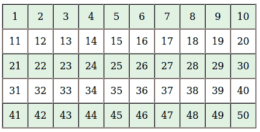
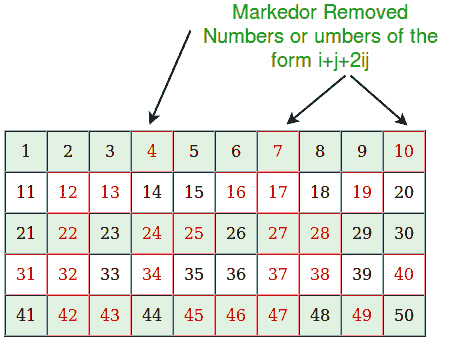

# 筛出孙达拉姆，打印所有小于 n 的素数

> 原文:[https://www . geesforgeks . org/sieve-sundaram-print-primes-small-n/](https://www.geeksforgeeks.org/sieve-sundaram-print-primes-smaller-n/)

给定一个数字 n，打印所有小于或等于 n 的素数
**示例:**

```
Input:  n = 10
Output: 2, 3, 5, 7

Input:  n = 20
Output: 2, 3, 5, 7, 11, 13, 17, 19
```

我们已经针对上述任务讨论了厄拉多塞算法的[筛。
下图是 Sundaram 算法的筛子。](https://www.geeksforgeeks.org/sieve-of-eratosthenes/) 

```
printPrimes(n)
[Prints all prime numbers smaller than n]

1) In general Sieve of Sundaram, produces primes smaller than 
   (2*x + 2) for a number given number x. Since we want primes 
   smaller than n, we reduce n-1 to half. We call it nNew.
       nNew = (n-1)/2;
   For example, if n = 102, then nNew = 50.
                if n = 103, then nNew = 51

2) Create an array marked[n] that is going 
   to be used to separate numbers of the form i+j+2ij from 
   others where  1 <= i <= j

3) Initialize all entries of marked[] as false.

4) // Mark all numbers of the form i + j + 2ij as true
   // where 1 <= i <= j
   Loop for i=1 to nNew
        a) j = i; 
        b) Loop While (i + j + 2*i*j)  2, then print 2 as first prime.

6) Remaining primes are of the form 2i + 1 where i is
   index of NOT marked numbers. So print 2i + 1 for all i
   such that marked[i] is false. 
```

以下是上述算法的实现:

## C++

```
// C++ program to print primes smaller than n using
// Sieve of Sundaram.
#include <bits/stdc++.h>
using namespace std;

// Prints all prime numbers smaller
int SieveOfSundaram(int n)
{
    // In general Sieve of Sundaram, produces primes smaller
    // than (2*x + 2) for a number given number x.
    // Since we want primes smaller than n, we reduce n to half
    int nNew = (n-1)/2;

    // This array is used to separate numbers of the form i+j+2ij
    // from others where  1 <= i <= j
    bool marked[nNew + 1];

    // Initialize all elements as not marked
    memset(marked, false, sizeof(marked));

    // Main logic of Sundaram.  Mark all numbers of the
    // form i + j + 2ij as true where 1 <= i <= j
    for (int i=1; i<=nNew; i++)
        for (int j=i; (i + j + 2*i*j) <= nNew; j++)
            marked[i + j + 2*i*j] = true;

    // Since 2 is a prime number
    if (n > 2)
        cout << 2 << " ";

    // Print other primes. Remaining primes are of the form
    // 2*i + 1 such that marked[i] is false.
    for (int i=1; i<=nNew; i++)
        if (marked[i] == false)
            cout << 2*i + 1 << " ";
}

// Driver program to test above
int main(void)
{
    int n = 20;
    SieveOfSundaram(n);
    return 0;
}
```

## Java 语言(一种计算机语言，尤用于创建网站)

```
// Java program to print primes smaller
// than n using Sieve of Sundaram.
import java.util.Arrays;
class GFG {

// Prints all prime numbers smaller
static int SieveOfSundaram(int n) {

    // In general Sieve of Sundaram, produces
    // primes smaller than (2*x + 2) for a number
    // given number x. Since we want primes
    // smaller than n, we reduce n to half
    int nNew = (n - 1) / 2;

    // This array is used to separate numbers of the
    // form i+j+2ij from others where 1 <= i <= j
    boolean marked[] = new boolean[nNew + 1];

    // Initialize all elements as not marked
    Arrays.fill(marked, false);

    // Main logic of Sundaram. Mark all numbers of the
    // form i + j + 2ij as true where 1 <= i <= j
    for (int i = 1; i <= nNew; i++)
    for (int j = i; (i + j + 2 * i * j) <= nNew; j++)
        marked[i + j + 2 * i * j] = true;

    // Since 2 is a prime number
    if (n > 2)
    System.out.print(2 + " ");

    // Print other primes. Remaining primes are of
    // the form 2*i + 1 such that marked[i] is false.
    for (int i = 1; i <= nNew; i++)
    if (marked[i] == false)
        System.out.print(2 * i + 1 + " ");
    return -1;
}

// Driver code
public static void main(String[] args) {
    int n = 20;
    SieveOfSundaram(n);
}
}
// This code is contributed by Anant Agarwal.
```

## 蟒蛇 3

```
# Python3 program to print
# primes smaller than n using
# Sieve of Sundaram.

# Prints all prime numbers smaller
def SieveOfSundaram(n):

    # In general Sieve of Sundaram,
    # produces primes smaller
    # than (2*x + 2) for a number
    # given number x. Since we want
    # primes smaller than n, we
    # reduce n to half
    nNew = int((n - 1) / 2);

    # This array is used to separate
    # numbers of the form i+j+2ij
    # from others where 1 <= i <= j
    # Initialize all elements as not marked
    marked = [0] * (nNew + 1);

    # Main logic of Sundaram. Mark all
    # numbers of the form i + j + 2ij
    # as true where 1 <= i <= j
    for i in range(1, nNew + 1):
        j = i;
        while((i + j + 2 * i * j) <= nNew):
            marked[i + j + 2 * i * j] = 1;
            j += 1;

    # Since 2 is a prime number
    if (n > 2):
        print(2, end = " ");

    # Print other primes. Remaining
    # primes are of the form 2*i + 1
    # such that marked[i] is false.
    for i in range(1, nNew + 1):
        if (marked[i] == 0):
            print((2 * i + 1), end = " ");

# Driver Code
n = 20;
SieveOfSundaram(n);

# This code is contributed by mits
```

## C#

```
// C# program to print primes smaller
// than n using Sieve of Sundaram.
using System;

class GFG {

// Prints all prime numbers smaller
static int SieveOfSundaram(int n)
{

    // In general Sieve of Sundaram, produces
    // primes smaller than (2*x + 2) for a number
    // given number x. Since we want primes
    // smaller than n, we reduce n to half
    int nNew = (n - 1) / 2;

    // This array is used to separate
    // numbers of the form i+j+2ij from
    // others where 1 <= i <= j
    bool []marked = new bool[nNew + 1];

    // Initialize all elements as not marked
    for (int i=0;i<nNew+1;i++)
    marked[i]=false;

    // Main logic of Sundaram.
    // Mark all numbers of the
    // form i + j + 2ij as true
    // where 1 <= i <= j
    for (int i = 1; i <= nNew; i++)
    for (int j = i; (i + j + 2 * i * j) <= nNew; j++)
        marked[i + j + 2 * i * j] = true;

    // Since 2 is a prime number
    if (n > 2)
    Console.Write(2 + " ");

    // Print other primes.
    // Remaining primes are of
    // the form 2*i + 1 such
    // that marked[i] is false.
    for (int i = 1; i <= nNew; i++)
    if (marked[i] == false)
        Console.Write(2 * i + 1 + " ");
    return -1;
}

// Driver code
public static void Main()
{
    int n = 20;
    SieveOfSundaram(n);
}
}

// This code is contributed by nitin mittal
```

## 服务器端编程语言（Professional Hypertext Preprocessor 的缩写）

```
<?php
// PHP program to print primes smaller
// than n using Sieve of Sundaram.

// Prints all prime numbers smaller
function SieveOfSundaram($n)
{
    // In general Sieve of Sundaram,
    // produces primes smaller than
    // (2*x + 2) for a number given
    // number x. Since we want primes
    // smaller than n, we reduce n to half
    $nNew = ($n - 1) / 2;

    // This array is used to separate
    // numbers of the form i+j+2ij
    // from others where 1 <= i <= j

    // Initialize all elements as not marked
    $marked = array_fill(0, ($nNew + 1), false);

    // Main logic of Sundaram. Mark all
    // numbers of the form i + j + 2ij
    // as true where 1 <= i <= j
    for ($i = 1; $i <= $nNew; $i++)
        for ($j = $i;
            ($i + $j + 2 * $i * $j) <= $nNew; $j++)
            $marked[$i + $j + 2 * $i * $j] = true;

    // Since 2 is a prime number
    if ($n > 2)
        echo "2 ";

    // Print other primes. Remaining
    // primes are of the form 2*i + 1
    // such that marked[i] is false.
    for ($i = 1; $i <= $nNew; $i++)
        if ($marked[$i] == false)
            echo (2 * $i + 1) . " ";
}

// Driver Code
$n = 20;
SieveOfSundaram($n);

// This code is contributed by mits
?>
```

## java 描述语言

```
<script>

// JavaScript program to print primes smaller
// than n using Sieve of Sundaram.

// Prints all prime numbers smaller
function SieveOfSundaram(n)
{

    // In general Sieve of Sundaram, produces
    // primes smaller than (2*x + 2) for a number
    // given number x. Since we want primes
    // smaller than n, we reduce n to half
    let nNew = (n - 1) / 2;

    // This array is used to separate
    // numbers of the form i+j+2ij from
    // others where 1 <= i <= j
    let marked = [];

    // Initialize all elements as not marked
    for (let i = 0; i < nNew + 1; i++)
    marked[i] = false;

    // Main logic of Sundaram.
    // Mark all numbers of the
    // form i + j + 2ij as true
    // where 1 <= i <= j
    for (let i = 1; i <= nNew; i++)
    for (let j = i; (i + j + 2 * i * j) <= nNew; j++)
        marked[i + j + 2 * i * j] = true;

    // Since 2 is a prime number
    if (n > 2)
    document.write(2 + " ");

    // Print other primes.
    // Remaining primes are of
    // the form 2*i + 1 such
    // that marked[i] is false.
    for (let i = 1; i <= nNew; i++)
    if (marked[i] == false)
        document.write(2 * i + 1 + " ");
    return -1;
}

// Driver program

        let n = 20;
    SieveOfSundaram(n);

    // This code is contributed by susmitakundugoaldanga.

</script>
```

```
2 3 5 7 11 13 17 19
```

**插图:**
下图中所有红色条目均为标注条目。对于每个剩余的(或黑色的)条目 x，数字 2x+1 是质数。
让我们看看它如何对 n=102 起作用，我们将对(n-1)/2 进行筛选，如下所示:



标记所有可以表示为 i + j + 2ij 的数字



现在对于列表中所有未标记的数字，找到 2x+1，那将是质数:
像 2 * 1+1 = 3
2 * 3+1 = 7
2 * 5+1 = 11
2 * 6+1 = 13
2 * 8+1 = 17 等等..
**这是怎么工作的？**
当我们产生最终输出时，我们产生 2x+1 形式的所有整数(即它们是奇数)，除了 2，它是单独处理的。

```
Let q be an integer of the form 2x + 1.

q is excluded if and only if x is of the 
form i + j + 2ij. That means, 

q = 2(i + j + 2ij) + 1
  = (2i + 1)(2j + 1)

So, an odd integer is excluded from the final list if 
and only if it has a factorization of the form (2i + 1)(2j + 1)
which is to say, if it has a non-trivial odd factor. 

Source: Wiki
```

**参考:**
https://en.wikipedia.org/wiki/Sieve_of_Sundaram
本文由 **Anuj Rathore** 供稿。如果发现有不正确的地方，请写评论，或者想分享更多关于以上讨论话题的信息