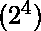
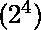
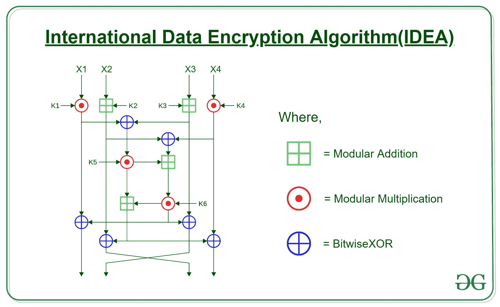

# 简化国际数据加密算法(IDEA)

> 原文:[https://www . geesforgeks . org/simplified-international-data-encryption-algorithm/](https://www.geeksforgeeks.org/simplified-international-data-encryption-algorithm-idea/)

在[密码学中](https://www.geeksforgeeks.org/cryptography-and-its-types/)、[分组密码](https://www.geeksforgeeks.org/block-cipher-modes-of-operation/)在许多密码算法的设计中非常重要，并且被广泛用于加密大块的大量数据。通过组块，它意味着密码在加密过程中采用固定大小的明文，并使用固定长度的密钥生成固定大小的密文。算法的强度由其密钥长度决定。

简化的**国际数据加密算法(IDEA)** 是一个**对称密钥块**密码，它是:

*   使用固定长度的 16 位明文**和**
*   分别以 4 位的 4 个块**加密它们**
*   产生 **16 位密文**。
*   使用的密钥长度为 **32 位**。
*   密钥也被分成 8 个块，每个块 4 位。

该算法包括一系列 4 个相同的完整回合和 1 个半回合。每一轮都包括一系列 14 个步骤，包括如下操作:

*   按位异或
*   加法模
*   乘法模 +1

在 4 个完整回合后，最终的“半回合”仅由先前在完整回合中使用的 14 个步骤中的前 4 个组成。要执行这些轮次，必须将每个二进制表示法转换为其等效的十进制表示法，执行该操作，所得结果应转换回该特定步骤最终结果的二进制表示法。

**键表:**8 个子键中 4 位的 6 个子键在每一个完整回合中使用，而 4 个子键在半回合中使用。所以，4.5 回合需要 28 个子项。给定的键“K”直接给出前 8 个子键。通过在每组 8 个键之间将主键向左旋转 6 位，创建了另外的 8 个子键组，这意味着键的每轮旋转少于一次(3 次旋转)。



<figure class="table">

|   | K1 | 峰。亦称 DAPSANG | K3 | K4 | K5 | K6 |
| --- | --- | --- | --- | --- | --- | --- |
| 第一轮 | One thousand one hundred and one | One thousand one hundred | 0110 | One thousand one hundred and eleven | 0011 | One thousand one hundred and eleven |
| 第二轮 | 0101 | 1001 ***** | 0001 | One thousand and eleven | One thousand one hundred | One thousand one hundred and eleven |
| 第三轮 | One thousand one hundred and one | 0110 | 0111 | 0111 ***** | One thousand one hundred and eleven | 0011 |
| 第四轮 | One thousand one hundred and eleven | 0101 | One thousand and one | One thousand one hundred and one | One thousand one hundred | 0110 ***** |
| 第 4.5 轮 | One thousand one hundred and eleven | One thousand one hundred and one | 0110 | 0111 |   |   |

*表示位移位

14 个步骤中使用的符号:

<figure class="table">

| 标志 | 操作 |
| --- | --- |
| * | 乘法模 +1 |
| + | 加法模 |
| ^ | 按位异或 |

16 位明文可以表示为 **X1 || X2 || X3 || X4** ，每个大小为 4 位。32 位密钥被分成 8 个子密钥，表示为 K1 || K2 || K3 || K4 || K5 || K6 || K7 || K8，同样每个大小为 4 位。每轮 14 步使用三个代数运算——加法模(2^4)、乘法模(2^4)+1)和按位异或。涉及的步骤如下:

1.  X1 * K1
2.  X2 + K2
3.  X3 + K3
4.  X4 * K4
5.  ^第三步
6.  ^第四步
7.  K5
8.  步骤 6 +步骤 7
9.  步骤 8 * K6
10.  步骤 7 +步骤 9
11.  ^第九步
12.  ^第九步
13.  ^第 10 步
14.  ^第 10 步

下一轮的输入是步骤 11 ||步骤 13 ||步骤 12 ||步骤 14，变成 X1 || X2 || X3 || X4。12 和 13 之间的这种交换发生在每个完整回合之后，除了最后一个完整回合(第 4 回合)，其中最后半回合的输入是步骤 11 ||步骤 12 ||步骤 13 ||步骤 14。

最后一个完整回合后，半回合如下:

1.  X1 * K1
2.  X2 + K2
3.  X3 + K3
4.  X4 * K4

最终输出是通过连接这些块获得的。

**例:**

```
Key: 1101 1100 0110 1111 0011 1111 0101 1001 
Plaintext: 1001 1100 1010 1100
Ciphertext: 1011 1011 0100 1011
```

**说明:**
说明仅针对第 1 个完整回合(其余可类似执行)和最后半回合。

*   **第一轮:**
    *   从明文:**X1–1001，X2–1100，X3–1010，X4–1100**

    *   从上表可知:**K1–1101，K2–1100，K3–0110，K4–1111，K5–0011，K6–1111**

```
(1001(9) * 1101(13))(mod 17) = 1111(15)
(1100(12) + 1100(12))(mod 16) = 1000(8)
(1010(10) + 0110(6))(mod 16) = 0000(0)
(1100(12) * 1111(15))(mod 17) = 1010(10)
(1111(15) ^ 0000(0)) = 1111(15)
(1000(8) ^ 1010(10)) = 0010(2)
(1111(15) * 0011(3))(mod 17) = 1011(11)
(0010(2) + 1011(11))(mod 16) = 1101(13)
(1101(13) * 1111(15))(mod 17) = 1000(8)
(1011(11) + 1000(8))(mod 16) = 0011(3)
(1000(8) ^ 1111(15)) = 0111(7)
(1000(8) ^ 0000(0)) = 1000(8)
(0011(3) ^ 1000(8)) = 1011(11)
(0011(3) ^ 1010(10)) = 1001(9)
```

*   **第 1 轮输出** : 0111 1011 1000 1001 *(第 12 步和第 13 步结果互换)*
*   **第二轮:**
    *   来自第 1 轮输出:**X1–0111，X2–1011，X3–1000，X4–1001**

    *   从上表可知:**K1–0101，K2–1001，K3–0001，K4–1011，K5–1100，K6–1111**

    *   **第 2 轮输出** : 0110 0110 1110 1100 *(第 12 步和第 13 步结果互换)*
*   **第三轮:**
    *   来自第 2 轮输出:**X1–0110、X2–0110、X3–1110、X4–1100**

    *   从上表可知:**K1–1101，K2–0110，K3–0111，K4–0111，K5–1111，K6–0011**

    *   **第 3 轮输出** : 0100 1110 1011 0010 *(第 12 步和第 13 步结果互换)*
*   **第 4 轮:**
    *   来自第 3 轮输出:**X1–0100，X2–1110，X3–1011，X4–0010**T2】
    *   从上表可知:**K1–1111，K2–0101，K3–1001，K4–1101，K5–1100，K6–0110**

    *   **第 4 轮输出** : 0011 1110 1110 0100 *(第 12 步和第 13 步结果互换)*
*   **第 4.5 回合:**
    *   来自第 4 轮输出:**X1–0011，X2–1110，X3–1110，X4–0100**T2】
    *   从上表可知:**K1–1111，K2–1101，K3–0110，K4–0111**

    *   **第 4.5 轮输出** : 1011 1011 0100 1011 *(第 2 步和第 3 步结果为**不**互换)*

```
(0011(3) * 1111(15))(mod 17) = 1011(11)
(1110(14) + 1101(13))(mod 16) = 1011(11)
(1110(14) + 0110(6))(mod 16) = 0100(4)
(0100(4) * 0111(7))(mod 17) = 1011(11) 
```

*   **最终密文**为 **1011 1011 0100 1011**

> **<u>注意:除了最后一轮变换外，每一轮都发生一次交换，输入到下一轮</u>**

</figure>

</figure>