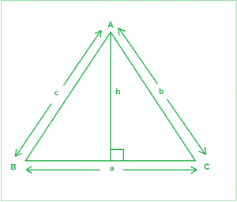

# 正弦规则及其推导、示例和实现

> 原文:[https://www . geesforgeks . org/sine-rule-with-derivation-example-and-implementation/](https://www.geeksforgeeks.org/sine-rule-with-derivation-example-and-implementation/)

给定角度(以度为单位) **A** 、 **C** ，以及侧面 **c** ，对应下图，任务是找到剩下的两个侧面 **a** 和 **b** 。



**示例:**

> **输入:** A = 45，C = 35，c = 23
> **输出:**
> 28.35
> 39.49
> **说明:**
> a 为 28.35，b 为 39.49
> 
> **输入:** A = 45，C = 45，c = 10
> **输出:**
> 10
> 14.14

**方法:**思路是用[正弦法则](https://en.wikipedia.org/wiki/Law_of_sines)。它指出任何三角形的边都与相对的角的正弦成正比。**甲/辛(甲)=乙/辛(乙)=丙/辛(丙)**。推导过程如下:

> 从上图可以明显看出:
> 
> 从 **A** 在【公元前】T0 上画了一条长度为 h 的垂线。根据一般三角法则:
> 
> **sinb = h/c──(1)**
> 
> **自= h/b──(2)**
> 
> 从上面两个方程，我们得到:
> 
> c x sinb = b x 自以来
> 
> 或**【b/sinb = c/自】——**
> 
> 同样，如果从 **B** 到 **AC** 画一条垂线，我们可以得到:
> 
> **a/SinA = c/SiNC—--(4)**
> 
> 从方程 **(3)** 和 **(4)** 中，我们得到:
> 
> **a/Sina = b/sinb = c/既然**

按照以下步骤解决问题:

*   将角度 **A** 和 **C** 从[度改为弧度](https://www.geeksforgeeks.org/degrees-and-radians-in-python/)，以便在内置功能中使用。
*   利用三角形的角度之和等于 180 度的观测值计算角度 **B** 。
*   使用正弦法则计算边 **a** 和 **b** 。

下面是上述方法的实现:

## C++14

```
// C++ program for the above approach
#include <bits/stdc++.h>
using namespace std;

// Function to calculate remaining two sides
void findSides(double A, double C, double c)
{
    // Calculate angle B
    double B = 180 - (A + C);

    // Convert angles to their respective radians for
    // using trigonometric functions
    A = A * (3.14159 / 180);
    C = C * (3.14159 / 180);
    B = B * (3.14159 / 180);

    // Sine rule
    double a = (c / sin(C)) * sin(A);
    double b = (c / sin(C)) * sin(B);

    // Precision of 2 decimal spaces
    cout << fixed << setprecision(2);

    // Print the answer
    cout << a << endl;
    cout << b << endl;
}

// Driver Code
int main()
{
    // Input
    double A = 45.0;
    double C = 35.0;
    double c = 23;

    // Function Call
    findSides(A, C, c);
    return 0;
}
```

## Java 语言(一种计算机语言，尤用于创建网站)

```
// Java program for the above approach
class GFG{

// Function to calculate remaining two sides
static void findSides(double A, double C,
                      double c)
{

    // Calculate angle B
    double B = 180 - (A + C);

    // Convert angles to their respective
    // radians for using trigonometric functions
    A = A * (3.14159 / 180);
    C = C * (3.14159 / 180);
    B = B * (3.14159 / 180);

    // Sine rule
    double a = (c / Math.sin(C)) * Math.sin(A);
    double b = (c / Math.sin(C)) * Math.sin(B);

    // Print the answer
    System.out.println(String.format("%.2f", a));
    System.out.println(String.format("%.2f", b));
}

// Driver code
public static void main(String[] args)
{

    // Input
    double A = 45.0;
    double C = 35.0;
    double c = 23;

    // Function Call
    findSides(A, C, c);
}
}

// This code is contributed by abhinavjain194
```

## 蟒蛇 3

```
# Python3 program for the above approach
import math

# Function to calculate remaining two sides
def findSides(A, C, c):

    # Calculate angle B
    B = 180 - (A + C)

    # Convert angles to their respective radians
    # for using trigonometric functions
    A = A * (3.14159 / 180)
    C = C * (3.14159 / 180)
    B = B * (3.14159 / 180)

    # Sine rule
    a = (c / math.sin(C)) * math.sin(A)
    b = (c / math.sin(C)) * math.sin(B)

    # Precision of 2 decimal spaces

    # Print the answer
    print("{0:.2f}".format(a))
    print("{0:.2f}".format(b))

# Driver Code

# Input
A = 45.0
C = 35.0
c = 23

# Function Call
findSides(A, C, c)

# This code is contributed by target_2
```

## C#

```
// C# program for the above approach
using System;
class GFG{

// Function to calculate remaining two sides
static void findSides(double A, double C,
                      double c)
{

    // Calculate angle B
    double B = 180 - (A + C);

    // Convert angles to their respective
    // radians for using trigonometric functions
    A = A * (3.14159 / 180);
    C = C * (3.14159 / 180);
    B = B * (3.14159 / 180);

    // Sine rule
    double a = (c / Math.Sin(C)) * Math.Sin(A);
    double b = (c / Math.Sin(C)) * Math.Sin(B);

    // Print the answer
    Console.WriteLine("{0:F2}",a);
    Console.WriteLine("{0:F2}",b);
}

// Driver code
public static void Main(String[] args)
{

    // Input
    double A = 45.0;
    double C = 35.0;
    double c = 23;

    // Function Call
    findSides(A, C, c);
}
}

// This code is contributed by shivanisinghss2110
```

## java 描述语言

```
<script>
       // JavaScript program for the above approach

       // Function to calculate remaining two sides
       function findSides(A, C, c)
       {

           // Calculate angle B
           let B = 180 - (A + C);

           // Convert angles to their respective radians for
           // using trigonometric functions
           A = A * (3.14159 / 180);
           C = C * (3.14159 / 180);
           B = B * (3.14159 / 180);

           // Sine rule
           let a = (c / Math.sin(C)) * Math.sin(A);
           let b = (c / Math.sin(C)) * Math.sin(B);

           // Precision of 2 decimal spaces

           // Print the answer
           document.write(a.toPrecision(4) + "<br>");
           document.write(b.toPrecision(4) + "<br>");
       }

       // Driver Code

       // Input
       let A = 45.0;
       let C = 35.0;
       let c = 23;

       // Function Call
       findSides(A, C, c);

 // This code is contributed by Potta Lokesh
   </script>
```

**Output**

```
28.35
39.49
```

***时间复杂度:**O(1)*
T5**辅助空间:** O(1)