# 奇异值分解

> 原文:[https://www . geesforgeks . org/奇异值分解-svd/](https://www.geeksforgeeks.org/singular-value-decomposition-svd/)

矩阵的奇异值分解是将该矩阵分解成三个矩阵。它有一些有趣的代数性质，传达了关于线性变换的重要几何和理论见解。它在数据科学中也有一些重要的应用。在本文中，我将尝试解释奇异值分解背后的数学直觉及其几何意义。

#### **SVD 背后的数学**

mxn 矩阵 A 的奇异值分解由下式给出:

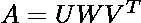

其中:

*   u:*mxn的正交特征向量的*矩阵。
*   V <sup>T</sup> :包含 A^{T}A.正交特征向量的 *nxn* 矩阵的转置
*   w:一个 *nxn* 奇异值的对角矩阵，它是特征值的平方根。

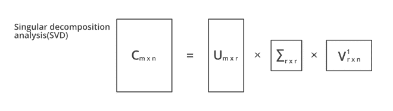

#### 例子

*   求矩阵 A 的奇异值分解= 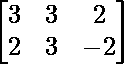
*   为了计算奇异值分解，首先，我们需要通过寻找 AA^{T}.的特征值来计算奇异值

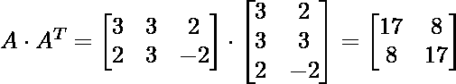

*   上述矩阵的特征方程为:

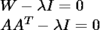

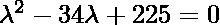

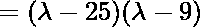

所以我们的奇异值是: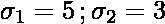

*   现在我们找到正确的奇异向量，即 A <sup>T</sup> A 的特征向量的正交集合。A <sup>T</sup> A 的特征值是 25，9 和 0，并且由于 A <sup>T</sup> A 是对称的，我们知道特征向量将是正交的。

对于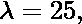

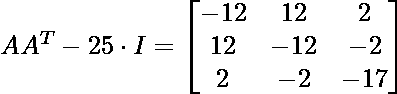

其可以被行缩减为:

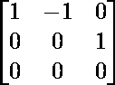

方向上的单位向量是:

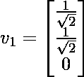

类似地，对于λ= 9，特征向量为:

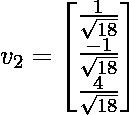

对于第三个特征向量，我们可以利用它垂直于 v1 和 v2 的性质，使得:

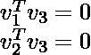

求解上述方程以生成第三特征向量

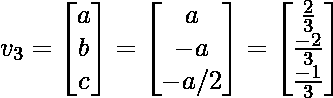

现在，我们使用公式 u_i = \frac{1}{\sigma} A v_i 计算 U，这给出了 U = 。因此，我们最终的奇异值分解方程变为:


### 应用程序

*   **伪逆的计算:**伪逆或 Moore-Penrose 逆是可能不可逆的矩阵逆(如低秩矩阵)的推广。如果矩阵是可逆的，那么它的逆将等于伪逆，但是伪逆对于不可逆的矩阵是存在的。用 A <sup>+</sup> 表示。

假设，我们需要计算矩阵 M 的伪逆:

那么，M 的奇异值分解可以表示为:

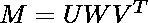

将两边乘以 M^{-1}.

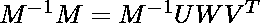

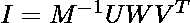

将两侧乘以 V:

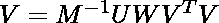

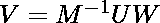

乘以 W^{-1}.由于 W 是奇异矩阵，W 的逆就是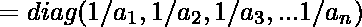

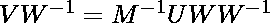

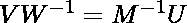

乘以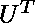

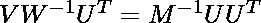

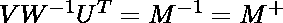

上面的等式给出了伪逆。

*   **求解一组齐次线性方程(Mx =b):** 如果 b=0，计算 SVD，取与奇异值(在 *W* 中)相关联的 V <sup>T</sup> 的任意一列等于 0。

如果、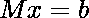

乘以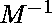

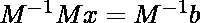

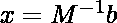

从伪逆，我们知道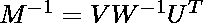

因此，

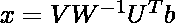

*   **等级、范围和零空间:**
    *   矩阵 M 的秩可以由奇异值分解通过非零奇异值的个数来计算。
    *   矩阵 M 的范围是对应非零奇异值的 U 的左奇异向量。
    *   矩阵 M 的零空间是与零奇异值对应的 V 的右奇异向量。


*   **曲线拟合问题:**奇异值分解可以用来最小化最小二乘误差。它使用伪逆来近似它。
*   除了上述应用，奇异值分解和伪逆也可以用于数字信号处理和图像处理

### 履行

*   在这段代码中，我们将尝试使用 Numpy 和 Scipy 计算奇异值分解。我们将计算奇异值分解，并执行伪逆。最后，我们可以应用奇异值分解对图像进行压缩

## 蟒蛇 3

```
# Imports

import numpy as np
from scipy.linalg import svd

"""
Singular Value Decomposition
"""
# define a matrix
X = np.array([[3, 3, 2], [2,3,-2]])
print(X)
# perform SVD
U, singular, V_transpose = svd(X)
# print different components
print("U: ",U)
print("Singular array",s)
print("V^{T}",V_transpose)

"""
Calculate Pseudo inverse
"""
# Onverse of singular matrix is just the reciprocal of each element
singular_inv = 1.0 / singular
# create m x n matrix of zeroes and put singular values in it
s_inv = np.zeros(A.shape)
s_inv[0][0]= singular_inv[0]
s_inv[1][1] =singular_inv[1]
# calculate pseudoinverse
M = np.dot(np.dot(V_transpose.T,s_inv.T),U.T)
print(M)

"""
SVD on image compression
"""

import numpy as np
import matplotlib.pyplot as plt
from skimage import data
from skimage.color import rgb2gray

cat = data.chelsea()
plt.imshow(cat)
# convert to grayscale
gray_cat = rgb2gray(cat)

# calculate the SVD and plot the image
U,S,V_T = svd(gray_cat, full_matrices=False)
S = np.diag(S)
fig, ax = plt.subplots(5, 2, figsize=(8, 20))

curr_fig=0
for r in [5, 10, 70, 100, 200]:
  cat_approx =U[:, :r] @  S[0:r, :r] @ V_T[:r, :]
  ax[curr_fig][0].imshow(256-cat_approx)
  ax[curr_fig][0].set_title("k = "+str(r))
  ax[curr_fig,0].axis('off')
  ax[curr_fig][1].set_title("Original Image")
  ax[curr_fig][1].imshow(gray_cat)
  ax[curr_fig,1].axis('off')
  curr_fig +=1
plt.show()
```

**输出:**

```
[[ 3  3  2]
 [ 2  3 -2]]
---------------------------
U:  [[-0.7815437 -0.6238505]
 [-0.6238505  0.7815437]]
---------------------------
Singular array [5.54801894 2.86696457]
---------------------------
V^{T} [[-0.64749817 -0.7599438  -0.05684667]
 [-0.10759258  0.16501062 -0.9804057 ]
 [-0.75443354  0.62869461  0.18860838]]
--------------------------
# Inverse 
array([[ 0.11462451,  0.04347826],
       [ 0.07114625,  0.13043478],
       [ 0.22134387, -0.26086957]])
---------------------------
```

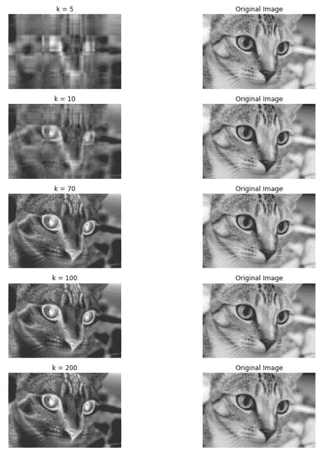

原始与奇异值分解 k 图像

## 参考文献:

*   [奇异值分解示例](https://www.d.umn.edu/~mhampton/m4326svd_example.pdf)