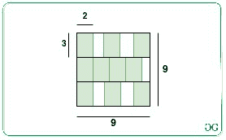
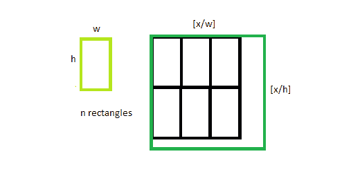

# 包含给定尺寸的 N 个非重叠矩形的最小正方形的尺寸

> 原文:[https://www . geeksforgeeks . org/包含给定尺寸的 n 个不重叠矩形的最小平方尺寸/](https://www.geeksforgeeks.org/size-of-smallest-square-that-contains-n-non-overlapping-rectangles-of-given-dimensions/)

给定两个正整数 **W** 和 **H** 和 **N** 个尺寸为 **W*H** 的矩形，任务是找到所需正方形的最小尺寸，以便所有 **N** 个矩形可以不重叠地打包。

**示例:**

> **输入:** N = 10，W = 2，H = 3
> **输出:** 9
> **说明:**
> 正方形的最小尺寸是 9 个单位来包装给定的 10 个尺寸为 2*3 的矩形，如下图所示:
> 
> 
> 
> **输入:** N = 1，W = 3，H = 3
> T3】输出: 3

**方法:**给定的问题基于以下观察:

*   可以看出，正方形内矩形的最佳间距之一由下式给出:

[](https://media.geeksforgeeks.org/wp-content/uploads/20210301113033/gfg22.png)

*   带边正方形 **X** 的尺寸 **W*H、**的最大矩形数由 **⌊X/W⌋⋅⌊X/H⌋** 给出。
*   上述函数是单调递增的。因此，想法是使用[二分搜索法](https://www.geeksforgeeks.org/binary-search/)来寻找满足给定条件的正方形的最小边。

按照以下步骤解决问题:

*   初始化两个变量，说**低**为 **1** ，说**高**为 **W*H*N** 。
*   迭代直到 **i** 小于 **j** ，并执行以下步骤:
    *   求**中间**的值为 **(i + j)/2** 。
    *   现在，如果**(中/W)*(中/H)** 的值最多为**N**，那么将**高**的值更新为**中**。
    *   否则，将**低**的值更新为**(中+ 1)** 。
*   完成以上步骤后，打印**高值**作为结果值。

下面是上述方法的实现:

## C++

```
// CPP program for the above approach
#include<bits/stdc++.h>
using namespace std;

// Function to check if side of square X
// can pack all the N rectangles or not
bool bound(int w, int h, int N, int x)
{

    // Find the number of rectangle
    // it can pack
    int val = (x / w) * (x / h);

    // If val is atleast N,
    // then return true
    if (val >= N)
        return true;

    // Otherwise, return false
    else
        return false;
}

// Function to find the size of the
// smallest square that can contain
// N rectangles of dimensions W * H
int FindSquare(int N, int W, int H)
{

    // Stores the lower bound
    int i = 1;

    // Stores the upper bound
    int j = W * H * N;

    // Iterate until i is less than j
    while (i < j)
    {

        // Calculate the mid value
        int mid = i + (j - i) / 2;

        // If the current size of square
        // cam contain N rectangles
        if (bound(W, H, N, mid))
            j = mid;

        // Otherwise, update i
        else
            i = mid + 1;
    }

    // Return the minimum size of the
    // square required
    return j;
}

// Driver code
int main()
{
    int W = 2;
    int H = 3;
    int N = 10;

    // Function Call
    cout << FindSquare(N, W, H);
}

// This code is contributed by ipg2016107.
```

## Java 语言(一种计算机语言，尤用于创建网站)

```
// Java program for the above approach
class GFG{

// Function to check if side of square X
// can pack all the N rectangles or not
static boolean bound(int w, int h, int N, int x)
{

    // Find the number of rectangle
    // it can pack
    int val = (x / w) * (x / h);

    // If val is atleast N,
    // then return true
    if (val >= N)
        return true;

    // Otherwise, return false
    else
        return false;
}

// Function to find the size of the
// smallest square that can contain
// N rectangles of dimensions W * H
static int FindSquare(int N, int W, int H)
{

    // Stores the lower bound
    int i = 1;

    // Stores the upper bound
    int j = W * H * N;

    // Iterate until i is less than j
    while (i < j)
    {

        // Calculate the mid value
        int mid = i + (j - i) / 2;

        // If the current size of square
        // cam contain N rectangles
        if (bound(W, H, N, mid))
            j = mid;

        // Otherwise, update i
        else
            i = mid + 1;
    }

    // Return the minimum size of the
    // square required
    return j;
}

// Driver code
public static void main(String[] args)
{
    int W = 2;
    int H = 3;
    int N = 10;

    // Function Call
    System.out.print(FindSquare(N, W, H));
}
}

// This code is contributed by sk944795
```

## 蟒蛇 3

```
# Python program for the above approach

# Function to check if side of square X
# can pack all the N rectangles or not
def bound(w, h, N, x):

    # Find the number of rectangle
    # it can pack
    val = (x//w)*(x//h)

    # If val is atleast N,
    # then return true
    if(val >= N):
        return True

    # Otherwise, return false
    else:
        return False

# Function to find the size of the
# smallest square that can contain
# N rectangles of dimensions W * H
def FindSquare(N, W, H):

    # Stores the lower bound
    i = 1

    # Stores the upper bound
    j = W * H*N

    # Iterate until i is less than j
    while(i < j):

        # Calculate the mid value
        mid = i + (j - i)//2

        # If the current size of square
        # cam contain N rectangles
        if(bound(W, H, N, mid)):
            j = mid

        # Otherwise, update i
        else:
            i = mid + 1

    # Return the minimum size of the
    # square required
    return j

# Driver Code

W = 2
H = 3
N = 10

# Function Call
print(FindSquare(N, W, H))
```

## C#

```
// C# program for the above approach
using System;

class GFG{

// Function to check if side of square X
// can pack all the N rectangles or not
static bool bound(int w, int h, int N, int x)
{

    // Find the number of rectangle
    // it can pack
    int val = (x / w) * (x / h);

    // If val is atleast N,
    // then return true
    if (val >= N)
        return true;

    // Otherwise, return false
    else
        return false;
}

// Function to find the size of the
// smallest square that can contain
// N rectangles of dimensions W * H
static int FindSquare(int N, int W, int H)
{

    // Stores the lower bound
    int i = 1;

    // Stores the upper bound
    int j = W * H * N;

    // Iterate until i is less than j
    while (i < j)
    {

        // Calculate the mid value
        int mid = i + (j - i) / 2;

        // If the current size of square
        // cam contain N rectangles
        if (bound(W, H, N, mid))
            j = mid;

        // Otherwise, update i
        else
            i = mid + 1;
    }

    // Return the minimum size of the
    // square required
    return j;
}

// Driver Code
public static void Main()
{
    int W = 2;
    int H = 3;
    int N = 10;

    // Function Call
    Console.WriteLine(FindSquare(N, W, H));
}
}

// This code is contributed by ukasp
```

## java 描述语言

```
<script>

// Javascript program for the above approach

// Function to check if side of square X
// can pack all the N rectangles or not
function bound(w, h, N, x)
{

    // Find the number of rectangle
    // it can pack
    let val = parseInt(x / w) * parseInt(x / h);

    // If val is atleast N,
    // then return true
    if (val >= N)
        return true;

    // Otherwise, return false
    else
        return false;
}

// Function to find the size of the
// smallest square that can contain
// N rectangles of dimensions W * H
function FindSquare(N, W, H)
{

    // Stores the lower bound
    let i = 1;

    // Stores the upper bound
    let j = W * H * N;

    // Iterate until i is less than j
    while (i < j)
    {

        // Calculate the mid value
        let mid = i + parseInt((j - i) / 2);

        // If the current size of square
        // cam contain N rectangles
        if (bound(W, H, N, mid))
            j = mid;

        // Otherwise, update i
        else
            i = mid + 1;
    }

    // Return the minimum size of the
    // square required
    return j;
}

// Driver code
    let W = 2;
    let H = 3;
    let N = 10;

    // Function Call
    document.write(FindSquare(N, W, H));

</script>
```

**Output:** 

```
9
```

***时间复杂度:** O(log(W*H))*
***辅助空间:** O(1)*