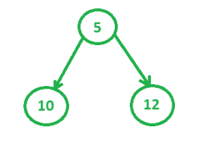
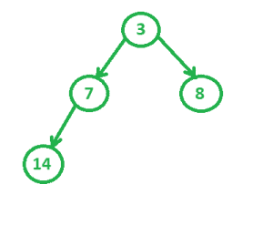
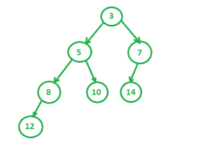

# 斜堆

> 原文:[https://www.geeksforgeeks.org/skew-heap/](https://www.geeksforgeeks.org/skew-heap/)

一个**倾斜堆**(或自调整堆)是一个以**二叉树**实现的堆数据结构。倾斜堆是有利的，因为它们能够比二进制堆更快地**合并**。与[二元堆](https://www.geeksforgeeks.org/binary-heap/)相比，没有结构约束，所以不能保证树的高度是对数的。只有两个条件必须满足:

1.  一般的堆顺序必须在那里(根是最小的，子树也是递归的)，但是平衡属性(除了最后一级，所有级别都必须是满的)不是必需的。
2.  倾斜堆中的主要操作是合并。我们可以仅使用 Merge 实现其他操作，如 insert、extractMin()等。

**例:**
**1。**考虑斜堆 1 为



**2。**要考虑的第二堆



**4。**我们得到最终的合并树



**递归合并过程:**
合并(h1，h2)

1.  假设 h1 和 h2 是要合并的两个最小偏斜堆。假设 h1 的根比 h2 的根小(如果不小，我们可以交换得到相同的)。
2.  我们交换 h1->左和 h1->右。
3.  h1->左侧=合并(h2，h1->左侧)

示例:

```
Let h1 be
        10
     /    \
   20      30
  /        /
40        50

Let h2 be
       15
     /    \
   25      35
  /  \
45    55

After swapping h1->left and h1->right, we get
        10
     /    \
   30      20
  /        /
50        40

Now we recursively Merge
   30
   /     AND   
  50

       15
     /    \
   25      35
  /  \
45    55
After recursive merge, we get (Please do it 
using pen and paper).
        15
     /     \
   30        25
  /  \     /    \
35    50  45    55

We make this merged tree as left of original
h1 and we get following result.
             10
         /         \
       15           20
    /      \       /   
   30       25    40   
 /   \    /    \
35   40  45    55
```

可视化方面:[https://www . cs . usfca . edu/~ galles/JavaScript visual/lefthetheap . html](https://www.cs.usfca.edu/~galles/JavascriptVisual/LeftistHeap.html)

## 卡片打印处理机（Card Print Processor 的缩写）

```
// CPP program to implement Skew Heap
// operations.
#include <bits/stdc++.h>
using namespace std;

struct SkewHeap
{
    int key;
    SkewHeap* right;
    SkewHeap* left;

    // constructor to make a new
    // node of heap
    SkewHeap()
    {
        key = 0;
        right = NULL;
        left = NULL;
    }

    // the special merge function that's
    // used in most of the other operations
    // also
    SkewHeap* merge(SkewHeap* h1, SkewHeap* h2)
    {
        // If one of the heaps is empty
        if (h1 == NULL)
            return h2;
        if (h2 == NULL)
            return h1;

        // Make sure that h1 has smaller
        // key.
        if (h1->key > h2->key)
           swap(h1, h2);

        // Swap h1->left and h1->right
        swap(h1->left, h1->right);

        // Merge h2 and h1->left and make
        // merged tree as left of h1.
        h1->left = merge(h2, h1->left);

        return h1;
    }

    // function to construct heap using
    // values in the array
    SkewHeap* construct(SkewHeap* root,
                     int heap[], int n)
    {
        SkewHeap* temp;
        for (int i = 0; i < n; i++) {
            temp = new SkewHeap;
            temp->key = heap[i];
            root = merge(root, temp);
        }
        return root;
    }

    // function to print the Skew Heap,
    // as it is in form of a tree so we use
    // tree traversal algorithms
    void inorder(SkewHeap* root)
    {
        if (root == NULL)
            return;
        else {
            inorder(root->left);
            cout << root->key << "  ";
            inorder(root->right);
        }
        return;
    }
};

// Driver Code
int main()
{
    // Construct two heaps
    SkewHeap heap, *temp1 = NULL,
                   *temp2 = NULL;
    /*
            5
           / \
          /   \
         10   12    */
    int heap1[] = { 12, 5, 10 };
    /*
            3
           / \
          /   \
         7     8
        /
       /
      14    */
    int heap2[] = { 3, 7, 8, 14 };
    int n1 = sizeof(heap1) / sizeof(heap1[0]);
    int n2 = sizeof(heap2) / sizeof(heap2[0]);
    temp1 = heap.construct(temp1, heap1, n1);
    temp2 = heap.construct(temp2, heap2, n2);

    // Merge two heaps
    temp1 = heap.merge(temp1, temp2);
    /*
            3
           / \
          /   \
         5     7
        / \   /
       8  10 14
      /
     12    */
    cout << "Merged Heap is: " << endl;
    heap.inorder(temp1);
}
```

**Output:** 

```
The heap obtained after merging is: 
12  8  5  10  3  14  7
```