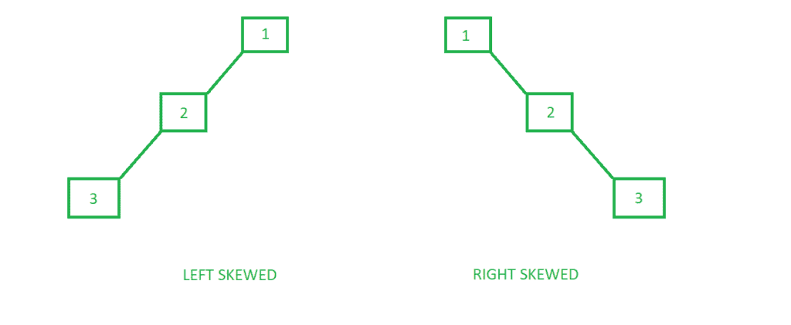

# 倾斜二叉树

> 原文:[https://www.geeksforgeeks.org/skewed-binary-tree/](https://www.geeksforgeeks.org/skewed-binary-tree/)

偏斜二叉树是一种所有节点只有一个子节点或者没有子节点的二叉树。

**偏斜二叉树的类型**

有两种特殊类型的倾斜树:



**1。左倾二叉树:**
这些是左倾二叉树，其中所有的节点都有一个左子节点或者根本没有子节点。这是一棵左侧控制的树。所有正确的孩子仍然是无效的。

下面是一个向左倾斜的树的例子:

## C++

```
#include <bits/stdc++.h>
using namespace std;

// A Tree node
struct Node {
    int key;
    struct Node *left, *right;
};

// Utility function to create a new node
Node* newNode(int key)
{
    Node* temp = new Node;
    temp->key = key;
    temp->left = temp->right = NULL;

    return (temp);
}

// Driver code
int main()
{
    /*
            1
           /
          2
         /
        3
    */
    Node* root = newNode(1);
    root->left = newNode(2);
    root->left->left = newNode(3);

    return 0;
}
```

## Java 语言(一种计算机语言，尤用于创建网站)

```
// Java implementation of above approach
import java.util.*;

class GFG
{

// A Tree node
static class Node
{
    int key;
     Node left, right;
};

// Utility function to create a new node
static Node newNode(int key)
{
    Node temp = new Node();
    temp.key = key;
    temp.left = temp.right = null;

    return (temp);
}

// Driver code
public static void main(String args[])
{
    /*
            1
           /
          2
         /
        3
    */
    Node root = newNode(1);
    root.left = newNode(2);
    root.left.left = newNode(3);
}
}

// This code is contributed by Arnab Kundu
```

## 蟒蛇 3

```
# Python3 implementation of the above approach

# Class that represents an individual
# node in a Binary Tree
class Node:
    def __init__(self, key):

        self.left = None
        self.right = None
        self.val = key

# Driver code

"""         1
           /
          2
         /
        3     """
root = Node(1)
root.left = Node(2)
root.left.left = Node(2)

# This code is contributed by dhruvsantoshwar
```

## C#

```
// C# implementation of above approach
using System;

class GFG
{

    // A Tree node
     public class Node
    {
         public int key;
         public Node left, right;
    };

    // Utility function to create a new node
     static Node newNode(int key)
    {
        Node temp = new Node();
        temp.key = key;
        temp.left = temp.right = null;

        return (temp);
    }

    // Driver code
    public static void Main()
    {
        /*
                1
            /
            2
            /
            3
        */
        Node root = newNode(1);
        root.left = newNode(2);
        root.left.left = newNode(3);
    }
}

// This code is contributed by AnkitRai01
```

## java 描述语言

```
<script>
// Javascript implementation of above approach

// A Tree node
class Node
{
    constructor()
    {
        this.key=0;
        this.left=this.right=null;
    }
}

// Utility function to create a new node
function newNode(key)
{
    let temp = new Node();
    temp.key = key;
    temp.left = temp.right = null;

    return (temp);
}

// Driver code
 /*
            1
           /
          2
         /
        3
    */
let root = newNode(1);
root.left = newNode(2);
root.left.left = newNode(3);

// This code is contributed by avanitrachhadiya2155
</script>
```

**2。右偏斜二叉树:**
这些是那些所有节点都有一个右子节点或者根本没有子节点的偏斜二叉树。这是一棵右侧控制的树。所有剩下的孩子仍然是空的。

下面是一个向右倾斜的树的例子:

## C++

```
#include <bits/stdc++.h>
using namespace std;

// A Tree node
struct Node {
    int key;
    struct Node *left, *right;
};

// Utility function to create a new node
Node* newNode(int key)
{
    Node* temp = new Node;
    temp->key = key;
    temp->left = temp->right = NULL;

    return (temp);
}

// Driver code
int main()
{
    /*
        1
         \
          2
           \
            3
    */
    Node* root = newNode(1);
    root->right = newNode(2);
    root->right->right = newNode(3);

    return 0;
}
```

## Java 语言(一种计算机语言，尤用于创建网站)

```
// Java implementation of above approach
import java.util.*;
class GFG
{

// A Tree node
static class Node
{
    int key;
    Node left, right;
};

// Utility function to create a new node
static Node newNode(int key)
{
    Node temp = new Node();
    temp.key = key;
    temp.left = temp.right = null;

    return (temp);
}

// Driver code
public static void main(String args[])
{
    /*
       1
        \
         2
          \
           3
    */
    Node root = newNode(1);
    root.right = newNode(2);
    root.right.right = newNode(3);
}
}

// This code is contributed by Arnab Kundu
```

## 蟒蛇 3

```
# Python3 implementation of the above approach

# A Tree node
class Node:

    def __init__(self, key):

        self.left = None
        self.right = None
        self.val = key

# Driver code
"""        
        1
         \
          2
           \
            3
                 """
root = Node(1)
root.right = Node(2)
root.right.right = Node(3)

# This code is contributed by shivanisinghss2110
```

## C#

```
// C# implementation of above approach
using System;

class GFG
{

// A Tree node
public class Node
{
    public int key;
    public Node left, right;
};

// Utility function to create a new node
static Node newNode(int key)
{
    Node temp = new Node();
    temp.key = key;
    temp.left = temp.right = null;

    return (temp);
}

// Driver code
public static void Main(String []args)
{
    /*
       1
        \
         2
          \
           3
    */
    Node root = newNode(1);
    root.right = newNode(2);
    root.right.right = newNode(3);
}
}

// This code is contributed by PrinciRaj1992
```

## java 描述语言

```
<script>

// Javascript implementation of above approach

// A Tree node
class Node
{
    constructor()
    {
        this.key = 0;
        this.left = this.right = null;
    }
}

// Utility function to create a new node
function newNode(key)
{
    let temp = new Node();
    temp.key = key;
    temp.left = temp.right = null;

    return(temp);
}

// Driver code
 /*
            1
           /
          2
         /
        3
    */
let root = newNode(1);
root.right = newNode(2);
root.right.right = newNode(3);

// This code is contributed by shivanisinghss2110

</script>
```