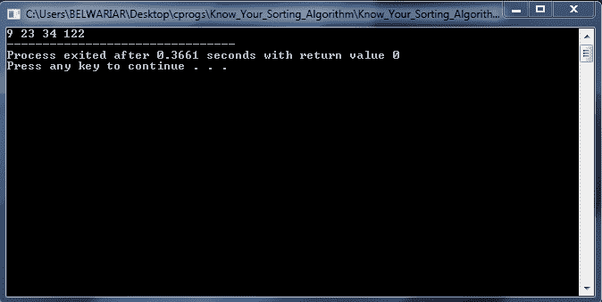

# 睡眠排序——睡觉时的懒惰/排序之王

> 原文:[https://www . geesforgeks . org/sleep-sort-king-lazy-sort-sleeping/](https://www.geeksforgeeks.org/sleep-sort-king-laziness-sorting-sleeping/)

在这个算法中，我们为输入数组中的每个元素创建不同的线程，然后每个线程休眠一段时间，这段时间与相应数组元素的值成比例。

因此，具有最少睡眠时间的线程首先醒来，并且数字被打印，然后是第二个最少的元素，以此类推。最大的元素在很长时间后醒来，然后元素在最后被打印出来。因此，输出是一个排序的。

所有这些多线程过程都发生在后台和操作系统的核心。我们对后台发生的事情一无所知，因此这是一个“神秘”的排序算法。

**示例:**让我们假设(为了方便起见)我们有一台速度非常慢的计算机，它需要 3 秒钟来处理每个元素:

```
INPUT: 8 2 9 

3s: sleep 8
6s: sleep 2
8s: "2" (2 wakes up so print it)
9s: sleep 9
11s: "8" (8 wakes up so print it)
18s: "9" (9 wakes up so print it)

OUTPUT: 2 8 9
```

**实现**
要实现睡眠排序，我们需要多线程功能，比如 **_beginthread()** 和**waitformmultipleobjects()**。因此我们需要包含 **windows.h** 来使用这些功能。这不会在[在线 IDE](https://ide.geeksforgeeks.org) 上编译。我们必须在您的电脑上运行它(请注意，此代码是针对 WINDOWS 的，而不是针对 LINUX 的)。

为了执行休眠排序，我们需要为输入数组中的每个值创建线程。我们使用函数 **_beginthread()** 来实现。

在每个线程中，我们分配两个指令:

**1)休眠**:休眠该线程直到 arr[i]毫秒(其中 arr[i]是该线程关联的数组元素)。我们使用 Sleep()函数来实现这一点。Sleep(n)函数将暂停与此线程相关的活动，直到“n”毫秒。因此，如果我们写 Sleep(1000)，那么这意味着线程将休眠 1 秒(1000 毫秒= 1 秒)

**2)打印:**当线程在睡眠后“醒来”时，打印该线程关联的数组元素–arr[I]。

创建线程后，我们处理这些线程。我们使用**waitformmultipleobjects()**来实现。

```
// C implementation of Sleep Sort
#include <stdio.h>
#include <windows.h>
#include <process.h>

// This is the instruction set of a thread
// So in these threads, we "sleep" for a particular
// amount of time and then when it wakes up
// the number is printed out
void routine(void *a)
{
    int n = *(int *) a; // typecasting from void to int

    // Sleeping time is proportional to the number
    // More precisely this thread sleep for 'n' milliseconds
    Sleep(n);

    // After the sleep, print the number
    printf("%d ", n);
}

/* A function that performs sleep sort
_beginthread() is a C run-time library call that creates a new
'thread' for all the integers in the array and returns that
thread.

Each of the 'thread' sleeps for a time proportional to that
integer and print it after waking.

We pass three parameters to _beginthread :-
1) start_address --> start address of the routine/function
                     which creates a new thread
2) stack_size --> Stack Size of the new thread (which is 0)
3) arglist --> Address of the argument to be passed

The return value of _beginthread() function is a handle to the
thread which is created. So we must accept is using the datatype-
'HANDLE' which is included in windows.h header
'HANDLE' datatype is used to represent an event/thread/process etc
So 'HANDLE' datatype is used to define a thread
We store the threads in an array - threads[] which is declared
using 'HANDLE' datatype.

WaitForMultipleObjects() is a function that processes the threads
and has four arguments-
1) no_of_threads --> Number of threads to be processed
2) array_of_threads --> This is the array of threads which should be
                        processed. This array must be of the type
                        'HANDLE'
3) TRUE or FALSE --> We pass TRUE if we want all the threads in the
                     array to be processed
4) time_limit --> The threads will be processed until this time limit
                  is crossed. So if we pass a 0 then no threads will
                  be processed, otherwise if we pass an INFINITE, then
                  the program will stop only when all the threads
                  are processed. We can put a cap on the execution
                  time of the program by passing the desired time
                  limit */
void sleepSort(int arr[], int n)
{
    // An array of threads, one for each of the elements
    // in the input array
    HANDLE threads[n];

    // Create the threads for each of the input array elements
    for (int i = 0; i < n; i++)
        threads[i] = (HANDLE)_beginthread(&routine, 0,  &arr[i]);

    // Process these threads
    WaitForMultipleObjects(n, threads, TRUE, INFINITE);
    return;
}

// Driver program to test above functions
int main()
{
    // Doesn't work for negative numbers
    int arr[] = {34, 23, 122, 9};
    int n = sizeof(arr) / sizeof(arr[0]);

    sleepSort (arr, n);

    return(0);
}
```

[](https://media.geeksforgeeks.org/wp-content/cdn-uploads/SleepSort.png)

**限制**
1)这个算法对负数不起作用，因为线程不能休眠负的时间。

2)由于该算法依赖于输入元素，因此输入数组中的巨大数字会导致该算法速度急剧下降(因为与该数字相关联的线程必须休眠很长时间)。因此，即使输入数组元素只包含 2 个元素，如- {1，100000000}，我们也必须等待更长的时间来排序。

3)该算法不能每次都产生正确的排序输出。这通常发生在输入数组中一个非常大的数字的左边有一个非常小的数字的时候。
例如–{ 34，23，1，12253，9}。
睡眠排序后的输出为{9，1，23，34，1223}

当最初对输入数组进行反向排序时，也会出现错误的输出，如- {10，9，8，7，6，5}。

出现这种意外输出的原因是因为在扫描每个元素和一些其他操作系统操作(如将每个线程插入优先级队列进行调度)之间需要一些时间。我们不能简单地忽视所有这些事情所花费的时间。

我们用下面的例子来描述

```
Let's assume (for convenience) we have a computer that's
so slow it takes 3 seconds to work through each element: 
INPUT: 10 9 8 7 6 5

3s: sleep 10
6s: sleep 9
9s: sleep 8
12s: sleep 7
13s: "10" (10 wakes up so print it)
15s: sleep 6
15s: "9" (9 wakes up so print it)
17s: "8" (8 wakes up so print it)
18s: sleep 5
19s: "7" (7 wakes up so print it)
21s: "6" (6 wakes up so print it)
23s: "5" (5 wakes up so print it)

OUTPUT: 10 9 8 7 6 5 
```

上面的输出只是一个例子。
显然，现代电脑的电脑速度没有那么慢(扫描每个元素需要 3 秒钟)。
实际上，在上面的阵列上的现代计算机上运行 sleep sort 给出了输出–{ 9，5，7，10，8，6}

**这个怎么修？**
1)我们可以通过对新输出重复睡眠排序来解决这个问题，直到输出被排序。每次它都会更准确地对元素进行排序。

2)由于其他操作系统工作和扫描每个元素所花费的时间，会出现前面讨论的错误输出。

在我们的程序中，我们使用了函数 **Sleep(arr[i])** ，这意味着与数组元素相关联的每个线程都会休眠‘arr[I]’毫秒。由于毫秒是一个非常小的量，并且其他操作系统任务可能比‘arr[I]’毫秒花费更多的时间，这最终会导致睡眠排序错误。将睡眠时间增加 10 倍可以得到一个有序的输出，因为操作系统任务将在这段睡眠时间内完成所有任务，因此不会产生任何错误。

如果我们使用 **Sleep(10*arr[i])** 而不仅仅是 Sleep(arr[i])，那么我们肯定会得到比后者更精确的输出。例如，如果我们使用 Sleep(10*arr[i])而不是 Sleep(arr[i])，输入数组–{ 10，9，8，7，6，5}将给出正确的排序输出–{ 5，6，7，8，9，10}。

然而，对于某些测试用例，Sleep(10*arr[i])仍然可能给出错误的结果。为了更精确地增加睡眠时间，比如说——睡眠。

因此，底线是睡眠时间越长，结果越准确。(听起来很有趣，嗯？) .但是这又会增加这个算法的运行时间。

**给读者的练习-**
1)上面的算法尝试按照升序排序。你能使用睡眠排序对输入数组进行降序排序吗？仔细想想。

2)是基于比较的排序算法吗？这个算法做了多少比较？
【回答:不是，是零比较】

3)不使用 windows.h header，不使用 Sleep()函数，我们能做睡眠排序吗？
【一个想法可以是创建一个优先级队列，在这个队列中，元素按照醒来和被打印之前剩余的时间进行排列。优先级队列前面的元素将是第一个被唤醒的元素。然而，实现起来并不容易。好好想想。]

**时间复杂度**
虽然关于睡眠排序的时间复杂度有很多相互矛盾的观点，但是我们可以用下面的推理来近似时间复杂度——

由于 Sleep()函数和创建多个线程是由操作系统使用优先级队列(用于调度目的)在内部完成的。因此，将所有数组元素插入优先级队列需要 0(Nlog N)个时间。此外，只有当所有线程都被处理时，也就是说，当所有元素“唤醒”时，才会获得输出。因为唤醒第 I 个数组元素的线程需要 O(arr[i])个时间。所以数组最大的元素最多需要 O(max(input))才能唤醒。因此，整体时间复杂度可以假设为 O(NlogN + max(输入))，
其中，N =输入数组中的元素数量，输入=输入数组元素

**辅助空间**
所有的事情都是通过 OS 的内部优先级队列来完成的。因此辅助空间可以忽略。

**结论**
睡眠排序与操作系统的关系比任何其他排序算法都要密切。这种排序算法是操作系统多线程和调度的完美展示。

“边睡边整理”这句话本身听起来就很独特。总的来说，这是一个有趣、懒惰、怪异的算法。但是正如有人正确地说的那样——“如果它起作用，那么它就不是懒惰的”。

本文由**拉希特·贝尔瓦亚尔**供稿。如果你喜欢极客博客并想投稿，你也可以写一篇文章并把你的文章邮寄到 contribute@geeksforgeeks.org。看到你的文章出现在极客博客主页上，帮助其他极客。

如果您发现任何不正确的地方，或者您想分享关于上面讨论的主题的更多信息，请写评论