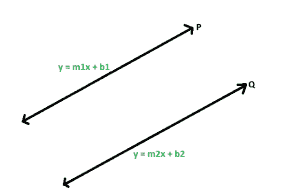

# 与给定斜率的直线平行的直线的斜率

> 原文:[https://www . geeksforgeeks . org/平行于给定坡度线的坡度/](https://www.geeksforgeeks.org/slope-of-the-line-parallel-to-the-line-with-the-given-slope/)

给定一个整数 **m** ，它是一条直线的斜率，任务是求与给定直线平行的直线的斜率。
**例:**

> **输入:** m = 2
> **输出:** 2
> **输入:** m = -3
> **输出:** -3

**进场:**



设 **P** 和 **Q** 为两条平行线，方程分别为 **y = m1x + b1** 、 **y = m2x + b2** 。这里 **m1** 和 **m2** 分别是直线的斜率。由于这些线是平行的，它们没有任何交点，因此这些线没有解的系统。所以，让我们试着求解方程，

> 对于 **y** ，**m1x+B1 = m2x+B2**
> T5】m1x–m2x = B2–B1
> **x(m1–m2)= B2–B1**
> 唯一不能有解的方法就是 **x** 让**m1–m2**等于零。
> **m1–m2 = 0**
> 这就给了我们 **m1 = m2** 并且斜率相等。

以下是上述方法的实现:

## C++

```
// C++ implementation of the approach
#include <bits/stdc++.h>
using namespace std;

// Function to return the slope
// of the line which is parallel to
// the line with the given slope
double getSlope(double m)
{
    return m;
}

// Driver code
int main()
{
    double m = 2;
    cout << getSlope(m);

    return 0;
}
```

## Java 语言(一种计算机语言，尤用于创建网站)

```
// Java implementation of the approach
class GfG
{

// Function to return the slope
// of the line which is parallel to
// the line with the given slope
static double getSlope(double m)
{
    return m;
}

// Driver code
public static void main(String[] args)
{
    double m = 2;
    System.out.println(getSlope(m));
}
}

// This code is contributed by Code_Mech.
```

## 蟒蛇 3

```
# Python3 implementation of the approach

# Function to return the slope
# of the line which is parallel to
# the line with the given slope
def getSlope(m):

    return m;

# Driver code
m = 2;
print(getSlope(m));

# This code is contributed
# by Akanksha Rai
```

## C#

```
// C# implementation of the approach
class GFG
{

// Function to return the slope
// of the line which is parallel to
// the line with the given slope
static double getSlope(double m)
{
    return m;
}

// Driver code
static void Main()
{
    double m = 2;
    System.Console.Write(getSlope(m));
}
}

// This code is contributed by mits
```

## 服务器端编程语言（Professional Hypertext Preprocessor 的缩写）

```
<?php
// PHP implementation of the approach

// Function to return the slope
// of the line which is parallel to
// the line with the given slope
function getSlope($m)
{
    return $m;
}

// Driver code
$m = 2;
echo getSlope($m);

// This code is contributed by Ryuga
?>
```

## java 描述语言

```
<script>

// javascript implementation of the approach

// Function to return the slope
// of the line which is parallel to
// the line with the given slope
function getSlope(m)
{
    return m;
}

var m = 2;
document.write(getSlope(m));

// This code contributed by Princi Singh

</script>
```

**Output:** 

```
2
```