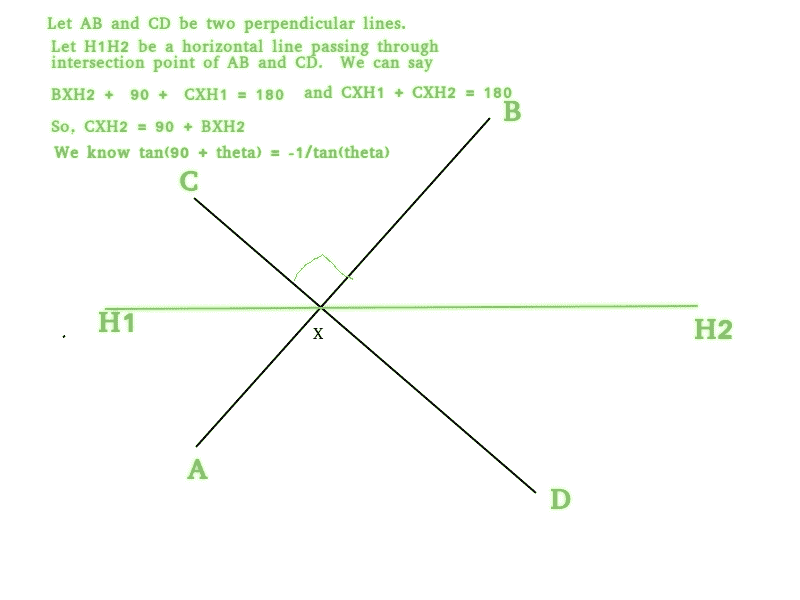

# 垂直于直线的斜率

> 原文:[https://www.geeksforgeeks.org/slope-perpendicular-line/](https://www.geeksforgeeks.org/slope-perpendicular-line/)

给你一条线的斜率(m <sub>1</sub> )，你必须找到另一条线的斜率，这条线垂直于给定的线。

示例:

```
Input : 5
Output : Slope of perpendicular line is : -0.20

Input : 4
Output : Slope of perpendicular line is : -0.25
```

假设给我们两条垂直的线段 AB 和 CD。AB 的斜率为 m <sub>1</sub> ，线 CD 为 m <sub>2</sub> 。

> m <sub>1</sub> * m <sub>2</sub> = -1
> 从上面我们可以说
> m<sub>2</sub>=–1/(m<sub>1</sub>)。

**以上公式是如何工作的？**
假设 AB 线的斜率为 m1，我们需要求 CD 线的斜率。下图给出了一个关于公式运算的想法。



## C++

```
// C++ program find slope of perpendicular line
#include <bits/stdc++.h>
using namespace std;

// Function to find
// the Slope of other line
double findPCSlope(double m)
{
    return -1.0 / m;
}

int main()
{
    double m = 2.0;
    cout << findPCSlope(m);
    return 0;
}
```

## Java 语言(一种计算机语言，尤用于创建网站)

```
// Java program find slope of perpendicular line

import java.io.*;
import java.util.*;

class GFG {

    // Function to find
    // the Slope of other line
    static double findPCSlope(double m)
    {
        return -1.0 / m;
    }

    public static void main(String[] args)
    {

        double m = 2.0;
        System.out.println(findPCSlope(m));
    }
}
```

## 蟒蛇 3

```
# Python 3 program find
# slope of perpendicular line

# Function to find
# the Slope of other line
def findPCSlope(m):

    return -1.0 / m

m = 2.0
print(findPCSlope(m))

# This code is contributed
# by Smitha
```

## C#

```
// C# Program to find Slope
// of perpendicular to line
using System;

class GFG {

    // Function to find
    // the Slope of other line
    static double findPCSlope(double m)
    {
        return -1.0 / m;
    }

    // Driver Code
    public static void Main()
    {

        double m = 2.0;
        Console.Write(findPCSlope(m));
    }
}

// This code is contributed by nitin mittal
```

## 服务器端编程语言（Professional Hypertext Preprocessor 的缩写）

```
<?php
// PHP program find slope
// of perpendicular line

// Function to find the
// Slope of other line
function findPCSlope($m)
{
    return -1.0 / $m;
}

    // Driver Code
    $m = 2.0;
    echo findPCSlope($m);

// This code is contributed by anuj_67
?>
```

## java 描述语言

```
<script>

// Javascript program find slope
// of perpendicular line

// Function to find
// the Slope of other line
function findPCSlope(m)
{
    return -1.0 / m;
}

// Driver code
let m = 2.0;

document.write(findPCSlope(m));

// This code is contributed by jana_sayantan

</script>
```

**Output:** 

```
-0.5
```