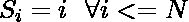
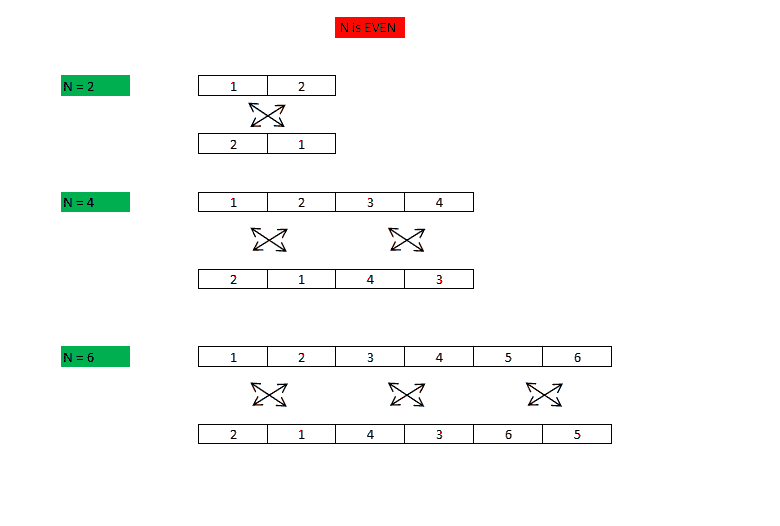
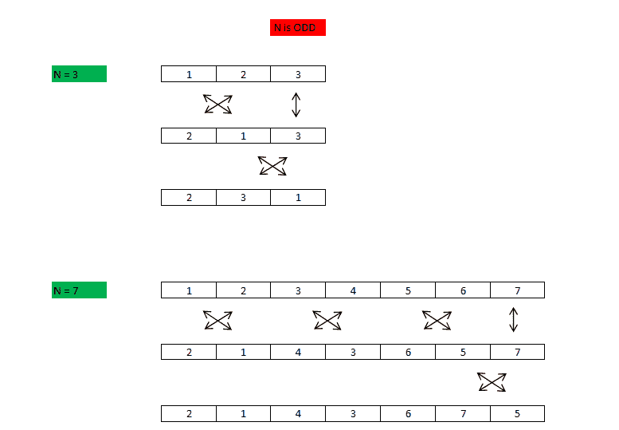

# 序列的最小混乱

> 原文:[https://www . geesforgeks . org/minist-神经病-sequence/](https://www.geeksforgeeks.org/smallest-derangement-sequence/)

给定序列


求

的字典序最小(字典序中最早)的错乱 S 的错乱如同 S 的任何排列，使得 S 及其排列中没有两个元素出现在同一位置。

**示例:**

```
Input: 3
Output : 2 3 1
Explanation: The Sequence is 1 2 3.
Possible permutations are (1, 2, 3), (1, 3, 2),
          (2, 1, 3), (2, 3, 1), (3, 1, 2) (3, 2, 1).
Derangements are (2, 3, 1), (3, 1, 2).
Smallest Derangement: (2, 3, 1)

Input : 5
Output : 2 1 4 5 3.
Explanation: Out of all the permutations of 
(1, 2, 3, 4, 5), (2, 1, 4, 5, 3) is the first derangement.
```

**方法 1:**
我们可以修改本文所示的方法:[最大错乱](https://www.geeksforgeeks.org/largest-derangement-sequence/)
使用一个 min 堆，我们可以连续获取最少的元素，并将其放置在更重要的位置，注意保持错乱的属性。

**复杂度:** O(N * log N)

下面是上述方法的实现。

## C++

```
// C++ program to generate smallest derangement
// using priority queue.
#include <bits/stdc++.h>
using namespace std;

void generate_derangement(int N)
{
    // Generate Sequence and insert into a
    // priority queue.
    int S[N + 1];
    priority_queue<int, vector<int>, greater<int> > PQ;
    for (int i = 1; i <= N; i++) {
        S[i] = i;
        PQ.push(S[i]);
    }

    // Generate Least Derangement
    int D[N + 1];
    for (int i = 1; i <= N; i++) {
        int d = PQ.top();
        PQ.pop();
        if (d != S[i] || i == N) {
            D[i] = d;
        }
        else {
            D[i] = PQ.top();
            PQ.pop();
            PQ.push(d);
        }
    }

    if (D[N] == S[N])
       swap(D[N-1], D[N]);

    // Print Derangement
    for (int i = 1; i <= N; i++)
        printf("%d ", D[i]);   
    printf("\n");
}

// Driver code
int main()
{
    generate_derangement(10);
    return 0;
}
```

## Java 语言(一种计算机语言，尤用于创建网站)

```
// Java program to generate
// smallest derangement
// using priority queue.
import java.util.*;
class GFG{

static void generate_derangement(int N)
{
  // Generate Sequence and insert
  // into a priority queue.
  int []S = new int[N + 1];

  PriorityQueue<Integer> PQ =
                new PriorityQueue <>();

  for (int i = 1; i <= N; i++)
  {
    S[i] = i;
    PQ.add(S[i]);
  }

  // Generate Least Derangement
  int []D = new int[N + 1];

  for (int i = 1; i <= N; i++)
  {
    int d = PQ.peek();
    PQ.remove();
    if (d != S[i] || i == N)
    {
      D[i] = d;
    }
    else
    {
      D[i] = PQ.peek();
      PQ.remove();
      PQ.add(d);
    }
  }

  if (D[N] == S[N])
  {
    int t = D[N - 1];
    D[N - 1] = D[N];
    D[N] = t;
  }

  // Print Derangement
  for (int i = 1; i <= N; i++)
    System.out.printf("%d ", D[i]);   
  System.out.printf("\n");
}

// Driver code
public static void main(String[] args)
{
  generate_derangement(10);
}
}

// This code is contributed by Amit Katiyar
```

## 蟒蛇 3

```
# Python3 program to generate
# smallest derangement
# using priority queue.
def generate_derangement(N) :

    # Generate Sequence and insert
    # into a priority queue.
    S = [i for i in range(N + 1)]   
    PQ = []   
    for i in range(1, N + 1) :      
        PQ.append(S[i])

    # Generate Least Derangement
    D = [0] * (N + 1)   
    PQ.sort()  
    for i in range(1, N + 1) :     
        PQ.sort()     
        d = PQ[0]
        del PQ[0]    
        if (d != S[i]) or (i == N) :        
            D[i] = d         
        else :        
            PQ.sort()
            D[i] = PQ[0]
            del PQ[0]
            PQ.append(d)           
    if D[N] == S[N] :       
        t = D[N - 1]
        D[N - 1] = D[N]
        D[N] = t

    # Print Derangement
    for i in range(1, N + 1) :
        print(D[i], end = " ")       
    print()

generate_derangement(10)

# This code is contributed by divyeshrabadiya07
```

## C#

```
// C# program to generate
// smallest derangement
// using priority queue.
using System;
using System.Collections.Generic;

class GFG{

static void generate_derangement(int N)
{

  // Generate Sequence and insert
  // into a priority queue.
  int []S = new int[N + 1];

  List<int> PQ = new List <int>();

  for(int i = 1; i <= N; i++)
  {
    S[i] = i;
    PQ.Add(S[i]);
  }

  // Generate Least Derangement
  int []D = new int[N + 1];
  PQ.Sort();
  for(int i = 1; i <= N; i++)
  {
    PQ.Sort();

    int d = PQ[0];
    PQ.RemoveAt(0);

    if (d != S[i] || i == N)
    {
      D[i] = d;
    }
    else
    {
      PQ.Sort();
      D[i] = PQ[0];
      PQ.RemoveAt(0);
      PQ.Add(d);
    }
  }

  if (D[N] == S[N])
  {
    int t = D[N - 1];
    D[N - 1] = D[N];
    D[N] = t;
  }

  // Print Derangement
  for(int i = 1; i <= N; i++)
    Console.Write(D[i] + " "); 

  Console.Write("\n");
}

// Driver code
public static void Main(String[] args)
{
  generate_derangement(10);
}
}

// This code is contributed by Amit Katiyar
```

## java 描述语言

```
<script>
// Javascript program to generate
// smallest derangement
// using priority queue.

function generate_derangement(N)
{

    // Generate Sequence and insert
  // into a priority queue.
  let S = new Array(N + 1);

  let PQ =[];

  for (let i = 1; i <= N; i++)
  {
    S[i] = i;
    PQ.push(S[i]);
  }

 PQ.sort(function(a,b){return a-b;});   

  // Generate Least Derangement
  let D = new Array(N + 1);

  for (let i = 1; i <= N; i++)
  {
    let d = PQ.shift();

    if (d != S[i] || i == N)
    {
      D[i] = d;
    }
    else
    {
      D[i] = PQ.shift();

      PQ.push(d);
    }
    PQ.sort(function(a,b){return a-b;});
  }

  if (D[N] == S[N])
  {
    let t = D[N - 1];
    D[N - 1] = D[N];
    D[N] = t;
  }

  // Print Derangement
  for (let i = 1; i <= N; i++)
    document.write( D[i]+" ");  
  document.write("<br>");
}

// Driver code
generate_derangement(10);

// This code is contributed by avanitrachhadiya2155
</script>
```

**输出:**

```
2 1 4 3 6 5 8 7 10 9 
```

**方法 2**
因为我们被赋予了一个非常特定的序列



我们可以更有效地计算出答案。
将原始序列分成两对元素，然后交换每对的元素。
如果 N 是奇数，那么最后一对需要再次交换。

**绘画作品**

 

**复杂度:**我们最多执行 N/2 + 1 次互换，所以复杂度为 O(N)。

**这个方法为什么管用**
这个方法是方法 1 的一个非常具体的应用，是以观察为基础的。给定序列的性质，在位置 I，我们已经知道可以放入的最少元素，要么是 i+1，要么是 i-1。因为我们已经给出了 S 的最小排列，所以很明显，i+1 (i = 1)形式的无序必须从 2 开始，而不是 1。下一个元素将是 I–1 形式。之后的元素将是 i + 1，然后是下一个 I–1。这种模式将持续到最后。
这个操作最容易理解为交换 s 的元素对的相邻元素。
如果我们能在恒定时间内确定最少的元素，那么来自堆的复杂性开销就被消除了。因此，复杂度从 0(N * log N)降低到 0(N)。

下面是上述方法的实现:

## C++

```
// Efficient C++ program to find smallest
// derangement.
#include <bits/stdc++.h>

void generate_derangement(int N)
{       
    // Generate Sequence S
    int S[N + 1];
    for (int i = 1; i <= N; i++)
        S[i] = i;

    // Generate Derangement
    int D[N + 1];
    for (int i = 1; i <= N; i += 2) {
        if (i == N && i%N!=0) {

            // Only if i is odd
            // Swap D[N-1] and D[N]
            int temp=D[N];
            D[N] = D[N - 1];
            D[N - 1] = temp;
        }
        else {
            D[i] = i + 1;
            D[i + 1] = i;
        }
    }

    // Print Derangement
    for (int i = 1; i <= N; i++)
        printf("%d ", D[i]);   
    printf("\n");
}

// Driver Program
int main()
{
    generate_derangement(10);
    return 0;
}
```

## Java 语言(一种计算机语言，尤用于创建网站)

```
// Efficient Java program to find
// smallest derangement.
class GFG
{

static void generate_derangement(int N)
{
    // Generate Sequence S
    int S[] = new int[N + 1];
    for (int i = 1; i <= N; i++)
        S[i] = i;

    // Generate Derangement
    int D[] = new int[N + 1];
    for (int i = 1; i <= N; i += 2)
    {
        if (i == N)
        {

            // Only if i is odd
            // Swap S[N-1] and S[N]
            D[N] = S[N - 1];
            D[N - 1] = S[N];
        }
        else
        {
            D[i] = i + 1;
            D[i + 1] = i;
        }
    }

    // Print Derangement
    for (int i = 1; i <= N; i++)
        System.out.print(D[i] + " ");
    System.out.println();
}

// Driver Program
public static void main(String[] args)
{
    generate_derangement(10);
}
}

// This code is contributed by Arnab Kundu
```

## 蟒蛇 3

```
# Efficient Python3 program to find
# smallest derangement.

def generate_derangement(N):

    # Generate Sequence S
    S = [0] * (N + 1)
    for i in range(1, N + 1):
        S[i] = i

    # Generate Derangement
    D = [0] * (N + 1)
    for i in range(1, N + 1, 2):
        if i == N:

            # Only if i is odd
            # Swap S[N-1] and S[N]
            D[N] = S[N - 1]
            D[N - 1] = S[N]
        else:
            D[i] = i + 1
            D[i + 1] = i

    # Print Derangement
    for i in range(1, N + 1):
        print(D[i], end = " ")
    print()

# Driver Code
if __name__ == '__main__':
    generate_derangement(10)

# This code is contributed by PranchalK
```

## C#

```
// Efficient C# program to find
// smallest derangement.
using System;

class GFG
{

static void generate_derangement(int N)
{
    // Generate Sequence S
    int[] S = new int[N + 1];
    for (int i = 1; i <= N; i++)
        S[i] = i;

    // Generate Derangement
    int[] D = new int[N + 1];
    for (int i = 1; i <= N; i += 2)
    {
        if (i == N)
        {

            // Only if i is odd
            // Swap S[N-1] and S[N]
            D[N] = S[N - 1];
            D[N - 1] = S[N];
        }
        else
        {
            D[i] = i + 1;
            D[i + 1] = i;
        }
    }

    // Print Derangement
    for (int i = 1; i <= N; i++)
        Console.Write(D[i] + " ");
    Console.WriteLine();
}

// Driver Program
public static void Main()
{
    generate_derangement(10);
}
}

// This code is contributed
// by Akanksha Rai
```

## 服务器端编程语言（Professional Hypertext Preprocessor 的缩写）

```
<?php
// Efficient PHP program to find smallest
// derangement.

function generate_derangement($N)
{    
    // Generate Sequence S
    $S = array();
    for ($i = 1; $i <= $N; $i++)
        $S[$i] = $i;

    // Generate Derangement
    $D = array();
    for ($i = 1; $i <= $N; $i += 2)
    {
        if ($i == $N)
        {

            // Only if i is odd
            // Swap S[N-1] and S[N]
            $D[$N] = $S[$N - 1];
            $D[$N - 1] = $S[$N];
        }
        else
        {
            $D[$i] = $i + 1;
            $D[$i + 1] = $i;
        }
    }

    // Print Derangement
    for ($i = 1; $i <= $N; $i++)
        echo $D[$i] . " ";
    echo "\n";
}

// Driver Program
generate_derangement(10);

// This code is contributed
// by Akanksha Rai
?>
```

## java 描述语言

```
<script>

// Javascript program to find
// smallest derangement.
function generate_derangement(N)
{

    // Generate Sequence S
    let S = [];
    for (let i = 1; i <= N; i++)
        S[i] = i;

    // Generate Derangement
    let D = [];
    for (let i = 1; i <= N; i += 2)
    {
        if (i == N)
        {

            // Only if i is odd
            // Swap S[N-1] and S[N]
            D[N] = S[N - 1];
            D[N - 1] = S[N];
        }
        else
        {
            D[i] = i + 1;
            D[i + 1] = i;
        }
    }

    // Prlet Derangement
    for (let i = 1; i <= N; i++)
        document.write(D[i] + " ");
    document.write("<br/>");
 }

// Driver code
        generate_derangement(10);

      // This code is contributed by code_hunt.
</script>
```

**输出:**

```
2 1 4 3 6 5 8 7 10 9 
```

**注意:**如果我们对 S 本身进行交换操作，辅助空间可以减少到 O(1)。

本文由 [**萨彦·马哈帕特拉**](https://auth.geeksforgeeks.org/profile.php?user=Sayan Mahapatra) 供稿。如果你喜欢 GeeksforGeeks 并想投稿，你也可以使用[contribute . geeks for geeks.org](https://write.geeksforgeeks.org)写一篇文章或者把你的文章邮寄到 review-team@geeksforgeeks.org。看到你的文章出现在极客博客主页上，帮助其他极客。
如果发现有不正确的地方，或者想分享更多关于上述话题的信息，请写评论。