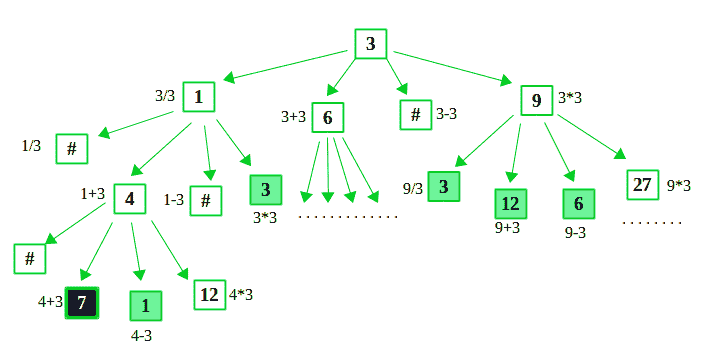
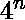

# 用一位数表示数字的最小表达式

> 原文:[https://www . geeksforgeeks . org/minist-expression-represent-number-use-single-digital/](https://www.geeksforgeeks.org/smallest-expression-represent-number-using-single-digit/)

给定一个数字 N 和一个数字 D，我们必须形成一个只包含 D 的表达式或方程，并且该表达式的计算结果为 N。表达式中允许的运算符是 **+、-、*和/** 。求满足上述条件的最小长度表达式，D 在表达式中最多只能出现 10(极限)次。因此限制 N 的值(虽然限制的值取决于你想走多远。但是对于下面的方法，大的极限值可能需要更长的时间)。

请记住，可以有多个计算结果为 N 的 D 的最小表达式，但该表达式的长度将是最小的。

示例:

```
Input :  N = 7, D = 3
Output : 3/3+ 3 + 3
Explanation : 3/3 = 1, and 1+3+3 = 7 
This is the minimum expression.

Input :  N = 7, D = 4
Output : (4+4+4)/4 + 4
Explanation : (4+4+4) = 12, and 12/4 = 3 and 3+4 = 7
Also this is the minimum expression. Although 
you may find another expression but that 
expression can have only five 4's

Input :  N = 200, D = 9
Output : Expression not found!
Explanation : Not possible within 10 digits. 

```

我们使用的方法是**回溯**。我们从给定的数字 D 开始，如果可能的话，开始乘法、加法、减法和除法。这个过程一直持续到我们发现总数为 N，或者我们到达终点，我们回溯开始另一条路。为了找到最小表达式，我们找到递归树的最小级别。然后应用我们的回溯算法。

假设 N = 7，D = 3


上述方法是指数型的。在每一个层次上，我们最多重复 4 次。所以，我们可以说这个方法的时间复杂度是，其中 n 是递归树中的层数(或者我们可以说我们希望 D 最多出现的次数——在我们的例子中是 10)。

**注**:我们用上面的方法两次。首先找到最低水平，然后找到在那个水平上可能的表达式。所以，我们有两个途径。我们可以一下子得到这个表达，但你需要为此挠头。

## C++

```
// CPP Program to generate minimum expression containing
// only given digit D that evaluates to number N.
#include <climits>
#include <iostream>
#include <map>
#include <sstream>
#include <stack>

// limit of Digits in the expression
#define LIMIT 10

using namespace std;

// map that store if a number is seen or not
map<int, int> seen;

// stack for storing operators
stack<char> operators;
int minimum = LIMIT;

// function to find minimum levels in the recursive tree
void minLevel(int total, int N, int D, int level) {

  // if total is equal to given N
  if (total == N) {

    // store if level is minimum
    minimum = min(minimum, level);
    return;
  }

  // if the last level is reached
  if (level == minimum)
    return;

  // if total can be divided by D.
  // recurse by dividing the total by D
  if (total % D == 0)
    minLevel(total / D, N, D, level + 1);

  // recurse for total + D
  minLevel(total + D, N, D, level + 1);

  // if total - D is greater than 0
  if (total - D > 0)

    // recurse for total - D
    minLevel(total - D, N, D, level + 1);

  // recurse for total multiply D
  minLevel(total * D, N, D, level + 1);
}

// function to generate the minimum expression
bool generate(int total, int N, int D, int level) {
  // if total is equal to N
  if (total == N)
    return true;

  // if the last level is reached
  if (level == minimum)
    return false;

  // if total is seen at level greater than current level
  // or if we haven't seen total before. Mark the total 
  // as seen at current level
  if (seen.find(total) == seen.end() ||
      seen.find(total)->second >= level) {

    seen[total] = level;

    int divide = INT_MAX;

    // if total is divisible by D
    if (total % D == 0) {
      divide = total / D;

      // if divide isn't seen before
      // mark it as seen
      if (seen.find(divide) == seen.end())
        seen[divide] = level + 1;
    }

    int addition = total + D;

    // if addition isn't seen before
    // mark it as seen
    if (seen.find(addition) == seen.end())
      seen[addition] = level + 1;

    int subtraction = INT_MAX;
    // if D can be subtracted from total
    if (total - D > 0) {
      subtraction = total - D;

      // if subtraction isn't seen before
      // mark it as seen
      if (seen.find(subtraction) == seen.end())
        seen[subtraction] = level + 1;
    }

    int multiply = total * D;

    // if multiply isn't seen before
    // mark it as seen
    if (seen.find(multiply) == seen.end())
      seen[multiply] = level + 1;

    // recurse by dividing the total if possible
    if (divide != INT_MAX)
      if (generate(divide, N, D, level + 1)) {

        // store the operator.
        operators.push('/');
        return true;
      }

    // recurse by adding D to total
    if (generate(addition, N, D, level + 1)) {

      // store the operator.
      operators.push('+');
      return true;
    }

    // recurse by subtracting D from total
    if (subtraction != INT_MAX)
      if (generate(subtraction, N, D, level + 1)) {

        // store the operator.
        operators.push('-');
        return true;
      }

    // recurse by multiplying D by total
    if (generate(multiply, N, D, level + 1)) {

      // store the operator.
      operators.push('*');
      return true;
    }
  }

  // expression is not found yet
  return false;
}

// function to print the expression
void printExpression(int N, int D) {
  // find minimum level
  minLevel(D, N, D, 1);

  // generate expression if possible
  if (generate(D, N, D, 1)) {
    // stringstream for converting to D to string
    ostringstream num;
    num << D;

    string expression;

    // if stack is not empty
    if (!operators.empty()) {

      // concatenate D and operator at top of stack
      expression = num.str() + operators.top();
      operators.pop();
    }

    // until stack is empty
    // concatenate the operator with parenthesis for precedence
    while (!operators.empty()) {
      if (operators.top() == '/' || operators.top() == '*')
        expression = "(" + expression + num.str() + ")" + operators.top();
      else
        expression = expression + num.str() + operators.top();
      operators.pop();
    }

    expression = expression + num.str();

    // print the expression
    cout << "Expression: " << expression << endl;
  }

  // not possible within 10 digits.
  else
    cout << "Expression not found!" << endl;
}

// Driver's Code
int main() {
  int N = 7, D = 4;

  // print the Expression if possible
  printExpression(N, D);

  // print expression for N =100, D =7
  minimum = LIMIT;
  printExpression(100, 7);

  // print expression for N =200, D =9
  minimum = LIMIT;
  printExpression(200, 9);

  return 0;
}
```

## 蟒蛇 3

```
# Python3 program to generate minimum expression containing
# only the given digit D that evaluates to number N.
LIMIT = 10

# to restrict the maximum number of times 
# the number D can be used to obtain N
minimum = LIMIT

# to store the value of intermediate D
# and the D of operands used to get that intermediate D, ie
# seen[intermediateNumber] = numberOfOperandsUsed
seen = {}

# stack to store the operators used to print the expression
operators = []

# function to obtain minimum D of operands in recursive tree
def minLevel(total, N, D, level):
    global minimum

    # if total is equal to given N
    if total == N:
        # store if D of operands is minimum
        minimum = min(minimum, level)
        return

    # if the last level (limit) is reached
    if level == minimum:
        return

    # if total can be divided by D, recurse
    # by dividing the total by D
    if total % D == 0:
        minLevel(total / D, N, D, level + 1)

    # recurse for total + D
    minLevel(total + D, N, D, level + 1)

    # if total - D is greater than 0, recurse for total - D
    if total - D > 0:
        minLevel(total - D, N, D, level + 1)

    # recurse for total * D
    minLevel(total * D, N, D, level + 1)

# function to generate the minimum expression
def generate(total, N, D, level):

    # if total is equal to N
    if total == N:
        return True

    # if the last level is reached
    if level == minimum:
        return False

    # if the total is not already seen or if 
    # the total is seen with more level
    # then mark total as seen with current level
    if seen.get(total) is None or seen.get(total) >= level:
        seen[total] = level

        divide = -1

        # if total is divisible by D
        if total % D == 0:
            divide = total / D

            # if the number (divide) is not seen, mark as seen
            if seen.get(divide) is None:
                seen[divide] = level + 1

        addition = total + D

        # if the number (addition) is not seen, mark as seen
        if seen.get(addition) is None:
            seen[addition] = level + 1

        subtraction = -1
        # if D can be subtracted from total
        if total - D > 0:
            subtraction = total - D

            # if the number (subtraction) is not seen, mark as seen
            if seen.get(subtraction) is None:
                seen[subtraction] = level + 1

        multiplication = total * D

        # if the number (multiplication) is not seen, mark as seen
        if seen.get(multiplication) is None:
            seen[multiplication] = level + 1

        # recurse by dividing the total if possible and store the operator
        if divide != -1 and generate(divide, N, D, level + 1):
            operators.append('/')
            return True

        # recurse by adding D to total and store the operator
        if generate(addition, N, D, level + 1):
            operators.append('+')
            return True

        # recurse by subtracting D from total
        # if possible and store the operator
        if subtraction != -1 and generate(subtraction, N, D, level + 1):
            operators.append('-')
            return True

        # recurse by multiplying D by total and store the operator
        if generate(multiplication, N, D, level + 1):
            operators.append('*')
            return True

    # expression is not found yet
    return False

# function to print the expression
def printExpression(N, D):

    # find the minimum number of operands
    minLevel(D, N, D, 1)

    # generate expression if possible
    if generate(D, N, D, 1):
        expression = ''

        # if stack is not empty, concatenate D and
        # operator popped from stack
        if len(operators) > 0:
            expression = str(D) + operators.pop()

        # until stack is empty, concatenate the 
        # operator popped with parenthesis for precedence
        while len(operators) > 0:
            popped = operators.pop()
            if popped == '/' or popped == '*':
                expression = '(' + expression + str(D) + ')' + popped
            else:
                expression = expression + str(D) + popped

        expression = expression + str(D)
        print("Expression: " + expression)

    # not possible within 10 digits.
    else:
        print("Expression not found!")

# Driver's code
if __name__ == '__main__':
    # N = 7, D = 4
    minimum = LIMIT
    printExpression(7, 4)

    minimum = LIMIT
    printExpression(100, 7)

    minimum = LIMIT
    printExpression(200, 9)

# This code is contributed by thecodingpanda
```

**Output:**

```
Expression: (4+4+4)/4+4
Expression: (((7+7)*7)*7+7+7)/7
Expression not found!

```