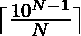
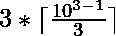
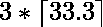

# 可被 N 整除的最小 N 位数

> 原文:[https://www . geesforgeks . org/最小 n 位数可被 n 整除/](https://www.geeksforgeeks.org/smallest-n-digit-number-divisible-by-n/)

给定一个正整数 **N** ，任务是找到能被 **N** 整除的最小 **N** 位数。

**示例:**

> **输入:** N = 2
> **输出:** 10
> **说明:**
> 10 是最小的 2 位数，可被 2 整除。
> 
> **输入:** N = 3
> **输出:** 102
> **说明:**
> 102 是最小的 3 位数，可被 3 整除。

**天真法:**天真法是从最小的 N 位数(比如说 **S** )迭代到最大的 N 位数(比如说 **L** )。**【S，L】**之间第一个被 **N** 整除的数字就是需要的结果。

下面是上述方法的实现:

## C++

```
// C++ program for the above approach
#include <iostream>
#include <math.h>
using namespace std;

// Function to find the smallest
// N-digit number divisible by N
void smallestNumber(int N)
{
    // Find largest n digit number
    int L = pow(10, N) - 1;

    // Find smallest n digit number
    int S = pow(10, N - 1);

    for (int i = S; i <= L; i++) {

        // If i is divisible by N,
        // then print i and return ;
        if (i % N == 0) {

            cout << i;
            return;
        }
    }
}

// Driver Code
int main()
{
    // Given Number
    int N = 2;

    // Function Call
    smallestNumber(N);
    return 0;
}
```

## Java 语言(一种计算机语言，尤用于创建网站)

```
// Java program for the above approach
import java.util.*;
class GFG{

// Function to find the smallest
// N-digit number divisible by N
static void smallestNumber(int N)
{

    // Find largest n digit number
    int L = (int) (Math.pow(10, N) - 1);

    // Find smallest n digit number
    int S = (int) Math.pow(10, N - 1);

    for (int i = S; i <= L; i++)
    {

        // If i is divisible by N,
        // then print i and return ;
        if (i % N == 0)
        {
            System.out.print(i);
            return;
        }
    }
}

// Driver Code
public static void main(String[] args)
{
    // Given Number
    int N = 2;

    // Function Call
    smallestNumber(N);
}
}

// This code is contributed by Amit Katiyar
```

## 蟒蛇 3

```
# Python3 program for the above approach

# Function to find the smallest
# N-digit number divisible by N
def smallestNumber(N):

    # Find largest n digit number
    L = pow(10, N) - 1;

    # Find smallest n digit number
    S = pow(10, N - 1);

    for i in range(S, L):

        # If i is divisible by N,
        # then print i and return ;
        if (i % N == 0):
            print(i);
            return;

# Driver Code
if __name__ == "__main__" :

    # Given number
    N = 2;

    # Function call
    smallestNumber(N)

# This code is contributed by rock_cool
```

## C#

```
// C# program for the above approach
using System;
class GFG{

// Function to find the smallest
// N-digit number divisible by N
static void smallestNumber(int N)
{

    // Find largest n digit number
    int L = (int)(Math.Pow(10, N) - 1);

    // Find smallest n digit number
    int S = (int)Math.Pow(10, N - 1);

    for(int i = S; i <= L; i++)
    {

       // If i is divisible by N,
       // then print i and return ;
       if (i % N == 0)
       {
           Console.Write(i);
           return;
       }
    }
}

// Driver Code
public static void Main()
{

    // Given number
    int N = 2;

    // Function call
    smallestNumber(N);
}
}

// This code is contributed by Nidhi_biet
```

## java 描述语言

```
<script>

// Javascript program for the above approach

// Function to find the smallest
// N-digit number divisible by N
function smallestNumber(N)
{

    // Find largest n digit number
    let L = Math.pow(10, N) - 1;

    // Find smallest n digit number
    let S = Math.pow(10, N - 1);

    for(let i = S; i <= L; i++)
    {

        // If i is divisible by N,
        // then print i and return ;
        if (i % N == 0)
        {
            document.write(i);
            return;
        }
    }
}

// Driver code

// Given Number
let N = 2;

// Function Call
smallestNumber(N);

// This code is contributed by divyeshrabadiya07

</script>
```

**Output:** 

```
10
```

**时间复杂度:***O(L–S)*，其中 **L** 和 **S** 分别是最大和最小的 N 位数。

**有效方法:**如果该数可被 **N** 整除，那么对于某些正整数 **X** ，该数的形式为 **N * X** 。
由于它必须是最小的 **N 位**数字，那么 **X** 将由下式给出:

。因此，最小的 N 位数由下式给出:


**例如:**

> 对于 N = 3，最小的 3 位数由下式给出:
> = > 
> 
> => 
> 
> => 
> 
> => 102

下面是上述方法的实现:

## C++

```
// C++ program for the above approach
#include <iostream>
#include <math.h>
using namespace std;

// Function to find the smallest
// N-digit number divisible by N
int smallestNumber(int N)
{

    // Return the smallest N-digit
    // number calculated using above
    // formula
    return N * ceil(pow(10, (N - 1)) / N);
}

// Driver Code
int main()
{
    // Given N
    int N = 2;

    // Function Call
    cout << smallestNumber(N);
    return 0;
}
```

## Java 语言(一种计算机语言，尤用于创建网站)

```
// Java program for the above approach
import java.util.*;
class GFG{

// Function to find the smallest
// N-digit number divisible by N
static int smallestNumber(int N)
{

    // Return the smallest N-digit
    // number calculated using above
    // formula
    return (int) (N * Math.ceil(Math.pow(10, (N - 1)) / N));
}

// Driver Code
public static void main(String[] args)
{
    // Given N
    int N = 2;

    // Function Call
    System.out.print(smallestNumber(N));
}
}

// This code is contributed by Princi Singh
```

## 蟒蛇 3

```
# Python3 program for the above approach
import math

# Function to find the smallest
# N-digit number divisible by N
def smallestNumber(N):

    # Return the smallest N-digit
    # number calculated using above
    # formula
    return N * math.ceil(pow(10, (N - 1)) // N);

# Driver Code

# Given N
N = 2;

# Function Call
print(smallestNumber(N));

# This code is contributed by Code_Mech
```

## C#

```
// C# program for the above approach
using System;
class GFG{

// Function to find the smallest
// N-digit number divisible by N
static int smallestNumber(int N)
{

    // Return the smallest N-digit
    // number calculated using above
    // formula
    return (int) (N * Math.Ceiling(Math.Pow(10, (N - 1)) / N));
}

// Driver Code
public static void Main()
{
    // Given N
    int N = 2;

    // Function Call
    Console.Write(smallestNumber(N));
}
}

// This code is contributed by Code_Mech
```

## java 描述语言

```
<script>
    // Javascript program for the above approach

    // Function to find the smallest
    // N-digit number divisible by N
    function smallestNumber(N)
    {

        // Return the smallest N-digit
        // number calculated using above
        // formula
        return N * Math.ceil(Math.pow(10, (N - 1)) / N);
    }

    // Given N
    let N = 2;

    // Function Call
    document.write(smallestNumber(N));

    // This code is contributed by divyesh072019.
</script>
```

**Output:** 

```
10
```

**时间复杂度:***O(1)*
T5】辅助空间: *O(1)*