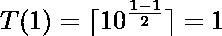
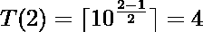
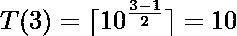
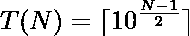

# 平方为 N 位数的最小数

> 原文:[https://www . geesforgeks . org/最小数字-其平方有 n 位数/](https://www.geeksforgeeks.org/smallest-number-whose-square-has-n-digits/)

给定一个数字 **N** ，任务是找到平方为 **N** 位数的最小数字。
**例:**

> **输入:** N = 2
> **输出:** 4
> **说明:**
> 3 <sup>2</sup> = 9，有 1 位数字。
> 4 <sup>2</sup> = 16，有 2 位数字。
> 因此，4 是平方为 N 位数的最小数。
> **输入:** N = 3
> **输出:** 10
> **解释:**
> 10 <sup>2</sup> = 100，有 3 位数字。

**天真法:**解决问题最简单的方法是从开始计算每个数字的平方，并计算其平方中的位数。打印第一个数字，其平方为 N 位数。
***时间复杂度:**O(√(10<sup>N</sup>)*
**高效途径:**要解决问题，我们需要做以下观察:

> 平方为 1 位数的最小数= 1
> 平方为 2 位数的最小数= 4
> 平方为 3 位数的最小数= 10
> 平方为 4 位数的最小数= 32
> 平方为 5 位数的最小数= 100
> 因此，这些数组成了 1，4，10，32，100，317，…。

现在，我们需要为该系列的第 N 个术语找到一个公式。
该系列的术语可以用以下形式表示:

> 如果 **N = 1** ，最小可能数为 1。
> 
> 如果 **N = 2** ，最小可能数为 41。
> 
> 如果 **N = 3** ，最小可能数为 10。
> 

因此，我们可以得出结论，该系列的第 N 个<sup>可以表示为</sup> 

> 

因此，为了解决这个问题，我们只需要为给定的整数 **N** 计算***ceil(10<sup>(N–1)/2</sup>)***。
以下是上述方法的实施:

## C++

```
// C++ Program to find the smallest
// number whose square has N digits

#include <bits/stdc++.h>
using namespace std;

// Function to return smallest number
// whose square has N digits
int smallestNum(int N)
{

    // Calculate N-th term of the series
    float x = pow(10.0, (N - 1) / 2.0);
    return ceil(x);
}

// Driver Code
int main()
{
    int N = 4;
    cout << smallestNum(N);

    return 0;
}
```

## Java 语言(一种计算机语言，尤用于创建网站)

```
// Java program for above approach
class GFG{

// Function to return smallest number
// whose square has N digits
static int smallestNum(int N)
{

    // Calculate N-th term of the series
    float x = (float)(Math.pow(10, (N - 1) / 2.0));
    return (int)(Math.ceil(x));
}

// Driver code
public static void main(String[] args)
{
    int N = 4;
    System.out.print(smallestNum(N));
}
}

// This code is contributed by spp
```

## 蟒蛇 3

```
# Python3 Program to find the smallest
# number whose square has N digits
import math;

# Function to return smallest number
# whose square has N digits
def smallestNum(N):

    # Calculate N-th term of the series
    x = pow(10.0, (N - 1) / 2.0);
    return math.ceil(x);

# Driver Code
N = 4;
print(smallestNum(N));

# This code is contributed by Code_mech
```

## C#

```
// C# program for above approach
using System;
class GFG{

// Function to return smallest number
// whose square has N digits
static int smallestNum(int N)
{

    // Calculate N-th term of the series
    float x = (float)(Math.Pow(10, (N - 1) / 2.0));
    return (int)(Math.Ceiling(x));
}

// Driver code
public static void Main()
{
    int N = 4;
    Console.Write(smallestNum(N));
}
}

// This code is contributed by Code_Mech
```

## java 描述语言

```
<script>
// java script  Program to find the smallest
// number whose square has N digits
// Function to return smallest number
// whose square has N digits
function smallestNum(N)
{

    // Calculate N-th term of the series
    x = Math.pow(10.0, (N - 1) / 2.0);
    return Math.ceil(x);
}

// Driver Code
let N = 4;
document.write(smallestNum(N));

// This code is contributed by Gottumukkala Bobby
</script>
```

**Output:** 

```
32
```

***时间复杂度:** O(log(N))*
***辅助空间:** O(1)*