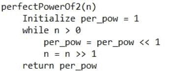

# 大于 n 的 2 的最小完美幂(不使用算术运算符)

> 原文:[https://www . geesforgeks . org/minist-perfect-power-2-great-n-无需使用算术运算符/](https://www.geeksforgeeks.org/smallest-perfect-power-2-greater-n-without-using-arithmetic-operators/)

给定一个非负整数 **n** 。问题是在不使用算术运算符的情况下，找到大于 **n** 的 2 的最小完美幂。
示例:

```
Input : n = 10
Output : 16

Input : n = 128
Output : 256
```

**算法:**



## C++

```
// C++ implementation of smallest perfect power
// of 2 greater than n
#include <bits/stdc++.h>

using namespace std;

// Function to find smallest perfect power
// of 2 greater than n
unsigned int perfectPowerOf2(unsigned int n)
{
    // To store perfect power of 2
    unsigned int per_pow = 1;

    while (n > 0)
    {
        // bitwise left shift by 1
        per_pow = per_pow << 1;

        // bitwise right shift by 1
        n = n >> 1;
    }

    // Required perfect power of 2
    return per_pow;
}

// Driver program to test above
int main()
{
    unsigned int n = 128;
    cout << "Perfect power of 2 greater than "
        << n << ": " << perfectPowerOf2(n);
    return 0;
}
```

## Java 语言(一种计算机语言，尤用于创建网站)

```
// JAVA Code for Smallest perfect
// power of 2 greater than n
import java.util.*;

class GFG {

    // Function to find smallest perfect
    // power of 2 greater than n
    static int perfectPowerOf2( int n)
    {
        // To store perfect power of 2
         int per_pow = 1;

        while (n > 0)
        {
            // bitwise left shift by 1
            per_pow = per_pow << 1;

            n = n >> 1;
        }

        // Required perfect power of 2
        return per_pow;
    }

    // Driver program
    public static void main(String[] args)
    {
         int n = 12;
         System.out.println("Perfect power of 2 greater than "
                            + n + ": " + perfectPowerOf2(n));
        }
    }

    //This code is contributed by Arnav Kr. Mandal.
```

## 蟒蛇 3

```
# Python3 implementation of smallest
# perfect power of 2 greater than n

# Function to find smallest perfect
# power of 2 greater than n
def perfectPowerOf2( n ):

    # To store perfect power of 2
    per_pow = 1

    while n > 0:

        # bitwise left shift by 1
        per_pow = per_pow << 1

        # bitwise right shift by 1
        n = n >> 1

    # Required perfect power of 2
    return per_pow

# Driver program to test above
n = 128
print("Perfect power of 2 greater than",
            n, ":",perfectPowerOf2(n))

# This code is contributed by "Sharad_Bhardwaj".
```

## C#

```
// C# Code for Smallest perfect
// power of 2 greater than n
using System;

class GFG {

    // Function to find smallest perfect
    // power of 2 greater than n
    static int perfectPowerOf2(int n)
    {
        // To store perfect power of 2
        int per_pow = 1;

        while (n > 0)
        {
            // bitwise left shift by 1
            per_pow = per_pow << 1;

            n = n >> 1;
        }

        // Required perfect power of 2
        return per_pow;
    }

    // Driver program
    public static void Main()
    {
        int n = 128;
        Console.WriteLine("Perfect power of 2 greater than " +
                           n + ": " + perfectPowerOf2(n));
    }
}

// This code is contributed by Sam007
```

## 服务器端编程语言（Professional Hypertext Preprocessor 的缩写）

```
<?php
// php implementation of
// smallest perfect power
// of 2 greater than n

// Function to find smallest
// perfect power of 2
// greater than n
function perfectPowerOf2($n)
{

    // To store perfect power of 2
    $per_pow = 1;

    while ($n > 0)
    {
        // bitwise left shift by 1
        $per_pow = $per_pow << 1;

        // bitwise right shift by 1
        $n = $n >> 1;
    }

    // Required perfect power of 2
    return $per_pow;
}

    // Driver code
    $n = 128;
    echo "Perfect power of 2 greater than ".
          $n . ": ".perfectPowerOf2($n);

// This code is contributed by mits
?>
```

## java 描述语言

```
<script>

// JavaScript implementation of smallest perfect power
// of 2 greater than n

// Function to find smallest perfect power
// of 2 greater than n
function perfectPowerOf2(n)
{
    // To store perfect power of 2
    let per_pow = 1;

    while (n > 0)
    {
        // bitwise left shift by 1
        per_pow = per_pow << 1;

        // bitwise right shift by 1
        n = n >> 1;
    }

    // Required perfect power of 2
    return per_pow;
}

// Driver program to test above

    let n = 128;
    document.write("Perfect power of 2 greater than "
        + n + ": " + perfectPowerOf2(n));

// This code is contributed by Surbhi Tyagi.

</script>
```

输出:

```
Perfect power of 2 greater than 128: 256
```

时间复杂度: **O(num)** ，其中 **num** 是 **n** 二进制表示的位数。