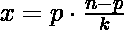

# 满足给定方程的最小正整数 X

> 原文:[https://www . geesforgeks . org/minist-正整数-x-满足给定方程/](https://www.geeksforgeeks.org/smallest-positive-integer-x-satisfying-the-given-equation/)

给定两个整数 **N** 和 **K** ，任务是找到满足等式的最小正整数 **X** :

> **(X / K) * (X % K) = N**

**示例:**

> **输入:** N = 6，K = 3
> **输出:** 11
> **解释:**
> 对于 X = 11，(11 / 3) * (11 % 3) = 3 * 2 = 6
> 因此，以下等式满足。
> 
> **输入:** N = 4，K = 6
> **输出:** 10
> **解释:**
> 对于 X = 10，(10 / 6) * (10 % 6) = 1 * 4 = 4
> 因此，以下等式满足。

**进场:**

想法是观察到，由于 **(X / K) * (X % K) = N** ，因此， **N** 将被 **p = X % K** 整除，小于 **K** 。因此，对于范围**【1，K)** 内的所有 **i** 尝试所有 p 值，其中:

> 

下面是上述方法的实现:

## C++

```
// C++ Program to implement
// the above approach
#include <bits/stdc++.h>
using namespace std;

// Function to find out the smallest
// positive integer for the equation
int findMinSoln(int n, int k)
{
    // Stores the minimum
    int minSoln = INT_MAX;

    // Iterate till K
    for (int i = 1; i < k; i++) {

        // Check if n is divisible by i
        if (n % i == 0)
            minSoln
                = min(minSoln, (n / i) * k + i);
    }

    // Return the answer
    return minSoln;
}

// Driver Code
int main()
{
    int n = 4, k = 6;
    cout << findMinSoln(n, k);
}
```

## Java 语言(一种计算机语言，尤用于创建网站)

```
// Java Program to implement
// the above approach
import java.util.*;
class GFG{

// Function to find out the smallest
// positive integer for the equation
static int findMinSoln(int n, int k)
{
    // Stores the minimum
    int minSoln = Integer.MAX_VALUE;

    // Iterate till K
    for (int i = 1; i < k; i++)
    {

        // Check if n is divisible by i
        if (n % i == 0)
            minSoln = Math.min(minSoln, (n / i) * k + i);
    }

    // Return the answer
    return minSoln;
}

// Driver Code
public static void main(String[] args)
{
    int n = 4, k = 6;
    System.out.println(findMinSoln(n, k));
}
}

// This code is contributed by Ritik Bansal
```

## 蟒蛇 3

```
# Python3 program to implement
# the above approach
import sys

# Function to find out the smallest
# positive integer for the equation
def findMinSoln(n, k):

    # Stores the minimum
    minSoln = sys.maxsize;

    # Iterate till K
    for i in range(1, k):

        # Check if n is divisible by i
        if (n % i == 0):
            minSoln = min(minSoln, (n // i) * k + i);

    # Return the answer
    return minSoln;

# Driver Code
if __name__ == '__main__':

    n = 4;
    k = 6;

    print(findMinSoln(n, k));

# This code is contributed by amal kumar choubey
```

## C#

```
// C# program to implement
// the above approach
using System;

class GFG{

// Function to find out the smallest
// positive integer for the equation
static int findMinSoln(int n, int k)
{

    // Stores the minimum
    int minSoln = int.MaxValue;

    // Iterate till K
    for (int i = 1; i < k; i++)
    {

        // Check if n is divisible by i
        if (n % i == 0)
            minSoln = Math.Min(minSoln,
                              (n / i) * k + i);
    }

    // Return the answer
    return minSoln;
}

// Driver Code
public static void Main(String[] args)
{
    int n = 4, k = 6;

    Console.WriteLine(findMinSoln(n, k));
}
}

// This code is contributed by amal kumar choubey
```

## java 描述语言

```
<script>

// Javascript Program to implement
// the above approach

// Function to find out the smallest
// positive integer for the equation
function findMinSoln(n, k)
{

    // Stores the minimum
    var minSoln = 1000000000;

    // Iterate till K
    for (var i = 1; i < k; i++) {

        // Check if n is divisible by i
        if (n % i == 0)
            minSoln
                = Math.min(minSoln, (n / i) * k + i);
    }

    // Return the answer
    return minSoln;
}

// Driver Code
var n = 4, k = 6;
document.write( findMinSoln(n, k));

// This code is contributed by rutvik_56.
</script>
```

**Output:** 

```
10
```

***时间复杂度:** O(N)*
***辅助空间:** O(1)*