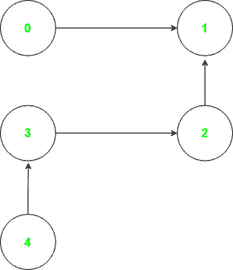
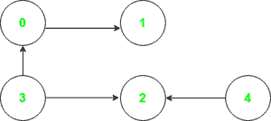

# 访问给定图的所有节点的最小顶点集

> 原文:[https://www . geeksforgeeks . org/给定图中访问所有节点的最小顶点集/](https://www.geeksforgeeks.org/smallest-set-of-vertices-to-visit-all-nodes-of-the-given-graph/)

给定一个由 N 个节点组成的**有向无环图**，任务是找到可以访问完整图的最小顶点集。

**示例:**

> **输入:**下图中的图形
> 
> 
> 
> **输出:** 0 4
> **置换:**从顶点 0 开始，可访问的节点集为{0，1}。同样，从顶点 4 可以访问{4，3，2}。因此，可以从最小可能大小的集合{0，4}中访问完整的图。
> 
> **输入:**下图中的图形
> 
> 
> 
> **输出:** 3 4

**方法 1:** 可以使用[拓扑排序](https://www.geeksforgeeks.org/topological-sorting/)来解决给定的问题，以获得顶点的排序，使得对于从 **U** 到 **V** 的每个有向边， **U** 先于 **V** 。以下是要遵循的步骤:

*   使用[可汗算法](https://www.geeksforgeeks.org/topological-sorting-indegree-based-solution/)按照拓扑顺序对给定的顶点数组进行排序。
*   维护一个被访问的数组，该数组跟踪被访问的顶点。
*   迭代排序的数组，执行以下操作:
    *   如果当前顶点未被访问，将其插入到所需的集合中。
    *   使用 [DFS](https://www.geeksforgeeks.org/depth-first-search-or-dfs-for-a-graph/) 遍历访问从插入的节点可到达的所有节点。

下面是上述方法的实现:

## 蟒蛇 3

```
# Python program of the above approach
from collections import defaultdict, deque

class Solution:

      # Function to perform DFS
    def dfs(self, node, vis, graph):

        # add node to visited set
        vis.add(node)

        for adj in graph[node]:
            if (adj not in vis):
                self.dfs(adj, vis, graph)

    def solve(self, edges):

        graph = defaultdict(list)

        # dictionary storing
        # indegrees of node
        indeg = defaultdict(int)

        # array to store topological
        # sorting of the array
        topo_sort = []
        vis = set()

        for (u, v) in edges:
            graph[u].append(v)

            # count indegree of each node
            indeg[v] += 1

        qu = deque()

        for u in graph:

            # add to ququ ,if indegree
            # of node u is 0
            if(indeg[u] == 0):
                qu.append(u)

        # Run till queue is not empty
        while(qu):

            node = qu.popleft()

            # add node to topo_sort
            topo_sort.append(node)

            # traverse adj nodes
            for adj in graph[node]:

                # decrement count of indegree
                # of each adj node by 1
                indeg[adj] -= 1

                # if count becomes 0, then
                # add adj to qu
                if (indeg[adj] == 0):
                    qu.append(adj)

        vis = set()
        ans = []

        # Take each node from topo_sort
        for node in topo_sort:

            # check if node is visited
            if (node not in vis):

                vis.add(node)
                ans.append(node)

                # Mark all the reachable
                # nodes as visited
                self.dfs(node, vis, graph)

        # finally return ans
        return (ans)

obj = Solution()
edges = [[0, 1], [2, 1], [3, 2], [4, 3]]

ans = obj.solve(edges)
print(" ".join(str(n) for n in ans))
```

**Output**

```
0 4
```

***时间复杂度:**O(N)*
T5**辅助空间:** O(N)

**方法 2:** 给定的问题也可以利用这样的观察来解决，即具有同度 **0** 的顶点是不能从任何其他顶点到达的顶点。因此，想法是[找到每个顶点的索引](https://www.geeksforgeeks.org/finding-in-and-out-degrees-of-all-vertices-in-a-graph/)，并将具有 in 度 **0** 的顶点插入到所需的集合中，因为所有其他顶点最终都可以被访问。

下面是上述方法的实现:

## C++

```
// C++ program of the above approach
#include <bits/stdc++.h>
using namespace std;

// Function to find smallest set
// of vertices from which the
// complete graph can be visited
vector<int> solve(vector<vector<int>>& edges)
{
    map<int, int> graph;

    // Dictionary storing
    // indgree of nodes
    map<int, int> indeg;

    for(auto dt : edges)
    {
        graph[dt[0]] = dt[1];

        // Count indegree of
        // each node
        indeg[dt[1]] += 1;
    }

    vector<int> ans;
    for(auto it = graph.begin();
             it != graph.end(); ++it)
    {

        // Add to ans, if indegree
        // of node u is 0
        if (!indeg.count(it->first))
            ans.push_back(it->first);
    }

    // Return Ans
    return ans;
}

// Driver code
int main()
{
    vector<vector<int>> edges = { { 0, 1 }, { 2, 1 },
                                  { 3, 2 }, { 4, 3 } };

    vector<int> ans = solve(edges);
    for(auto dt : ans)
        cout << dt << " ";

    return 0;
}

// This code is contributed by rakeshsahni
```

## 蟒蛇 3

```
# Python program of the above approach
from collections import defaultdict

class Solution:

    # Function to find smallest set
    # of vertices from which the
    # complete graph can be visited
    def solve(self , edges):

        graph = defaultdict(list)

        # dictionary storing
        # indgree of nodes
        indeg = defaultdict(int)

        for (u,v) in edges:
            graph[u].append(v)

            # count indegree of
            # each node
            indeg[v] +=1

        ans = []
        for u in graph:

            # add to ans, if indegree
            # of node u is 0
            if(indeg[u] == 0):
                ans.append(u)

        # Return Ans
        return (ans)

obj = Solution()
edges = [[0,1] , [2,1] , [3,2] , [4,3] ]

ans= obj.solve(edges)
print(" ".join(str(n) for n in ans))
```

**Output**

```
0 4
```

***时间复杂度:**O(N)*
T5**辅助空间:** O(N)